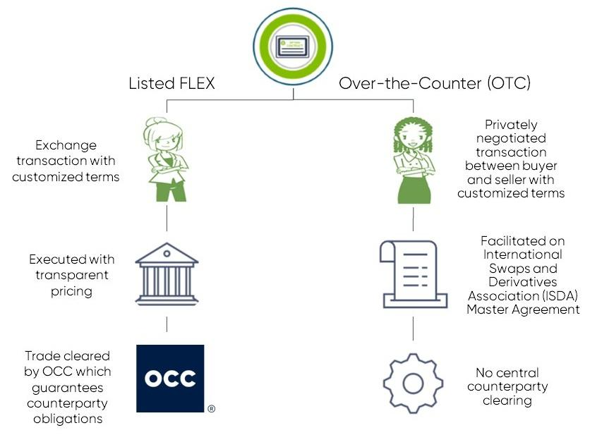

Financial derivatives have become a cornerstone of contemporary finance, offering a suite of instruments designed to manage risk, enhance returns, and access new investment opportunities. These instruments, including options, futures, and swaps, are derived from the performance of underlying assets and allow investors to speculate on future price movements, hedge against various risks, and leverage their investment positions. The utilization of financial derivatives has broadened the access to sophisticated trading and risk management strategies that were once only accessible to institutional investors.

Within this diverse category of financial tools, Flexible Exchange Options (FLEX) stand out due to their customizability. Introduced by the Cboe Options Exchange in 1993, FLEX options provide the benefits of customization typically associated with over-the-counter (OTC) derivatives, while offering the transparency and security of exchange-traded products. They allow traders to negotiate the terms of the contract, such as the strike price and expiration date, adapting to personal risk appetites and market expectations. This flexibility is particularly advantageous in markets characterized by rapid change and volatility.



The development of algorithmic trading has further impacted the utility of derivatives, including FLEX options. Algorithmic trading involves using computer algorithms to execute trades at speeds and with efficiency that far surpass traditional human capabilities. FLEX options are especially suited for algorithmic trading due to their customizable features, which can be fine-tuned to capitalize on small, short-term market inefficiencies that algorithms are designed to exploit.

In this rapidly evolving arena of financial markets, understanding and implementing trading strategies with FLEX options can offer significant advantages. These contracts not only provide a level of customization that aligns with the strategic goals of both institutional and individual traders but also enhance the ability to manage risk with precision in an algorithm-driven world. As markets continue to evolve, FLEX options are poised to expand their role, offering tailored solutions to increasingly complex trading demands.

## Table of Contents

## Understanding Financial Derivatives

Financial derivatives are sophisticated financial instruments that derive their value from one or more underlying assets. These assets can include stocks, bonds, commodities, interest rates, currencies, or market indexes. The primary function of derivatives is to enable investors to manage risk, enhance leverage, and capitalize on anticipated price movements in the financial markets. By providing a mechanism for hedging against adverse price changes, derivatives are essential tools in strategic financial management.

There are several types of financial derivatives, each serving specific purposes within the financial ecosystem. Options and futures are two of the most prevalent forms of derivatives, each with distinct characteristics and applications.

Options provide the buyer with the right, but not the obligation, to buy or sell an underlying asset at a predetermined price within a specified period. There are two main types of options: calls and puts. A call option grants the holder the right to purchase the underlying asset, while a put option gives the right to sell. The versatility of options allows investors to tailor strategies for hedging, income generation, or speculative purposes.

Futures contracts, in contrast, obligate the parties to buy or sell the underlying asset at a predetermined future date and price. Unlike options, futures do not provide an option but rather a commitment that both the buyer and seller must fulfill. Futures are widely used in commodities trading and financial markets to hedge against price [volatility](/wiki/volatility-trading-strategies) and to lock in prices for future transactions.

In addition to options and futures, the world of financial derivatives includes instruments such as swaps and forwards. Swaps involve the exchange of cash flows between two parties and are commonly used to manage [interest rate](/wiki/interest-rate-trading-strategies) and currency risks. Forwards are customizable, private agreements between two parties to buy or sell an asset at a specific future date and price, similar to futures contracts but typically executed over-the-counter (OTC).

Derivatives, by their nature, are leveraged instruments, meaning that they require the investor to commit only a fraction of the underlying asset's value. This leverage can amplify both potential returns and potential losses. As such, derivatives can greatly enhance investment strategies but also introduce significant risk if not used judiciously.

Overall, financial derivatives are indispensable components of modern financial systems, facilitating market efficiency, [liquidity](/wiki/liquidity-risk-premium), and dynamic risk management. They offer investors unique opportunities to speculate on market movements, hedge against potential losses, and optimize their portfolios through strategic leverage. With the continuous evolution of financial markets, derivatives remain integral to the design and execution of complex trading and investment strategies.

## What Are Flexible Exchange Options (FLEX)?

Flexible Exchange Options (FLEX) represent a significant evolution in the landscape of financial derivatives, offering bespoke customization that sets them apart from standard options. Unlike traditional options contracts with fixed specifications, FLEX options allow for negotiation of key terms, providing market participants a tailored approach to meet specific trading objectives. 

FLEX options were introduced by the Cboe Options Exchange in 1993 with the intention of merging the best features of over-the-counter (OTC) trading—primarily flexibility—with the security and regulatory advantages of exchange-traded products. This integration addresses the limitations of standard exchange-traded options by granting participants the ability to customize essential contract components such as the strike price, expiration date, and exercise style—either American or European. These adaptations enable traders to align the options more closely with their market outlook and risk management strategies.

A distinct advantage of FLEX options lies in their capacity to accommodate specific client needs for larger trade sizes. Unlike conventional options that often come with stringent position limits, FLEX options provide the scalability required for substantial trades without compromising on regulatory compliance. This characteristic makes them particularly attractive for institutional investors who seek both flexibility and safety.

The creation of FLEX options combines the adaptability of OTC products with the structure and oversight of organized exchanges, thus mitigating counterparty risk—a common concern in OTC markets. In doing so, FLEX options open a pathway for investors to engage in personalized trading strategies while benefiting from the security of an established trading framework.

In conclusion, FLEX options stand as a pioneering tool for traders seeking a hybrid approach to derivatives trading, encapsulating the tailored benefits of OTC deals while maintaining the rigor and protection of exchange-traded contracts.

## Components of a FLEX Option

Flexible Exchange Options (FLEX) provide market participants with the ability to tailor certain aspects of option contracts that are otherwise fixed in standardized options. The customization features of FLEX options primarily involve the strike price, expiration date, exercise style, and contract size. This levels of customization suit a broad range of strategic purposes.

**Strike Price and Expiration Date Customization**

FLEX options allow investors to specify non-standard strike prices. This permits precise alignment with strategic goals or anticipated market movements. Traders can set the strike price to reflect anticipated future states of the world or specific financial targets. Additionally, expiration dates are also adjustable, granting flexibility beyond the fixed cycles found in standard options markets. This can range from as short as a few days to as long as several years, depending on market conditions and trader requirements.

**Exercise Style Adaptability**

FLEX options support both American and European style exercise choices. American options can be exercised at any point up until the expiration date, providing flexibility to capitalize on favorable market conditions as they occur. European options, exercised only on the maturity date, may be preferred for strategies targeting specific event outcomes or market conditions at the end of the option term. The ability to choose the exercise style optimizes the strategies that traders can employ in various market environments.

**Variable Contract Sizes**

One of the key features of FLEX options is the capacity to accommodate variable contract sizes, which significantly benefits both institutional and individual traders. Traditional options have standard contract sizes, often limiting flexibility. By allowing trade sizes to be customized, FLEX options enable institutional investors to execute large transactions without being constrained by position limits, thus facilitating effective risk management and hedging strategies. Individual traders also benefit by tailoring contracts more precisely to their portfolio sizes and risk tolerance.

Overall, the customizable nature of FLEX options serves sophisticated investors who require greater precision in their hedging and trading strategies. This flexibility helps in managing risks more effectively and exploiting market opportunities as they arise.

## Algorithmic Trading with FLEX Options

Algorithmic trading, a critical component of modern financial markets, utilizes sophisticated computer algorithms to execute trades at unprecedented speeds and frequencies, significantly surpassing human capabilities. This method relies heavily on precision and the ability to respond swiftly to market signals, making it an ideal counterpart to Flexible Exchange Options (FLEX). 

FLEX options, with their inherent customizability, are uniquely suited to the [algorithmic trading](/wiki/algorithmic-trading) environment. Traders employing algorithmic strategies can customize specific parameters of these options, such as the strike price, expiration date, and exercise style, enabling them to tailor their strategies to specific market movements and data inputs. This level of customization ensures that algorithms can quickly adapt to even the smallest fluctuations in market conditions, thereby maximizing potential gains or minimizing potential losses.

The interaction between algorithmic trading and FLEX options is facilitated by the flexibility these financial derivatives offer, allowing for the development of highly specialized strategies. By adjusting FLEX options to meet precise algorithmic requirements, traders can effectively model and predict market behavior, enhancing their ability to capture micro-movements that might be invisible to ordinary trading techniques. For instance, through the use of predictive analytics and historical data, algorithms can be programmed to detect patterns and execute trades based on pre-defined conditions, which can be further optimized by the customization capabilities of FLEX options.

Data-driven strategies are integral to algorithmic trading, and here, FLEX options provide a powerful toolset for implementing bespoke trading strategies with high precision. The capability to create tailor-made contracts allows algorithmic traders to exploit [arbitrage](/wiki/arbitrage) opportunities, hedge specific risks, or engage in speculative activities that align with their strategic objectives.

In conclusion, the convergence of algorithmic trading and FLEX options signifies a crucial shift in trading methodologies. As technology continues to advance, the synergy between these two aspects—high-speed algorithmic trading and the flexibility of customized options—will enable traders to navigate the increasingly complex and data-rich environments of global financial markets with greater efficacy.

## Benefits and Challenges of Trading FLEX Options

FLEX options, with their enhanced customization features, allow traders to tailor contracts to align with specific market events and personal strategies. This flexibility enables traders to adjust the strike price, expiration date, and exercise style to suit their unique needs, which is particularly valuable in dynamic market environments. For instance, during periods of high volatility, investors can deploy FLEX options as tailored hedging instruments to protect against adverse price movements while also capitalizing on potential upside gains.

The bespoke nature of FLEX options presents unique hedging opportunities and risk management strategies that are unavailable with standard options. Traders can craft positions that precisely match their risk tolerance and market outlook, offering a significant advantage in crafting sophisticated hedging strategies. This capability provides investors with the ability to respond more effectively to unpredictable market events and to potentially enhance returns with strategies that are specifically tailored to exploit precise market conditions.

However, the complexity inherent in FLEX options can pose challenges. Understanding and effectively deploying these contracts require a higher level of expertise and market knowledge. The customization that FLEX allows introduces variables that can complicate strategic planning and execution, especially for traders who may not have extensive experience with derivatives. Additionally, the lower liquidity associated with FLEX options can be a drawback, as it may lead to wider bid-ask spreads and increased transaction costs, making these options less accessible to traders who prioritize market efficiency and faster execution speeds.

In summary, while FLEX options offer distinct advantages through their customizable features, these benefits come with challenges that necessitate a deep understanding of both the specific product and the broader market environment. Traders must weigh these factors carefully to harness the full potential of FLEX options in their investment strategies.

## Future of FLEX Options in Financial Markets

As financial markets continue to evolve, the demand for customizable and sophisticated trading instruments like Flexible Exchange Options (FLEX) is expected to grow. FLEX options have gained traction due to their ability to offer tailored solutions that meet specific investor needs, providing an edge in an increasingly complex financial environment.

Technological advancements in trading platforms and analytical tools play a crucial role in enhancing the role of FLEX options in portfolio strategies. Modern trading platforms now leverage [machine learning](/wiki/machine-learning) algorithms and advanced data analytics to optimize trading strategies, assess risk, and predict market movements. For instance, advanced modeling techniques can be used to simulate various market conditions, allowing traders to design FLEX options contracts that are optimally positioned to benefit from anticipated market shifts. This not only aids in accurate pricing but also helps in creating custom derivatives that suit individual or institutional trading specifications.

In Python, algorithmic platforms can utilize libraries such as NumPy for numerical computations and pandas for data manipulation to implement and backtest trading strategies with FLEX options. For example, traders might use Monte Carlo simulations to forecast option outcomes under different scenarios:

```python
import numpy as np

def monte_carlo_simulation(stock_price, strike_price, interest_rate, volatility, time):
    num_simulations = 10000
    option_payoffs = []

    for _ in range(num_simulations):
        std_dev = volatility * np.sqrt(time)
        simulated_price = stock_price * np.exp(np.random.normal((interest_rate - 0.5 * volatility**2) * time, std_dev))
        payoff = max(simulated_price - strike_price, 0)
        option_payoffs.append(payoff)

    option_price = np.exp(-interest_rate * time) * np.mean(option_payoffs)
    return option_price
```

Sophisticated investors are increasingly attracted to FLEX options for their ability to craft bespoke solutions in volatile markets. This adaptability allows traders and portfolio managers to construct hedges specifically tailored to their risk preferences and market outlooks. As global financial markets face uncertainty and dynamic changes, the ability to not only predict but also customize response strategies through derivatives like FLEX options fosters greater confidence and precision in trading operations.

Moreover, evolving regulatory landscapes and market conditions necessitate innovative financial solutions that FLEX options can provide. As institutions seek to improve risk management and achieve better alignment of financial positions with strategic goals, the inherent flexibility of these options makes them a preferred choice. As such, we can anticipate a future where FLEX options are increasingly integrated into diverse financial strategies, thereby solidifying their place as indispensable instruments in progressive financial portfolios.

## Conclusion

FLEX options epitomize the intersection of flexibility and security in financial derivatives trading, offering investors the unique ability to customize key contract terms. This adaptability not only aligns with individual trading strategies and market conditions but also enhances their attractiveness in both hedging and speculative applications. The integration of FLEX options into an algorithm-driven market further underscores their importance. They allow for precise tuning of trading algorithms, which can capitalize on nuanced market movements with minimal human intervention.

As financial markets continue to evolve with technological advancements, the demand for sophisticated and customizable instruments like FLEX options is set to grow. Their contributory potential lies in providing tailored solutions to complex trading needs, helping portfolio managers and individual investors alike navigate an increasingly volatile market environment. Thus, FLEX options stand out as valuable tools in the continual evolution of financial instruments, offering bespoke solutions that are aligned with the specific risk tolerance and return objectives of investors.

## References & Further Reading

[1]: Cox, C., & Rubinstein, M. (1985). ["Options Markets."](https://archive.org/details/optionsmarkets00coxj) Prentice Hall.

[2]: Schwartz, E. S., & Smith, J. E. (2000). ["Short-Term Variations and Long-Term Dynamics in Commodity Prices."](https://jimsmith.host.dartmouth.edu/wp-content/uploads/2022/04/Short-term_Long-term_Model.pdf) Management Science, 46(7), 893-911.

[3]: Black, F., & Scholes, M. (1973). ["The Pricing of Options and Corporate Liabilities."](https://www.cs.princeton.edu/courses/archive/fall09/cos323/papers/black_scholes73.pdf) Journal of Political Economy, 81(3), 637-654.

[4]: Hull, J. C. (2017). ["Options, Futures, and Other Derivatives."](https://www.pearson.com/en-us/subject-catalog/p/options-futures-and-other-derivatives/P200000005938/9780136939917) Pearson.

[5]: Glasserman, P. (2004). ["Monte Carlo Methods in Financial Engineering."](https://link.springer.com/book/10.1007/978-0-387-21617-1) Springer.