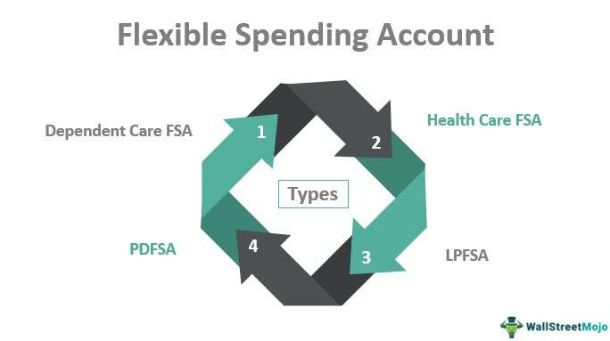

In the rapidly evolving landscape of finance, the convergence of flexible fund management and algorithmic trading is reshaping investment strategies. Flexible fund management provides portfolio managers with the ability to allocate investments dynamically across a broad range of asset classes, without the constraints often associated with traditional funds, which tend to adhere to specific investment styles or categories. This adaptability allows for more responsive investing in changing market conditions.

Algorithmic trading, or algo trading, adds a layer of sophistication to the management of flexible funds by deploying advanced algorithms to execute trades. These algorithms utilize substantial datasets to conduct analysis and then execute trades with a speed and efficiency that surpass human capabilities. The integration of these technologies enables traders to capitalize on real-time market movements while maintaining optimal asset diversification.

The fusion of flexibility in fund management with the precision and speed of algorithmic trading offers innovative pathways for optimizing and diversifying investment portfolios. This synergy provides the potential for improved returns and enhanced risk management, making it an attractive proposition for investors. Throughout this article, the aim is to illuminate how these financial mechanisms operate together, offering insights valuable to both investors and financial enthusiasts looking to navigate or leverage these evolving market dynamics.

## Table of Contents

## Understanding Flexible Funds

Flexible funds, a distinct segment within the broader mutual fund category, provide portfolio managers with significant freedom in making investment choices. Unlike traditional mutual funds, which are often constrained by specific classifications such as 'large-cap growth' or 'small-cap value', flexible funds empower managers to dynamically allocate assets across a diverse range of asset classes including equities, bonds, and cash equivalents. This adaptability allows managers to respond promptly to market conditions, potentially capitalizing on emerging opportunities and managing risks effectively.

The foundational concept of flexible funds lies in their lack of rigid investment criteria. Traditional funds are often restricted by predetermined investment styles, leading to what is known as "style boxes" that dictate the parameters of the investment strategy. In contrast, flexible funds transcend these limitations by incorporating a more holistic and opportunistic approach to asset management. This inherent flexibility, however, exposes them to "style drift" – the tendency of a portfolio's investment style to shift over time due to changes in market conditions or the manager’s decisions.

An illustrative example of a flexibly managed fund is the Fidelity Magellan Fund, which gained prominence for its remarkable performance under the management of Peter Lynch. Lynch's strategy was not confined to a particular style or asset class, allowing him to explore a wide array of investment opportunities based on his market insights. Similarly, BlackRock Flexible Funds exemplify the adaptive nature of flexible funds through their diversified investment strategies, which are not tethered to traditional benchmarks or sector allocations.

Flexible funds are structured to operate across different market environments, reflecting their potential for both growth and income. This characteristic makes them attractive to investors seeking a less restricted investment vehicle capable of navigating fluctuating markets. Nevertheless, the latitude provided to fund managers also necessitates a higher degree of trust and confidence in their judgment and capabilities.

The flexible nature of these funds is often facilitated through mechanisms such as tactical asset allocation, enabling managers to shift between asset classes based on anticipated market movements. This dynamism can potentially lead to optimized portfolio performance, although it equally requires vigilant oversight to prevent excessive risk-taking and ensure alignment with investors’ risk tolerance levels.

As investment landscapes continue to evolve, flexible funds are likely to remain a central tool for investors and portfolio managers seeking tailored approaches to asset management. Their broad flexibility not only enables nuanced responses to market shifts but also opens up pathways for innovative investment strategies that transcend conventional market boundaries.

## An Overview of Algorithmic Trading

Algorithmic trading, often known as algo trading, represents a transformative shift in the execution of trades within financial markets. This advanced trading methodology relies on the use of complex algorithms, which are essentially a series of instructions set to perform specific tasks, to automate and enhance trading processes. These algorithms are designed to analyze vast and diverse datasets, enabling rapid decision-making and execution of trades at speeds far beyond human capacity. Consequently, [algorithmic trading](/wiki/algorithmic-trading) offers significant improvements in efficiency and cost-effectiveness over traditional, manual trading methods.

## Types of Algorithmic Strategies

Algo trading encompasses a wide array of strategies, each tailored to capitalize on different aspects of market dynamics. Some prevalent strategies include:

1. **Market Making**: This involves placing both buy and sell orders to capitalize on the bid-ask spread. Algorithms continuously update orders based on real-time market conditions to ensure profitability.

2. **Statistical Arbitrage**: This strategy exploits price inefficiencies between correlated financial instruments. Algorithms identify deviations from normal statistical relationships to execute trades that will benefit when prices revert to their mean.

3. **Momentum Trading**: Algorithms in this strategy analyze trends within the market, purchasing assets showing upward trends and selling those with downward trajectories, anticipating that these trends will continue.

4. **Event-Driven Trading**: Algorithms react to news or events, such as mergers, earnings announcements, or economic indicators, executing trades based on anticipated impacts on asset prices.

## Prevalence in Modern Financial Markets

Algorithmic trading has become pervasive in contemporary financial markets, accounting for a significant portion of total trading [volume](/wiki/volume-trading-strategy), particularly in equities and futures markets. Its widespread adoption is facilitated by technological advancements in computing power and data management, allowing for real-time data processing and execution capabilities. Importantly, the ubiquity of algo trading contributes to increased market [liquidity](/wiki/liquidity-risk-premium) and reduced bid-ask spreads, enhancing market efficiency.

## Advantages Over Traditional Trading Methods

Compared to traditional trading, algorithmic trading offers several notable advantages:

- **Speed and Precision**: Algorithms can process market data and execute trades in fractions of a second, minimizing human-related errors and maximizing execution efficiency.

- **Reduced Transaction Costs**: By optimizing trade execution and timing, algorithms can lower market impact costs, a significant advantage over manual trade execution.

- **Consistency**: Algorithms operate based on predefined rules, reducing emotional bias and improving decision-making consistency.

## Common Misconceptions and Potential Risks

There are several misconceptions surrounding algo trading, one of which is that it guarantees profitability. In reality, while algos improve efficiency, they are only as good as the strategies and data they utilize.

Moreover, algo trading does not come without risks. One prominent risk is overfitting, where algorithms are too tightly fitted to historical data, impairing their predictive performance. Market impact, where large orders inadvertently move prices against the intended trade, is another consideration. The reliance on algorithmic systems also introduces systemic risks, as seen in cases of flash crashes where rapid selling by algorithms can lead to extreme market [volatility](/wiki/volatility-trading-strategies).

In conclusion, algorithmic trading stands at the forefront of transforming modern financial markets, offering enhanced capabilities in speed, efficiency, and execution. However, understanding the strategic underpinnings and inherent risks is paramount for leveraging this technology effectively.

## Integration of Flexible Funds and Algo Trading

The integration of flexible fund management with algorithmic trading brings significant sophistication to the investment strategy landscape. By utilizing algorithmic systems, fund managers can optimize asset allocation and enhance risk management, offering dynamic adaptations to market conditions. This integration facilitates a more responsive investment approach, where algorithms can process vast amounts of data and execute trades with precision and speed, allowing flexible funds to adjust their allocations in real-time to capitalize on market opportunities.

Algorithmic trading systems can deploy various strategies, including [trend following](/wiki/trend-following), mean reversion, and statistical [arbitrage](/wiki/arbitrage), to identify profitable trading opportunities. These strategies, when applied to flexible funds, can help in adjusting portfolios dynamically across different asset classes. For instance, a trend-following algorithm might detect an upward trend in technology stocks and can automatically reallocate a portion of the fund's assets to increase exposure to that sector.

Moreover, the synergies created between flexible fund management and algorithmic trading are evident in recent case examples where fund managers have successfully adopted these technologies. For example, some hedge funds have incorporated [machine learning](/wiki/machine-learning) algorithms to analyze historical price data and predict future movements. These algorithms are designed to learn and adapt, improving their accuracy over time, thus enhancing the fund's decision-making capabilities.

Recent developments in financial technology, such as the use of [artificial intelligence](/wiki/ai-artificial-intelligence) and enhanced data analytics, further augment the benefits of integrating algorithmic trading with flexible funds. For instance, AI systems can process natural language data from news articles or social media to gauge market sentiment, thereby providing an additional layer of insight for fund allocation decisions. These data-driven insights allow portfolio managers to take preemptive actions, mitigating potential risks and optimizing returns.

However, these integrations require robust risk management frameworks to prevent potential downsides, such as the amplification of market volatility. The algorithms must be continuously monitored and fine-tuned to align with the flexible fund's risk tolerance and investment objectives. Additionally, ensuring the quality and security of data inputs is crucial, as erroneous data can lead to significant trading errors and financial loss.

In conclusion, the integration of flexible funds with algorithmic trading stands at the forefront of modern investment strategies. It offers enhanced adaptability in asset allocation and risk management, setting the stage for more sophisticated and dynamic portfolio management. As financial technologies evolve, these integrated systems will likely continue to evolve, marking an exciting frontier for investors seeking to leverage technological advancements for superior financial performance.

## Challenges and Considerations

Integrating algorithmic trading with flexible fund management offers numerous advantages, but it also introduces specific challenges that warrant consideration. One of the primary concerns is overfitting, a statistical modeling error wherein the algorithm adapts excessively to historical data and performs poorly on new data. This risk increases in algorithm-driven environments where extensive [backtesting](/wiki/backtesting) against past market conditions is common. To minimize overfitting, it is crucial to employ techniques such as cross-validation and regularization, ensuring the robustness of trading algorithms across diverse market conditions.

Another significant challenge is market impact. Algorithmic trading executes high-frequency trades that can inadvertently influence market prices, especially in less liquid markets. This can lead to slippage, where the actual execution price deviates from the intended price, affecting the fund's return. Implementing market impact models is essential for predicting and mitigating these effects by adjusting execution strategies dynamically.

Moreover, algorithmic trading relies heavily on high-quality data for accurate decision-making. Poor data quality can lead to erroneous trades and significant financial losses. Therefore, maintaining comprehensive data cleaning processes and ensuring the acquisition of reliable data sources is critical for the integrity of trading algorithms.

Regulatory considerations also play an integral role in the integration of algorithmic trading with flexible funds. Financial markets across the globe are subject to stringent regulations to protect investors and maintain market integrity. Regulatory bodies, such as the U.S. Securities and Exchange Commission (SEC) and the European Securities and Markets Authority (ESMA), require rigorous compliance processes to ensure that algorithmic trading practices do not compromise market stability. These regulations often demand transparency in algorithmic processes and real-time monitoring of trades.

In managing these integrated investment systems, due diligence is paramount. This involves thorough evaluation and continuous monitoring of algorithmic performance, risk assessment, and compliance with regulatory requirements. Financial institutions must invest in robust risk management frameworks and ensure the availability of expertise to navigate the complexities inherent in algorithmic and flexible fund management.

In conclusion, while integrating algorithmic trading with flexible fund management presents innovative investment possibilities, the associated challenges require meticulous management and strategic foresight. Addressing concerns of overfitting, market impact, data quality, regulatory compliance, and due diligence is imperative for leveraging the full potential of these advanced financial mechanisms.

## Opportunities for Investors

Investors keen on blending flexible fund management with algorithmic trading can unlock substantial portfolio advantages. This strategic integration can lead to the pursuit of superior returns, increased diversification, and enhanced risk management, transforming investment approaches.

1. **Superior Returns**: The agility inherent in flexible funds enables dynamic asset reallocation, allowing investors to seize market opportunities effectively. Coupling this with algorithmic trading's capacity for rapid and data-driven decision-making may lead to improved returns. Algorithms can identify and execute trades with precision, capitalizing on short-lived market inefficiencies and trends that could be missed by traditional trading methods. Historical backtesting and continuous optimization of algorithms further refine strategies, enhancing the probability of achieving superior performance.

2. **Increased Diversification**: Flexible funds inherently provide a broad investment spectrum, not limited by rigid criteria. When augmented by algorithmic trading, diversification can be methodically achieved and maintained. Algorithms are programmed to recognize patterns and correlations across diverse asset classes, facilitating optimal diversification that minimizes unsystematic risk. By dynamically adjusting the portfolio's composition, these systems can maintain a balance of high-performing assets across different sectors and geographies.

3. **Improved Risk Management**: Algorithmic trading contributes significantly to risk management by systematically assessing and responding to market data in real-time. Risk management protocols embedded in algorithms can monitor market volatility and execute pre-defined risk mitigation strategies, such as stop-loss orders or hedging transactions. Moreover, the flexibility of fund strategies allows for quick reallocation of assets away from underperforming or high-risk investments, thus preserving capital.

For investors aiming to exploit these opportunities, a prudent approach to selecting funds and understanding risk profiles is vital:

- **Selecting Suitable Funds**: Investors should seek funds managed by teams proficient in both flexible fund management and algorithmic trading. Assessing the historical performance, fee structures, and strategy transparency of funds is essential. Engaging with fund managers to understand their approach to integrating algorithms in decision-making can provide clarity on the fund's potential alignment with investor goals.

- **Understanding Risk Profiles**: While algorithmically enhanced flexible funds offer significant prospects, they also come with inherent risks associated with market dynamics, technology limitations, and model overfitting. Investors need to assess their own risk tolerance, ensuring that their portfolios align with personal financial goals and risk capacity. Understanding the specific risk mitigation strategies embedded within the algorithms and how they interact with the flexible fund's objectives can further guide informed investment decisions.

Engaging with these strategies requires a balanced approach, blending innovation with caution, to maximize potential rewards while safeguarding against potential challenges in the evolving financial landscape.

## Conclusion

The convergence of flexible fund management and algorithmic trading represents a transformative era in modern investment strategies. This symbiosis is reshaping traditional fund management by introducing unprecedented adaptability and efficiency through technology. Flexible funds, with their characteristic dynamic allocation across various asset classes, gain an additional advantage when combined with algorithmic trading's speed and analytical power. This amalgamation enables more precise and customized portfolio management, enhancing returns while managing risk effectively.

Despite the promising benefits, challenges such as overfitting models, data quality requirements, and market impact cannot be ignored. These hurdles necessitate robust systems and continuous refinement of algorithms to avoid errors that could negate the advantages of algorithmic systems. Moreover, as regulatory landscapes evolve, ensuring compliance and operational due diligence will be vital for the smooth integration of these tools in investment practices.

Continual innovation in both flexible fund strategies and algorithmic trading algorithms promises to redefine asset management. Advances in machine learning and data analytics will likely enhance the predictive capabilities and execution efficiency, paving the way for more sophisticated and adaptive approaches to investing. This evolving framework poses significant potential for improving portfolio diversification, risk management, and achieving superior returns.

To truly harness the potential of these integrated investment strategies, investors and financial institutions must stay well-informed and agile. This means not just understanding the technologies and methods but also actively monitoring trends and developments in both finance and technology sectors. By maintaining a proactive approach, investors can effectively navigate and capitalize on these innovations, ensuring that their portfolios are well-positioned to thrive in the dynamic financial markets of tomorrow.

## References & Further Reading

[1]: Bergstra, J., Bardenet, R., Bengio, Y., & Kégl, B. (2011). ["Algorithms for Hyper-Parameter Optimization."](https://dl.acm.org/doi/10.5555/2986459.2986743) Advances in Neural Information Processing Systems 24.

[2]: ["Advances in Financial Machine Learning"](https://www.amazon.com/Advances-Financial-Machine-Learning-Marcos/dp/1119482089) by Marcos Lopez de Prado

[3]: ["Evidence-Based Technical Analysis: Applying the Scientific Method and Statistical Inference to Trading Signals"](https://www.amazon.com/Evidence-Based-Technical-Analysis-Scientific-Statistical/dp/0470008741) by David Aronson

[4]: ["Machine Learning for Algorithmic Trading"](https://github.com/stefan-jansen/machine-learning-for-trading) by Stefan Jansen

[5]: ["Quantitative Trading: How to Build Your Own Algorithmic Trading Business"](https://www.amazon.com/Quantitative-Trading-Build-Algorithmic-Business/dp/1119800064) by Ernest P. Chan