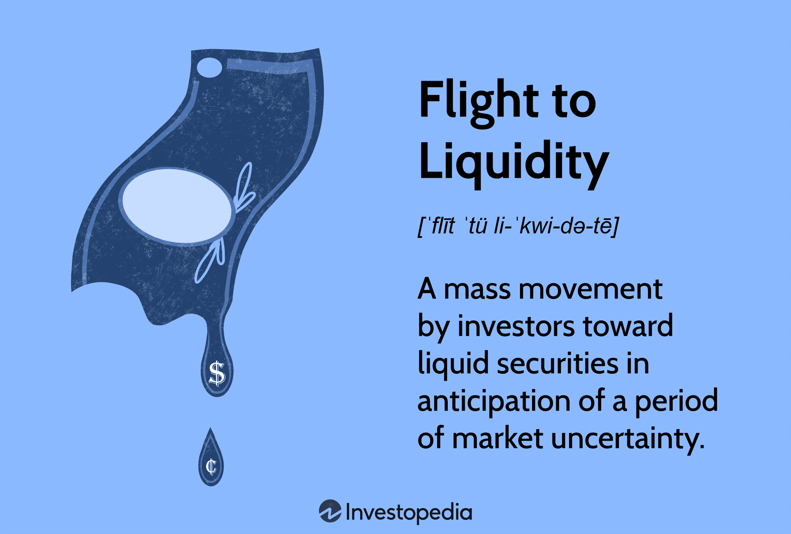

## Table of Contents

## What is meant by 'Flight to Liquidity'?

'Flight to Liquidity' is when investors quickly move their money from riskier investments to safer ones. This often happens during times of economic uncertainty or financial stress. Safer investments, like government bonds or cash, are easier to buy and sell quickly without losing much value. This movement helps investors protect their money when they think the market might be getting risky.

When a lot of people start doing this at the same time, it can affect the whole market. Prices of riskier assets, like stocks, can drop because fewer people want to buy them. On the other hand, the demand for safer assets goes up, which can make their prices go up. This shift can make it harder for businesses to get the money they need to grow, because investors are more focused on keeping their money safe rather than taking risks.

## Why do investors engage in a flight to liquidity?

Investors engage in a flight to liquidity because they want to keep their money safe during uncertain times. When the economy or markets seem risky, people get worried about losing their money in stocks or other investments that might go down in value. So, they move their money to safer places like government bonds or cash. These safer investments are easier to turn into cash without losing much money, which helps investors feel more secure.

This behavior is a way for investors to protect themselves from potential losses. When many investors start doing this at the same time, it can cause big changes in the market. The prices of riskier investments can drop because fewer people want to buy them, while the prices of safer investments can go up because more people want them. This shift can affect the whole economy, making it harder for businesses to get the money they need to grow.

## What are the common triggers for a flight to liquidity?

A flight to liquidity often happens when people start to feel worried about the economy or the financial markets. Things like a big drop in the stock market, news of a possible recession, or big problems in the world like wars or natural disasters can make investors nervous. When they see these signs, they want to protect their money, so they move it from risky investments to safer ones like government bonds or cash.

Another common trigger is when there's a lot of uncertainty about what's going to happen next. For example, if there's a lot of debate about new laws or policies that could affect businesses, or if there's a big political change happening, investors might not know what to expect. This uncertainty makes them want to play it safe and move their money to places where they can get it back easily without losing much.

Sometimes, problems in the financial system itself can cause a flight to liquidity. If banks or big financial companies start to have trouble, or if there's a fear that they might fail, investors get scared. They pull their money out of risky investments and put it into safer ones, hoping to avoid any losses if the financial system gets worse.

## How does a flight to liquidity affect financial markets?

When a lot of investors start moving their money to safer places during a flight to liquidity, it can make big changes in the financial markets. The prices of risky investments like stocks can go down because fewer people want to buy them. This happens because everyone is trying to sell their stocks at the same time, which makes the prices drop. On the other hand, the demand for safe investments like government bonds goes up, which can make their prices go up. This shift can make the whole market feel shaky and uncertain.

The effects of a flight to liquidity can also make it harder for businesses to grow. When investors are more focused on keeping their money safe, they are less likely to put money into new projects or companies that need it to expand. This can slow down the economy because businesses might not have the money they need to create new jobs or develop new products. Overall, a flight to liquidity can create a cycle where the fear of losing money makes people move their money to safe places, which can make the economy weaker.

In the long run, a flight to liquidity can lead to more problems if it lasts a long time. If people keep their money in safe places and don't invest in the economy, it can take longer for things to get better. Governments and central banks might need to step in to help calm things down, maybe by lowering interest rates or providing other support to make people feel more confident about investing again. But until that happens, the markets can stay uncertain and volatile.

## What are the typical assets considered liquid during a flight to liquidity?

During a flight to liquidity, people usually move their money into assets that are easy to buy and sell without losing value. The most common liquid asset is cash. Cash is the easiest to use because you can spend it right away or put it in a bank. Another popular choice is money market funds, which are like a safe place to park your money where you can get it back quickly.

Government bonds are also seen as very liquid. These are loans to the government that you can sell easily if you need your money back fast. They are considered safe because the government usually pays back what it owes. Some people also look at short-term corporate bonds from big, stable companies as a liquid option, though they might be a bit riskier than government bonds.

These assets are attractive during uncertain times because they help investors feel more secure. By moving money into these safe and liquid places, people hope to avoid big losses if the market gets worse. This shift can affect the whole economy, making it harder for businesses to grow, but it helps investors protect their money when they're worried.

## Can you explain the difference between liquidity and solvency in this context?

Liquidity is about how quickly you can turn an asset into cash without losing much money. During a flight to liquidity, investors want to move their money into things like cash, money market funds, or government bonds because they can sell these assets fast if they need to. It's like having money in your pocket that you can use right away. If you have a lot of liquid assets, you can handle sudden expenses or take advantage of new opportunities without waiting.

Solvency, on the other hand, is about whether you have enough money to pay all your debts. It's a bigger picture that looks at your total assets and total debts. A company or person is solvent if their assets are worth more than their debts. During a flight to liquidity, people might worry about their solvency because they want to make sure they can cover their debts if the market goes bad. But solvency is more about the long-term health of your finances, while liquidity is about having cash on hand right now.

In the context of a flight to liquidity, investors focus more on liquidity because they want to protect their money in the short term. They move their money to liquid assets to feel safer and avoid losses if the market gets worse. Solvency is important too, but it's more about making sure you're financially healthy over time, not just in the moment of a market scare.

## How do central banks respond to a flight to liquidity?

When there's a flight to liquidity, central banks often step in to help calm things down. They do this by making sure there's enough money in the system so people don't panic. One way they do this is by lowering interest rates, which makes it cheaper for banks to borrow money. When banks can borrow money more easily, they can lend more to businesses and people, which can help keep the economy going. Central banks might also buy government bonds or other safe assets to put more money into the system and make people feel more confident.

Another thing central banks might do is provide special loans to banks that are having trouble. This helps make sure banks can keep operating and lending money even when everyone is moving their money to safe places. By doing these things, central banks try to stop the flight to liquidity from causing too much damage to the economy. They want to make sure that businesses can still get the money they need to grow and that people feel safe enough to start investing again when the markets calm down.

## What historical examples illustrate a flight to liquidity?

One big example of a flight to liquidity happened during the 2008 financial crisis. When big banks like Lehman Brothers started to fail, people got really scared. They started pulling their money out of stocks and other risky investments and putting it into safer places like government bonds and cash. This made stock prices drop a lot, and it was hard for businesses to get the money they needed. The government and central banks had to step in with a lot of help to try to calm things down and get people to start investing again.

Another time this happened was during the early days of the COVID-19 pandemic in 2020. When the virus started spreading fast, and countries were locking down, everyone was worried about what would happen to the economy. Investors moved their money quickly from stocks to safer assets like government bonds and cash. This caused a lot of ups and downs in the stock market, and businesses found it hard to get money to keep going. Central banks around the world lowered interest rates and bought bonds to put more money into the system and help businesses and people feel more secure.

## What are the potential risks and consequences for the economy during a flight to liquidity?

When a lot of people move their money to safe places during a flight to liquidity, it can hurt the economy. Businesses find it hard to get the money they need to grow because investors are scared to take risks. This can slow down the economy because companies might not be able to start new projects or hire more workers. When stock prices drop because everyone is selling, it can make people feel even more worried about the future. This can lead to a cycle where fear makes things worse, and the economy can take a long time to recover.

The government and central banks might need to step in to help, but there's no guarantee that their actions will fix everything right away. If the flight to liquidity lasts a long time, it can make the economy weaker and cause more problems. People might keep their money in safe places instead of investing in new businesses or projects, which can slow down growth even more. This can make it hard for the economy to bounce back, and it might take a lot of effort and time to get things moving again.

## How can investors prepare for or mitigate the effects of a flight to liquidity?

Investors can prepare for a flight to liquidity by keeping some of their money in safe and easy-to-sell assets like cash or government bonds. This way, if the market starts to feel risky, they can move their money quickly without losing too much. It's also smart to spread out their investments so they're not all in one place. If they have some money in stocks, some in bonds, and some in other things, it can help them feel more secure. They should also keep an eye on the news and understand what's happening in the economy so they can make good choices when things get uncertain.

To mitigate the effects of a flight to liquidity, investors should try not to panic and sell everything at once. If everyone does this, it can make the market worse. Instead, they can slowly move their money to safer places if they need to. It's also a good idea to have a plan ready for what they'll do if the market gets bad. Talking to a financial advisor can help them make a plan that fits their needs. By being prepared and staying calm, investors can handle a flight to liquidity better and protect their money.

## What role do government securities play during a flight to liquidity?

During a flight to liquidity, government securities like government bonds become really important. People move their money to these bonds because they are seen as very safe. Governments usually pay back what they owe, so these bonds are a good place to keep money when things feel risky. They are also easy to buy and sell, which is what people want when they are worried about the market. This makes government securities a popular choice during uncertain times.

When lots of people buy government securities, it can help calm the market a bit. The demand for these safe investments goes up, which can make their prices go up too. This can make people feel a bit better because they know their money is in a safe place. But it can also mean that there's less money going into riskier investments like stocks, which can make it harder for businesses to grow. So, while government securities help people feel more secure during a flight to liquidity, they can also affect the whole economy by changing where money is going.

## How does a flight to liquidity influence monetary policy decisions?

When there's a flight to liquidity, central banks have to think carefully about what to do. They see people moving their money to safe places like government bonds and cash, and they want to stop this from hurting the economy too much. So, they might lower interest rates to make it easier for banks to borrow money. This can help because when banks can borrow more easily, they can lend more to businesses and people. This can keep the economy going even when everyone is scared. Central banks might also buy government bonds to put more money into the system and make people feel more confident.

Another thing central banks might do is give special loans to banks that are having trouble. This helps keep banks strong so they can keep lending money, even when everyone is moving their money to safe places. By doing these things, central banks try to stop the flight to liquidity from causing too much damage. They want to make sure businesses can still get the money they need to grow and that people feel safe enough to start investing again when the markets calm down.

## What is the understanding of financial markets liquidity?

Liquidity refers to the ease with which assets can be converted into cash without affecting their market price. In financial markets, liquidity is a fundamental characteristic that enables assets to be traded quickly and at stable prices. A highly liquid market typically features high trading volumes and narrow bid-ask spreads, signifying that participants can buy or sell large quantities of assets with minimal price impact.

Liquidity is crucial for the efficient functioning of financial markets as it facilitates lower transaction costs. These reduced costs are beneficial for investors, providing the ability to swiftly enter or exit positions. High liquidity mitigates the risk of large price swings due to individual trades, contributing to overall market stability.

One phenomenon associated with [liquidity](/wiki/liquidity-risk-premium) is the concept of "flight to liquidity." During times of economic uncertainty, investors often seek to reduce risk by moving investments from less liquid and potentially volatile assets to more liquid ones, such as government bonds or highly traded equity securities. This behavior underscores liquidity's role as a critical [factor](/wiki/factor-investing) in risk management, enabling investors to adapt to changing market conditions by reallocating assets towards safer and more liquid options.

For instance, during financial crises, there is typically a notable increase in demand for liquid assets as investors prioritize the ability to quickly access cash. This shift can lead to increased liquidity premiums on less liquid assets, where investors require higher returns to compensate for the increased risk of illiquidity.

Models and metrics, such as the Amihud illiquidity measure, can be used to quantify liquidity in markets. This measure is calculated using the formula:

$$
\text{Illiquidity} = \frac{1}{D} \sum_{d=1}^{D} \frac{|R_d|}{V_d}
$$

where $R_d$ is the return on a specific day $d$, $V_d$ is the trading volume in monetary value for that day, and $D$ is the number of trading days. A higher value indicates greater illiquidity, implying higher transaction costs and potential price impact.

Overall, understanding financial market liquidity is essential for investors aiming to optimize their strategies and manage risks effectively. Liquidity's impact on transaction costs, market stability, and its role during economic downturns highlights its importance as a foundational element in investment decision-making.

## What are the investment strategies in liquid markets?

Investing in liquid markets is essential for executing trades swiftly and minimizing the risks associated with holding illiquid assets. Liquid markets refer to environments where assets can easily be bought or sold without significantly affecting their market price. The presence of numerous buyers and sellers facilitates this ease of transaction, contributing to efficient market functioning. 

Investment strategies in liquid markets often revolve around balancing liquidity and returns. Liquid assets, such as stocks, Treasury bills, and money market funds, offer investors flexibility and a safety net during volatile market conditions. Stocks are known for their high liquidity due to the significant trading volumes on major stock exchanges, allowing investors to quickly enter or [exit](/wiki/exit-strategy) positions. Treasury bills, considered one of the safest investments, provide short-term security with their government backing and ease of conversion to cash. Money market funds, on the other hand, offer stability and liquidity by investing in short-term, high-quality debt instruments.

Understanding how to leverage liquidity is crucial for effective risk management and capital preservation. By maintaining a portfolio with a mix of liquid assets, investors can reduce the risks associated with price [volatility](/wiki/volatility-trading-strategies) and market disruptions. Liquid assets allow for rapid reallocation of capital in response to changing market conditions, thereby enhancing the agility of an investment strategy.

Relying on liquidity also aids in managing liquidity risk—the risk that an investor will not be able to sell assets quickly without incurring a loss. This can be quantified by assessing the bid-ask spread and trading volumes of an asset. A narrower spread and higher volumes generally indicate better liquidity. For instance, consider an investor holding a diverse stock portfolio, where:

- $L_{total}$ represents the total liquidity of the portfolio
- $L_i$ is the liquidity of the individual asset $i$
- $w_i$ is the weight of asset $i$ in the portfolio

The overall liquidity of the portfolio can be estimated using a weighted average formula:

$$
L_{total} = \sum_{i=1}^{n} w_i \times L_i
$$

This approach allows investors to quantitatively assess and adjust their portfolio to achieve the desired balance between liquidity and returns.

Implementing robust investment strategies in liquid markets enables investors to navigate uncertainties more effectively, ensuring that capital is preserved and opportunities for growth are maximized. By prioritizing liquidity, investors can maintain stable portfolios and adapt to market fluctuations with confidence.

## References & Further Reading

[1]: Amihud, Y. (2002). ["Illiquidity and Stock Returns: Cross-Section and Time-Series Effects."](https://www.sciencedirect.com/science/article/pii/S1386418101000246) Journal of Financial Markets, 5(1), 31-56.

[2]: Harris, L. (2003). ["Trading and Exchanges: Market Microstructure for Practitioners."](https://www.amazon.com/Trading-Exchanges-Market-Microstructure-Practitioners/dp/0195144708) Oxford University Press.

[3]: Gomber, P., Arndt, B., Lutat, M., & Uhle, T. (2011). ["High-Frequency Trading."](https://papers.ssrn.com/sol3/papers.cfm?abstract_id=1858626) In Algorithmic Trading and DMA: An Introduction to Direct Access Trading Strategies (pp. 433-466). Springer.

[4]: Lopez de Prado, M. (2018). ["Advances in Financial Machine Learning."](https://www.amazon.com/Advances-Financial-Machine-Learning-Marcos/dp/1119482089) Wiley.

[5]: Chan, E. P. (2009). ["Quantitative Trading: How to Build Your Own Algorithmic Trading Business."](https://github.com/ftvision/quant_trading_echan_book) Wiley.