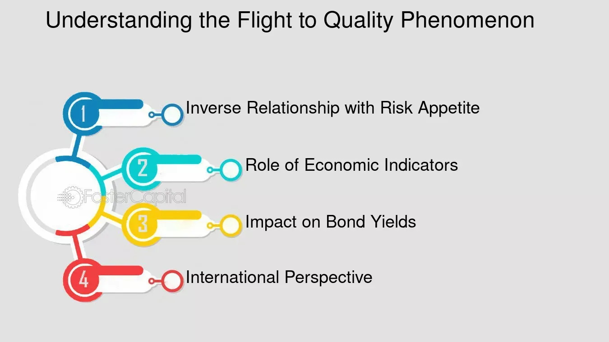

## Table of Contents

## What is the basic definition of 'Flight to Quality'?

'Flight to Quality' is a term used in finance and economics. It describes what happens when investors move their money from risky investments to safer ones. This often happens during times of economic uncertainty or crisis. People want to protect their money, so they choose investments that are less likely to lose value.

This movement can affect markets a lot. When many investors do this at the same time, it can cause prices of risky assets to fall and prices of safe assets to rise. For example, during a financial crisis, investors might sell stocks and buy government bonds instead. This is because government bonds are seen as more secure. Understanding 'Flight to Quality' helps us see how investors behave and how markets can change quickly.

## Why do investors engage in a flight to quality?

Investors engage in a flight to quality because they want to keep their money safe. When the economy is shaky or there's a big crisis, people get worried about losing their investments. They start moving their money from risky things like stocks to safer things like government bonds or gold. These safe investments are less likely to lose value, so investors feel more secure.

This behavior is like a natural reaction to danger. Just as animals might run to a safe place when they sense a threat, investors run to quality investments when they sense economic trouble. By doing this, they hope to protect their money until things calm down. It's all about reducing risk and feeling more in control during uncertain times.

## What types of assets are typically considered 'quality' during a flight to quality?

During a flight to quality, investors usually look for assets that are safe and reliable. The most common type of quality asset is government bonds, especially those from stable countries like the United States, Germany, or Japan. These bonds are seen as very safe because they are backed by the government, which is less likely to go bankrupt. Another popular choice is gold. Gold has been valued for thousands of years and is seen as a safe haven because it keeps its value even when the economy is bad.

Cash and cash equivalents, like money market funds, are also considered quality assets. These are easy to turn into cash quickly and don't lose value as easily as stocks or other risky investments. Some investors might also turn to high-quality corporate bonds from big, stable companies. These bonds are safer than stocks but can still offer a bit more return than government bonds. Overall, the key is to find assets that will hold their value and protect the investor's money during tough economic times.

## Can you explain the mechanism behind a flight to quality?

When investors see trouble coming in the economy, they start to worry about losing their money. They want to keep their investments safe, so they move their money from risky things like stocks to safer things like government bonds or gold. This movement is called a flight to quality. It's like running to a safe place when you see danger. Investors do this because they want to protect their money until the economy gets better.

When lots of investors do this at the same time, it can change the market a lot. The prices of risky investments go down because fewer people want to buy them. At the same time, the prices of safe investments go up because more people want them. This can make the economy even more unstable, but it's what investors do to feel safer during tough times.

## What economic conditions typically trigger a flight to quality?

A flight to quality often happens when people start to worry about the economy. This can be because of things like a big drop in the stock market, a financial crisis, or even news about a possible recession. When investors see these signs, they get scared that their money might not be safe in risky investments anymore. So, they start moving their money to safer places like government bonds or gold.

These economic conditions make investors feel like they need to protect their money. For example, if there's a lot of uncertainty because of a global event or if companies are starting to fail, people will want to keep their money safe. By moving their money to quality assets, they hope to wait out the bad times without losing too much. This behavior can make the economy even more unstable, but it's what investors do to feel more secure during tough times.

## How does a flight to quality affect the financial markets?

When investors engage in a flight to quality, it can shake up the financial markets a lot. They start selling their risky investments like stocks and buying safer ones like government bonds or gold. This big move causes the prices of risky assets to drop because fewer people want to buy them. At the same time, the prices of safe assets go up because more people want them. This can make the stock market go down and can even make the economy feel more unstable.

This shift in investment can also affect how much it costs for companies to borrow money. When investors buy a lot of government bonds, the demand for these bonds goes up, which can make their prices go up and their interest rates go down. But, if companies want to borrow money by issuing bonds, they might have to offer higher interest rates because investors are less interested in risky investments. This can make it harder and more expensive for companies to get the money they need to grow or even just to keep going.

## What are the historical examples of a flight to quality?

One big example of a flight to quality happened during the 2008 financial crisis. When big banks started failing and the economy was in trouble, investors got really scared. They sold their stocks and other risky investments fast and bought safer things like U.S. government bonds and gold. This made the stock market crash even more, and the prices of safe investments went up a lot. It was a clear sign of how worried investors were about losing their money.

Another time was during the early days of the COVID-19 pandemic in 2020. When the virus started spreading and countries were shutting down, people didn't know what would happen to the economy. So, they moved their money from stocks to safer places like government bonds and cash. This caused a big drop in the stock market and made safe investments more expensive. It showed how quickly investors could change their minds when they felt the economy was in danger.

## How can investors identify the onset of a flight to quality?

Investors can spot the start of a flight to quality by watching the news and the markets closely. They should look for signs of big trouble in the economy, like a sharp drop in the stock market or news about banks failing. If people are talking a lot about a possible recession or a big crisis, that's a hint that investors might start moving their money to safer places. Also, if they see the prices of government bonds going up quickly or the price of gold jumping, that's another sign that a flight to quality could be happening.

When investors see these signs, they should pay attention to how other investors are acting. If a lot of people are selling their stocks and buying safe investments like government bonds or cash, it's a strong sign that a flight to quality is starting. This behavior can be seen in market data and news reports about investment trends. By keeping an eye on these things, investors can get ready to protect their money if they think a flight to quality is coming.

## What are the potential risks and drawbacks of engaging in a flight to quality?

When investors move their money to safer investments during a flight to quality, they might miss out on making more money. If the economy gets better faster than they thought, the risky investments they sold could go up in value. They would not get to enjoy those gains because they moved their money to safer, but less profitable, places. Also, if everyone is buying the same safe investments, like government bonds, the prices of those investments can go up a lot. This means the investors might not make as much money from these safe investments as they hoped.

Another risk is that the flight to quality can make the economy even more unstable. When lots of investors sell their risky investments at the same time, it can cause the stock market to drop even more. This can scare more people and make the economic problems worse. Also, if investors keep their money in safe investments for too long, they might miss out on good chances to invest in the economy when it starts to recover. It's important for investors to watch the market closely and be ready to move their money back to riskier investments when the time is right.

## How does a flight to quality influence monetary policy?

When investors engage in a flight to quality, it can affect what central banks do with their monetary policy. Central banks, like the Federal Reserve in the U.S., try to keep the economy stable. When investors move their money to safe investments like government bonds, it can make the prices of these bonds go up and their interest rates go down. This can make it harder for the central bank to control interest rates in the economy. They might need to buy more bonds or change their interest rates to keep things in balance.

This movement can also make the central bank worried about the economy. If lots of investors are moving to safe investments, it might mean they think the economy is in trouble. The central bank might decide to lower interest rates to make borrowing cheaper and encourage people to spend and invest more. This can help the economy recover. But, the central bank has to be careful because changing interest rates too much can also cause other problems. They need to watch the market closely and make smart choices to help the economy stay stable.

## What role do credit ratings play in a flight to quality?

Credit ratings are important during a flight to quality because they help investors know which investments are safe. A credit rating is like a score that tells how likely it is for a company or a country to pay back its debts. When investors are scared about the economy, they look for investments with high credit ratings, like AAA-rated government bonds. These high ratings mean the investment is very safe, so investors feel more secure putting their money there.

During a flight to quality, investors might move their money away from investments with lower credit ratings. They do this because they think these investments are too risky when the economy is shaky. This movement can make the prices of low-rated investments go down even more. So, credit ratings help investors decide where to put their money to keep it safe during tough economic times.

## How can advanced investors strategically position their portfolios during a flight to quality?

Advanced investors can strategically position their portfolios during a flight to quality by carefully balancing their investments between safe and risky assets. They might keep some money in safe investments like government bonds or gold to protect their money during uncertain times. At the same time, they could hold onto some risky investments like stocks, especially if they think the economy will recover soon. This way, they can still make money if the market goes up again. They should also watch the market closely and be ready to move their money around based on what's happening.

Another strategy is to use what's called a "barbell approach." This means putting money in both very safe investments and very risky ones, but not in the middle. The safe part of the portfolio protects their money, while the risky part gives them a chance to make more money if the economy gets better. Advanced investors should also think about diversifying their investments across different types of assets and countries. This can help them spread out their risk and be ready for whatever happens in the economy. By being smart and flexible, they can do well even during a flight to quality.

## References & Further Reading

[1]: Baur, D. G., & McDermott, T. K. (2010). ["Is gold a safe haven? International evidence."](https://www.sciencedirect.com/science/article/pii/S0378426609003343) Journal of International Money and Finance.

[2]: Black, F. (1976). ["The Pricing of Commodity Contracts."](https://www.sciencedirect.com/science/article/pii/0304405X76900246) Journal of Financial Economics.

[3]: Gregoriou, G. N. (Ed.). (2015). ["Reconsidering Funds of Hedge Funds: The Financial Crisis and Best Practices in UCITS, Tail Risk, Performance, and Due Diligence."](https://www.amazon.com/Reconsidering-Funds-Hedge-Financial-Performance/dp/0124016995)

[4]: Menkveld, A. J. (2013). ["High frequency trading and the new market makers."](https://www.sciencedirect.com/science/article/pii/S1386418113000281) The Review of Financial Studies.

[5]: ["Market Liquidity: Theory, Evidence, and Policy"](https://academic.oup.com/book/55158) by Thierry Foucault, Marco Pagano, Ailsa Roell

[6]: Subrahmanyam, A. (1991). ["A Theory of Trading in Stock Index Futures."](https://www.jstor.org/stable/2962083) The Journal of Finance.