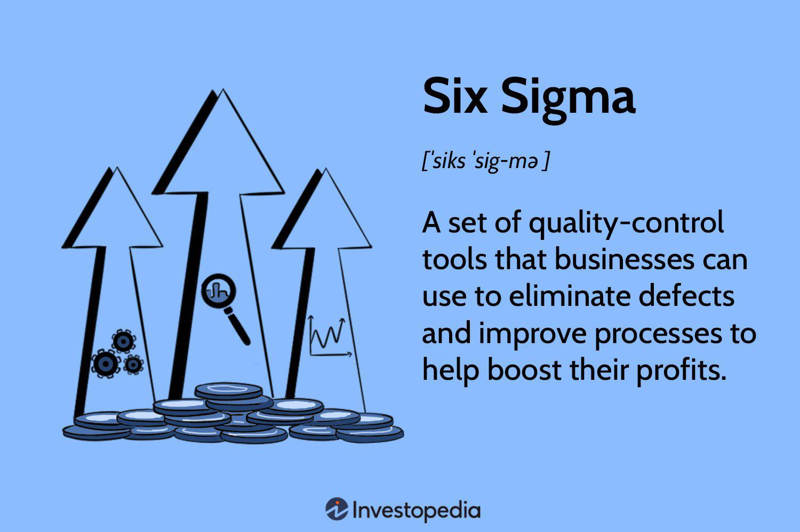

In recent years, the concept of "flight to quality" has garnered significant attention within financial markets, serving as an essential strategy for investors during turbulent periods. A "flight to quality" occurs when investors move their assets from riskier investments to safer ones, such as from equities to government bonds, reflecting concerns over market stability or global economic uncertainties. Several factors can prompt such behavior, including geopolitical tensions, natural disasters, or unexpected economic downturns.

This article explores how flight to quality, when combined with the sophisticated tools of algorithmic trading, can help investors adeptly navigate volatile markets. Algorithmic trading, characterized by the use of advanced algorithms and high-speed data processing, enables investors to execute trades with precision and at optimal times. These technologies are instrumental in mitigating human emotion and bias, allowing for the strategic execution of investment decisions during uncertain times.



A comprehensive understanding of these concepts is crucial for investors aiming to shield their portfolios from market volatility. By integrating flight to quality principles and algorithmic capabilities, investors can design strategies that provide both stability and the potential for growth even amidst economic turbulence. This discussion will unravel the complexities of the financial marketplace and examine the dynamics of contemporary investment strategies as they adapt to evolving conditions.

## Table of Contents

## Understanding Flight to Quality

Flight to quality is an investment phenomenon where investors transfer their capital from riskier assets, such as stocks, to safer ones, such as government bonds. This behavior is largely driven by fears regarding the stability of financial markets and broader economic conditions. Several factors can trigger a flight to quality, including geopolitical tensions, natural disasters, and unexpected economic downturns.

Investors seek to mitigate risk and preserve capital during periods of uncertainty. When confidence in the market or economy wanes, moving assets to stable and reliable investments becomes a priority. Government bonds are typically favored during these times due to their perceived safety, being backed by government credit. This shift, while protective, can lead to increased demand for such safe assets, driving up their prices and subsequently lowering yields.

The triggers for a flight to quality are varied yet interconnected. Geopolitical tensions, such as international conflicts or trade wars, can create uncertainty about the global economic landscape. Similarly, natural disasters can disrupt supply chains and impact economic productivity, prompting investors to seek shelter in safe-haven assets. Additionally, unexpected downturns in economic indicators, like sudden drops in GDP or employment rates, can shake investor confidence, leading to a reevaluation of risk.

Observing the patterns associated with a flight to quality is important for both individual investors and institutional players. These patterns often include rapid movements in asset prices and changes in market [liquidity](/wiki/liquidity-risk-premium), as individuals adjust their portfolios in response to perceived threats. Recognizing these signals can aid in making informed decisions about asset allocation and risk management.

In summary, understanding the dynamics that drive a flight to quality is essential for safeguarding investments during turbulent times. Analyzing the causes and consequences of these shifts helps investors make strategic decisions aimed at preserving capital and maintaining stability within their portfolios.

## The Role of Algorithmic Trading

Algorithmic trading, often referred to as algo trading, has revolutionized the landscape of financial markets by facilitating the rapid and efficient execution of trades. This form of trading relies on preprogrammed instructions and mathematical models to execute orders at a speed and frequency that would be impossible for a human trader. In the context of a flight to quality, where investors seek to shift their assets from riskier investments to more secure ones, [algorithmic trading](/wiki/algorithmic-trading) technologies offer significant advantages.

First and foremost, algorithmic trading systems can swiftly analyze vast amounts of data, taking into account multiple variables such as price trends, market [volatility](/wiki/volatility-trading-strategies), and economic indicators. This capability allows for the prompt identification of market conditions that may necessitate a flight to quality. For instance, algorithms can assess geopolitical events or sudden economic downturns and respond by reallocating investments towards safe-haven assets.

Moreover, algorithmic trading minimizes the emotional bias that often affects human traders. Fear and anxiety during market turmoil can lead to impulsive decisions; however, algorithms operate on logic and data, executing trades based on predefined criteria rather than emotional reactions. This objectivity is particularly beneficial during periods of market instability, where quick and rational decision-making is crucial.

Investors aiming to optimize their flight to quality strategies need to understand the operation of different types of trading algorithms. Broadly, these can be categorized into the following:

1. **Trend-Following Algorithms**: These algorithms analyze historical price data to identify patterns and trends, executing trades that align with these trends. They are especially useful during prolonged periods of market movement towards or away from risk.

2. **Arbitrage Algorithms**: In a volatile market, price discrepancies often occur. Arbitrage algorithms exploit these inefficiencies by executing simultaneous trades in different markets to capitalize on price differences, ensuring maximum profit with minimal risk.

3. **Mean Reversion Algorithms**: These algorithms are based on the assumption that prices will eventually return to their mean or average level. During market corrections or after sharp declines, these algorithms identify opportunities for buying undervalued assets, providing investors with a chance to reallocate to safer investments at optimal prices.

4. **Machine Learning Algorithms**: Leveraging artificial intelligence, these algorithms continually improve their predictive capabilities by learning from new data. In the context of a flight to quality, they can enhance decision-making processes by identifying emerging patterns and predicting future market movements.

A basic implementation example of a trend-following algorithm in Python using moving averages could look like this:

```python
import pandas as pd

def simple_moving_average(data, window_size):
    return data.rolling(window=window_size).mean()

def trend_following_strategy(data, short_window, long_window):
    signals = pd.DataFrame(index=data.index)
    signals['price'] = data
    signals['short_mavg'] = simple_moving_average(data, short_window)
    signals['long_mavg'] = simple_moving_average(data, long_window)
    signals['signal'] = 0.0
    signals['signal'][short_window:] = np.where(signals['short_mavg'][short_window:] > signals['long_mavg'][short_window:], 1.0, 0.0)
    signals['positions'] = signals['signal'].diff()
    return signals

# Assume `data` is a DataFrame with datetime index and closing prices
short_window = 40
long_window = 100
signals = trend_following_strategy(data['Close'], short_window, long_window)
```

In summary, algorithmic trading plays an indispensable role in executing flight to quality strategies. By leveraging advanced computational methods, investors can navigate volatile market conditions more effectively, ensuring the timely reallocation of assets to bolster portfolio stability. Understanding and utilizing these algorithms are paramount for any investor looking to safeguard against potential market downturns.

## Identifying Safe-Haven Assets

Safe-haven assets serve as financial instruments that investors utilize to mitigate risk and secure their portfolios during periods of market instability. Such assets typically exhibit minimal correlation with riskier assets, maintaining their value or potentially appreciating when financial markets face turmoil. This section discusses several prototypical examples of safe-haven assets, their significance, and how investors can accurately identify and invest in them.

Government bonds are often considered quintessential safe-haven assets. Particularly, U.S. Treasury bonds are preferred due to their low default risk and guaranteed return by the government. During economic downturns or geopolitical tensions, investors tend to reallocate their capital from equities and other riskier investments into these bonds seeking preservation of principal and capital stability. The demand for government bonds during these times often results in lower yields; however, their safety and liquidity make them an attractive choice for risk-averse investors.

Gold has long been viewed as a reliable store of value and a hedge against inflation and currency fluctuations. Its enduring worth, scarcity, and inherent value independent of any government's or financial system's backing contribute to its status as a safe haven. Gold prices typically increase when investors anticipate a decline in a currency's value or in response to financial stress, making it a preferred asset in uncertain economic environments.

Defensive stocks or sectors, such as utilities, healthcare, and consumer staples, also provide a cushion against market volatility. These sectors offer essential goods and services that maintain demand irrespective of economic conditions, providing more predictable and stable revenues. Defensive stocks typically exhibit lower volatility compared to broader market indices, making them a strategic component of a flight to quality portfolio.

To identify these safe-haven assets effectively, investors often monitor economic indicators, geopolitical developments, and central bank policies that can signal increased market volatility. Diversifying a portfolio through a balanced allocation in defensive stocks, government bonds, and physical assets like gold can protect against market downturns. Tools such as correlation analyses and historical performance reviews can assist investors in recognizing assets that have demonstrated resilience during past market crises.

In summary, identifying and investing in safe-haven assets form a crucial component of a flight to quality strategy. These assets help in cushioning portfolios during adverse financial conditions, offering an advantageous balance between risk and return for prudent investors.

## Integration of Flight to Quality in Investment Strategies

Integrating a flight to quality approach into an investment strategy is vital for protecting portfolios during economic downturns. This method prioritizes diversification by incorporating safe-haven assets that historically retain or increase in value during volatile market conditions. To effectively utilize this strategy, investors should strategically allocate a portion of their portfolio to assets like government bonds, gold, and certain defensive stocks known for their stability.

Algorithmic trading significantly enhances the execution of a flight to quality strategy. By employing algorithms, investors can swiftly and precisely execute trades, reducing latency and minimizing the influence of human emotion. These automated systems can identify market trends and execute orders rapidly, ensuring that investors capitalize on opportune moments for shifting asset allocations. A basic Python snippet for an algorithmic trade execution might look like this:

```python
import yfinance as yf

def execute_trade(symbol, target_price):
    data = yf.download(symbol, period="1d")
    current_price = data['Close'][-1]

    if current_price <= target_price:
        print(f"Executing trade for {symbol} at {current_price}")

execute_trade('GOLD', 1800)
```

Designing an effective flight to quality strategy involves understanding market signals and choosing appropriate safe-haven assets. Investors can adopt a systematic approach by setting predefined criteria for reallocating assets and utilizing algorithms to automate these decisions. This methodology not only protects against market risks but also ensures that the portfolio maintains a balanced risk-return profile.

Several examples illustrate successful implementations of flight to quality strategies. During the 2008 financial crisis, many institutional investors reallocated assets into U.S. Treasury bonds, benefiting from their perceived safety. Similarly, during geopolitical tensions, such as the Brexit referendum, gold saw significant inflows as investors sought a secure store of value. These case studies underscore the importance of proactive strategy adaptation to safeguard against market uncertainties.

In conclusion, the success of integrating a flight to quality approach lies in disciplined portfolio management and the judicious use of algorithmic trading. By proactively adjusting investment strategies and incorporating robust technological solutions, investors can significantly mitigate risks associated with economic downturns.

## Risks and Challenges

Flight to quality, while a strategic defensive mechanism, comes with several inherent challenges and risks. Understanding these risks is crucial for investors aiming to protect their portfolios effectively without compromising potential returns. Below are some of the primary concerns when implementing a flight to quality strategy.

One of the most significant downsides of flight to quality investments is the typically lower yield returns from safer assets compared to their riskier counterparts. United States Treasury securities, for instance, are considered among the safest havens during economic uncertainty. However, these securities generally offer lower yields, which can affect overall portfolio performance, especially if held over an extended period. Lower yields might lead to what is known as "opportunity cost," where the capital tied in low-yield, safe assets could have potentially earned higher returns if allocated elsewhere.

Another risk is the occurrence of herd behavior among investors. During times of market uncertainty, large numbers of investors simultaneously flock to these safe assets, which can create a self-reinforcing cycle. This mass movement can lead to inflated prices for traditional safe havens like gold, certain government bonds, or defensive sector stocks. As prices rise due to increased demand, the assets may become overvalued, reducing their attractiveness and potentially leading to price corrections when market conditions stabilize.

Managing these risks requires strategic foresight and precise execution. Investors should maintain a diversified portfolio that balances higher-risk, high-return investments with safer ones, mitigating the overall risk. Here's a simple example of how one might use Python to analyze and balance a portfolio incorporating both high-risk and low-risk assets:

```python
import pandas as pd
import numpy as np

# Hypothetical data: Expected returns and standard deviations for assets
data = {
    'Asset': ['Stock_A', 'Stock_B', 'Bond_A', 'Bond_B'],
    'Expected_Return': [0.12, 0.15, 0.03, 0.02],
    'Standard_Deviation': [0.22, 0.30, 0.05, 0.03]
}

df = pd.DataFrame(data)

# Weights as proportions of total investment
weights = np.array([0.25, 0.25, 0.25, 0.25])

# Calculate portfolio expected return
portfolio_return = np.sum(df['Expected_Return'] * weights)

# Calculate portfolio variance
portfolio_variance = np.dot(weights.T, np.dot(np.diag(df['Standard_Deviation'] ** 2), weights))

# Calculate portfolio standard deviation
portfolio_std_deviation = np.sqrt(portfolio_variance)

print(f"Portfolio Expected Return: {portfolio_return:.2%}")
print(f"Portfolio Standard Deviation: {portfolio_std_deviation:.2%}")
```

This Python snippet demonstrates how to calculate a portfolio's expected return and volatility, helping investors understand the risk-return trade-off. By adjusting weights dynamically, investors can better anticipate and manage risks associated with flight to quality transitions.

Finally, it is essential to be aware of the systemic risks posed by significant movements in global financial markets. While shifting to safe-haven assets during volatile times can protect against short-term losses, these strategies need continuous monitoring and adjustments in response to changing economic indicators and financial market dynamics. Investors should remain vigilant and ready to pivot their strategies as new information becomes available to ensure sustainable portfolio performance.

## Conclusion

Flight to quality is a critical strategy for navigating financial uncertainty and protecting investments. This investment approach focuses on reallocating assets from riskier investments to more secure, stable options, often considered safe havens such as government bonds and gold. By choosing securities known for their resilience during economic downturns, investors can better shield their portfolios from volatility.

Furthermore, integrating algorithmic trading with a flight to quality strategy enhances an investor's ability to respond swiftly to market changes. Algorithms allow for the rapid execution of trades based on precise, non-emotional decision-making. This technological edge facilitates timely adjustments that are crucial during periods of financial instability, ensuring that shifts to safer assets are made efficiently.

To secure a more stable financial future, it is essential for investors to not only understand the principles behind flight to quality but to also effectively implement them within their investment strategies. Continuous education and refinement of these strategies are vital, as the financial markets are dynamic and subject to ongoing change. This adaptability helps investors remain prepared for potential market disruptions.

While uncertainty will always exist in the financial markets, a well-structured investment strategy that incorporates flight to quality can significantly mitigate its impact. This approach offers a pathway to maintaining portfolio stability and achieving long-term financial goals, even amidst market unpredictability.

## References & Further Reading

[1]: Baur, D. G., & McDermott, T. K. (2010). ["Is gold a safe haven? International evidence."](https://www.sciencedirect.com/science/article/pii/S0378426609003343) Journal of International Money and Finance.

[2]: Black, F. (1976). ["The Pricing of Commodity Contracts."](https://www.sciencedirect.com/science/article/pii/0304405X76900246) Journal of Financial Economics.

[3]: Gregoriou, G. N. (Ed.). (2015). ["Reconsidering Funds of Hedge Funds: The Financial Crisis and Best Practices in UCITS, Tail Risk, Performance, and Due Diligence."](https://www.amazon.com/Reconsidering-Funds-Hedge-Financial-Performance/dp/0124016995)

[4]: Menkveld, A. J. (2013). ["High frequency trading and the new market makers."](https://www.sciencedirect.com/science/article/pii/S1386418113000281) The Review of Financial Studies.

[5]: ["Market Liquidity: Theory, Evidence, and Policy"](https://academic.oup.com/book/55158) by Thierry Foucault, Marco Pagano, Ailsa Roell

[6]: Subrahmanyam, A. (1991). ["A Theory of Trading in Stock Index Futures."](https://www.jstor.org/stable/2962083) The Journal of Finance.