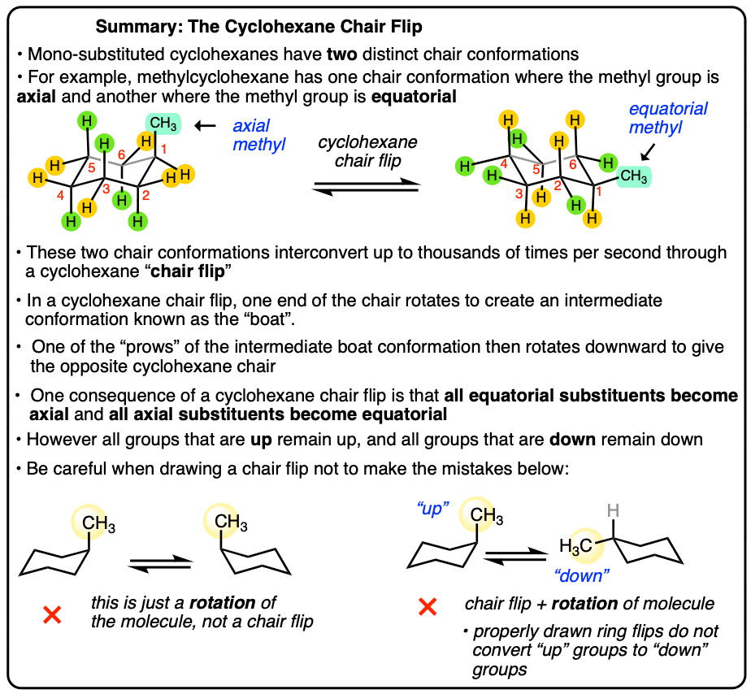

## Table of Contents

## What is the basic definition of a flip in gymnastics?

A flip in gymnastics is when a person does a salto or a somersault. This means they rotate their body in the air, usually going head over heels. Flips can be done forward, backward, or sideways. Gymnasts often use a springboard or a trampoline to help them get enough height and speed to do a flip.

There are many different types of flips in gymnastics. Some common ones are the front flip, back flip, and side flip. Each type of flip requires different skills and techniques. Gymnasts practice a lot to make sure they can do flips safely and correctly. Flips are exciting to watch and can be part of bigger routines in gymnastics competitions.

## How does the mechanism of a flip work in terms of physics?

When a gymnast does a flip, they use the principles of physics to control their movement. The key ideas are momentum, rotation, and the conservation of angular momentum. Momentum helps the gymnast get off the ground. They often use a springboard or run-up to gain speed. This speed turns into upward momentum when they push off the ground, lifting them into the air. Once in the air, the gymnast starts to rotate. They do this by pulling their body into a tucked position or by swinging their arms. This action creates a force that makes them spin.

The conservation of angular [momentum](/wiki/momentum) is crucial during the flip. It means that once the gymnast starts spinning, they will keep spinning at the same rate unless something changes it. If they tuck tighter, they spin faster because their mass is closer to the center of rotation. To land safely, the gymnast must time their movements carefully. They need to know when to start untucking to slow down the spin and prepare for landing. By understanding and using these physics principles, gymnasts can perform flips with control and precision.

## Can you provide simple examples of flips performed in gymnastics?

A front flip is a common flip in gymnastics. The gymnast runs towards the end of a springboard, then jumps and tucks their body forward. As they spin in the air, they keep their body tight to control the flip. Once they see the ground coming, they untuck and prepare to land on their feet. Front flips can be part of bigger routines on the floor or vault.

Another flip is the back flip. The gymnast starts by facing away from the springboard. They jump backward, pushing off with their legs to get height. In the air, they tuck their body backward and start to spin. They need to watch the ground to know when to untuck and land. Back flips can be exciting to watch and are often used in floor routines or on the balance beam.

A side flip, or aerial, is different because the gymnast rotates sideways. They run and jump, then swing one leg up and over. This motion makes them spin sideways in the air. They need to keep their body straight to complete the flip. Side flips can be part of a tumbling pass on the floor or used in a dance routine.

## What are the different types of flips and how do they vary?

Flips in gymnastics come in many types, each with its own way of spinning. A front flip is when the gymnast jumps and tucks forward, spinning head over heels. They use a run-up and a springboard to get enough height and speed. A back flip is different because the gymnast jumps backward and tucks their body to spin in the opposite direction. They also use a run-up and springboard but face away from it. A side flip, or aerial, involves spinning sideways. The gymnast runs, jumps, and swings one leg up to start the sideways spin. Each type of flip requires different skills and timing to do it right.

The way each flip is done can change a lot based on what the gymnast wants to do. For example, a front flip can be done with different levels of tuck - from a tight tuck to a more open pike position. A back flip can be done with a twist, where the gymnast spins around their body's long axis while also flipping backward. This makes it a back flip with a twist. Side flips can be done with different leg positions, like a straight leg or a bent leg. Gymnasts can also combine flips, like doing a front flip into a back flip, to make their routines more exciting and challenging. Each variation adds its own level of difficulty and style to the performance.

## What muscles are primarily used during the execution of a flip?

During a flip, gymnasts use a lot of muscles to jump, spin, and land safely. The leg muscles, like the quadriceps and hamstrings, help them push off the ground and jump high. The calf muscles also help by giving extra power when they push off. The core muscles, including the abs and lower back, are very important too. They keep the body tight and help control the spin in the air. Strong core muscles make it easier to tuck and untuck at the right time.

The arm muscles, like the shoulders and biceps, help with the flip too. They swing to start the spin and help with balance when landing. The back muscles work with the core to keep the body in the right shape during the flip. All these muscles work together to make the flip smooth and safe. By using all these muscles, gymnasts can do flips with control and style.

## How does one learn to perform a flip safely?

Learning to do a flip safely takes time and practice. Start with the basics, like learning to jump high and tuck your body in the air. It's really helpful to practice on a soft surface, like a gymnastics mat or a foam pit. This way, if you fall, you won't get hurt. It's also important to have a coach or a teacher who knows gymnastics. They can show you the right way to do a flip and help you if you're doing something wrong. Always listen to their advice and take it slow. Don't try to do a full flip until you feel ready and have practiced the smaller steps a lot.

Once you feel comfortable with the basics, you can start trying flips with more help, like using a trampoline or a springboard. These tools can help you get higher in the air, making it easier to spin. Keep practicing the tuck and spin, and always work on your landing. Landing safely is just as important as doing the flip. Keep your body strong and flexible by doing exercises and stretches. Remember, it's okay to be scared at first. Everyone feels that way when they start. Just keep practicing, and soon you'll be doing flips safely and confidently.

## What are common mistakes beginners make when attempting a flip?

When beginners try to do a flip, they often make some common mistakes. One big mistake is not jumping high enough. If you don't jump high, you won't have enough time in the air to spin around and land safely. Another mistake is not tucking their body tight enough. When you tuck, you need to pull your knees close to your chest to spin faster. If you don't tuck tight, you might not spin enough and could land badly.

Another common mistake is not looking where they are going to land. It's important to spot the ground so you know when to start untucking and prepare for landing. If you don't look, you might land wrong and hurt yourself. Also, beginners sometimes rush into trying a full flip before they are ready. It's better to practice the smaller steps a lot, like jumping and tucking, before trying the whole flip. Taking it slow and practicing a lot helps you do flips safely.

## How do professional athletes incorporate flips into their routines?

Professional athletes use flips in their routines to make them exciting and show off their skills. They often do flips on different equipment like the floor, vault, and balance beam. On the floor, they might do a series of flips, like a front flip into a back flip, to create a tumbling pass. This makes their routine look smooth and impressive. On the vault, they use the springboard to do big flips and twists, which can score them high points in competitions. Flips add a lot of excitement and difficulty to their routines, making them stand out.

On the balance beam, flips are even trickier because it's narrow and high off the ground. Athletes need to be very precise and careful. They might do a back flip or a front flip on the beam, landing perfectly to keep going with their routine. Each flip is planned to fit into the whole performance, making it look like one big, flowing movement. By adding flips to their routines, professional athletes can show how strong, skilled, and brave they are.

## What advanced techniques can enhance the performance of a flip?

Advanced gymnasts use special techniques to make their flips better and more exciting. One way is by adding twists to their flips. This means they spin around their body's long axis while flipping. For example, they might do a back flip with a full twist, which is spinning around once while flipping backward. This makes the flip harder and more impressive. Another technique is changing the way they tuck during the flip. They might do a layout flip, where they keep their body straight instead of tucked, or a pike flip, where they bend at the hips but keep their legs straight. These changes add variety and difficulty to their routines.

Gymnasts also use their arms and legs to control the flip better. By swinging their arms at the right time, they can start the spin and keep it going smoothly. They might also use their legs to help with the twist, like kicking one leg to start spinning around. Timing is very important. They need to know exactly when to tuck, twist, and untuck to land safely. Practicing these advanced techniques a lot helps gymnasts do flips that are not only safe but also look amazing and can win them high scores in competitions.

## How has the technique of flipping evolved over time in sports?

The way athletes do flips in sports has changed a lot over time. In the past, flips were simple and mostly done on the ground. Gymnasts would do basic front flips and back flips, focusing on getting the spin right and landing safely. As time went on, athletes started using new equipment like springboards and trampolines. These tools helped them jump higher and spin faster, making flips more exciting and challenging. Coaches and athletes also learned more about how to train and practice, which helped them do flips better and safer.

Today, flips in sports are much more advanced. Athletes now do flips with twists, where they spin around their body while flipping. They also use different body positions, like layouts and pikes, to make their flips look different and harder. Gymnasts practice a lot to get the timing just right, so they can do flips that are not only safe but also look amazing. The way flips are done has become a big part of sports like gymnastics, diving, and even some martial arts, showing how much the technique has grown and changed over the years.

## What safety equipment is recommended when practicing flips?

When practicing flips, it's really important to use safety equipment to stay safe. Gymnasts should always use a thick gymnastics mat. These mats are soft and can help if you fall. They can stop you from getting hurt if you don't land right. Another good piece of equipment is a foam pit. It's full of soft foam blocks, so if you fall into it, you won't get hurt. It's a great way to practice flips without worrying about landing hard.

Wearing the right gear also helps keep you safe. A good pair of gymnastics shoes with grip can help you land better and not slip. Some gymnasts also wear wrist guards or knee pads to protect their joints. These can help if you fall and land on your hands or knees. Using this safety equipment can make practicing flips a lot safer and help you learn without getting hurt.

## Can you discuss the biomechanics involved in executing a perfect flip?

When a gymnast does a perfect flip, they use a lot of different body movements and forces to make it happen. They start by using their leg muscles to push off the ground and jump high. The more power they put into the jump, the higher they go, which gives them more time to spin. Once in the air, they tuck their body by pulling their knees to their chest. This makes them spin faster because their body's mass is closer to the center of rotation. Their core muscles are really important here because they help keep the body tight and control the spin. The gymnast also uses their arms to help start the spin and keep it going smoothly.

To land a flip perfectly, the gymnast needs to know exactly when to start untucking. They use their eyes to spot the ground and time their movements. As they see the ground coming, they start to open up their body, slowing down the spin so they can land on their feet. Their leg muscles help them absorb the impact of landing, and their core and back muscles help them stay balanced. By using all these body parts and forces together, gymnasts can do flips that look smooth and land safely.

## References & Further Reading

[1]: Bergstra, J., Bardenet, R., Bengio, Y., & Kégl, B. (2011). ["Algorithms for Hyper-Parameter Optimization."](https://dl.acm.org/doi/10.5555/2986459.2986743) Advances in Neural Information Processing Systems 24.

[2]: ["Advances in Financial Machine Learning"](https://www.amazon.com/Advances-Financial-Machine-Learning-Marcos/dp/1119482089) by Marcos Lopez de Prado

[3]: ["Evidence-Based Technical Analysis: Applying the Scientific Method and Statistical Inference to Trading Signals"](https://www.amazon.com/Evidence-Based-Technical-Analysis-Scientific-Statistical/dp/0470008741) by David Aronson

[4]: ["Machine Learning for Algorithmic Trading"](https://github.com/stefan-jansen/machine-learning-for-trading) by Stefan Jansen

[5]: ["Quantitative Trading: How to Build Your Own Algorithmic Trading Business"](https://www.amazon.com/Quantitative-Trading-Build-Algorithmic-Business/dp/1119800064) by Ernest P. Chan