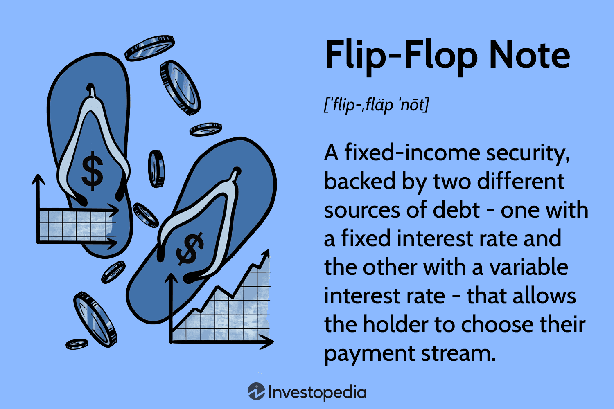

Algorithmic trading, often referred to as algo trading, involves using computer algorithms to automate the process of buying and selling financial instruments. This approach has gained significant traction in modern financial markets due to its ability to process vast amounts of data at high speed, execute orders with precision, and operate without the biases and emotional influences inherent in human traders. As markets become increasingly complex and interdependent, the role of algorithmic trading becomes even more crucial in maintaining efficiency and competitiveness.

A key concept within algorithmic trading is the 'mechanism flip'. This refers to a sudden and often unexpected change in the behavior of a trading algorithm, which can be triggered by a variety of factors such as shifts in market conditions, technical malfunctions, or strategic adjustments. Understanding mechanism flips is essential for enhancing trading algorithms and strategies, as these flips can lead to substantial deviations from expected trading outcomes, potentially impacting profitability and risk management.



This article addresses the complex dynamics of mechanism flips in algorithmic trading. It begins with a foundational understanding of algorithmic trading and the different types of algorithms commonly employed, such as trend-following and arbitrage strategies. We will define what constitutes a mechanism flip and how these flips manifest within trading systems. Real-world examples will illustrate both beneficial and adverse effects of mechanism flips, offering insights into their implications. Furthermore, we will explore strategies to identify, manage, and mitigate the risks associated with mechanism flips. Finally, we will look at the future of mechanism flips in algorithmic trading, considering technological advancements and regulatory developments.

By the end of this article, readers will gain a comprehensive understanding of mechanism flips and learn how to adapt their trading algorithms to navigate these complex phenomena effectively.

## Table of Contents

## Understanding Algorithmic Trading

Algorithmic trading, often referred to as algo trading, involves using computer programs to execute trading strategies based on pre-defined criteria at high speed and volume. These algorithms track and analyze market data to identify trading opportunities, thereby automating the trading process.

At its core, algorithmic trading relies on mathematical models and complex algorithms to determine the timing, price, quantity, and routing of trades. Fundamental principles include pattern recognition, statistical analysis, and historical data examination, which enable the algorithm to make decisions without human intervention.

Several types of algorithms are commonly employed in trading:

1. **Trend-Following Algorithms**: These algorithms identify and follow market trends, making buy or sell decisions based on the direction in which the asset is moving. They often use technical indicators like moving averages to make predictions. 

2. **Arbitrage Algorithms**: These algorithms exploit price discrepancies between different markets or instruments. For instance, if a stock is priced differently in two distinct exchanges, an arbitrage algorithm will simultaneously buy and sell it to profit from the price difference.

3. **Market Making Algorithms**: These provide liquidity to the market by continuously offering both buy and sell quotes for a financial instrument. The algorithm profits from the spread between the buy and sell price.

Algorithmic trading offers several advantages:

- **Speed**: Algorithms can process market data and execute trades far quicker than human traders, often in milliseconds, taking advantage of fleeting market conditions.

- **Accuracy**: By following predefined instructions, algorithms reduce the chances of human error, ensuring that trades are executed precisely as planned.

- **Emotion-Free Decision Making**: Algorithms are devoid of emotions, which means they can operate without fear or greed, adhering strictly to the strategy without deviation.

However, [algorithmic trading](/wiki/algorithmic-trading) is not without challenges and risks:

- **Technical Failures**: The reliance on technology means that technical glitches or software bugs can lead to significant losses or execution errors.

- **Market Impact**: Large orders executed by algorithms can influence the market, causing price fluctuations.

- **Overfitting**: There's a risk that algorithms are overly optimized on historical data, performing well in backtests but poorly in real-world scenarios.

To mitigate these risks, it is essential for trading firms to implement robust testing environments, continuous monitoring, and risk management protocols.

## What is a Mechanism Flip in Algo Trading?

A mechanism flip within algorithmic trading systems refers to a significant alteration in the underlying processes or conditions that drive algorithmic decisions. This change, often unforeseen, can lead to shifts in trading strategies and outcomes. Mechanism flips can result from changes in market conditions, technical errors, or strategic realignments, and understanding them is vital for maintaining effective trading algorithms.

Changes in market conditions are a primary cause of mechanism flips. These can include alterations in [volatility](/wiki/volatility-trading-strategies), [liquidity](/wiki/liquidity-risk-premium), or regulatory policies that impact how algorithms operate. For example, a sudden increase in market volatility could disrupt a trend-following algorithm's ability to predict price movements accurately.

Technical errors within the algorithmic systems themselves can also lead to mechanism flips. These errors may arise from software bugs, data feed inaccuracies, or hardware malfunctions, resulting in unintended execution of trades or misinterpretation of market signals.

Strategic realignments refer to changes in the algorithm or its parameters due to intentional modifications in response to evolving market strategies or new investment goals. This can occur when traders adjust algorithm settings to enhance performance in varying market environments.

The potential consequences of mechanism flips are manifold. They can lead to increased volatility in trading outcomes, as the algorithm may execute trades based on inappropriate signals or misaligned strategies. This disruption may result in unexpected losses or gains, affecting both short-term profitability and long-term strategic objectives.

Identifying and managing mechanism flips is crucial for successful trading. Traders must implement robust monitoring systems to detect sudden changes in algorithm performance and have mitigation strategies in place. This includes ongoing [backtesting](/wiki/backtesting) and simulation to ensure algorithms remain effective under different market scenarios, as well as incorporating safeguards like stop-loss mechanisms and diversification to minimize risk.

Overall, understanding and addressing mechanism flips is essential for maintaining the robustness and reliability of algorithmic trading systems, thereby securing more consistent and successful trading outcomes.

## Examples of Mechanism Flips in Algorithmic Trading

Algorithmic trading encompasses a broad range of strategies, each susceptible to changes known as mechanism flips that can significantly influence trading outcomes. This section examines several instances of mechanism flips, providing insights into their impact on trading performance.

### Mechanism Flip Leading to Improved Performance

Consider a trend-following algorithm designed to capitalize on sustained price movements. Initially, the algorithm uses a simple moving average (SMA) indicator to generate buy and sell signals. However, due to increased market volatility, the SMA-based model begins underperforming. A mechanism flip occurs when the algorithm dynamically switches to an Exponential Moving Average (EMA) model, which responds more rapidly to recent price changes.

This adjustment improves the algorithm's sensitivity to market reversals, leading to enhanced performance. The transition from SMA to EMA can be quantified through backtesting, showing improved returns and reduced drawdowns. This example underscores the adaptability required in algorithmic trading systems to respond to shifting market dynamics.

### Mechanism Flip Resulting in Losses

A hypothetical scenario involves an [arbitrage](/wiki/arbitrage) algorithm that exploits price discrepancies between two correlated assets. The algorithm operates efficiently under normal market conditions. However, during a sudden market disruption, the correlation between the assets alters temporarily, rendering the algorithm's strategy ineffective. 

The flip in mechanism occurs when the algorithm attempts to compensate by increasing its trading frequency, assuming that market conditions would normalize swiftly. Instead, this leads to excessive transaction costs and increased market exposure, culminating in unexpected losses.

This case highlights the risks associated with mechanism flips that are not carefully monitored or based on inaccurate assumptions about market conditions. It demonstrates the importance of incorporating risk management protocols to prevent exacerbated losses during flips.

### Lessons Learned

Several lessons emerge from these examples:

1. **Adaptability**: Algorithms must be designed to adapt seamlessly to new strategies or parameters as market conditions evolve, ensuring continued profitability without human intervention.

2. **Risk Management**: Implementing robust risk management strategies is crucial to mitigate the adverse effects of mechanism flips, such as increased transaction costs or exposure to unexpected market conditions.

3. **Continuous Monitoring and Backtesting**: Ongoing monitoring and backtesting are essential to identify potential mechanism flips early and assess their potential impact, allowing for timely adjustments.

4. **Data and Signal Appropriateness**: The choice of indicators or signals must align with current market conditions. The example of switching from SMA to EMA shows the importance of selecting the right tools for specific market environments.

Effectively managing mechanism flips ensures that trading algorithms can navigate and capitalize on complex financial environments, sustaining profitability and minimizing risks.

## Strategies to Manage and Mitigate Mechanism Flips

To effectively manage and mitigate mechanism flips within algorithmic trading systems, a combination of proactive identification methods, strategic interventions, and adaptive practices is necessary. These strategies ensure that trading algorithms remain robust, efficient, and profitable despite constantly changing market conditions.

### Proactive Identification of Potential Mechanism Flips

Identifying potential mechanism flips before they occur involves continuously monitoring key indicators and patterns within trading systems and market conditions. By analyzing historical data and employing predictive analytics, traders can anticipate shifts that might trigger a flip. Implementing advanced [machine learning](/wiki/machine-learning) models could enhance this process, enabling the detection of anomalies and patterns that signal an impending flip. For instance, anomaly detection algorithms such as Isolation Forests or Autoencoders can be useful for spotting unusual patterns in trading data.

### Strategies for Mitigating the Impact of Mechanism Flips

- **Robust Testing:** Conducting extensive backtesting and simulation of trading algorithms under varying market scenarios is imperative. This includes stress testing under extreme conditions to understand potential vulnerabilities. Algorithms should be rigorously vetted using historical data and synthetic data to ensure they maintain performance consistency across different market regimes.

- **Diversification:** Implementing diversification in trading strategies can reduce the impact of a mechanism flip. By spreading investments across various asset classes, sectors, or trading strategies, the negative effects of a single mechanism flip can be mitigated. A diversified portfolio inherently includes parts that behave differently under the same market conditions, thereby cushioning against sudden adverse flips.

- **Stop-Loss Mechanisms:** Incorporating stop-loss mechanisms can limit potential losses from unexpected flips. These automated protocols ensure that positions are closed automatically once they reach a predefined loss threshold, thus protecting the trader from excessive depletion of capital. A simple Python implementation could involve setting a trigger that monitors asset prices and executes a sell order when the price falls below a certain level.

```python
def stop_loss(prices, threshold):
    for price in prices:
        if price < threshold:
            execute_sell_order()
            break

```

### Continuous Monitoring and Analysis

Continuous monitoring of both internal system performance and external market indicators is crucial for timely detection and response to mechanism flips. Employing real-time data analytics platforms allows traders to keep abreast of market dynamics. This includes setting up alert systems that notify traders of significant changes in market conditions or system performance metrics, ensuring prompt intervention when needed.

### Flexibility and Adaptability in Trading Algorithms

Building flexibility and adaptability into trading algorithms allows them to adjust to dynamic market conditions automatically. Adaptive algorithms that leverage machine learning can modify their parameters in response to market shifts, thus optimizing performance. For example, [reinforcement learning](/wiki/reinforcement-learning) algorithms can be programmed to adjust decision-making processes based on real-time feedback, allowing for responsive strategy realignment.

In conclusion, a comprehensive strategy combining proactive identification, mitigation techniques, continuous oversight, and algorithmic adaptability can effectively manage mechanism flips in algorithmic trading. Understanding these facets empowers traders to maintain robust and responsive trading systems capable of navigating the complexities of modern financial markets.

## The Future of Mechanism Flips in Algorithmic Trading

Advancements in technology and changes in financial markets are expected to significantly influence mechanism flips within algorithmic trading. As technology becomes more sophisticated, algorithmic trading systems will need to adapt to manage these flips more effectively. 

One of the key technological advancements likely to impact mechanism flips is the development of [artificial intelligence](/wiki/ai-artificial-intelligence) (AI) and machine learning (ML). These technologies could be employed to predict and manage mechanism flips by analyzing vast datasets to identify patterns and anomalies that might signify an impending flip. For example, machine learning algorithms can be trained on historical market data to recognize the precursors to a mechanism flip—such as unusual trading volumes or price movements—and adjust trading strategies accordingly. This predictive capability can help automate the process of mitigating the adverse effects of mechanism flips, thus preserving trading portfolios against unexpected market changes.

Moreover, AI and ML can improve the adaptability of trading algorithms through continuous learning mechanisms. Unlike traditional static algorithms, AI-enhanced systems can self-correct and recalibrate in real time, reducing the risk of prolonged inefficiencies caused by mechanism flips. A simple implementation could use reinforcement learning to adjust trading actions based on the success or failure of previous trades, refining strategies dynamically as market conditions evolve.

As algorithmic trading becomes more complex and widespread, there is an increasing need for regulatory oversight to manage the ethical considerations surrounding mechanism flips. Regulators may enforce guidelines to ensure that algorithms behave responsibly during unexpected market shifts, preventing undue market manipulation or systemic risk. This oversight is crucial as the frequency and impact of mechanism flips could grow with more traders deploying sophisticated algorithms.

Ethical considerations also include the transparency and accountability of algorithmic decisions, particularly as they affect market participants. The autonomous nature of AI-driven trading systems raises questions about responsibility and control, prompting the need for frameworks that balance innovation with market integrity and fairness.

In looking forward, the role of mechanism flips in algorithmic trading is likely to grow in significance. As financial markets continue to evolve, driven by technological innovation and globalization, traders must stay informed and adaptable, integrating cutting-edge tools and strategies to manage the dynamic landscape effectively. The ability to identify, predict, and respond to mechanism flips will be crucial in maintaining competitive advantage and ensuring consistent trading outcomes.

In conclusion, as technology and market dynamics progress, the focus on mechanism flips will increase. Traders and firms must leverage AI and sophisticated analytics to stay ahead in an ever-evolving landscape. Regulators and industry leaders will need to collaborate closely to address ethical issues and uphold market stability, ensuring that algorithmic traders harness these advancements responsibly and effectively.

## Conclusion

Algorithmic trading has become an integral part of today's financial markets, offering numerous advantages such as speed, accuracy, and the removal of emotional bias in trading decisions. One of the critical aspects that have emerged within this domain is the concept of mechanism flips. These flips represent changes or shifts in the functioning of a trading algorithm, which can occur due to market dynamics, technical errors, or strategic adjustments.

Understanding mechanism flips is paramount for traders seeking to optimize their algorithmic trading strategies. Recognizing and managing these shifts can help mitigate risks and capitalize on opportunities that arise from changing market conditions. Mechanism flips, if not appropriately addressed, can lead to increased volatility and unanticipated trading results. Therefore, an in-depth comprehension of these phenomena is crucial in avoiding potential pitfalls and ensuring the robustness of trading algorithms.

Traders are encouraged to remain vigilant and flexible, continually updating and testing their algorithms to anticipate and handle mechanism flips effectively. Strategies such as diversification, robust testing, and employing stop-loss mechanisms are vital in managing the impacts of these flips. Moreover, continuous monitoring and analysis are integral to adjusting trading strategies in alignment with evolving market conditions.

In summary, mechanism flips offer both challenges and opportunities within algorithmic trading. By integrating insights into trading frameworks and maintaining a proactive approach, traders can enhance their ability to achieve successful trading outcomes. Staying informed and adaptive is key to thriving in the dynamic landscape of algorithmic trading. As technology continues to advance, the importance of understanding and managing mechanism flips will only grow, underscoring the need for traders to adopt forward-thinking strategies in their trading endeavors.

## References & Further Reading

[1]: Bergstra, J., Bardenet, R., Bengio, Y., & Kégl, B. (2011). ["Algorithms for Hyper-Parameter Optimization."](https://dl.acm.org/doi/10.5555/2986459.2986743) Advances in Neural Information Processing Systems 24.

[2]: ["Advances in Financial Machine Learning"](https://www.amazon.com/Advances-Financial-Machine-Learning-Marcos/dp/1119482089) by Marcos Lopez de Prado

[3]: ["Evidence-Based Technical Analysis: Applying the Scientific Method and Statistical Inference to Trading Signals"](https://www.amazon.com/Evidence-Based-Technical-Analysis-Scientific-Statistical/dp/0470008741) by David Aronson

[4]: ["Machine Learning for Algorithmic Trading"](https://github.com/stefan-jansen/machine-learning-for-trading) by Stefan Jansen

[5]: ["Quantitative Trading: How to Build Your Own Algorithmic Trading Business"](https://www.amazon.com/Quantitative-Trading-Build-Algorithmic-Business/dp/1119800064) by Ernest P. Chan