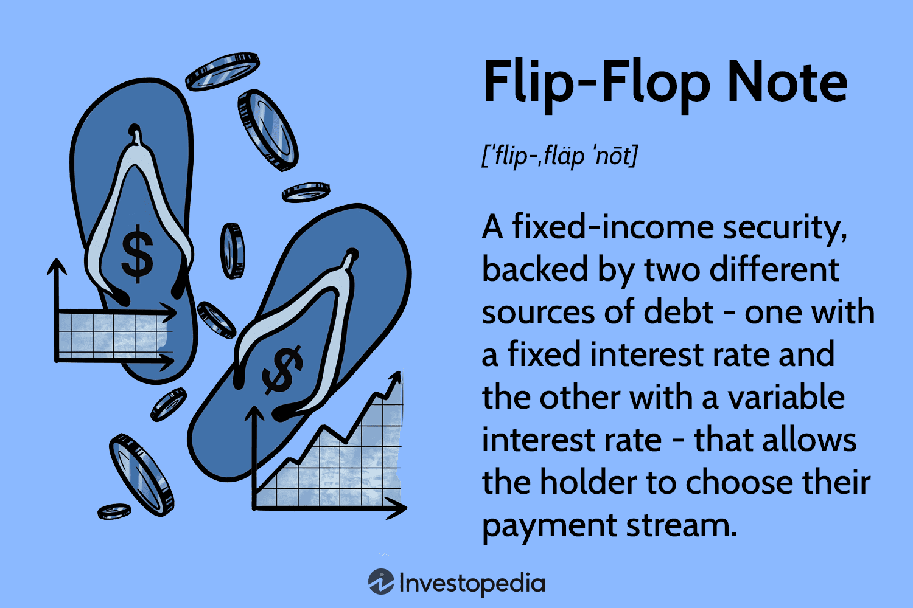

## Table of Contents

## What is a flip-flop note?

A flip-flop note is a type of musical notation used in some music, especially jazz and pop. It shows a quick change between two notes. Instead of writing out each note, a flip-flop note uses a special symbol to show the change. This makes the music easier to read and play.

Flip-flop notes are helpful for musicians because they save space on the page and make the music look less crowded. They are often used when a musician needs to play a quick back-and-forth between two notes. This can add a fun and lively feel to the music.

## How does a flip-flop note work?

A flip-flop note in music is a special symbol that shows a quick switch between two notes. Instead of writing out each note separately, the flip-flop note uses a single symbol to tell the musician to play one note and then quickly play another note right after. This makes the music easier to read because it takes up less space on the page.

Musicians use flip-flop notes a lot in jazz and pop music to add a lively feel. When they see the flip-flop note, they know to play the first note and then immediately switch to the second note. This back-and-forth movement can make the music sound more fun and exciting.

## What are the basic types of flip-flop notes?

There are two main types of flip-flop notes: the turn and the mordent. A turn is a flip-flop note that tells a musician to play four quick notes. They start with the main note, go up to the note above, back to the main note, and then down to the note below. It's like a little loop around the main note. A turn helps make the music sound fancy and decorative.

A mordent is another type of flip-flop note. It tells the musician to play three quick notes. They start with the main note, quickly go to the note above it, and then come right back to the main note. It's a quick up-and-down movement. Mordents add a lively and bouncy feel to the music. Both turns and mordents help musicians play with more flair and expression.

## What are the common uses of flip-flop notes in daily life?

Flip-flop notes are often used in daily life when people play music, especially on instruments like the piano or guitar. They help musicians make their music sound more interesting and fun. For example, if someone is playing a song on the piano at a family gathering, they might use flip-flop notes to add a lively touch to the music. This can make the song more enjoyable for everyone listening.

In schools and music classes, teachers use flip-flop notes to teach students how to play with more expression. They show students how to use turns and mordents to make their playing sound more professional and exciting. This helps students learn to play music in a way that sounds more polished and can impress their friends and family.

## How can flip-flop notes be used in educational settings?

In educational settings, flip-flop notes are a great tool for teaching students about musical expression. Teachers can show students how to use turns and mordents to make their music sound more interesting. By learning these techniques, students can add a lively and fun touch to their playing. This helps them understand how small changes can make a big difference in how their music sounds.

Flip-flop notes also help students learn to read music better. When students see flip-flop notes in their sheet music, they have to pay close attention to the symbols and understand what they mean. This practice improves their ability to read and interpret musical notation. As a result, students become more confident and skilled musicians, able to play with more flair and expression.

## What are the advantages of using flip-flop notes over traditional note-taking methods?

Flip-flop notes make music easier to read because they take up less space on the page. Instead of writing out each note, a flip-flop note uses one symbol to show a quick switch between two notes. This means the music looks less crowded and is simpler for musicians to follow. It's like using a shortcut in writing, making it faster and easier to understand the music.

Using flip-flop notes also helps musicians play with more expression. They can add fun and lively touches to the music, making it sound more interesting. For example, a turn or a mordent can make a simple song sound fancy and exciting. This helps musicians show off their skills and make the music more enjoyable for listeners.

## Can flip-flop notes be integrated with digital tools? If so, how?

Flip-flop notes can be used with digital tools like music software and apps. These tools let musicians write and play music on a computer or tablet. When using these tools, musicians can add flip-flop notes to their music by choosing the right symbols from the software's menu. This makes it easy to include turns and mordents in digital sheet music, just like on paper.

Digital tools also help musicians learn and practice flip-flop notes. Many music apps have lessons and exercises that teach how to play these notes. The software can play the flip-flop notes for the musician to hear, and then they can try playing them on their instrument. This helps musicians get better at using flip-flop notes and makes their music sound more lively and fun.

## What are some advanced techniques for organizing information using flip-flop notes?

Flip-flop notes can be used to organize musical ideas by grouping similar patterns together. When writing music, a musician might use flip-flop notes to show where a quick switch between notes happens often. This helps them see the patterns in their music more clearly. By using flip-flop notes, they can group these patterns together and make the music easier to read and play. This way, the music looks less crowded, and the musician can focus on the main melody while still adding interesting details.

Another way to use flip-flop notes for organization is by creating sections in the music. Musicians can use different types of flip-flop notes to mark the start and end of different parts of a song. For example, they might use a turn to show the beginning of a new section and a mordent to show the end. This helps them keep track of the structure of the music and makes it easier to practice and perform. By using flip-flop notes in this way, musicians can organize their music in a way that makes sense to them and helps them play better.

## How do flip-flop notes facilitate memory retention and recall?

Flip-flop notes help musicians remember and play music better because they make the music easier to read. When a musician sees a flip-flop note, they know it means a quick switch between two notes. This saves space on the page and makes the music look less crowded. When the music is easier to read, the musician can focus on playing it well instead of trying to understand what to play. This helps them remember the music better because they can see the patterns and repeats more clearly.

Using flip-flop notes also helps musicians remember how to add expression to their playing. When they see a turn or a mordent, they know to play those notes quickly and with flair. This adds a fun and lively touch to the music. By practicing these flip-flop notes, musicians get better at remembering where to add these special touches. Over time, this helps them recall the music more easily and play it with more confidence and expression.

## What are the limitations or challenges of using flip-flop notes?

Flip-flop notes can be hard to learn at first. They use special symbols that might be confusing for new musicians. It takes time to understand what these symbols mean and how to play them right. If someone is just starting to learn music, they might find it easier to stick with regular notes instead of trying to figure out flip-flop notes. This can slow down their learning and make them feel frustrated.

Another challenge with flip-flop notes is that they might not work well for all kinds of music. Some music, like classical pieces, might need every note written out clearly. Using flip-flop notes in these cases could make the music harder to read and play. Also, not all musicians agree on how to play flip-flop notes. Different musicians might play the same flip-flop note a little differently, which can cause confusion when people play together.

## How can flip-flop notes be adapted for different learning styles?

Flip-flop notes can be adapted for visual learners by using clear and colorful symbols. When visual learners see these symbols, they can remember what they mean more easily. Teachers can also use diagrams or pictures to show how to play flip-flop notes. This helps visual learners see the pattern of the notes and understand how to play them. By using colors and pictures, visual learners can learn flip-flop notes in a way that makes sense to them.

For auditory learners, flip-flop notes can be taught by playing examples of how they sound. Teachers can play a piece of music with flip-flop notes and then let the student try to play it back. This helps auditory learners hear the quick switch between notes and remember how it should sound. They can also use music apps that play flip-flop notes and let them practice along. This way, auditory learners can learn flip-flop notes by listening and playing, which is how they learn best.

Kinesthetic learners can benefit from flip-flop notes by practicing them on their instrument. Teachers can show them how to move their fingers to play the quick switch between notes. This hands-on practice helps kinesthetic learners feel the rhythm and pattern of flip-flop notes. They can also use games or exercises that involve moving to the music. By playing and moving, kinesthetic learners can learn flip-flop notes in a way that feels natural to them.

## What are some expert tips for maximizing the effectiveness of flip-flop notes?

To make flip-flop notes work well, practice them slowly at first. This helps you get the hang of the quick switch between notes. Start by playing the flip-flop note at a slow speed, then speed up as you get better. It's also helpful to listen to recordings of music with flip-flop notes. This way, you can hear how they should sound and try to copy that in your playing. Another tip is to use flip-flop notes in different songs. The more you use them, the easier they become to play.

It's also important to know when to use flip-flop notes. They work best in music that needs a lively and fun feel, like jazz or pop. Don't use them too much, or the music might sound too busy. Instead, use flip-flop notes to add special touches to the music. Lastly, talk to other musicians about how they use flip-flop notes. You can learn new ways to play them and get better at using them in your music.

## References & Further Reading

[1]: Hendershott, T., Jones, C. M., & Menkveld, A. J. (2011). ["Does Algorithmic Trading Improve Liquidity?"](https://onlinelibrary.wiley.com/doi/full/10.1111/j.1540-6261.2010.01624.x) Review of Financial Studies, 24(8), 2245-2279.

[2]: Kirilenko, A., Kyle, A. S., Samadi, M., & Tuzun, T. (2017). ["The Flash Crash: The Impact of High Frequency Trading on an Electronic Market."](https://www.jstor.org/stable/26652722) Journal of Finance, 72(3), 967-998.

[3]: ["Advances in Financial Machine Learning"](https://www.amazon.com/Advances-Financial-Machine-Learning-Marcos/dp/1119482089) by Marcos Lopez de Prado

[4]: Bryzgalova, S., & Julliard, C. (2019). ["Liquidity, Volatility, and Algorithmic Trading in the Foreign Exchange Market."](https://sabryzgalova.com/) SSRN Electronic Journal.

[5]: ["Principles of Financial Engineering"](https://www.sciencedirect.com/book/9780123735744/principles-of-financial-engineering) by Salih N. Neftci

[6]: Chan, E. (2013). ["Algorithmic Trading: Winning Strategies and Their Rationale."](https://github.com/ftvision/quant_trading_echan_book) John Wiley & Sons.