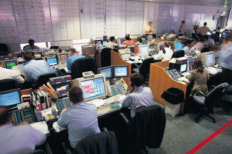

Operation Flipper refers to a strategic approach employed within financial markets, especially regarding algorithmic trading. In this context, it involves the rapid buying and selling of financial assets aimed at capitalizing on fleeting price discrepancies. By leveraging high-speed algorithms, traders can make instantaneous decisions that would be impractical through manual trading. The primary appeal of Operation Flipper is its potential to generate substantial profits quickly by exploiting the slightest market inefficiencies.

This article focuses on exploring Operation Flipper's inherent risks within algorithmic trading. These include systemic risks, technical glitches, and cybersecurity vulnerabilities that could potentially have volatile implications on market dynamics. Recognizing and understanding these risks becomes essential for traders and investors who aim to deploy algorithmic strategies efficiently and safely.



Despite its potential, Operation Flipper also presents significant challenges. The interplay between algorithmic speed and market volatility can amplify losses just as quickly as it can generate gains. We aim to explore both the opportunities and risks associated with this strategy within this article, providing insights into how to navigate the complexities of algorithmic trading effectively. Understanding these aspects is critical for thriving in the fast-paced world of financial markets while ensuring that technological innovations are leveraged optimally without compromising market stability.

## Table of Contents

## What is Operation Flipper in Algo Trading?

Operation Flipper involves executing a large number of trades in a short period, primarily driven by computer algorithms designed to optimize speed and efficiency. The core objective of this strategy is to exploit short-term price movements within financial markets, allowing traders to generate quick profits. This often entails buying and selling stocks or other financial assets rapidly, taking advantage of market inefficiencies or temporary disparities in asset prices.

Similar to high-frequency trading ([HFT](/wiki/high-frequency-trading-strategies)), Operation Flipper operates on the principle of making numerous trades with very small profit margins on each. However, it distinguishes itself by targeting specific market inefficiencies rather than relying solely on market volatility or order flow imbalances. The underlying concept is to anticipate momentary price changes and transact before others can respond, thus capitalizing on these brief windows of opportunity.

Algorithmic models used in Operation Flipper analyze historical data, market trends, and real-time information to identify potential trading opportunities. These advanced algorithms can execute trades at a pace and precision unavailable to traditional human traders. For instance, using limit orders instead of market orders allows traders to control the price at which trades are executed, thereby managing risks associated with price slippage.

The mathematics behind Operation Flipper often involves statistical [arbitrage](/wiki/arbitrage). Let's denote the prices of two correlated assets as $P_1(t)$ and $P_2(t)$. An example strategy might involve trading based on the spread $S(t) = P_1(t) - \beta P_2(t)$, where $\beta$ minimizes the variance of $S(t)$. If $S(t)$ deviates from its mean by a certain threshold, the algorithm could trigger trades to benefit from the expected reversion to the mean.

In summary, Operation Flipper prioritizes the identification and swift exploitation of market inefficiencies through sophisticated algorithms, aiming to maintain profitability by executing a high [volume](/wiki/volume-trading-strategy) of trades with small gains. This strategy's effectiveness relies heavily on the superior speed and analytical capabilities provided by automated trading systems.

## Understanding the Mechanics of Algo Trading

Algorithmic trading, or algo trading, involves the use of computer algorithms to automate the process of executing trades. These algorithms operate on pre-determined criteria such as price, timing, and volume, ensuring that trades are executed with precision and speed. The primary objective of algo trading is to harness computational power to identify trading opportunities that a human trader might miss due to the rapid pace and vast quantity of data processed.

The core of [algorithmic trading](/wiki/algorithmic-trading) is the algorithm itself, which is a set of step-by-step instructions created to achieve a specific goal—in this case, executing trades. These algorithms are devised to process vast datasets and make quick decisions based on real-time market conditions. This ability is significantly advantageous over manual trading, where the speed and efficiency of trade execution are limited by human capabilities. Algo trading eliminates the potential for human error and emotion-driven decisions, thereby enhancing precision and reliability.

Executing trades using algorithms involves several key components:

1. **Data Input**: Algorithms require a steady stream of real-time financial data. This data can include stock prices, trading volumes, and other relevant market indicators. Advanced algorithms may also incorporate non-traditional data sources such as news sentiment analysis or social media trends to refine decision-making.

2. **Signal Generation**: The algorithm analyzes the incoming data to generate trading signals. These signals indicate buy or sell opportunities based on the pre-defined criteria, leveraging statistical and mathematical models to predict future price movements. Common models include moving averages, mean reversion strategies, and arbitrage opportunities.

3. **Execution**: Once a signal is generated, the algorithm executes trades automatically, directly interfacing with the trading platform. Speed is crucial here, as the ability to execute trades within milliseconds confers a competitive advantage in capturing fleeting market opportunities.

4. **Risk Management and Monitoring**: Continual assessment of risk factors is essential. Algorithms embed risk management protocols to ensure that trades remain within acceptable risk parameters. Additionally, constant monitoring of algorithm performance and market conditions allows for real-time adjustment to maintain alignment with trading goals.

Despite its effectiveness, algo trading's dependence on technology introduces several risks. System malfunctions or inaccuracies in the algorithm's code can lead to unintended trading decisions, potentially causing financial losses. Likewise, the infrastructure supporting algo trading must be robust, as any technical glitches can disrupt trading activities and result in missed opportunities or erroneous trades.

Innovations in technology, such as improved computational power and advancements in [machine learning](/wiki/machine-learning), continue to enhance the capabilities of algo trading systems. However, traders and developers must remain vigilant, ensuring that their algorithms are not only effective but also resilient against the inherent risks of automation. By understanding these mechanics, traders can better leverage the advantages of algorithmic trading while being mindful of its challenges.

## Key Risks Associated with Operation Flipper

Operation Flipper, although a promising strategy in algorithmic trading, is fraught with significant risks that traders must diligently manage to avoid substantial losses.

**Amplification of Systemic Risk**: Algo trading, by its design, is highly interconnected with financial markets, leading to scenarios where minor disturbances can result in major market fluctuations. One prominent example is the Flash Crash of May 6, 2010, when the US stock market plummeted by approximately 1,000 points within minutes, only to recover shortly afterwards. This incident highlighted the potential for algorithmic trading strategies to amplify systemic risks, causing rapid and, at times, irrational market movements. The intertwined nature of algorithmic trades can lead to feedback loops, where the actions of one algorithm can trigger others, further exacerbating market volatility.

**Technical Glitches**: The reliance on computer algorithms implies that any errors in coding or technical disruptions can lead to unintended trades, potentially resulting in significant financial losses. For instance, a misconfigured algorithm may misinterpret market signals or execute trades in unintended volumes. Such glitches are not uncommon, and their impact can be magnified by the speed and volume at which algorithmic trades occur. This makes it crucial for firms to invest in robust technological infrastructure and comprehensive testing to minimize the risk of technical failures.

**Data Accuracy**: Algorithms rely on accurate and timely data inputs to make informed trading decisions. In scenarios where data is inaccurate or incomplete, the algorithms' decisions can be flawed, leading to poor trading outcomes. The accuracy of data pertaining to price movements, trading volumes, and other market indicators is paramount. Traders need to ensure that algorithms have access to high-quality data feeds and incorporate redundancy checks to mitigate the risks associated with data inaccuracies.

**Overfitting**: Overfitting is a common risk in algorithm development where algorithms are overly tailored to historical data, reducing their ability to adapt to new market conditions. This can limit profitability and increase the risk of losses when markets deviate from past patterns. To counter this, traders must strike a balance in algorithm design, ensuring models are both specific enough to capture relevant patterns and versatile enough to adjust to evolving market environments. Techniques such as cross-validation and the use of out-of-sample data for testing can help in assessing an algorithm's robustness and preventing overfitting.

Managing these risks involves a comprehensive approach that includes regular algorithm reviews, continuous monitoring of the trading environment, and stringent risk management protocols. By understanding and mitigating these challenges, traders can better leverage Operation Flipper within the fast-paced domain of algorithmic trading.

## Cybersecurity Concerns

Algo trading, with its dependence on sophisticated algorithms and high-speed data exchange, is inherently susceptible to cybersecurity threats. The high value of trading strategies and the sensitive nature of financial data make it an attractive target for cybercriminals. Cybersecurity breaches in this context can have severe repercussions.

A successful cyber attack could lead to unauthorized trades being executed, which can disrupt market operations and result in considerable financial loss. Furthermore, the theft of sensitive trading algorithms or proprietary data could lead to significant competitive disadvantages and reputational damage to the firms involved. For instance, if a trading strategy is leaked, it could be reverse-engineered or exploited by competitors, thereby nullifying a firm's competitive edge.

To safeguard against these potential threats, robust cybersecurity measures are mandatory. This involves implementing multi-layered security protocols that encompass both preventive and responsive strategies. Prevention strategies might include encrypting sensitive data, employing multi-[factor](/wiki/factor-investing) authentication, and maintaining up-to-date security software to protect against known vulnerabilities.

Responsive strategies are equally crucial and should include monitoring systems to detect unusual behavior that could indicate a cyber attack in progress. For example, an anomaly detection system could be employed to flag atypical trading patterns. This might involve machine learning algorithms designed to learn normal trading behaviors and alert operators when deviations occur. Here's a simple illustration using Python's scikit-learn library for anomaly detection:

```python
from sklearn.ensemble import IsolationForest

# Generate simulated trading data
data = [[0.1], [0.2], [10], [0.3], [0.25], [0.3], [0.1], [0.2]]

model = IsolationForest(contamination=0.1)
model.fit(data)

# Predict anomalies
anomalies = model.predict(data)
print(anomalies)
```

In this code snippet, `IsolationForest` is used to identify anomalies in trading data, which could potentially signal a cybersecurity breach. Anomalies in financial transactions might indicate unauthorized trading activities due to a breach. Regular audits, penetration testing, and incident response plans also form part of a comprehensive approach to cybersecurity, ensuring that any breach is promptly identified and mitigated.

Overall, robust cybersecurity frameworks and adaptive intelligence are essential to protect the financial systems that leverage algorithmic trading, maintaining the integrity and trust that underpin modern financial markets.

## Regulatory and Compliance Challenges

Regulatory and compliance challenges in algorithmic trading are critical aspects that market participants must address to mitigate associated risks effectively. In the United States, financial regulatory bodies such as the Commodity Futures Trading Commission (CFTC) and the Securities and Exchange Commission (SEC) have established stringent guidelines to ensure that algorithmic trading activities are conducted within a framework that promotes market integrity and stability.

One of the primary regulatory requirements involves the registration of algorithmic trading entities. This includes ensuring that firms engaging in such trading are duly registered and compliant with applicable financial regulatory standards. Furthermore, regular reporting to these regulatory bodies is mandated, which involves the submission of detailed transaction data and algorithmic strategy information. This reporting is crucial for maintaining transparency and enabling regulatory oversight to prevent market abuse and systemic risk.

Risk management requirements are another vital component of compliance. Firms are expected to implement comprehensive risk management frameworks that include pre-trade risk checks, post-trade surveillance, and systems to manage and contain potential algorithmic errors or market anomalies. These measures are designed to protect not only the market participants themselves but also the broader financial system from the cascading effects of trading malfunctions or algorithmic failures.

Staying informed of regulatory changes is imperative for traders and firms engaged in algorithmic trading. Regulatory landscapes can evolve rapidly, responding to new market developments and emerging risks. As such, continuous education and adaptation are necessary to ensure ongoing compliance and to avoid potential penalties. Firms must therefore allocate resources towards monitoring regulatory developments and updating their compliance strategies accordingly.

In summary, the regulatory and compliance challenges faced by algorithmic traders necessitate a proactive and well-structured approach to meeting the obligations set forth by financial regulators. By adhering to registration, reporting, and risk management guidelines, and by staying abreast of regulatory changes, algorithmic trading entities can mitigate risks and operate within safe and legal parameters.

## Mitigating Risks in Operation Flipper

Mitigating risks in Operation Flipper involves the implementation of comprehensive risk management strategies and the integration of human oversight into the trading process. One effective approach is the employment of pre-trade risk controls and post-trade surveillance systems. Pre-trade risk controls act as a preventive measure, ensuring that trades comply with set standards and risk parameters before execution. This involves the use of threshold limits, credit checks, and margin requirements, all automated to flag or block trades that exceed prescribed risk levels.

Post-trade surveillance, on the other hand, focuses on monitoring executed trades to identify any anomalies or unauthorized activities. Analytical tools and algorithms assess the trading activities for patterns indicative of errors or potential manipulation. This continuous monitoring helps in quickly detecting and addressing any discrepancies, thus minimizing potential financial losses and maintaining the integrity of trading operations.

Developing algorithms with a balanced approach to adaptability and specificity is crucial to avoid the pitfalls of overfitting. Overfitting occurs when an algorithm is excessively tailored to historical data, leading to poor performance under new or varying market conditions. To prevent this, traders can implement techniques such as cross-validation and regularization during the development phase. Cross-validation involves partitioning data into subsets, using some for training while validating on others, to ensure robustness across different datasets. Regularization techniques, like L1 (Lasso) or L2 (Ridge) regularization, penalize overly complex models by adding a complexity term to the loss function, effectively balancing trade-off between bias and variance.

Incorporating manual oversight is critical for swiftly responding to unforeseen market events or algorithmic errors. Although algorithms can process data and execute trades at speeds unreachable by humans, they may lack the intuitive judgment needed during unexpected market shifts. Manual oversight allows human traders to intervene in instances where algorithms might falter, such as during high [volatility](/wiki/volatility-trading-strategies) periods or atypical market conditions. Implementation of a 'kill switch'—a mechanism to halt trading activities during emergencies—ensures further protection against potential losses stemming from algorithmic errors.

Overall, these strategies contribute to a comprehensive risk management framework for Operation Flipper, ensuring that while speed and efficiency in trading are maximized, exposure to risks is effectively contained and controlled.

## Conclusion

Operation Flipper, as a strategy within algorithmic trading, provides notable prospects for profit generation. Its emphasis on rapid buying and selling, backed by algorithmic speed and efficiency, allows traders to potentially exploit short-term market movements for financial gain. However, the efficacy of such opportunities is intertwined with substantial risks that require diligent management. 

To navigate the complexities of algorithmic trading successfully, traders must prioritize risk understanding and mitigation. This involves recognizing the multifaceted nature of algo trading, where technical glitches, data inaccuracies, and systemic risks can pose significant challenges. By implementing robust risk management strategies, traders can establish a stable foundation for leveraging the strengths of Operation Flipper.

The integration of technology in trading necessitates a careful balance to preserve market integrity while maximizing the strategy's potential. Effective risk management, combined with adaptability to changing market conditions, forms the cornerstone of harnessing the benefits offered by Operation Flipper. Technical advancements should be complemented with vigilant oversight and compliance to ensure that the strategy aligns with both financial goals and regulatory frameworks.

Successful traders are those who maintain this equilibrium between technological leverage and prudent risk control. As algorithmic strategies like Operation Flipper continue to evolve, a proactive approach towards risk assessment and management will be essential for sustained success in the dynamic environment of algorithmic trading.

## References & Further Reading

[1]: Bergstra, J., Bardenet, R., Bengio, Y., & Kégl, B. (2011). ["Algorithms for Hyper-Parameter Optimization."](https://proceedings.neurips.cc/paper/2011/file/86e8f7ab32cfd12577bc2619bc635690-Paper.pdf) Advances in Neural Information Processing Systems 24.

[2]: ["Advances in Financial Machine Learning"](https://www.amazon.com/Advances-Financial-Machine-Learning-Marcos/dp/1119482089) by Marcos Lopez de Prado

[3]: ["Evidence-Based Technical Analysis: Applying the Scientific Method and Statistical Inference to Trading Signals"](https://www.amazon.com/Evidence-Based-Technical-Analysis-Scientific-Statistical/dp/0470008741) by David Aronson

[4]: ["Machine Learning for Algorithmic Trading"](https://github.com/stefan-jansen/machine-learning-for-trading) by Stefan Jansen

[5]: ["Quantitative Trading: How to Build Your Own Algorithmic Trading Business"](https://www.amazon.com/Quantitative-Trading-Build-Algorithmic-Business/dp/1119800064) by Ernest P. Chan