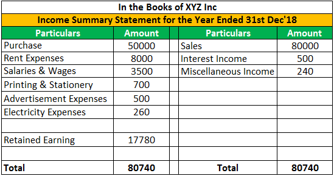

Flipping and algorithmic trading are pivotal strategies in the financial and investment sector, each focusing on exploiting market inefficiencies to derive profit. Real estate flipping involves the acquisition of properties at a lower price, followed by their resale at a higher value, typically within a short duration. This strategy hinges on accurately assessing the property's potential market value and knowing the ideal moment for resale to maximize profit, thereby emulating the buy-low, sell-high principle.

Algorithmic trading, on the other hand, employs computer algorithms to facilitate swift and automated trading of assets. It operates on preset rules and mathematical models to analyze market data, identify potential opportunities, and execute trades at speeds unattainable by human traders. This method reduces human error and exploits slight price discrepancies in the market.



The intersection of real estate flipping and algorithmic trading offers a synthesis of traditional and modern approaches to investment. By combining the hands-on strategy of flipping with the data-driven precision of algorithmic trading, investors can optimize their decision-making processes and improve profitability. Both strategies, despite their unique methodologies, share a common goal: to leverage market knowledge and timing to achieve significant financial gain. Therefore, understanding the synergy between these techniques can unlock innovative pathways for investment success.

## Table of Contents

## Understanding Real Estate Flipping

Real estate flipping is a strategic investment practice where properties are bought and sold within a short time frame to yield a profit. This approach typically targets market inefficiencies, allowing investors to capitalize on discrepancies between a property's purchase price and its potential sale value.

The primary methods entailed in real estate flipping can be categorized into two distinct strategies:

1. **Renovation Flipping (Reno Flip):** This method involves acquiring undervalued properties that may be older or not in optimal condition. Investors undertake renovations or improvements to increase the market value of these properties. The key advantage of this approach is the potential for substantial profit margins, derived from both the appreciation in property value post-renovations and the general increase in real estate prices. However, it requires a keen eye for identifying properties with potential, and involves additional costs related to construction, materials, and labor. The unpredictability of renovation costs and time frames can introduce financial and logistical challenges.

2. **Market-Based Flipping:** Unlike renovation flipping, this strategy focuses on purchasing properties and quickly reselling them to benefit from favorable market conditions, without making significant property improvements. This approach banks on the anticipation of short-term market appreciation, often relying on local housing market booms, decreased supply, or demographic shifts that elevate property demand. While it eliminates renovation-related risks, it depends heavily on accurate market forecasting. Failures in predicting market movements can lead to holdings that depreciate or stagnate in value.

Despite the lucrative potential of real estate flipping, the practice is inherently risky. Market [volatility](/wiki/volatility-trading-strategies) represents a significant challenge, as external economic factors can abruptly alter property values, leading to non-profitable investments. Unexpected costs, whether from architectural modifications or market fluctuations, can diminish profit margins and extend holding periods beyond anticipated timelines. Therefore, successful real estate flippers must maintain strategic agility, robust market awareness, and ample financial buffers to navigate these uncertainties efficiently.

## Algorithmic Trading in Real Estate

Algorithmic trading leverages computer software and algorithms to automate the trading process, enabling more precise and faster property transactions within the real estate sector. By utilizing advanced data analytics, algorithms can process and interpret extensive datasets, encompassing historical property prices, market trends, and economic indicators. This capability allows investors to make data-driven decisions promptly, minimizing the lag between market analysis and transaction execution.

One of the key advantages of [algorithmic trading](/wiki/algorithmic-trading) in real estate is its ability to evaluate vast amounts of information quickly, identifying patterns and trends that may not be apparent at a glance. For instance, sophisticated algorithms can assess seasonal variations in property prices or recognize emerging neighborhoods poised for growth. By doing so, investors gain a competitive edge by entering or exiting markets at optimal moments, enhancing their investment returns.

Moreover, algorithmic trading tools can precisely calibrate investment strategies to reflect investor preferences and risk tolerance. By adjusting algorithm parameters, such as target property types, desired return rates, or acceptable risk levels, investors can customize their approach to align with specific goals. This adaptability ensures a tailored investment pathway that resonates with individual objectives.

Incorporating algorithms into the property investment process enhances the timing and accuracy of decisions. For example, by automating the tracking of price movements and transactional [volume](/wiki/volume-trading-strategy) in targeted areas, algorithms can trigger purchase or sale recommendations based on pre-set conditions. This method reduces the emotional component of decision-making, often leading to more consistent and rational investment behavior.

The efficacy of algorithmic trading in real estate also extends to predictive analytics, where [machine learning](/wiki/machine-learning) models can forecast future property values based on various statistical inputs. These models, trained on historical data, provide a probabilistic estimation of price trajectories, thus equipping investors with foresight into potential market developments. Consequently, algorithmic trading empowers investors to capitalize on forecasted opportunities while mitigating potential risks inherent in market fluctuations.

Additionally, with the growing prevalence of real-time data streams from smart city initiatives and IoT devices, algorithms can incorporate current infrastructural and environmental factors into their calculations. This holistic approach enhances the precision of market forecasts and investment decisions, situating algorithmic trading as a pivotal tool for modern real estate investors.

In conclusion, algorithmic trading represents a transformative methodology in real estate investment, characterized by enhanced analytical capabilities, speed, and precision. By harnessing the power of data, investors are equipped to make informed decisions, thereby optimizing their investment outcomes in the evolving real estate landscape.

## Combining Flipping and Algorithmic Trading

Integrating algorithmic trading with real estate flipping represents a strategic union that can significantly enhance investment outcomes by facilitating swift and informed decisions. This synergy capitalizes on the strengths of both strategies, where algorithmic trading's precision and speed complement the opportunistic nature of real estate flipping.

Automated algorithms, driven by sophisticated software, are invaluable in identifying lucrative opportunities within the real estate market. These algorithms can process vast datasets to pinpoint undervalued properties, predict price movements, and assess market trends with remarkable accuracy. By analyzing variables such as property location, historical pricing, and economic indicators, algorithms can forecast optimal buy and sell points, thus maximizing returns and reducing human error.

In practical terms, an algorithm might use regression analysis or machine learning models to predict property appreciation rates. For instance, a basic linear regression model can predict price fluctuations based on variables like square footage or proximity to urban centers:

```python
import numpy as np
from sklearn.linear_model import LinearRegression

# Sample data: square footage and property price
square_footage = np.array([1500, 2000, 2500, 3000]).reshape(-1, 1)
price = np.array([300000, 400000, 500000, 600000])

# Create and train the model
model = LinearRegression()
model.fit(square_footage, price)

# Predict the price of a property with 2700 square feet
predicted_price = model.predict(np.array([[2700]]))
print(f"Predicted Price: ${predicted_price[0]:.2f}")
```

This combination allows investors to adapt promptly to market shifts, a crucial ability in the volatile world of real estate flipping. Algorithms can be programmed to trigger alerts or execute transactions automatically when market conditions meet specific criteria. This automation offers a competitive edge by ensuring timely actions, such as purchasing a property when prices dip below a certain threshold or selling when the market peaks.

Moreover, the integration of algorithmic trading reduces the inherent risks of flipping by enabling a risk-managed approach. For example, algorithms can include risk assessments that consider potential renovation costs, local economic conditions, and property taxes, providing a comprehensive overview that informs better decision-making.

In conclusion, the amalgamation of algorithmic trading with real estate flipping enables investors to optimize their strategies by leveraging data-driven insights and automation. This powerful combination not only enhances the ability to capitalize on market inefficiencies but also equips investors with the tools necessary to navigate the complex landscape of real estate investment successfully.

## Risks and Challenges

Both real estate flipping and algorithmic trading involve significant risks that must be carefully managed to optimize outcomes. Market volatility is a primary concern for both strategies. In real estate flipping, unforeseen shifts in the housing market can drastically affect property values, leading to potential losses instead of anticipated profits. For example, sudden changes in interest rates or economic downturns can dampen buyer demand, leaving investors with unsellable properties and tied-up capital.

Algorithmic trading, while providing speed and efficiency, is plagued by technological challenges. An unexpected failure in algorithmic software could result in incorrect trades or missed opportunities. Additionally, latency issues, where there's a delay between market changes and the algorithm's response, may lead to suboptimal trade execution. 

To navigate these uncertainties, a clear understanding of both real estate market dynamics and algorithmic limitations is essential. Real estate markets are influenced by diverse factors, including economic indicators, demographic trends, and local policy changes. Investors must conduct thorough market analysis and stay informed of these influencers to anticipate possible market movements.

Algorithmic trading requires a strong grasp of the technology and its limitations. Algorithms are as good as the data they are fed; thus, data integrity is crucial. Poor-quality or outdated data can result in erroneous trading decisions. Additionally, over-reliance on backtested models without accounting for real-time market conditions can lead to substantial financial losses.

Investors must also be cognizant of regulatory challenges. Real estate flipping often requires adherence to local zoning laws, environmental regulations, and housing codes. Navigating these regulations is complex and non-compliance can result in legal penalties or financial losses. 

In algorithmic trading, regulations such as the European Union’s Markets in Financial Instruments Directive II (MiFID II) and the U.S. Securities and Exchange Commission's (SEC) guidelines dictate trading practices. Ensuring compliance involves maintaining robust reporting systems and audit trails, and adhering to risk management policies.

Overall, mitigating the risks inherent in real estate flipping and algorithmic trading requires comprehensive knowledge, vigilance, and a proactive approach to regulatory compliance. This necessitates continuous learning and adaptation to market changes and technological advancements.

## Successful Strategies for Flipping and Algo-Trading

Combining detailed market research with robust algorithmic models is essential for maximizing profitability in flipping and algorithmic trading. This synergy allows investors to make informed decisions backed by data-driven insights and comprehensive analysis.

Investors should prioritize diversification and risk management to safeguard against sudden market shifts. By spreading investments across various properties and employing different trading algorithms, the risk associated with any individual asset or strategy can be minimized. The formula for diversification might involve tracking multiple real estate markets simultaneously, which could be executed effectively with an algorithm designed for multi-market analysis. For example, in Python, investors can utilize libraries such as pandas and NumPy for data manipulation, combined with machine learning frameworks like scikit-learn to develop predictive models that scan diverse market conditions. Here's a basic example of how Python could be used:

```python
import pandas as pd
from sklearn.model_selection import train_test_split
from sklearn.ensemble import RandomForestRegressor

# Assume df is a DataFrame containing real estate market data
df = pd.read_csv("market_data.csv")

# Preprocessing data
features = df.drop('Price', axis=1)
target = df['Price']

# Splitting the dataset into training and testing sets
X_train, X_test, y_train, y_test = train_test_split(features, target, test_size=0.3, random_state=42)

# Initializing and training the model
model = RandomForestRegressor()
model.fit(X_train, y_train)

# Predicting and assessing performance
predictions = model.predict(X_test)
```

Continuous learning and adaptation are necessary to maintain a competitive edge. The real estate and trading markets are not static; they evolve with economic trends, consumer behaviors, and technological advancements. Investors must continuously refine their strategies by staying informed about the latest market developments and incorporating feedback from past investment performance. Regular updates to algorithmic models and investment strategies should be based on new data inputs and changing market dynamics. Additionally, leveraging advances in [artificial intelligence](/wiki/ai-artificial-intelligence) and machine learning can provide more accurate forecasts and automate decision-making processes.

To excel in these sectors, investors must commit to an ongoing process of education and adaptation. Engaging in forums, attending industry conferences, and participating in training programs can enhance investors' understanding and preparedness, ensuring they remain at the forefront of innovative investment approaches. Through a commitment to robust research, dynamic risk management, and constant learning, investors can effectively harness the power of flipping and algorithmic trading for sustainable financial gains.

## Conclusion

The integration of real estate flipping and algorithmic trading presents a transformative potential for savvy investors aiming to attain substantial financial gains. By employing advanced algorithms alongside traditional real estate strategies, investors are equipped to make informed, rapid decisions that capitalize on both market inefficiencies and emerging opportunities. This approach hinges on the capability of technology to not only process vast datasets but also to provide predictive insights, enabling a dynamic response to fluctuating market conditions.

Investors who adeptly utilize these tools can enhance the performance of their portfolios by optimizing entry and [exit](/wiki/exit-strategy) points, improving risk management, and ensuring diversification. Algorithmic trading aids in identifying lucrative properties faster than conventional methods, minimizing the lag between market analysis and investment action. Consequently, this method can significantly reduce chances of missed opportunities due to latency.

Moreover, the continuous evolution of technology and data analytics implies that the future of investing is increasingly reliant on innovative methods that merge established investment techniques with groundbreaking advancements. It is through these synergies that investors will not only enhance their financial returns but also sustain their competitive edge in an ever-evolving market landscape. As we advance, the confluence of real estate flipping and algorithmic trading is set to redefine investment strategies, creating pathways for unprecedented growth and profitability.

## References & Further Reading

[1]: Bergstra, J., Bardenet, R., Bengio, Y., & Kégl, B. (2011). ["Algorithms for Hyper-Parameter Optimization."](https://dl.acm.org/doi/10.5555/2986459.2986743) Advances in Neural Information Processing Systems 24.

[2]: ["Advances in Financial Machine Learning"](https://www.amazon.com/Advances-Financial-Machine-Learning-Marcos/dp/1119482089) by Marcos Lopez de Prado

[3]: ["Evidence-Based Technical Analysis: Applying the Scientific Method and Statistical Inference to Trading Signals"](https://www.amazon.com/Evidence-Based-Technical-Analysis-Scientific-Statistical/dp/0470008741) by David Aronson

[4]: ["Machine Learning for Algorithmic Trading"](https://github.com/stefan-jansen/machine-learning-for-trading) by Stefan Jansen

[5]: ["Quantitative Trading: How to Build Your Own Algorithmic Trading Business"](https://www.amazon.com/Quantitative-Trading-Build-Algorithmic-Business/dp/1119800064) by Ernest P. Chan