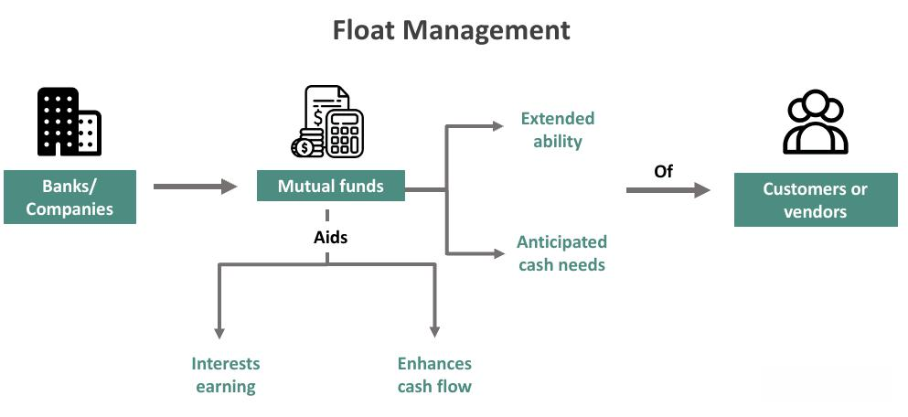

The financial world has experienced profound changes with technological innovations and the emergence of new financial mechanisms. A significant development in this landscape is the concept of stock market float shrink. This mechanism involves reducing the number of shares available for trading through various corporate actions such as share buybacks, acquisitions, or reverse stock splits. Float shrink can influence market liquidity, share prices, and overall investor perception.

Concurrently, algorithmic trading has become an indispensable tool for modern traders aiming to maximize returns. By using complex algorithms, traders can execute orders at speeds and frequencies that exceed human capabilities. This technology facilitates the capitalization on minor market fluctuations and inefficiencies, optimizing trade execution in line with strategies associated with float shrink events.



This article will explore the intersection of these financial mechanisms, focusing on how float shrink strategies can be effectively integrated with algorithmic trading. The combined influence of these factors contributes significantly to market efficiency and is pivotal in shaping investor strategies and outcomes. Understanding this interplay offers valuable insights into the dynamics of contemporary stock market participation.

## Table of Contents

## Understanding Financial Mechanisms in the Stock Market

Financial mechanisms in the stock market are pivotal in managing the control, exchange, and flow of financial assets. These mechanisms encompass a variety of corporate actions and strategic processes that directly affect a company's stock float, which is the number of shares available for trading by the public. Examples of such actions include share buybacks, acquisitions, and reverse splits, each carrying significant implications for a company’s market value and investor appeal.

**Share Buybacks**: A share buyback, also known as a stock repurchase, occurs when a company buys its own outstanding shares to reduce the number of shares available on the open market. This action can lead to an increase in the company's earnings per share (EPS), as the same amount of earnings is distributed over fewer shares. The formula for calculating EPS is:

$$
\text{EPS} = \frac{\text{Net Income}}{\text{Outstanding Shares}}
$$

By reducing the denominator (Outstanding Shares), the EPS increases, potentially making the company more attractive to investors. Moreover, buybacks can signal management's confidence in the company's financial health and future prospects, although it might occasionally camouflage underlying business issues if used excessively.

**Acquisitions**: Through acquisitions, a company can achieve growth by purchasing another company or its assets. This strategic move can enhance shareholder value by bringing in additional revenue streams, expanding market reach, or achieving synergies through cost efficiencies. However, acquisitions can intricate the company’s float depending on whether the deal is cash-based or involves issuing new shares.

**Reverse Splits**: Reverse stock splits consolidate existing shares into a smaller number of shares, effectively increasing the stock price while maintaining the company's market capitalization. This mechanism is often used by companies to boost their stock price and avoid delisting from stock exchanges that have minimum price requirements. Unlike a buyback, a reverse split does not directly impact the company's value but may improve its perception and liquidity in the stock market.

Understanding these financial mechanisms is crucial for investors aiming to make informed decisions. Each mechanism has distinct implications on the stock market dynamics and investor sentiment. Investors need to consider the strategic intent behind these actions and their potential impact on overall shareholder value. An informed approach helps in evaluating whether these corporate actions align with the investor's own risk tolerance and investment objectives.

## The Impact of Float Shrink on Market Dynamics

Float shrink is a significant phenomenon in the stock market, defined by the reduction of shares available for trading. This event typically occurs through mechanisms such as share buybacks or strategic acquisitions. The impact of a float shrink on market dynamics can be substantial, influencing key financial metrics and investor sentiment.

When a company undertakes a float shrink, particularly through buybacks, it purchases its own shares from the marketplace. This action decreases the outstanding shares in circulation, thereby enhancing financial ratios such as earnings per share (EPS) and cash flow per share. Mathematically, the relationship can be expressed as follows:

$$
\text{EPS} = \frac{\text{Net Income}}{\text{Outstanding Shares}}
$$

As the denominator decreases due to a buyback, the EPS increases, assuming the net income remains constant. This enhancement can lead to a perceived increase in the stock's market value, attracting further investor interest.

However, while buybacks can indicate management's confidence in the company's future performance and prospects, they can also conceal underlying operational challenges. For instance, a company may resort to buybacks to artificially boost financial ratios rather than addressing fundamental business issues. This can result in a misleading representation of financial health, which might be detrimental if the core business does not improve simultaneously.

Investors must critically evaluate the motivations behind float shrink events. Growth-oriented float shrinks are typically part of a broader strategic vision aimed at strengthening the company's competitive position and unlocking shareholder value. Conversely, defensive float shrinks might serve as temporary measures to inflate stock metrics or respond to external pressures without contributing to long-term growth. Distinguishing between these intents is crucial for informed investment decisions and for anticipating the genuine impact on market dynamics.

## Algorithmic Trading: Leveraging Technology in Stock Transactions

Algorithmic trading uses sophisticated mathematical models and algorithms to execute trades at speeds far exceeding human capabilities. This technology-driven approach allows for rapid transaction execution, enabling traders to capitalize on even minor price fluctuations within the stock market. By automating the trading process, [algorithmic trading](/wiki/algorithmic-trading) systems can effectively process large volumes of data in short timeframes, resulting in optimized decision-making and execution.

One of the primary advantages of algorithmic trading is its ability to integrate events like stock float shrink into trading strategies. When companies engage in activities such as share buybacks, the reduced availability of shares can lead to increased price [volatility](/wiki/volatility-trading-strategies) and altered [liquidity](/wiki/liquidity-risk-premium) conditions. Algorithmic trading systems are well-suited to process and respond to these changes, identifying strategic entry and [exit](/wiki/exit-strategy) points in the market. For example, an algorithm might be designed to monitor buyback announcements and adjust trading strategies in response to anticipated price movements.

To maximize the benefits of algorithmic trading, it is imperative for traders to ensure that their algorithms are adaptable. Market conditions can fluctuate rapidly, necessitating algorithms that can adjust to new information and unforeseen events. This adaptability is crucial for mitigating the risks inherent in fast-paced trading environments. Effective risk management strategies often involve setting strict parameters for trade execution, such as stop-loss orders or dynamic pricing models that adjust based on market conditions.

Python, given its extensive libraries and frameworks for financial analysis and [machine learning](/wiki/machine-learning), is a popular choice for developing and testing trading algorithms. For instance, using libraries like NumPy and pandas, traders can efficiently handle large datasets and perform complex computations necessary for developing robust algorithmic strategies. Here is a simple Python code snippet demonstrating a basic form of algorithmic trading that trades stocks based on simple moving averages (SMA):

```python
import pandas as pd
import numpy as np

# Example stock price data
data = {'Price': [120, 121, 119, 118, 120, 124, 122, 125]}
df = pd.DataFrame(data)

# Calculate short-term moving average
df['SMA_5'] = df['Price'].rolling(window=5).mean()

# Calculate long-term moving average
df['SMA_20'] = df['Price'].rolling(window=20).mean()

# Define buy/sell signals
df['Signal'] = np.where(df['SMA_5'] > df['SMA_20'], 'Buy', 'Sell')

print(df)
```

In practice, algorithmic trading strategies are considerably more complex than this example, often incorporating various variables and conditions. Nonetheless, at its core, algorithmic trading aims to leverage technology to enhance the efficiency and effectiveness of stock transactions, particularly in response to corporate events such as float shrink. The integration of these sophisticated methodologies presents traders and investors with significant opportunities for profit, provided they maintain a vigilant approach to risk management and strategy adaptation.

## Case Study: The Role of Algorithmic Trading in Float Shrink Strategies

Real-world examples provide insight into how algorithmic trading can effectively leverage float shrink strategies to enhance market performance. A prominent illustration of this is seen with stock buybacks undertaken by technology giants like Apple Inc. When companies engage in buybacks, they reduce the number of shares available on the market, which can lead to an increase in earnings per share (EPS), potentially boosting the stock's market value. These actions often reflect management's confidence in the company's future performance, thus attracting investor interest.

Algorithmic trading systems have capitalized on such corporate actions by identifying trends and exploiting trading opportunities. For instance, when Apple announced significant buyback programs, algorithmic trading platforms were quick to detect the patterns associated with these buybacks. Algorithms can be programmed to monitor the [volume](/wiki/volume-trading-strategy) of share repurchases and the price movements that typically accompany them. Python, with libraries such as `pandas` and `numpy`, can be used to backtest these strategies to assess potential profitability.

Here is a simple example of how one might set up an algorithm to identify buyback opportunities using Python:

```python
import pandas as pd

# Assume `stock_data` is a DataFrame with columns: 'Date', 'Close', 'Volume'
# Assume ‘buyback_data’ contains information about the dates and amounts of share buybacks

def identify_buyback_opportunities(stock_data, buyback_data):
    buyback_dates = buyback_data['Date']
    opportunities = []

    for date in buyback_dates:
        # Look for significant price movements in the days following a buyback
        relevant_data = stock_data[stock_data['Date'] >= date]
        price_increase = (relevant_data['Close'].iloc[5] - relevant_data['Close'].iloc[0]) / relevant_data['Close'].iloc[0]

        if price_increase > 0.05:  # Example threshold of a 5% increase
            opportunities.append((date, price_increase))

    return opportunities

# Example usage
stock_data = pd.read_csv('historical_stock_data.csv')
buyback_data = pd.read_csv('buyback_data.csv')
buyback_opportunities = identify_buyback_opportunities(stock_data, buyback_data)
```

Algorithmic traders have shown that these strategies can yield an average annual return higher than broader market indices. By rapidly responding to float reduction events, traders can optimize entry and exit points, maximizing gains. In particular, algorithmic trading systems can process a vast amount of data quickly, factoring in not just the buyback announcements, but also economic indicators, news sentiment, and broader market trends.

The strategic integration of float shrink strategies in algorithmic trading platforms highlights the potential to outperform market indices. This demonstrates how a nuanced understanding of corporate actions combined with technology-driven trading can redefine investment strategies, offering substantial returns that might not be achievable through conventional trading methods.

## Conclusion: Integrating Financial Mechanisms and Technology

The convergence of financial mechanisms, such as float shrink, with advanced trading technologies like algorithmic trading presents significant opportunities for investors. The dynamic interplay between these financial strategies and technological advancements allows for more precise and efficient investment decisions. Investors who understand and leverage these strategies could potentially achieve greater market returns compared to traditional methods.

Float shrink occurs when a company reduces the number of shares available for trading, often through share buybacks or strategic acquisitions. This action can lead to an increase in a company's earnings per share (EPS), as the same level of earnings is spread over fewer shares. In turn, this may enhance the stock's market value, offering investors an opportunity to capitalize on improved financial metrics. However, distinguishing whether float shrink is driven by genuine growth prospects or merely a defensive tactic is crucial for making sound investment decisions.

Algorithmic trading, with its ability to process vast amounts of data rapidly, can effectively integrate information about float shrink events. Algorithms can optimize entry and exit points, responding instantaneously to changes in the market. For example, a basic Python algorithm using a machine learning model could analyze historical price dynamics and volumes to predict the impact of a buyback on stock movements:

```python
import pandas as pd
from sklearn.model_selection import train_test_split
from sklearn.linear_model import LinearRegression

# Load historical stock data
stock_data = pd.read_csv('stock_data.csv')

# Features and target variable
X = stock_data[['Historical Prices', 'Volume']]
y = stock_data['Price Change']

# Train-test split
X_train, X_test, y_train, y_test = train_test_split(X, y, test_size=0.2, random_state=42)

# Linear Regression model
model = LinearRegression()
model.fit(X_train, y_train)

# Predictions
predictions = model.predict(X_test)
```

Such algorithms allow investors to identify patterns and execute trades at an optimal scale and speed. By continuously updating these algorithms with the latest market information, investors can maintain a competitive advantage and mitigate potential risks associated with market volatility.

The strategic application of financial mechanisms and algorithmic trading marks a transformative shift in stock market participation. As technology continues to evolve, staying informed about market dynamics and the latest trading tools will be essential for maximizing investment potential. In the ever-changing financial landscape, those who adeptly integrate financial strategies with cutting-edge technology are likely to redefine the standards of investing success.

## References & Further Reading

[1]: ["The Effects of Share Repurchase on Stock Performance: A Quantitative Analysis"](https://www.investopedia.com/articles/investing/112013/impact-share-repurchases.asp) by Geoffrey C. Friesen, Journal of Financial Economics.

[2]: ["Advances in Financial Machine Learning"](https://www.amazon.com/Advances-Financial-Machine-Learning-Marcos/dp/1119482089) by Marcos Lopez de Prado 

[3]: ["Algorithmic Trading: Winning Strategies and Their Rationale"](https://www.amazon.com/Algorithmic-Trading-Winning-Strategies-Rationale-ebook/dp/B00CY5HC0U) by Ernest P. Chan

[4]: Ferri, R. A. (2009). ["The ETF Book: All You Need to Know About Exchange-Traded Funds"](https://www.amazon.com/ETF-Book-About-Exchange-Traded-Funds/dp/0470537469)

[5]: ["Quantitative Trading: How to Build Your Own Algorithmic Trading Business"](https://www.amazon.com/Quantitative-Trading-Build-Algorithmic-Business/dp/1119800064) by Ernest P. Chan

[6]: ["Evidence-Based Technical Analysis: Applying the Scientific Method and Statistical Inference to Trading Signals"](https://www.amazon.com/Evidence-Based-Technical-Analysis-Scientific-Statistical/dp/0470008741) by David Aronson

[7]: ["Machine Learning for Algorithmic Trading"](https://github.com/stefan-jansen/machine-learning-for-trading) by Stefan Jansen