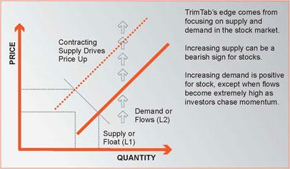

## Table of Contents

## What is float shrink?

Float shrink is a term used in the stock market to describe a situation where the number of shares available for trading, known as the float, decreases. This can happen for various reasons, like when a company buys back its own shares or when major shareholders decide to hold onto their shares instead of selling them. When the float shrinks, it means there are fewer shares available for the public to buy and sell.

A smaller float can lead to increased volatility in the stock's price. With fewer shares available, even small changes in demand can cause big price swings. This can be good for investors if the price goes up, but it can also be risky because the price can drop quickly too. Understanding float shrink is important for anyone interested in how stock prices move and how to manage investment risks.

## Why is float shrink important in financial markets?

Float shrink is important in financial markets because it affects how a stock's price can move. When there are fewer shares available to trade, the stock's float gets smaller. This means that even small changes in how many people want to buy or sell the stock can make its price go up or down a lot. It's like if there were only a few apples at a market; if more people want apples, the price of those apples can go up quickly.

This can be good for investors if the stock price goes up because of the smaller float. They might see the value of their investment grow faster. But it can also be risky. If something happens that makes people want to sell the stock, the price can drop fast because there aren't many shares to cushion the fall. So, understanding float shrink helps investors know how a stock might behave and how to manage their risks better.

## How does float shrink affect a stock's price?

Float shrink makes a stock's price more likely to change a lot. When there are fewer shares of a stock to trade, it's like there are fewer apples at a market. If more people want to buy those apples, the price of the apples can go up quickly. In the same way, if more people want to buy the stock with a smaller float, the price of the stock can go up faster than it would if there were more shares available.

But it can also be risky. If something happens that makes people want to sell the stock, like bad news about the company, the price can drop fast. This is because there aren't many shares to cushion the fall. So, when the float shrinks, it can make the stock's price more exciting but also more unpredictable.

## What are the common mechanisms that lead to float shrink?

Float shrink happens when the number of shares that people can trade goes down. One common way this happens is when a company decides to buy back its own shares. When a company does this, it's taking shares out of the market, which means there are fewer shares left for everyone else to trade. Another way float shrink can happen is when big investors, like company founders or big shareholders, decide to keep their shares instead of selling them. If these big investors hold onto their shares, it means there are fewer shares available for other people to buy and sell.

Sometimes, float shrink can also happen because of other reasons, like when a company issues new shares but not to the public. For example, if a company gives new shares to its employees as part of their pay, those shares aren't available for the public to trade right away. All these things can lead to fewer shares being available, which can make the stock's price move more quickly and be more exciting but also more risky for investors.

## Can you explain the role of buybacks in float shrink?

When a company decides to buy back its own shares, it's called a buyback. This is one of the main ways that float shrink happens. When a company does a buyback, it takes some of its shares out of the market. This means there are fewer shares left for everyone else to trade. Imagine if there were 100 apples at a market and the owner took back 20 apples. Now, there are only 80 apples left for people to buy and sell. It's the same idea with stocks.

Buybacks can make the price of a stock go up faster because there are fewer shares to go around. If more people want to buy the stock, the price can jump quickly because there aren't as many shares available. But it can also be risky. If something bad happens and people want to sell the stock, the price can drop fast too. So, buybacks are important because they can change how a stock's price moves, making it more exciting but also more unpredictable.

## How does insider buying contribute to float shrink?

Insider buying happens when people who work at a company, like the CEO or other top managers, decide to buy more of the company's stock. When they do this, they are taking shares out of the market because they are holding onto them instead of selling them. This means there are fewer shares left for everyone else to trade, which is what we call float shrink. It's like if someone at an apple market decided to buy a bunch of apples and keep them instead of selling them, there would be fewer apples left for others to buy.

When insiders buy more shares, it can make the stock's price go up faster. This is because there are fewer shares available for people to buy. If more people want to buy the stock, the price can jump quickly. But it can also be risky. If something bad happens and people want to sell the stock, the price can drop fast too. So, insider buying can make the stock more exciting but also more unpredictable because it helps shrink the float.

## What are the differences between float shrink and short squeeze?

Float shrink and short squeeze are two different things that can happen with stocks, but they can affect the stock's price in their own ways. Float shrink happens when there are fewer shares of a stock available for people to trade. This can happen if a company buys back its own shares or if big investors decide to hold onto their shares instead of selling them. When the float shrinks, it means there are fewer shares left for everyone else, which can make the stock's price go up faster because there's less supply.

A short squeeze, on the other hand, is when a lot of people who have bet that a stock's price will go down (these people are called short sellers) have to buy the stock back quickly. This can happen if the stock's price starts to go up instead of down. When short sellers have to buy back the stock, it can push the price up even more because there's a sudden rush to buy. While float shrink is about there being fewer shares to trade, a short squeeze is about a sudden increase in buying because short sellers are trying to cover their bets. Both can make a stock's price move a lot, but they happen for different reasons.

## How can investors identify companies likely to experience float shrink?

Investors can look for companies that are buying back their own shares. When a company does this, it's taking shares out of the market, which makes the float smaller. Companies often announce buyback programs, so investors can check news and company reports to see if a buyback is happening. Also, if a company has a history of doing buybacks, it might keep doing them, so looking at past actions can give clues about the future.

Another way to spot potential float shrink is by watching what big investors are doing. If company founders or other major shareholders are holding onto their shares instead of selling them, this can also make the float smaller. Investors can look at filings with the Securities and Exchange Commission (SEC) to see if insiders are buying more shares. If they see that insiders are buying and not selling, it could mean the float might shrink.

Putting these two things together—company buybacks and insider buying—can help investors guess which companies might see their float get smaller. This can be useful because a smaller float can make a stock's price move more quickly, which can be exciting but also risky for investors.

## What are some historical examples of float shrink impacting stock performance?

One famous example of float shrink affecting stock performance is Apple Inc. Back in 2012, Apple started a big buyback program. They used a lot of their money to buy back their own shares. This made the number of shares people could trade go down. Because there were fewer shares, when more people wanted to buy Apple stock, the price went up faster than it might have if there were more shares. This helped make Apple's stock price go up a lot over the years.

Another example is Netflix. In 2019, Netflix announced they would buy back $500 million worth of their own shares. This was a way to shrink their float. When they did this, it made the stock more exciting because there were fewer shares to go around. If more people wanted to buy Netflix stock, the price could go up quickly. But it was also riskier because if something bad happened and people wanted to sell, the price could drop fast too. So, the float shrink made Netflix's stock more unpredictable.

## How do regulatory changes influence float shrink?

Regulatory changes can affect how companies buy back their own shares, which can lead to float shrink. For example, if the government makes new rules that make it easier for companies to buy back their shares, more companies might do it. This would take more shares out of the market, making the float smaller. On the other hand, if the government makes it harder for companies to buy back shares, there might be less float shrink because companies won't be taking as many shares out of the market.

These changes can also affect how insiders, like company managers, buy and sell shares. If new rules make it easier for insiders to buy more shares and hold onto them, it can also lead to float shrink. When insiders buy and keep more shares, there are fewer shares left for everyone else to trade. So, regulatory changes can play a big role in whether a company's float gets smaller or stays the same, which can make the stock's price move more or less quickly.

## What advanced metrics should investors monitor to predict float shrink?

Investors can look at a few key numbers to guess if a company's float might get smaller. One important thing to watch is the company's share repurchase activity. If a company is buying back a lot of its own shares, it's taking those shares out of the market, which makes the float smaller. Investors can check company reports and news to see if there are any buyback programs happening. Another thing to watch is insider buying and selling. If insiders, like the CEO or other big bosses, are buying a lot of shares and not selling them, it can also make the float smaller because they're holding onto the shares instead of letting them be traded.

Another useful metric is the short interest ratio. This tells investors how many shares have been sold short, which means people are betting the stock's price will go down. If a lot of shares are sold short and the stock's price starts to go up, short sellers might have to buy back the shares quickly, which can push the price up even more. This doesn't directly cause float shrink, but it can make the stock's price move a lot, which can be important to know about. By keeping an eye on these numbers, investors can get a better idea of whether a company's float might shrink and how that could affect the stock's price.

## How can algorithmic trading strategies be adjusted to capitalize on float shrink?

Algorithmic trading strategies can be adjusted to take advantage of float shrink by focusing on stocks that are likely to have fewer shares available for trading. One way to do this is by setting up algorithms to monitor company announcements about share buybacks. When a company announces it will buy back its shares, the algorithm can start buying the stock, knowing that the float will get smaller and the price might go up faster. The algorithm can also keep an eye on insider buying, looking for patterns where company insiders are buying more shares and not selling them. This can be a sign that the float might shrink, so the algorithm can trade the stock to take advantage of the expected price movement.

Another way to adjust algorithmic strategies is by using data on short interest. If the algorithm sees that a lot of shares have been sold short and the stock's price starts to go up, it can quickly buy the stock, anticipating a short squeeze which can make the price go up even more. By combining these different pieces of information, the algorithm can make smart trades to benefit from float shrink. It's important for the algorithm to be fast and flexible, adjusting its trades based on the latest data to make the most of the opportunities that come from a smaller float.

## What are the key aspects of understanding financial mechanisms in the stock market?

Financial mechanisms in the stock market are pivotal in managing the control, exchange, and flow of financial assets. These mechanisms encompass a variety of corporate actions and strategic processes that directly affect a company's stock float, which is the number of shares available for trading by the public. Examples of such actions include share buybacks, acquisitions, and reverse splits, each carrying significant implications for a company’s market value and investor appeal.

**Share Buybacks**: A share buyback, also known as a stock repurchase, occurs when a company buys its own outstanding shares to reduce the number of shares available on the open market. This action can lead to an increase in the company's earnings per share (EPS), as the same amount of earnings is distributed over fewer shares. The formula for calculating EPS is:

$$
\text{EPS} = \frac{\text{Net Income}}{\text{Outstanding Shares}}
$$

By reducing the denominator (Outstanding Shares), the EPS increases, potentially making the company more attractive to investors. Moreover, buybacks can signal management's confidence in the company's financial health and future prospects, although it might occasionally camouflage underlying business issues if used excessively.

**Acquisitions**: Through acquisitions, a company can achieve growth by purchasing another company or its assets. This strategic move can enhance shareholder value by bringing in additional revenue streams, expanding market reach, or achieving synergies through cost efficiencies. However, acquisitions can intricate the company’s float depending on whether the deal is cash-based or involves issuing new shares.

**Reverse Splits**: Reverse stock splits consolidate existing shares into a smaller number of shares, effectively increasing the stock price while maintaining the company's market capitalization. This mechanism is often used by companies to boost their stock price and avoid delisting from stock exchanges that have minimum price requirements. Unlike a buyback, a reverse split does not directly impact the company's value but may improve its perception and liquidity in the stock market.

Understanding these financial mechanisms is crucial for investors aiming to make informed decisions. Each mechanism has distinct implications on the stock market dynamics and investor sentiment. Investors need to consider the strategic intent behind these actions and their potential impact on overall shareholder value. An informed approach helps in evaluating whether these corporate actions align with the investor's own risk tolerance and investment objectives.

## What is the Impact of Float Shrink on Market Dynamics?

Float shrink is a significant phenomenon in the stock market, defined by the reduction of shares available for trading. This event typically occurs through mechanisms such as share buybacks or strategic acquisitions. The impact of a float shrink on market dynamics can be substantial, influencing key financial metrics and investor sentiment.

When a company undertakes a float shrink, particularly through buybacks, it purchases its own shares from the marketplace. This action decreases the outstanding shares in circulation, thereby enhancing financial ratios such as earnings per share (EPS) and cash flow per share. Mathematically, the relationship can be expressed as follows:

$$
\text{EPS} = \frac{\text{Net Income}}{\text{Outstanding Shares}}
$$

As the denominator decreases due to a buyback, the EPS increases, assuming the net income remains constant. This enhancement can lead to a perceived increase in the stock's market value, attracting further investor interest.

However, while buybacks can indicate management's confidence in the company's future performance and prospects, they can also conceal underlying operational challenges. For instance, a company may resort to buybacks to artificially boost financial ratios rather than addressing fundamental business issues. This can result in a misleading representation of financial health, which might be detrimental if the core business does not improve simultaneously.

Investors must critically evaluate the motivations behind float shrink events. Growth-oriented float shrinks are typically part of a broader strategic vision aimed at strengthening the company's competitive position and unlocking shareholder value. Conversely, defensive float shrinks might serve as temporary measures to inflate stock metrics or respond to external pressures without contributing to long-term growth. Distinguishing between these intents is crucial for informed investment decisions and for anticipating the genuine impact on market dynamics.

## References & Further Reading

[1]: ["The Effects of Share Repurchase on Stock Performance: A Quantitative Analysis"](https://www.investopedia.com/articles/investing/112013/impact-share-repurchases.asp) by Geoffrey C. Friesen, Journal of Financial Economics.

[2]: ["Advances in Financial Machine Learning"](https://www.amazon.com/Advances-Financial-Machine-Learning-Marcos/dp/1119482089) by Marcos Lopez de Prado 

[3]: ["Algorithmic Trading: Winning Strategies and Their Rationale"](https://www.amazon.com/Algorithmic-Trading-Winning-Strategies-Rationale-ebook/dp/B00CY5HC0U) by Ernest P. Chan

[4]: Ferri, R. A. (2009). ["The ETF Book: All You Need to Know About Exchange-Traded Funds"](https://www.amazon.com/ETF-Book-About-Exchange-Traded-Funds/dp/0470537469)

[5]: ["Quantitative Trading: How to Build Your Own Algorithmic Trading Business"](https://www.amazon.com/Quantitative-Trading-Build-Algorithmic-Business/dp/1119800064) by Ernest P. Chan

[6]: ["Evidence-Based Technical Analysis: Applying the Scientific Method and Statistical Inference to Trading Signals"](https://www.amazon.com/Evidence-Based-Technical-Analysis-Scientific-Statistical/dp/0470008741) by David Aronson

[7]: ["Machine Learning for Algorithmic Trading"](https://github.com/stefan-jansen/machine-learning-for-trading) by Stefan Jansen