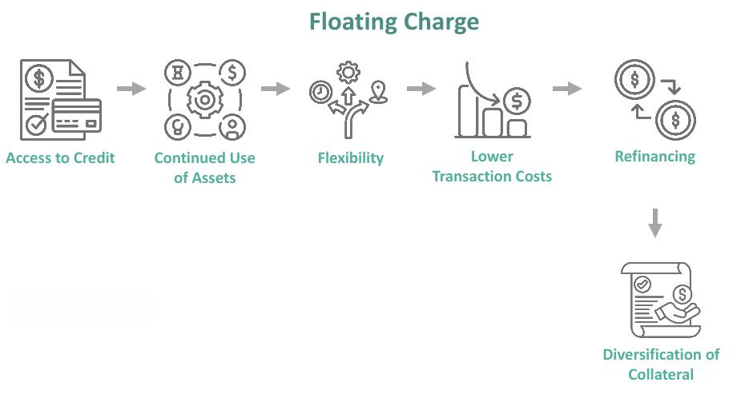

## Table of Contents

## What is a floating charge?

A floating charge is a type of security interest that a company gives to a lender. It's called "floating" because it covers a group of assets that can change over time, like inventory or accounts receivable. This means the company can still use and sell these assets as part of their normal business operations, even though they are used as security for the loan.

When certain events happen, like the company defaulting on the loan, the floating charge can "crystallize." This means it turns into a fixed charge on the specific assets that are part of the group at that time. Once crystallized, the lender has more control over those assets and can take them if the loan isn't paid back.

## How does a floating charge differ from a fixed charge?

A floating charge and a fixed charge are both ways a company can give a lender security for a loan, but they work differently. A fixed charge is tied to specific, unchanging assets like buildings or heavy machinery. Once a fixed charge is placed on an asset, the company can't sell or use that asset without the lender's permission. This gives the lender a strong claim on those specific assets if the company can't pay back the loan.

On the other hand, a floating charge covers a group of assets that can change over time, like inventory or accounts receivable. This means the company can still use and sell these assets as part of their normal business operations. The floating charge "floats" over these assets until something happens, like the company defaulting on the loan. At that point, the floating charge can "crystallize" and turn into a fixed charge on the assets that are part of the group at that time, giving the lender more control over them.

## What types of assets are typically covered by a floating charge?

A floating charge usually covers assets that change a lot, like the things a company has in stock or the money customers owe them. These are called inventory and accounts receivable. Since these assets can go up or down all the time, a floating charge lets the company keep using them to run their business. 

For example, a store can keep selling its products even if they are covered by a floating charge. The company can also collect money from customers without any problems. This makes it easier for the company to keep working normally while still giving the lender some security for the loan.

## Can you provide a simple example of how a floating charge works?

Imagine a small bakery that needs a loan to grow its business. The bank agrees to give the loan, but they want some security. Instead of taking the bakery's ovens or the building, which are fixed assets, the bank puts a floating charge on the bakery's inventory, like the cakes and cookies they make, and the money customers owe them.

This means the bakery can keep baking and selling its goods every day. They can also collect money from customers without any issues. But if the bakery can't pay back the loan, the floating charge turns into a fixed charge on whatever cakes, cookies, and customer payments are there at that time. Then, the bank can take those things to help get their money back.

## What are the advantages of using a floating charge for a business?

Using a floating charge helps a business keep running smoothly. It lets the company use and sell things like inventory and collect money from customers without any problems. This is important because these things change all the time, and the business needs to keep using them to make money. If the business had a fixed charge on these things, they wouldn't be able to sell or use them freely, which could hurt their day-to-day operations.

Another advantage is that a floating charge can make it easier for a business to get a loan. Banks might be more willing to lend money if they know they have some security, but they also want the business to keep working well. A floating charge gives the bank this security without stopping the business from doing what it needs to do. This way, the business can grow and still pay back the loan.

## What are the potential risks or disadvantages of a floating charge for a company?

A floating charge can be risky for a company because it might make it harder to get more loans. If a company already has a floating charge on its inventory and accounts receivable, other lenders might not want to give them more money. They might worry that they won't be able to get their money back if the company can't pay its loans. This means the company might have trouble getting the money it needs to grow or handle tough times.

Another risk is that if the company can't pay back the loan, the floating charge can turn into a fixed charge. This means the lender can take the company's inventory and money owed by customers at that time. Losing these things can hurt the company a lot, making it even harder to keep running or recover. So, while a floating charge lets the company keep working normally, it can also put the company's future at risk if things go wrong.

## How is a floating charge created and registered?

A floating charge is created when a company and a lender agree on it as part of a loan deal. They write it down in a legal document called a debenture. This document says what assets the floating charge covers, like inventory and accounts receivable. Once they agree on everything, the company signs the debenture. This makes the floating charge official, but it's not enough. The company also needs to tell everyone about it by registering it.

Registering a floating charge means the company sends the details to a public record office, like the Companies House in the UK. They fill out a form with information about the charge, the lender, and the assets it covers. Once the office accepts the form, the floating charge is registered. This step is important because it lets other people, like other lenders or investors, know that the company has given a floating charge to someone. It helps them understand the company's financial situation better and make smarter decisions about giving more money or investing in the company.

## What happens to a floating charge during the insolvency of a company?

When a company goes insolvent, a floating charge can change a lot. If the company can't pay its debts, the floating charge might turn into a fixed charge. This happens right away, and it means the lender can take the assets that were covered by the floating charge at that time. These assets could be the company's inventory or the money customers owe them. This can be a big problem for the company because losing these things can make it even harder to keep going or to pay back other debts.

In some places, like the UK, there's a special rule called the "prescribed part." This rule says that before the lender can take everything covered by the floating charge, some money has to be set aside to help pay other people the company owes money to, like smaller creditors. This doesn't happen with fixed charges, so it's one way floating charges can be different during insolvency. It tries to make things a bit fairer for everyone the company owes money to, not just the lender with the floating charge.

## How does the concept of crystallization affect a floating charge?

Crystallization is a big deal for a floating charge. It happens when something goes wrong, like the company not paying back its loan. When this happens, the floating charge turns into a fixed charge on whatever assets it covers at that moment. This means the lender can now take those specific assets, like the inventory or money customers owe the company, if the loan isn't paid back.

This change can make a big difference for the company. Before crystallization, the company could keep using and selling its inventory and collecting money from customers. But once the floating charge crystallizes, the lender has more control over those assets. This can be tough for the company because losing these things can hurt its ability to keep running and make money.

## Can a floating charge be converted into a fixed charge, and if so, how?

Yes, a floating charge can be converted into a fixed charge, and this is called crystallization. It happens when something bad happens, like the company not paying back its loan on time. When the floating charge crystallizes, it turns into a fixed charge on the assets it covers at that moment. These assets could be the company's inventory or the money customers owe them. Once it's a fixed charge, the lender can take those specific assets if the loan isn't paid back.

This change can be a big problem for the company. Before crystallization, the company could keep using and selling its inventory and collecting money from customers without any issues. But after the floating charge turns into a fixed charge, the lender gets more control over those assets. This can make it hard for the company to keep running its business because losing these things can hurt its ability to make money and pay back other debts.

## What are the legal implications of a floating charge in different jurisdictions?

The way floating charges work can be different depending on where you are. In the UK, a floating charge is a common way for companies to get loans. They have to tell everyone about it by registering it with Companies House. If a UK company goes bankrupt, there's a rule called the "prescribed part" that says some money from the floating charge has to be used to help pay other people the company owes money to, not just the main lender. This tries to make things a bit fairer for everyone.

In the United States, things are a bit different. They use something called a "floating lien" which is similar to a floating charge but works under different rules. The laws here can be more complicated, and how a floating lien works can change a lot depending on which state you're in. When a U.S. company goes bankrupt, the floating lien can affect who gets paid first and how the company's assets are shared among everyone it owes money to. So, it's important for companies to know the rules in their own country and state when they're thinking about using a floating charge or lien.

## How have recent legal cases or changes in law affected the use of floating charges?

Recent legal cases and changes in law have made floating charges a bit trickier to use. For example, in the UK, a big case called Re Spectrum Plus changed how floating charges work. Before this case, people thought that if a company promised not to sell certain assets without the lender's permission, the floating charge could turn into a fixed charge right away. But the court said no, it's still a floating charge until something bad happens, like the company not paying back its loan. This made it harder for lenders to feel safe about their money, and they might ask for more security or higher interest rates.

In other places, like Australia, laws have changed to make floating charges less powerful during bankruptcy. They passed a law called the Personal Property Securities Act, which says that if a company goes bankrupt, other people the company owes money to can get paid before the lender with the floating charge. This makes it riskier for lenders to use floating charges, so they might be more careful about giving loans this way. Companies need to keep up with these changes to know how floating charges can help or hurt them when they're trying to get money to grow their business.

## References & Further Reading

[1]: Thomas, R. (2013). ["Floating Charges in Corporate Insolvency."](https://uk.practicallaw.thomsonreuters.com/w-016-9561?contextData=(sc.Default)) Cambridge Law Journal.

[2]: Armour, J., & Frisby, S. (2001). ["Rethinking Receivership."](https://www.jstor.org/stable/pdf/20468356.pdf) Oxford Journal of Legal Studies.

[3]: Lopez de Prado, M. (2018). ["Advances in Financial Machine Learning."](https://www.amazon.com/Advances-Financial-Machine-Learning-Marcos/dp/1119482089) Wiley.

[4]: Chan, E. P. (2009). ["Quantitative Trading: How to Build Your Own Algorithmic Trading Business."](https://github.com/ftvision/quant_trading_echan_book) Wiley.

[5]: Jansen, S. (2020). ["Machine Learning for Algorithmic Trading."](https://github.com/stefan-jansen/machine-learning-for-trading) Packt Publishing.

[6]: Aronson, D. R. (2007). ["Evidence-Based Technical Analysis: Applying the Scientific Method and Statistical Inference to Trading Signals."](https://onlinelibrary.wiley.com/doi/book/10.1002/9781118268315) Wiley.

[7]: Bergstra, J., Bardenet, R., Bengio, Y., & Kégl, B. (2011). ["Algorithms for Hyper-Parameter Optimization."](https://dl.acm.org/doi/10.5555/2986459.2986743) Advances in Neural Information Processing Systems 24.