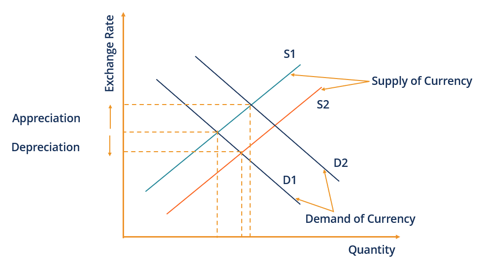

## Table of Contents

## What is a floating exchange rate?

A floating exchange rate is when the value of a country's money goes up and down based on what people think it's worth in the market. It's not set by the government or a central bank. Instead, it changes every day because of things like how much people want to buy or sell the currency, what's happening in the economy, and even what's going on in the world.

This kind of exchange rate can be good because it lets the currency find its own value naturally. It can help a country's economy adjust to changes without needing the government to step in all the time. But it can also be risky because the value of the money can change a lot, which can make it hard for businesses and people to plan for the future.

## How does a floating exchange rate differ from a fixed exchange rate?

A floating exchange rate and a fixed exchange rate are two different ways countries can set the value of their money compared to other countries' money. With a floating exchange rate, the value of the money changes every day based on what people think it's worth. It's like letting the value float up and down freely without anyone controlling it. On the other hand, a fixed exchange rate is when a country's government or central bank decides on a specific value for their money and tries to keep it at that value. They might do this by buying or selling their own money to make sure it stays at the set rate.

The main difference between the two is who decides the value of the money. In a floating exchange rate, it's the market that decides, so the value can go up and down a lot. This can be good because it lets the money find its own value, but it can also be risky because big changes can be hard to predict. In a fixed exchange rate, the government or central bank is in control, so the value stays more stable. This can make it easier for people and businesses to plan, but it can be hard for the government to keep the value fixed, especially if the economy changes a lot.

## What are the key factors that influence a floating exchange rate?

The value of a country's money in a floating exchange rate system is influenced by many things. One big [factor](/wiki/factor-investing) is how much people want to buy or sell the currency. If more people want to buy it, its value goes up. If more people want to sell it, its value goes down. This is called supply and demand. Another factor is what's happening in the country's economy. If the economy is doing well, people might want more of that country's money, making its value go up. If the economy is not doing well, the value might go down.

Another important thing that affects a floating exchange rate is what's happening in the world. Big events like wars, natural disasters, or changes in other countries' economies can change how people feel about a currency. If people think a country is risky because of these events, they might not want to buy its money, and its value can drop. Also, interest rates set by a country's central bank can influence the exchange rate. If the interest rates are high, more people might want to invest in that country, pushing up the value of its currency. If the interest rates are low, the opposite can happen.

Lastly, the actions of big investors and traders can have a big impact on a floating exchange rate. These people often move a lot of money around quickly, and their decisions can cause the value of a currency to change a lot in a short time. They might buy or sell a currency based on their guesses about what will happen in the future, and this can lead to big swings in the exchange rate.

## Can you explain how supply and demand affect floating exchange rates?

Supply and demand are big reasons why a country's money can go up or down in value when it has a floating exchange rate. Imagine you have a bunch of apples, and everyone wants to buy them. The price of the apples will go up because there are a lot of people wanting to buy them but not enough apples to go around. It's the same with money. If a lot of people want to buy a country's money, its value will go up. This happens when people from other countries want to invest in that country or buy things from it. On the other hand, if nobody wants to buy the money and everyone wants to sell it, its value will go down. This can happen if people think the country's economy is not doing well or if they want to take their money out of the country.

So, if more people want to buy a country's money than sell it, the demand is high, and the value of the money goes up. If more people want to sell the money than buy it, the supply is high, and the value goes down. It's all about how many people want the money and how much of it is available. This is why the value of money with a floating exchange rate can change every day. It's always moving based on what people are doing with it.

## What are the advantages of a floating exchange rate system?

A floating exchange rate system has many good points. One big advantage is that it lets a country's money find its own value. This means the money can go up or down based on what people think it's worth. When the economy is doing well, the value of the money can go up, and when it's not doing well, it can go down. This helps the economy adjust to changes without the government having to step in all the time. It's like letting the market take care of things naturally.

Another advantage is that a floating exchange rate can help a country deal with problems from other countries. If another country's economy is not doing well, it might not affect the country with the floating exchange rate as much. The value of the money can change to help protect the economy. Also, a floating exchange rate can make a country's money more attractive to investors. If the money is doing well, more people might want to buy it, which can help the economy grow.

## What are the disadvantages or risks associated with floating exchange rates?

One big problem with floating exchange rates is that they can change a lot. This can make it hard for businesses and people to plan for the future. If the value of the money goes up and down a lot, it can be tough to know how much things will cost or how much money you'll get from selling things. This can make people and businesses feel unsure and might stop them from making big plans or investments.

Another risk is that big changes in the exchange rate can hurt the economy. If the value of the money goes down a lot, it can make things from other countries more expensive. This can lead to higher prices for things people need, like food and gas. On the other hand, if the value of the money goes up a lot, it can make things the country sells to other countries more expensive, which can hurt businesses that rely on exports. This can slow down the economy and make it harder for people to find jobs.

Lastly, floating exchange rates can be influenced a lot by what big investors and traders do. These people can move a lot of money around quickly, and their actions can cause the value of the money to change a lot in a short time. This can make the exchange rate unstable and hard to predict, which can be bad for the economy. It's like trying to drive a car on a road that keeps changing, making it hard to stay on [course](/wiki/best-algorithmic-trading-courses).

## How do central banks intervene in a floating exchange rate system?

Even though a floating exchange rate means the value of money changes based on what people think it's worth, central banks can still step in sometimes. They do this to try to keep the value of the money from changing too much or too fast. If the value of the money is going down a lot, the central bank might buy its own money using other countries' money. This makes more people want to buy the money, which can help its value go up. On the other hand, if the value of the money is going up too much, the central bank might sell its own money. This makes more of the money available, which can help its value go down.

Central banks can also change interest rates to affect the exchange rate. If they make interest rates higher, more people might want to invest in the country because they can earn more money from their investments. This can make the value of the money go up. If they make interest rates lower, fewer people might want to invest, which can make the value of the money go down. By doing these things, central banks can try to keep the value of the money more stable, even in a floating exchange rate system.

## What historical events have significantly impacted floating exchange rates?

One big event that changed floating exchange rates was the end of the Bretton Woods system in 1971. Before that, many countries had fixed exchange rates where their money was tied to the U.S. dollar, and the U.S. dollar was tied to gold. But when the U.S. stopped letting other countries trade their dollars for gold, the system fell apart. This made a lot of countries switch to floating exchange rates. Their money started to go up and down based on what people thought it was worth, not what the government said it was worth.

Another event that had a big impact was the Asian Financial Crisis in 1997. It started in Thailand when people lost faith in the Thai baht and started selling it a lot. This made the value of the baht drop quickly. Because Thailand had a floating exchange rate, the value of its money changed a lot. The crisis spread to other countries in Asia, like South Korea and Indonesia, and even affected places like Russia and Brazil. It showed how risky floating exchange rates can be and how big changes in one country's money can affect the whole world.

The 2008 Global Financial Crisis also had a big effect on floating exchange rates. When big banks and financial companies in the U.S. started to fail, it caused a lot of panic. People and businesses around the world started to pull their money out of risky places and put it into safer ones. This made the value of some countries' money go up a lot, while others went down. The crisis showed how floating exchange rates can change quickly when people are scared and unsure about the future.

## How do floating exchange rates affect international trade and investment?

Floating exchange rates can make international trade more complicated. When the value of a country's money goes up and down a lot, it can be hard for businesses to know how much they will pay for things from other countries or how much they will get for selling their own things to other countries. If a country's money gets weaker, it can make their things cheaper for other countries to buy, which might help them sell more. But it also makes things from other countries more expensive, which can be bad for people and businesses that need to buy things from abroad. On the other hand, if a country's money gets stronger, it can make their things more expensive for other countries to buy, which might hurt their sales. But it also makes things from other countries cheaper, which can be good for people and businesses buying from abroad.

Floating exchange rates also affect international investment. When a country's money is doing well and its value is going up, more people from other countries might want to invest there. They think they can make more money because the value of the money will keep going up. But if the value of the money starts to go down, people might pull their money out of the country because they don't want to lose money. This can make the value of the money go down even more, which can hurt the economy. So, floating exchange rates can make investing in other countries more risky, but they can also make it more rewarding if the value of the money goes up.

## What role do market expectations and speculation play in floating exchange rates?

Market expectations and speculation can have a big impact on floating exchange rates. When people think a country's money will go up in value, they might buy a lot of it, hoping to make money later when they sell it. This can make the value of the money go up because more people want to buy it. On the other hand, if people think the money will go down in value, they might sell it quickly to avoid losing money. This can make the value of the money go down because more people want to get rid of it. So, what people think might happen in the future can change the value of the money right now.

Speculation can also cause the value of money to change a lot in a short time. Big investors and traders often move a lot of money around based on their guesses about what will happen. If a lot of them decide to buy or sell a country's money at the same time, it can make the value go up or down quickly. This can make the exchange rate unstable and hard to predict. Even small news or rumors can cause big changes if people start to act on them. So, speculation can make floating exchange rates more risky and unpredictable.

## How do countries transition from a fixed to a floating exchange rate system?

When a country decides to move from a fixed to a floating exchange rate system, it usually happens because the old system isn't working well anymore. The government or central bank will stop trying to keep the money at a set value. They might do this slowly by letting the money change a little bit more each day, or they might do it all at once by letting the money find its own value right away. This change can be hard because people and businesses need time to get used to the new way of doing things. They have to start thinking about how the value of the money might go up and down and plan for that.

Once the country has made the switch, the value of its money will start to change based on what people think it's worth. The government and central bank might still step in sometimes to keep the value from changing too much, but they won't try to keep it at a set rate anymore. This can help the economy adjust to changes more easily, but it can also make things more unpredictable. People and businesses have to be ready for the value of the money to go up and down, and they might need to change their plans because of it.

## What advanced economic models are used to predict movements in floating exchange rates?

Economists use different models to try and guess how floating exchange rates will change. One popular model is called the purchasing power parity (PPP) model. It looks at how much things cost in different countries and tries to figure out what the exchange rate should be so that the same thing costs the same everywhere. If a burger costs $5 in the U.S. and 4 euros in Europe, the exchange rate should be around 1.25 dollars per euro to make the prices the same. But this model doesn't always work perfectly because other things like interest rates and what people think about the future can also affect the exchange rate.

Another model is the [interest rate](/wiki/interest-rate-trading-strategies) parity (IRP) model. This one looks at the difference in interest rates between two countries. If the interest rate is higher in one country, more people might want to invest there, which can make the value of that country's money go up. The model tries to predict how much the exchange rate will change based on these interest rate differences. But just like the PPP model, it's not always right because things like what people expect to happen in the future and big events can also move the exchange rate in ways the model doesn't expect.

## References & Further Reading

[1]: ["Exchange Rate Systems and Policies"](https://courses.lumenlearning.com/wm-macroeconomics/chapter/exchange-rate-policies/) by International Monetary Fund.

[2]: ["Algorithmic Trading in the Foreign Exchange Market"](https://www.federalreserve.gov/pubs/ifdp/2009/980/ifdp980.pdf) by Committee on Payments and Market Infrastructures (2018).

[3]: ["Technical Analysis of the Foreign Exchange Market"](https://files.stlouisfed.org/files/htdocs/wp/2011/2011-001.pdf) by Boris Schlossberg 

[4]: ["Floating Exchange Rates in an Interdependent World"](https://www.gao.gov/products/nsiad-84-68) by Peter B. Kenen in International Organization Journal. 

[5]: ["Quantitative Trading: How to Build Your Own Algorithmic Trading Business"](https://books.google.com/books/about/Quantitative_Trading.html?id=j70yEAAAQBAJ) by Ernest P. Chan. 

[6]: ["Advances in Financial Machine Learning"](https://www.amazon.com/Advances-Financial-Machine-Learning-Marcos/dp/1119482089) by Marcos Lopez de Prado.