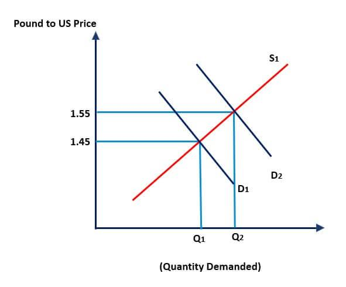

The foreign exchange market, commonly known as forex, plays a pivotal role in determining currency prices worldwide. As the largest and most liquid financial marketplace, it serves as the backbone of global trade and finance, reflecting continuous economic shifts and geopolitical events. Understanding currency valuation within this vast market is crucial for traders seeking to make informed decisions and effectively manage risk.

The valuation of currencies in the forex market is influenced by numerous factors including economic indicators such as interest rates, inflation, and GDP growth, as well as political stability and market sentiment. These dynamics contribute to the constant fluctuations seen in exchange rates, necessitating a comprehensive understanding for both traders and policymakers. 



In this article, we will discuss floating exchange rates, which allow currencies to fluctuate based on market supply and demand, serving as a more flexible alternative to fixed exchange rates. Additionally, we will address the rise of algorithm-based trading, which is transforming how currencies are valued. By leveraging sophisticated computer programs to execute trades at speeds unattainable by humans, algorithmic trading is reshaping the forex market by enhancing efficiency and liquidity.

The aim of this article is to provide readers with a nuanced understanding of these critical concepts and their impact on today's economic landscape. By exploring the intricacies of currency valuation, floating exchange rates, and algorithmic trading, readers will gain valuable insights into the dynamics of the forex market and the evolving role of technology in currency valuation.

## Table of Contents

## Understanding Currency Valuation

Currency valuation refers to the process of determining how much one currency is worth relative to another. This valuation is critical because it affects international trade, investments, and a country's overall economic health. The primary factors influencing currency valuation include economic indicators, political stability, and market sentiment.

Economic indicators are [statistics](/wiki/bayesian-statistics) that provide information about a country's economic performance and future prospects. These indicators include GDP growth rates, unemployment numbers, inflation rates, interest rates, and balance of trade figures. For example, a country with a strong GDP growth rate and low unemployment is often seen as having a robust economy, which can increase demand for its currency. Conversely, high inflation rates can erode currency value by decreasing purchasing power.

Political stability also plays a significant role in currency valuation. A stable political environment, characterized by predictable government policies and the rule of law, can foster investor confidence and attract foreign investment, thereby strengthening a currency. On the other hand, political instability, such as coups, civil unrest, or policy unpredictability, can deter investment and lead to a depreciation of the currency as investors seek safer havens.

Market sentiment reflects the mood and expectations of investors and traders regarding economic conditions and future currency movements. This sentiment is often influenced by news events, economic reports, and geopolitical developments. Positive sentiment can lead to an appreciation in currency value as traders anticipate strong economic performance, while negative sentiment can have the opposite effect.

Currency valuation impacts international trade by influencing the cost of imports and exports. A stronger currency makes imports cheaper but can make exports more expensive on the global market, potentially reducing demand for a country's goods. Conversely, a weaker currency tends to make exports more competitive but increases the cost of imports, which can contribute to inflationary pressures within the country.

For policymakers and traders, understanding these factors is crucial for making informed decisions. Policymakers can use monetary and fiscal policies to influence economic indicators, thereby indirectly affecting currency valuation. Traders, on the other hand, use information about economic indicators, political conditions, and market sentiment to predict currency movements and make strategic trading decisions.

In summary, currency valuation is a complex process influenced by various factors, each playing a significant role in shaping a country's economic landscape. By understanding these factors, stakeholders can make better decisions to navigate the foreign exchange market effectively.

## The Foreign Exchange Market

The foreign exchange ([forex](/wiki/forex-system)) market holds the distinction of being the largest and most liquid financial market globally. With an average daily trading [volume](/wiki/volume-trading-strategy) exceeding $6 trillion, the forex market surpasses other financial markets in terms of size and [liquidity](/wiki/liquidity-risk-premium). This vast market facilitates the exchange of currencies from around the world, serving as a critical component of international trade and economic activity.

Forex participants encompass a wide array of entities, ranging from major financial institutions such as banks and corporations to sovereign governments and independent traders. Banks and corporations engage in forex trading to support international business operations, manage risk, and hedge against currency fluctuations. Meanwhile, governments participate through their central banks, primarily to stabilize or influence the value of their domestic currencies. Individual traders, often referred to as retail traders, also play a significant role by trading for speculative or hedging purposes.

The forex market operates continuously from Monday to Friday, coordinating with the opening hours of major financial centers across different time zones. Beginning in Asia with the opening of the Tokyo market, trading transitions to European centers such as London, and later to the Americas, including New York. This seamless operation allows for a 24-hour trading cycle, providing liquidity and opportunities at almost any time throughout the business week.

Unlike other financial markets, the forex market does not have a centralized exchange. Instead, it functions as an over-the-counter (OTC) market, where transactions are conducted electronically via computer networks among traders around the world. This decentralized structure contributes to the market's liquidity and ensures that currency prices reflect real-time global economic developments and events.

In summary, the forex market's immense size and liquidity, coupled with a diverse range of participants and continuous operation, make it a unique and essential component of the global financial system. Understanding these characteristics provides essential context for participants and observers aiming to navigate or analyze the complexities of international finance.

## Floating Exchange Rates

Floating exchange rate systems, distinguished by their reliance on market forces, are a central feature of modern foreign exchange markets. Under this arrangement, currency values are not fixed but instead are determined by the entire interplay of supply and demand dynamics within the forex market. This inherent flexibility allows currencies to adjust and fluctuate freely, responding in real-time to shifts in economic variables and market sentiment. Such a system stands in contrast to fixed exchange rate regimes where governments peg their currencies to a particular benchmark, often another major currency or a basket of currencies, and maintain that rate through direct intervention.

The advantages of floating exchange rate systems are substantial. Primarily, they foster a more dynamic and adaptable economic environment. By allowing currencies to vary freely, floating rates can mitigate the impact of global economic shocks. When faced with adverse international conditions, an economy can benefit from a natural depreciation of its currency, which can stimulate export competitiveness. Conversely, during periods of economic strength, currencies may appreciate, effectively importing stability and reducing inflationary pressures from within.

Floating exchange rates adjust to economic indicators such as inflation rates, interest rates, and levels of public debt. For instance, an increase in a country's [interest rate](/wiki/interest-rate-trading-strategies) relative to others can attract foreign capital, boosting the demand and, thus, the value of its currency. Similarly, economic indicators like GDP growth rates and political stability can significantly influence market perceptions and, consequently, currency valuations.

Examples of prominent currencies operating under floating exchange rate regimes include the United States dollar (USD) and the euro (EUR). These currencies are subject to minimal direct government control or regulation aimed at maintaining a specified value. As such, their exchange rates reflect the aggregate beliefs of the global market about the respective economies they represent.

In summary, floating exchange rates offer a mechanism through which currencies can adjust to both domestic economic conditions and global developments, fostering an environment in which market forces play a pivotal role in currency valuation. This system's flexibility allows for economic adjustments that can stabilize economies in times of fluctuations, making it integral to the global financial architecture.

## Algo Trading in Forex

Algorithmic trading, commonly known as 'algo trading', leverages advanced computer programs to execute trades in the foreign exchange (forex) market based on predetermined criteria. This technology enables traders to respond swiftly to market alterations, executing orders with a precision and speed beyond the capabilities of manual intervention. By employing complex algorithms, traders can parse extensive datasets to pinpoint trading opportunities in real-time, thus maximizing efficiency and potential outcomes.

The underlying logic of [algorithmic trading](/wiki/algorithmic-trading) involves formulating a trading strategy into precise rules that a computer can execute. These rules might encompass timing, price, quantity, or any specific model, and once programmed, they can execute trades devoid of human oversight. Python is one of the most utilized programming languages in algo trading, given its simplicity and extensive library ecosystem. For instance, Python's libraries such as NumPy and pandas enable data manipulation and analysis, while libraries like TA-Lib assist in technical analysis, essential for crafting algo trading strategies.

Here's an elementary Python example of a moving average crossover strategy commonly applied in forex algorithmic trading:

```python
import pandas as pd
import numpy as np

def generate_signals(data, short_window=40, long_window=100):
    signals = pd.DataFrame(index=data.index)
    signals['signal'] = 0.0

    # Create short simple moving average column
    signals['short_mavg'] = data['price'].rolling(window=short_window, min_periods=1).mean()

    # Create long simple moving average column
    signals['long_mavg'] = data['price'].rolling(window=long_window, min_periods=1).mean()

    # Create signals
    signals['signal'][short_window:] = np.where(signals['short_mavg'][short_window:] > signals['long_mavg'][short_window:], 1.0, 0.0)   

    # Generate trading orders
    signals['positions'] = signals['signal'].diff()

    return signals
```

This script calculates the short and long moving averages of a forex pair, generating buy signals when the short moving average surpasses the long one. The high efficiency of algo trading renders it appealing since it allows implementing profitable strategies without the need for constant monitoring.

While this method presents numerous advantages, including increased accuracy and reduced transaction costs, it also introduces risks related to market [volatility](/wiki/volatility-trading-strategies). Algorithms can exacerbate market swings, as multiple programs may engage simultaneously, given particular triggers. Despite these challenges, the allure of algorithmic trading remains substantial, driven by its transformative potential in the competitive landscape of forex trading.

## Impact of Algorithmic Trading on Currency Valuation

Algorithmic trading, often referred to as "algo trading," has a profound impact on currency valuation within the foreign exchange (forex) market. This method leverages pre-programmed instructions to execute trades at speeds and frequencies unattainable by human traders, and it offers significant efficiencies in market operations.

One of the primary effects of algorithmic trading on currency valuation is the potential increase in market liquidity. With algorithms capable of executing high volumes of trades simultaneously, the entry and [exit](/wiki/exit-strategy) of positions in the market become significantly smoother. This enhanced liquidity facilitates tighter bid-ask spreads, ultimately reducing transaction costs for traders. As a result, participants can more easily and cost-effectively engage in forex transactions, leading to a more efficient market.

Algorithmic trading also allows traders to better exploit market inefficiencies. Algorithms can process vast amounts of market data in real-time, identifying patterns and discrepancies in pricing that may indicate potential trading opportunities. By swiftly acting on these insights, algorithms contribute to a more accurate pricing of currencies over time. This increased accuracy in currency valuation supports the stability and predictive capacity of forex markets.

However, the reliance on algorithms brings challenges, particularly in terms of volatility. Algorithms, by design, react quickly to market changes based on a set of defined criteria. If multiple algorithms are triggered simultaneously by specific market events, this can lead to rapid price movements and volatility spikes. This behavior, sometimes referred to as "flash crashes," highlights the systemic risk that comes with widespread adoption of algorithmic trading. It underscores the need for effective risk management frameworks and regulatory oversight to mitigate potential adverse impacts.

Despite these challenges, algorithmic trading remains a powerful and essential tool for modern forex traders. Its ability to process and analyze large datasets with precision allows for sophisticated trading strategies that can adapt to market dynamics and enhance profitability. For traders and firms capable of leveraging these technologies, algorithmic trading not only represents a competitive advantage but also a necessary adaptation to the evolving landscape of the forex market. The continued evolution of algorithmic strategies promises further refinements in trading efficiencies and currency valuation methodologies, making it an indispensable component of contemporary trading arsenals.

## Conclusion

The foreign exchange (forex) market's complexity presents both significant challenges and lucrative opportunities for traders worldwide. The ability to understand and leverage floating exchange rates is fundamental in navigating currency valuation fluctuations. Floating exchange rates are characterized by their responsiveness to economic indicators and market sentiment, offering a dynamic environment where currency prices are determined by supply and demand. This system requires traders to continuously adapt to global economic conditions, which can influence exchange rates in real time. 

With the advent and increasing prevalence of algorithmic trading, the forex landscape is undergoing a transformation. Algorithmic trading programs enable traders to execute orders with remarkable speed and accuracy, processing large volumes of data to pinpoint trading opportunities more efficiently than traditional methods. These algorithms can adjust strategies based on real-time market information, offering traders a significant competitive advantage by capitalizing on minute discrepancies in the market.

The ability to stay informed and integrate these advanced technological tools into trading strategies is crucial for sustained success in the forex market. Traders who can adapt to these innovations are better positioned to manage risk, enhance trade execution, and optimize returns. As such, continuous learning and adaptation to technological advancements like algorithmic trading are vital. Staying ahead in the forex market requires not only a solid understanding of economic principles but also a proactive approach to integrating new technologies and strategies that can enhance performance and profitability.

## References & Further Reading

[1]: ["Exchange Rate Systems and Policies"](https://courses.lumenlearning.com/wm-macroeconomics/chapter/exchange-rate-policies/) by International Monetary Fund.

[2]: ["Algorithmic Trading in the Foreign Exchange Market"](https://www.federalreserve.gov/pubs/ifdp/2009/980/ifdp980.pdf) by Committee on Payments and Market Infrastructures (2018).

[3]: ["Technical Analysis of the Foreign Exchange Market"](https://files.stlouisfed.org/files/htdocs/wp/2011/2011-001.pdf) by Boris Schlossberg 

[4]: ["Floating Exchange Rates in an Interdependent World"](https://www.gao.gov/products/nsiad-84-68) by Peter B. Kenen in International Organization Journal. 

[5]: ["Quantitative Trading: How to Build Your Own Algorithmic Trading Business"](https://books.google.com/books/about/Quantitative_Trading.html?id=j70yEAAAQBAJ) by Ernest P. Chan. 

[6]: ["Advances in Financial Machine Learning"](https://www.amazon.com/Advances-Financial-Machine-Learning-Marcos/dp/1119482089) by Marcos Lopez de Prado.