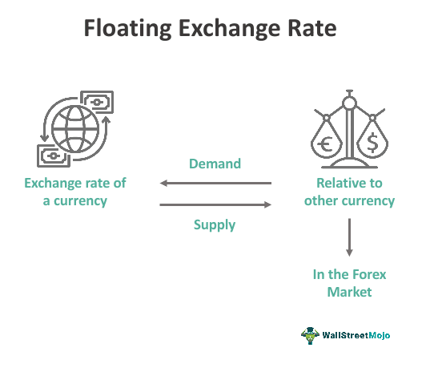

Financial markets constitute an intricate network where the trading of assets, such as stocks, bonds, and derivatives, occurs. These markets are pivotal to the global economy, facilitating the allocation of resources, risk management, and capital formation. A significant transformation within these markets has been brought about by algorithmic trading, which leverages advanced mathematics and cutting-edge technology to enhance trading efficiency and efficacy.

Algorithmic trading has revolutionized the financial landscape by utilizing computer programs that execute trades at exceptionally high speeds and volumes, far surpassing human capabilities. These algorithms are designed to follow a set of pre-defined rules, which often incorporate complex mathematical models and statistical analysis to predict market behavior and identify profitable trading opportunities. By reducing human error and bias, algorithmic trading enhances market efficiency and liquidity.



A critical aspect of financial markets, particularly in the context of algorithmic trading, is the mechanism of floating prices. A floating price is one that adjusts according to market conditions and benchmarks such as interest rates or currency exchange rates. This dynamic pricing mechanism is essential for derivative contracts and swap agreements, where the value of the contract depends on variables that can fluctuate over time.

The interaction between floating prices and algorithmic trading is fundamental to modern financial strategies. As prices fluctuate in response to new information, algorithmic systems can react almost instantaneously, making rapid trading decisions based on the latest data. This capability not only optimizes trading strategies but also enhances overall market stability by providing consistent liquidity. However, it can also lead to increased market volatility, particularly during times of systemic stress.

In this article, the focus will be on understanding these key components—floating price mechanisms and algorithmic trading—and how they interact to define contemporary financial trading strategies. Through this exploration, readers will gain insight into the mechanistic and strategic foundations that drive modern markets, offering a profound understanding of the innovations shaping today's financial trading environment.

## Table of Contents

## Understanding Financial Markets and Floating Prices

Financial markets are a platform where various financial securities, such as stocks, bonds, and derivatives, are traded. These markets are instrumental in channeling funds, offering investor returns, and providing mechanisms for risk management. Among the crucial components of financial markets are floating prices, which are crucial for the valuation and trading of certain financial instruments.

A floating price, in the context of finance, is a price that varies in response to market dynamics. Unlike fixed prices, floating prices are not static but adjust according to benchmarks such as interest rates or currency exchange rates. This variability allows them to reflect current market conditions more accurately—a critical aspect for instruments that are sensitive to market fluctuations. For instance, in a market where interest rates are a primary influence, a floating rate might be indexed to a benchmark like the London Interbank Offered Rate (LIBOR), adjusting in tandem with changes in the benchmark rate.

Floating prices play a significant role in swap agreements and other derivative contracts. In [interest rate](/wiki/interest-rate-trading-strategies) swaps, one party typically agrees to pay a fixed interest rate while the other pays a floating rate indexed to a benchmark, enabling parties to hedge interest rate risk or speculate on rate movements. The formula for a simple interest rate swap can be expressed as:

$$
\text{Net Swap Payment} = (\text{Fixed Rate} - \text{Floating Rate}) \times \text{Notional Principal}
$$

In this structure, the floating rate component introduces variability and potential for gain or loss—depending directly on the changes in the benchmark rates to which it is tied.

Understanding floating price mechanisms is essential for comprehending how financial markets function. They serve as indicators of supply and demand dynamics and broader economic variables, offering insights into investor sentiment and market trends. The adjustment capability of floating prices makes them instrumental in ensuring that financial instruments remain relevant and correctly valued in a constantly shifting economic environment. 

Furthermore, in derivative markets, floating prices are vital for hedging strategies. Derivatives traders often rely on the sensitivity of floating prices to market conditions, using these fluctuations to anticipate and react to potential financial risks. The dynamic nature of floating prices can also offer [arbitrage](/wiki/arbitrage) opportunities, allowing traders to exploit price discrepancies between markets.

To summarize, financial markets depend heavily on the efficiency and accuracy of floating prices. These prices not only reflect real-time market sentiment but also provide a responsive framework for trading, risk management, and financial strategy formulation. Understanding their mechanics is fundamental for any market participant looking to navigate the complexities of modern financial systems.

## The Role of Pricing Mechanisms in Financial Markets

Pricing mechanisms are critical in determining the values of financial instruments within the market. These mechanisms serve as the foundation upon which various financial agreements, including contracts like interest rate swaps, are structured. Two primary types of pricing arrangements coexist: floating and fixed price mechanisms.

Floating pricing arrangements are inherently dynamic and fluctuate in response to market conditions. They are often tethered to economic indicators such as interest rates, currency exchange rates, and various benchmark indices. The variability introduced by floating prices requires sophisticated strategies for financial institutions to manage long-term investment risks. For instance, in interest rate swaps, agreements are structured where one party exchanges a fixed interest rate for a floating rate, often linked to a benchmark such as LIBOR (London Interbank Offered Rate) or its successors like SOFR (Secured Overnight Financing Rate). This setup allows market participants to hedge against interest rate fluctuations or to speculate on rate movements.

In contrast, fixed price arrangements provide certainty and stability. They offer a predetermined price that remains constant throughout the contract's duration, regardless of market fluctuations. This fixed nature allows businesses and investors to forecast costs and returns more accurately, enhancing budgeting and cash flow management.

The dynamics of floating prices not only embody prevailing economic conditions but also encapsulate expectations about future market shifts. Pricing mechanisms thus form the critical link between financial theory and practical trading strategies. By reflecting broader economic variables, these mechanisms play a significant role in financial strategy and risk management. For example, understanding the movements associated with a floating rate can guide investment decisions, influencing whether an investor opts for hedging against potential losses or seeking higher profitability through speculation.

Overall, the interplay between floating and fixed pricing mechanisms shapes the financial landscape, providing diverse tools for market participants to navigate complex financial environments.

 to Algorithmic Trading

Algorithmic trading employs sophisticated computer programs that follow predefined algorithms to execute trading orders. These systems prioritize speed and accuracy, enabling financial institutions and individual traders to perform a significant number of transactions within milliseconds. The rapid execution capability is essential in today's high-paced financial markets, where opportunistic trades can capitalize on minute price changes.

The foundation of [algorithmic trading](/wiki/algorithmic-trading) lies in mathematical and statistical models that discern potential trading opportunities. These models analyze historical data, recognize patterns, and forecast future market movements to make strategic trades. For instance, linear regression can be used to predict future prices based on historical trends. In Python, such a model could be implemented using libraries like NumPy and SciPy:

```python
import numpy as np
from scipy import stats

# Example of predicting future prices using simple linear regression
historical_prices = np.array([50, 51, 52, 50, 49, 51, 53, 52])
days = np.arange(len(historical_prices))

slope, intercept, r_value, p_value, std_err = stats.linregress(days, historical_prices)

# Predict future price for the 9th day
future_price_prediction = slope * 8 + intercept
print(f"Predicted future price: {future_price_prediction}")
```

Another critical aspect of algorithmic trading is its ability to minimize human errors. Human traders can be influenced by emotions and cognitive biases, potentially making decisions that are not aligned with their strategic goals. In contrast, algorithmic systems operate based on objective data and predefined rules, ensuring consistency and adherence to the trading strategy.

Algorithmic trading also significantly enhances market efficiency. By facilitating numerous transactions at high speed, these systems contribute to price discovery and market [liquidity](/wiki/liquidity-risk-premium). The increased market depth they provide helps in narrowing bid-ask spreads and enables smoother market functioning. However, while algorithmic trading offers substantial benefits, it also demands robust technology infrastructure and a clear understanding of market dynamics to mitigate associated risks effectively.

## Interaction of Algorithmic Trading with Floating Prices

Algorithmic trading systems frequently incorporate floating price data from financial markets to inform their trading decisions. Floating prices, characterized by their fluctuation in response to market conditions, provide crucial input for these algorithms, allowing them to operate with high precision and speed. By leveraging floating prices, algorithms can react to market movements almost instantaneously, enabling the execution of high-frequency trading ([HFT](/wiki/high-frequency-trading-strategies)) strategies. This rapid responsiveness is a significant advantage in capturing trading opportunities that exist for mere fractions of a second.

The use of floating price data allows algorithmic trading to enhance market liquidity, as algorithms continuously provide buy and sell orders, increasing the availability of trades. This liquidity is essential for the efficient functioning of financial markets, as it reduces the bid-ask spread and facilitates smoother transactions. Market stability is also bolstered by algorithmic trading, as the dissemination of price data and the algorithms' capabilities to process this information quickly enables the market to absorb shocks more effectively.

However, the interaction between algorithmic trading and floating prices is not without its challenges. While the swift execution of trades can stabilize markets under regular conditions, it may also exacerbate [volatility](/wiki/volatility-trading-strategies) during extreme market stress. Algorithms, primarily driven by predetermined rules and heuristics, can contribute to heightened market fluctuations if multiple systems respond to the same price signals simultaneously. This behavior can lead to phenomena such as flash crashes—rapid, deep market price declines followed by quick recoveries—illustrating the potential for algorithmic trading to influence market dynamics negatively.

To mitigate these risks, trading algorithms often incorporate sophisticated risk management techniques, such as volatility controls and circuit breakers, which can temporarily halt trading activities to allow for market stabilization. Furthermore, ongoing developments in regulatory frameworks aim to address the systemic risks posed by algorithmic trading, ensuring that technological advances contribute positively to market robustness.

In summary, the interplay between algorithmic trading and floating prices is a cornerstone of modern financial markets, melding efficiency with the potential for increased volatility. As technology evolves, so too will the methodologies employed to harness this interaction, promising continued improvements but also necessitating vigilant oversight.

## Case Studies in Algorithmic Trading and Pricing Mechanisms

Major financial institutions such as JP Morgan and BlackRock have been at the forefront of algorithmic trading, employing sophisticated techniques to enhance their trading strategies and improve market efficiency. These institutions leverage algorithmic trading for various applications, including [market making](/wiki/market-making) and [statistical arbitrage](/wiki/statistical-arbitrage), which are fundamentally linked to floating price mechanisms.

Market making is a prominent application where algorithms are used to provide liquidity to the market by continuously quoting buy and sell prices for various financial instruments. By doing so, market makers facilitate smoother transactions for other market participants, thereby increasing overall market liquidity. JP Morgan employs complex market-making algorithms that can dynamically adjust prices based on real-time market conditions, including floating prices linked to interest rate changes or currency exchange rates. These algorithms assess supply and demand imbalances and margin requirements to optimize the spread between bid and ask prices, thus ensuring profitability while managing risk efficiently.

Statistical arbitrage, another crucial application, involves using complex mathematical models to exploit price inefficiencies between correlated financial instruments. Institutions like BlackRock utilize statistical arbitrage strategies that incorporate floating prices to identify and execute trades with a potential edge. These strategies often involve analyzing historical price data and employing [machine learning](/wiki/machine-learning) algorithms to forecast price movements. For instance, a statistical arbitrage algorithm may identify deviations from historical price relationships between two currency pairs and execute trades that bet on the return to historical patterns.

Here is a simple Python example demonstrating a basic concept of statistical arbitrage using the pandas library to analyze the historical price correlation between two stocks:

```python
import pandas as pd
import numpy as np
from sklearn.linear_model import LinearRegression

# Assuming historical_data is a DataFrame with columns 'Stock_A' and 'Stock_B'
def calculate_spread(stock_a, stock_b):
    regression = LinearRegression()
    regression.fit(stock_b.values.reshape(-1, 1), stock_a)
    hedged = stock_a - regression.predict(stock_b.values.reshape(-1, 1))
    return hedged

historical_data = pd.DataFrame({
    'Stock_A': [100, 102, 101, 105, 107],
    'Stock_B': [50, 51, 52, 54, 55]
})

spread = calculate_spread(historical_data['Stock_A'], historical_data['Stock_B'])
print(spread)
```

This basic implementation identifies the spread, i.e., the mispricing between two stock prices that can be targeted for an arbitrage opportunity. Such algorithms can be expanded with more advanced statistical methods and include factors reflecting floating price variations.

The practical benefits of algorithmic trading in these scenarios are evident as they enable institutions to capitalize on minimal price discrepancies, automate trading processes, and respond instantly to market changes. However, challenges include managing algorithm-induced volatility and ensuring robust risk management frameworks to avoid detrimental market events, such as the infamous "flash crash." These case studies highlight the intricacies and potential of integrating floating prices into algorithmic trading strategies.

## Risks and Challenges of Algorithmic Trading

Algorithmic trading, despite its many benefits such as speed and accuracy, presents several risks and challenges that must be addressed to maintain market integrity. One of the primary risks is systemic risk, which refers to the potential for widespread financial instability that can arise when many market participants use similar trading algorithms. These algorithms, reacting to the same market signals, can exacerbate price movements, leading to significant disruptions.

Market volatility is another concern associated with algorithmic trading. The rapid execution of trades can enhance market liquidity and efficiency, but it can also amplify market fluctuations during periods of stress. High-frequency trading, a subset of algorithmic trading that executes a large number of trades in milliseconds, may contribute to these fluctuations. In some instances, this can result in occurrences known as "flash crashes," where market prices drop sharply within minutes before rebounding just as quickly. Two notable flash crashes occurred on May 6, 2010, and August 24, 2015, underscoring the potential volatility risks inherent in algorithmic trading.

Another challenge involves liquidity issues. While algorithmic trading can provide liquidity in normal market conditions, it may lead to liquidity shortages during abrupt market changes. Algorithms programmed with similar criteria may quickly withdraw from the market under certain conditions, resulting in reduced liquidity and increased price volatility.

To manage these risks, sophisticated technological measures and robust regulatory frameworks are essential. Market participants must employ advanced risk management systems that can monitor and control the behavior of trading algorithms in real-time. These systems should include mechanisms capable of pausing or altering trading strategies if unusual market conditions are detected.

Regulatory frameworks play a crucial role in mitigating the challenges posed by algorithmic trading. Regulators enforce rules to ensure fair and transparent trading practices, often requiring firms to implement "circuit breakers" and other controls that can halt trading temporarily during volatile periods. These regulations are designed not only to protect market participants but also to safeguard the overall stability of financial markets.

In conclusion, while algorithmic trading revolutionizes how financial markets operate by improving efficiency and liquidity, it also introduces significant risks and challenges. Addressing these requires a combination of advanced technology and effective regulatory oversight, ensuring that the benefits of algorithmic trading do not come at the expense of market stability.

## Conclusion

Floating price mechanisms and algorithmic trading represent central components in the ongoing evolution of financial markets. These mechanisms, which allow prices to adjust dynamically in response to real-time market conditions, are fundamental in the complex environment where various financial instruments are traded. Understanding and mastering these elements have become imperative for market participants as they strive to optimize their trading strategies and risk management practices.

As technology continues to advance at a rapid pace, the integration of [artificial intelligence](/wiki/ai-artificial-intelligence) (AI) and machine learning into algorithmic trading systems is increasingly apparent. These technologies promise to enhance the capabilities of trading algorithms by enabling them to analyze vast datasets, identify complex patterns, and make more informed trading decisions. The adaptation of AI technologies could involve the implementation of neural networks or [reinforcement learning](/wiki/reinforcement-learning) models, which have shown potential in improving predictive accuracy and decision-making processes in uncertain environments.

For instance, a trading algorithm could be enhanced using machine learning to predict future price movements based on historical data, employing models such as LSTM (Long Short-Term Memory) networks to understand temporal dependencies. Here is a simple Python snippet to illustrate how LSTM might be set up for such a task:

```python
from keras.models import Sequential
from keras.layers import LSTM, Dense

# Define the LSTM model
model = Sequential()
model.add(LSTM(50, return_sequences=True, input_shape=(timesteps, features)))
model.add(LSTM(50, return_sequences=False))
model.add(Dense(1))

# Compile the model
model.compile(optimizer='adam', loss='mean_squared_error')

# Fit the model with data
model.fit(X_train, y_train, epochs=100, batch_size=64, validation_split=0.1)
```

While the integration of AI offers substantial benefits, it also introduces new challenges. These could include the increased complexity of ensuring the transparency and interpretability of decisions made by AI-driven models, as well as concerns around data privacy and security. Moreover, there is the potential for these sophisticated algorithms to exacerbate market volatility during periods of stress, as they may interact in unforeseen ways, leading to unintended consequences such as flash crashes.

In conclusion, floating price mechanisms and algorithmic trading are integral to the innovative landscape of financial markets. Their continued evolution, fueled by advances in AI and machine learning, will present both opportunities for efficiency and profitability, as well as challenges related to risk management and regulatory oversight. For market participants, staying abreast of these developments and understanding their implications is crucial for successfully navigating future market conditions.

## References & Further Reading

[1]: Cartea, Á., Jaimungal, S., & Penalva, J. (2015). ["Algorithmic and High-Frequency Trading."](https://assets.cambridge.org/97811070/91146/frontmatter/9781107091146_frontmatter.pdf) Cambridge University Press.

[2]: Aldridge, I. (2013). ["High-Frequency Trading: A Practical Guide to Algorithmic Strategies and Trading Systems."](https://www.amazon.com/High-Frequency-Trading-Practical-Algorithmic-Strategies/dp/1118343506) Wiley.

[3]: Kissell, R. (2013). ["The Science of Algorithmic Trading and Portfolio Management."](https://www.sciencedirect.com/book/9780124016897/the-science-of-algorithmic-trading-and-portfolio-management) Academic Press.

[4]: Narang, R. K. (2013). ["Inside the Black Box: A Simple Guide to Quantitative and High-Frequency Trading."](https://onlinelibrary.wiley.com/doi/book/10.1002/9781118662717) Wiley.

[5]: Gomber, P., Arndt, B., Lutat, M., & Uhle, T. (2011). ["High-Frequency Trading."](https://papers.ssrn.com/sol3/papers.cfm?abstract_id=1858626) SSRN Electronic Journal.

[6]: Giraud, J., & Roussellet, C. (2016). ["Floating and Fixed Prices in Financial Markets."](https://www.sciencedirect.com/science/article/abs/pii/S0304407617301653) In Mathematical Financial Economics.

[7]: de Prado, M. L. (2018). ["Advances in Financial Machine Learning."](https://www.amazon.com/Advances-Financial-Machine-Learning-Marcos/dp/1119482089) Wiley.