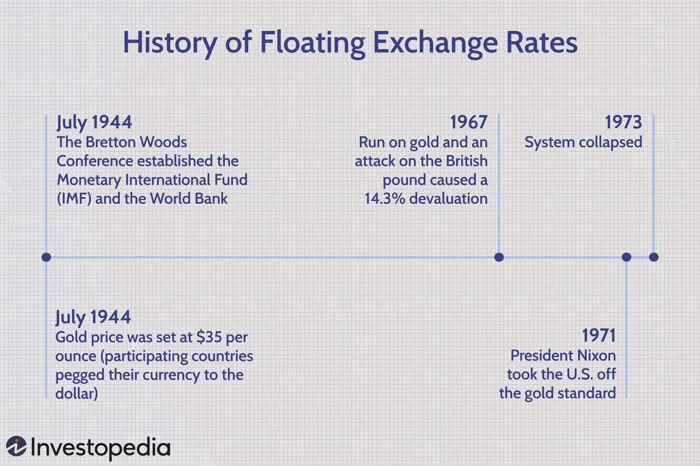

## Table of Contents

## What is a floating price?

A floating price is a type of price that can change over time. It is often used in financial markets for things like commodities or currencies. Instead of having a fixed price, the floating price moves up and down based on what is happening in the market. This means that if you buy something with a floating price, the amount you pay could be different from what someone else pays at a different time.

Floating prices are important because they help markets stay balanced. When the price can change, it encourages people to buy when prices are low and sell when prices are high. This movement helps keep supply and demand in check. For example, if the price of oil goes up, people might use less oil, which can help bring the price back down. Floating prices make sure that the market can react to changes quickly and fairly.

## How does a floating price differ from a fixed price?

A floating price is one that can go up and down, while a fixed price stays the same. When something has a floating price, like gas at the pump, the price you pay today might be different from what you pay next week. This happens because the price changes with the market. On the other hand, if you buy a bus ticket with a fixed price, you will always pay the same amount no matter when you buy it.

Floating prices help markets stay balanced by letting the price change when supply and demand change. For example, if there's a lot of something, the price might go down to encourage people to buy more. If there's not enough, the price might go up to encourage people to use less. Fixed prices don't change, so they can't respond to these changes in the market. This means that while fixed prices give you certainty about what you will pay, floating prices help keep the market fair and efficient.

## What are the common uses of floating prices in financial markets?

Floating prices are used a lot in financial markets, especially for things like commodities and currencies. Commodities like oil, gold, and wheat have prices that can change every day. This happens because the price of these things depends on how much people want them and how much is available. For example, if there's a big storm that makes it hard to get oil out of the ground, the price of oil might go up because there's less of it to go around. Currencies also have floating prices. The value of one country's money compared to another's can change all the time. This is important for people who buy and sell things from different countries.

Floating prices are also used for financial products like stocks and bonds. The price of a company's stock can go up and down based on how well the company is doing and what people think about its future. If a company does well, more people might want to buy its stock, which can make the price go up. Bonds, which are like loans that people give to companies or governments, can also have floating prices. The price of a bond can change based on things like interest rates and how safe people think the bond is. Floating prices help make sure that the market can react quickly to new information and keep everything balanced.

## How is a floating price determined?

A floating price is determined by the balance of supply and demand in the market. When there's a lot of something, like oil, and not many people want it, the price goes down. But if there's not much of it and a lot of people want it, the price goes up. This happens all the time, every day, as things change in the world. For example, if a big storm makes it hard to get oil out of the ground, the supply goes down, and the price might go up because there's less oil to go around.

People and companies all over the world are buying and selling things, and their actions help set the floating price. Traders and investors watch the market closely and make decisions based on what they see. They might buy something if they think the price will go up, or sell it if they think the price will go down. All these decisions, plus news and events that can affect supply and demand, help determine the floating price. It's like a big, constantly moving puzzle where everyone's actions fit together to set the price.

## What factors influence the movement of a floating price?

Many things can make a floating price go up or down. The biggest one is how much people want something and how much of it there is. If a lot of people want to buy something, but there isn't much of it, the price will go up. But if there's a lot of it and not many people want it, the price will go down. This is called supply and demand. For example, if a big storm makes it hard to get oil out of the ground, there's less oil, so the price might go up because people still need it.

Other things can also affect floating prices. News and events around the world can change how people feel about buying or selling things. If a company does well, people might want to buy its stock, which can make the price go up. But if there's bad news, like a war or a big economic problem, people might want to sell, and the price could go down. Also, things like interest rates and government rules can change how much people want to buy or sell, which can move the floating price.

## Can you explain the mechanism behind floating price adjustments?

Floating prices change because of something called supply and demand. When a lot of people want to buy something, but there isn't much of it, the price goes up. This is because everyone is trying to get it, so sellers can ask for more money. On the other hand, if there's a lot of something and not many people want it, the price goes down. Sellers have to lower the price to get people to buy it. It's like a seesaw: when one side goes up, the other goes down.

These changes happen all the time because the world is always moving. News and events can make people feel differently about buying or selling. For example, if there's a big storm that stops oil from being produced, the price of oil might go up because there's less of it. Or if a company does really well, more people might want to buy its stock, which makes the price go up. Things like interest rates and government rules can also make prices move. All these things together help decide the floating price, making it go up and down as the world changes.

## What are the advantages of using a floating price in contracts?

Using a floating price in contracts can be really helpful because it lets the price change with the market. This means if the price of something like oil or wheat goes up or down, the contract price changes too. This helps keep things fair for both the buyer and the seller. If the price of oil goes up a lot, the seller doesn't lose money because the contract price goes up with it. And if the price goes down, the buyer doesn't have to pay more than they need to.

Floating prices also help manage risk. Since the price can change, both the buyer and the seller can protect themselves from big surprises. For example, if a farmer sells wheat at a floating price, they don't have to worry as much about the price dropping before they can sell. And the buyer knows they won't be stuck paying a high price if the market goes down. This makes everyone feel more secure and helps keep the market balanced.

## What are the potential risks associated with floating prices?

Using floating prices can be risky because the price can change a lot. If you're buying something with a floating price, you might end up paying more than you expected if the price goes up. For example, if you're buying oil and the price suddenly jumps because of a big storm, you'll have to pay more. This can be hard on your budget and make it tough to plan for the future because you never know what the price will be.

On the other hand, if you're selling something with a floating price, you might get less money than you hoped for if the price goes down. If you're a farmer selling wheat and the price drops because there's too much wheat around, you won't make as much money. This can be a problem if you were counting on that money to pay for things. Floating prices can make it hard to predict what will happen, which can be stressful and risky for both buyers and sellers.

## How do floating prices affect commodity markets?

Floating prices are really important in commodity markets because they help keep things balanced. Commodities like oil, wheat, and gold have prices that change all the time. This happens because the price goes up when a lot of people want to buy and there's not much of the commodity around. But if there's a lot of the commodity and not many people want it, the price goes down. This makes sure that the market stays fair for everyone. If the price of oil goes up a lot, people might start using less oil, which can help bring the price back down.

Floating prices also make it easier for people to buy and sell commodities. If someone wants to buy wheat, they can do it at the current price, which might be different from what someone else paid last week. This helps farmers and other sellers because they can get the best price possible at that time. But it can also be risky because the price can change a lot. If the price of a commodity suddenly drops, sellers might not make as much money as they hoped. And if the price goes up, buyers might have to pay more than they planned.

## What role do floating prices play in currency exchange rates?

Floating prices are super important for figuring out how much one country's money is worth compared to another's. This is called the exchange rate. When a country's money has a floating price, it can go up or down based on how much people want it and how much of it there is. If a lot of people want to buy a country's money, its value goes up. But if not many people want it, its value goes down. This helps keep things fair because the price can change to match what's happening in the world.

For example, if a country's economy is doing really well, more people might want to buy its money, which makes its value go up. But if there's bad news, like a big economic problem, people might want to sell the money, and its value could go down. Floating prices help the market react quickly to these changes. This is good because it means the exchange rate can adjust to make sure that buying and selling between different countries stays balanced and fair.

## How can businesses hedge against the volatility of floating prices?

Businesses can use something called hedging to protect themselves from the ups and downs of floating prices. One way to do this is by using futures contracts. A futures contract is like a promise to buy or sell something at a certain price in the future. For example, if a company needs to buy oil in six months, they can buy a futures contract now that locks in today's price. This way, even if the price of oil goes up, the company won't have to pay more than what they agreed on in the futures contract.

Another way businesses can hedge is by using options. An option gives a company the right, but not the obligation, to buy or sell something at a set price. If the price of a commodity like wheat goes up, a company can use their option to buy it at the lower price they locked in. But if the price goes down, they can just buy it at the lower market price and not use the option. This helps businesses manage the risk of floating prices by giving them a way to protect themselves without being stuck with a bad deal.

## What advanced strategies can traders use to capitalize on floating price movements?

Traders can use something called technical analysis to try to predict where floating prices might go next. They look at charts and patterns to see how prices have moved in the past. By doing this, they can try to guess if a price will go up or down. For example, if they see a pattern that usually means the price will go up, they might buy now and sell later when the price is higher. This can help them make money from the ups and downs of floating prices.

Another strategy traders use is called arbitrage. This is when they buy something in one place where it's cheaper and sell it in another place where it's more expensive. For example, if the price of gold is lower in one market than another, a trader can buy it in the cheaper market and sell it in the more expensive one to make a profit. This works because floating prices can be different in different places, and traders can take advantage of these differences.

## What is the understanding of financial markets and floating prices?

Financial markets are a platform where various financial securities, such as stocks, bonds, and derivatives, are traded. These markets are instrumental in channeling funds, offering investor returns, and providing mechanisms for risk management. Among the crucial components of financial markets are floating prices, which are crucial for the valuation and trading of certain financial instruments.

A floating price, in the context of finance, is a price that varies in response to market dynamics. Unlike fixed prices, floating prices are not static but adjust according to benchmarks such as interest rates or currency exchange rates. This variability allows them to reflect current market conditions more accurately—a critical aspect for instruments that are sensitive to market fluctuations. For instance, in a market where interest rates are a primary influence, a floating rate might be indexed to a benchmark like the London Interbank Offered Rate (LIBOR), adjusting in tandem with changes in the benchmark rate.

Floating prices play a significant role in swap agreements and other derivative contracts. In [interest rate](/wiki/interest-rate-trading-strategies) swaps, one party typically agrees to pay a fixed interest rate while the other pays a floating rate indexed to a benchmark, enabling parties to hedge interest rate risk or speculate on rate movements. The formula for a simple interest rate swap can be expressed as:

$$
\text{Net Swap Payment} = (\text{Fixed Rate} - \text{Floating Rate}) \times \text{Notional Principal}
$$

In this structure, the floating rate component introduces variability and potential for gain or loss—depending directly on the changes in the benchmark rates to which it is tied.

Understanding floating price mechanisms is essential for comprehending how financial markets function. They serve as indicators of supply and demand dynamics and broader economic variables, offering insights into investor sentiment and market trends. The adjustment capability of floating prices makes them instrumental in ensuring that financial instruments remain relevant and correctly valued in a constantly shifting economic environment. 

Furthermore, in derivative markets, floating prices are vital for hedging strategies. Derivatives traders often rely on the sensitivity of floating prices to market conditions, using these fluctuations to anticipate and react to potential financial risks. The dynamic nature of floating prices can also offer [arbitrage](/wiki/arbitrage) opportunities, allowing traders to exploit price discrepancies between markets.

To summarize, financial markets depend heavily on the efficiency and accuracy of floating prices. These prices not only reflect real-time market sentiment but also provide a responsive framework for trading, risk management, and financial strategy formulation. Understanding their mechanics is fundamental for any market participant looking to navigate the complexities of modern financial systems.

## References & Further Reading

[1]: Cartea, Á., Jaimungal, S., & Penalva, J. (2015). ["Algorithmic and High-Frequency Trading."](https://assets.cambridge.org/97811070/91146/frontmatter/9781107091146_frontmatter.pdf) Cambridge University Press.

[2]: Aldridge, I. (2013). ["High-Frequency Trading: A Practical Guide to Algorithmic Strategies and Trading Systems."](https://www.amazon.com/High-Frequency-Trading-Practical-Algorithmic-Strategies/dp/1118343506) Wiley.

[3]: Kissell, R. (2013). ["The Science of Algorithmic Trading and Portfolio Management."](https://www.sciencedirect.com/book/9780124016897/the-science-of-algorithmic-trading-and-portfolio-management) Academic Press.

[4]: Narang, R. K. (2013). ["Inside the Black Box: A Simple Guide to Quantitative and High-Frequency Trading."](https://onlinelibrary.wiley.com/doi/book/10.1002/9781118662717) Wiley.

[5]: Gomber, P., Arndt, B., Lutat, M., & Uhle, T. (2011). ["High-Frequency Trading."](https://papers.ssrn.com/sol3/papers.cfm?abstract_id=1858626) SSRN Electronic Journal.

[6]: Giraud, J., & Roussellet, C. (2016). ["Floating and Fixed Prices in Financial Markets."](https://www.sciencedirect.com/science/article/abs/pii/S0304407617301653) In Mathematical Financial Economics.

[7]: de Prado, M. L. (2018). ["Advances in Financial Machine Learning."](https://www.amazon.com/Advances-Financial-Machine-Learning-Marcos/dp/1119482089) Wiley.