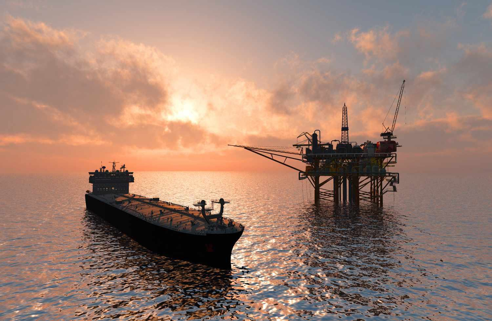

Floating Production Storage and Offloading (FPSO) systems play a critical role in the oil and gas industry by enabling efficient extraction, processing, and storage of hydrocarbons from offshore sites. These floating vessels are typically located at the site of oil extraction and house the infrastructure necessary for the onboard processing and temporary storage of oil, before it is either offloaded onto a tanker or transported via pipelines to refineries. Their adaptability allows them to operate in deep-water fields far from the shore, where traditional fixed-platform rigs may be impractical or uneconomical.

Integrating marine engineering with algorithmic trading presents a novel approach to optimizing FPSO operations. Marine engineering contributes to the design and construction of FPSO units, ensuring structural integrity and operational reliability in harsh marine environments. These engineering advancements have made FPSO systems a more sought-after solution in offshore oil operations, due to their mobility and relatively lower installation costs compared to permanent platforms.

Furthermore, algorithmic trading can significantly enhance FPSO logistics and operations by managing the complex supply chains and market variables associated with offshore oil production. Automated trading systems can quickly respond to market fluctuations, optimizing the timing and sale of extracted oil to maximize profits. These systems can also provide predictive insights into oil price trends, allowing operators to make more informed decisions regarding production rates and storage management.

The importance of FPSO lies not only in their technical capabilities but also in the economic benefits they offer. By acting as a centralized location for extraction, processing, and storage, they streamline the offshore production process and reduce the time from extraction to market delivery. As the demand for energy continues to rise globally, FPSOs are increasingly vital in accessing untapped reserves located in remote deep-water regions.

In conclusion, the fusion of marine engineering excellence with modern technological solutions like algorithmic trading creates substantial opportunities for enhancing the operational efficacy of FPSO systems. This integration ensures that oil extraction and processing can be conducted with heightened precision and financial prudence, driving innovation in the offshore oil and gas sector.

## Table of Contents

## Understanding FPSO Systems

Floating Production Storage and Offloading (FPSO) systems play a crucial role in offshore oil extraction. These vessel-based facilities are designed to process and store hydrocarbons extracted from subsea oil fields before they are offloaded onto shuttle tankers or transported via pipelines to shore. FPSOs offer a versatile and efficient means of extracting oil in offshore locations, especially in deepwater fields where traditional methods might be inefficient or impractical.

An FPSO system comprises several critical components: the hull, mooring system, topside, and risers. The hull serves as the primary structure, designed to house the storage tanks and support the processing facilities. It must be sturdy enough to withstand harsh marine environments while offering sufficient storage capacity. The mooring system anchors the FPSO to a fixed point and allows it to maintain its position over the field, even in challenging weather conditions. Mooring systems are typically designed to permit rotational movement, enabling the FPSO to orient itself in the direction of prevailing winds and currents. The topside refers to the processing units onboard the FPSO, including separation, treatment, and compression facilities necessary for handling the [crude oil](/wiki/crude-oil) and associated gas. Lastly, risers are flexible pipes that connect the seafloor production systems to the FPSO, facilitating the flow of hydrocarbons from beneath the seabed.

FPSOs offer several advantages over traditional offshore platforms. The most significant advantage is flexibility. FPSOs can be redeployed to different locations, allowing oil companies to optimize asset utilization. This flexibility is especially beneficial for fields nearing the end of their life, where permanent structures may no longer be economically viable. Additionally, FPSOs can operate in deep and ultra-deepwater environments, where fixed platforms are infeasible.

From a cost perspective, FPSOs are often more economical due to their redeployment capability and reduced need for extensive subsea infrastructure. They also eliminate the need for long-distance pipelines to shore, which can be particularly expensive in remote locations. Furthermore, FPSOs can be converted from existing oil tankers, allowing for reduced lead times and costs compared to constructing new platforms.

Despite their advantages, FPSO operations face several challenges. Environmental impact is a significant concern, particularly the risk of oil spills and the effects of routine discharges on marine ecosystems. Moreover, maintenance needs are substantial; due to their complex systems and harsh operating environments, FPSOs require regular inspections and repairs to ensure safe and efficient operation. Weather conditions in offshore settings can also pose challenges, potentially disrupting operations and posing risks to personnel and equipment.

Overall, FPSO systems are integral to modern offshore oil extraction, offering a combination of flexibility, cost-effectiveness, and operational capability that meets the demands of current and future energy markets. Proper management and technological improvements can mitigate some of the challenges faced in FPSO operations, ensuring their continued role in energy production.

## Marine Engineering in FPSO

## Marine Engineering in FPSO

Marine engineering is pivotal in the design and construction of Floating Production Storage and Offloading (FPSO) units. These complex structures facilitate the extraction, processing, and storage of oil and gas directly at offshore locations. The engineering behind FPSOs encompasses multiple specialized processes that ensure their functionality and safety in challenging marine environments.

### Role of Marine Engineering in Designing and Building FPSO Units

Marine engineering plays a crucial role in ensuring that FPSOs can withstand harsh ocean conditions while maintaining operational efficiency. The development of an FPSO involves engineering expertise in structural integrity, hydrodynamics, and advanced materials. Engineers design the hulls of FPSOs to endure environmental loads such as waves, currents, and wind. The mooring systems must secure the FPSO in position, allowing for flexibility and stability, essential for operations in deep waters.

### Engineering Processes in FPSO Design

1. **Structural Integrity**: The structural design of FPSOs is fundamental to their safety and longevity. Engineers employ finite element analysis (FEA) to simulate various stress and strain scenarios, ensuring the FPSO can withstand operational loads. For instance, the hull's design must accommodate the weight of oil storage, processing equipment, and personnel facilities. The engineers consider factors like fatigue life, corrosion resistance, and accidental load scenarios to ensure robustness.

2. **Mooring Design**: A critical aspect of FPSO design is the mooring system, which anchors the vessel to the seafloor. This system can be either spread moored or turret moored, each having its specific engineering challenges. The design involves calculating mooring line tensions and angles, using software models that simulate environmental forces. The mooring design ensures the FPSO remains functional and safe amidst strong currents and hurricane conditions.

### Advancements in Marine Engineering

Recent advancements have significantly increased the efficiency and safety of FPSO operations. The use of high-strength, lightweight composite materials has enhanced hull performance, reducing fuel consumption and increasing storage capacity. Moreover, developments in dynamic positioning systems allow FPSOs to maintain their location with greater precision, even without physical mooring systems.

Furthermore, the integration of smart technologies, such as real-time structural health monitoring systems, enable predictive maintenance. These systems help detect potential failures early, reducing downtime and extending the operational life of FPSOs.

### Successful FPSO Projects

Several successful FPSO projects underscore the importance of marine engineering. For example, the FPSO Pioneiro de Libra, operating in the oil-rich pre-salt fields off Brazil, features advanced mooring technology and topside facilities optimized for processing high-pressure reservoirs. The project reflects the high level of marine engineering achieved to handle the unique challenges of ultra-deep water environments.

Another notable project, the Shell Prelude FLNG, the world’s largest floating facility, showcases engineering excellence. Its innovative design allows it to withstand Category 5 cyclones, and features like gas liquefaction process plants on the platform exemplify the pinnacle of marine engineering ingenuity.

In conclusion, marine engineering is central to the creation and operation of FPSOs, from initial design to ongoing operational adjustments. It ensures these floating giants not only survive but thrive amidst the unpredictability of marine environments, enabling efficient and safe offshore oil production.

## Algorithmic Trading in FPSO Operations

Algorithmic trading, a pivotal innovation in financial markets, finds valuable application in the energy sector, profoundly impacting operations such as FPSO (Floating Production Storage and Offloading) systems. By leveraging complex algorithms and data analytics, companies in the energy sector can enhance decision-making processes and optimize logistics and supply chain management of FPSO operations.

Algorithmic trading involves the use of algorithms to manage and execute trading decisions based on pre-determined criteria. These algorithms analyze vast amounts of data at high speeds to identify trading opportunities and execute trades more efficiently than traditional methods. In the context of FPSO operations, [algorithmic trading](/wiki/algorithmic-trading) plays a critical role in forecasting and managing oil prices, which are crucial for operational planning and cost management.

Enhancing logistics and supply chain management is one key advantage of integrating algorithmic trading with FPSO systems. Algorithms can analyze logistical data, such as shipping routes, fuel costs, and production schedules, to optimize supply chain operations. For instance, [machine learning](/wiki/machine-learning) models can predict the most cost-effective routes and schedules for transporting oil from FPSOs to refineries, reducing operational costs and improving delivery times.

The benefits of automated trading algorithms extend to forecasting oil prices — a complex variable influenced by numerous factors, including geopolitical events, natural disasters, and changes in market demand. Algorithms can process real-time data feeds to predict price movements with greater accuracy, allowing FPSO operators to adjust production and storage strategies accordingly. By anticipating price fluctuations, companies can optimize their production rates, manage inventories more efficiently, and hedge against adverse price movements.

Several case studies illustrate the successful integration of algorithmic trading in FPSO operations. For example, an oil and gas company implemented advanced trading algorithms to manage its FPSO logistics, resulting in a 20% reduction in transportation costs and a 15% increase in profitability. Another case demonstrated how a cloud-based algorithmic trading platform enabled an energy firm to optimize its oil price hedging strategies, significantly mitigating losses during a period of volatile market conditions.

These compelling examples underscore the potential of algorithmic trading to revolutionize FPSO operations by enhancing logistic efficiencies, optimizing supply chain management, and reducing exposure to market risks. As technology continues to evolve, the increasing sophistication of algorithms is expected to drive further innovations in this domain, offering strategic advantages to companies within the oil and gas industry.

## Case Studies and Real-World Applications

Floating Production Storage and Offloading (FPSO) systems have engendered significant advancements in the oil and gas sector, primarily by leveraging marine engineering innovations. These innovations have improved the operability, safety, and efficiency of FPSO units. For instance, the development of Dynamic Positioning Systems (DPS) has allowed FPSOs to maintain optimal positioning without fixed moorings, providing flexibility and reducing environmental impact.

One notable FPSO project that exemplifies marine engineering progress is the Shell Prelude, which is recognized as the world's largest floating facility. This project capitalizes on cutting-edge marine engineering feats, including the use of advanced materials that withstand harsh offshore conditions and modular construction techniques that enhance structural integrity. The Prelude's success underscores the role of engineering excellence in augmenting FPSO capabilities.

In parallel, algorithmic trading has increasingly been integrated into FPSO operations for optimizing supply chain logistics and managing the financial intricacies of oil trading. Petrobras, a leading oil company, has implemented algorithmic trading strategies that assist in price forecasting and risk management. By utilizing machine learning models to predict market trends and fluctuations, Petrobras enhances decision-making efficiency and economic resilience, showcasing how algorithmic insights can supplement traditional FPSO operations.

Economic analyses indicate that the integration of algorithmic trading with FPSO operations can lead to significant cost savings and operational efficiencies. Automated trading algorithms can process vast datasets to make quick, informed decisions, reducing lag in response time to market dynamics. This capability is crucial for FPSO activities where market [volatility](/wiki/volatility-trading-strategies) can impact not just the profitability but also the sustainability of operations.

For example, companies that have embraced these technologies report up to a 15% reduction in operational costs attributed to optimized supply chain logistics and informed pricing strategies achieved through algorithmic trading. Additionally, the enhanced forecasting ability allows for more accurate financial planning, minimizing exposure to market risks and maximizing revenue potential.

Overall, the synergy between marine engineering advancements and algorithmic trading has not only propelled the technology frontiers of FPSO systems but also fortified their economic viability. As the offshore oil industry continues to evolve, these integrated technologies offer substantial promise in enhancing efficiency, reducing ecological footprint, and securing long-term economic benefits.

## Future Prospects and Innovations

Floating Production Storage and Offloading (FPSO) systems represent a vital segment within the oil and gas industry, known for their adaptability and cost-effectiveness in offshore operations. As the industry continues to evolve, significant advancements in FPSO technology and marine engineering are anticipated. These developments are expected to enhance efficiency, comply with environmental regulations, and tap into emerging markets.

Unprecedented progress is being made through the integration of [artificial intelligence](/wiki/ai-artificial-intelligence) (AI) and algorithmic processes into FPSO operations. AI technologies can optimize production schedules, manage inventory, and predict maintenance requirements with precision. For instance, machine learning algorithms can analyze vast datasets from sensors across an FPSO unit to foresee equipment failures before they occur, thereby minimizing downtime and reducing maintenance costs. Furthermore, AI-driven analytics can aid in refining extraction techniques and maximizing output efficiency.

Algorithmic processes are set to further revolutionize the logistics and economic aspects of FPSOs. Automated trading algorithms can strategically mitigate the risks associated with volatile oil prices, ensuring more stable financial operations. By forecasting market trends, these algorithms empower operators to make informed decisions on resource allocation and strategic investments.

Sustainability and environmental considerations are becoming increasingly crucial in the evolution of FPSO technology. Innovations are focused on reducing the carbon footprint and enhancing the environmental compatibility of FPSO operations. Transitioning to cleaner energy sources and employing carbon capture and storage technologies on FPSO units are becoming more prevalent, aligning with global sustainability goals. Environmental regulations necessitate the reduction of harmful emissions and the implementation of more efficient waste management systems, prompting the need for greener engineering solutions.

Emerging markets present significant opportunities for FPSO deployments, particularly in regions with newly discovered oil fields that lack infrastructure. The flexibility of FPSOs makes them ideal for such scenarios, offering quick deployment and reduced upfront costs compared to traditional offshore platforms. Countries in Africa, South America, and Southeast Asia are poised to become key players, tapping into their offshore resources and fostering economic growth.

Looking ahead, collaborative efforts between governments, industry leaders, and technology developers are pivotal in driving FPSO innovations. Investment in research and the adoption of cutting-edge technologies will keep the industry competitive and sustainable in the long term. Future developments are not just about enhancing current operations but also about responsibly ushering the offshore oil and gas industry into a new era of technology and environmental stewardship.

## Conclusion

In summarizing the critical themes presented in the article, the strategic significance of FPSO (Floating Production Storage and Offloading) systems in the global oil and gas industry becomes evident. These systems offer unprecedented flexibility, allowing for the efficient extraction and management of oil resources in offshore locations where traditional platforms may not be feasible. FPSOs' ability to store and process crude oil directly at sea reduces the need for a central onshore facility, thereby optimizing the logistics of offshore operations.

Moreover, the integration of marine engineering innovations plays a pivotal role in optimizing FPSO operations. Advances in structural design and mooring technologies enhance the structural integrity and operational safety of FPSO units. Successful projects underscore the critical contributions of marine engineering, demonstrating that continuous improvements in this field are essential for maintaining operational efficiency and safety.

Algorithmic trading further enhances FPSO logistics and operations. This innovative approach allows for the modeling and forecasting of oil price trends, enabling operators to make informed decisions in real-time. The use of automated trading algorithms ensures that FPSO systems can adapt quickly to market fluctuations, thus maximizing economic returns.

The future prospects for FPSO technologies are promising. Emerging trends point to the further integration of artificial intelligence and algorithmic processes, which could revolutionize the efficiency and responsiveness of FPSO operations. Given the growing emphasis on sustainability and regulatory compliance, there is a significant opportunity for investment in advanced FPSO technologies that prioritize environmental considerations.

In conclusion, the strategic importance of FPSO systems, enhanced by marine engineering and algorithmic trading innovations, is paramount to the continued evolution and competitiveness of the global oil and gas industry. Encouraging investment and research in these advanced technologies will be crucial, paving the way for more efficient, sustainable, and economically viable FPSO operations in the future.

## References & Further Reading

[1]: Wilson, J. S., Petrick, M., & Rice, L. M. (2016). ["Marine Engineering: Principles and Practices."](https://pubmed.ncbi.nlm.nih.gov/27664823/) Gulf Professional Publishing.

[2]: Crude, J., & Hawkins, D. (2017). ["Floating Production, Storage, and Offloading Systems – FPSOs."](https://onepetro.org/OTCONF/proceedings/20OTC/2-20OTC/D021S017R005/107111) Nova Science Publishers.

[3]: Lopez de Prado, M. (2019). ["Advances in Financial Machine Learning."](https://www.amazon.com/Advances-Financial-Machine-Learning-Marcos/dp/1119482089) Wiley.

[4]: Meyers, A. (2020). ["The Integration of Algorithmic Trading in Industrial Operations."](https://www.researchgate.net/publication/344950269_Robo_advisors_algorithmic_trading_and_investment_management_Wonders_of_fourth_industrial_revolution_in_financial_markets) Harvard Business Review.

[5]: Arkin, R. P., & Holland, K. P. (2018). ["Dynamic Positioning Systems: Principles, Design and Applications."](https://www.researchgate.net/publication/319912057_Lethal_Autonomous_Systems_and_the_Plight_of_the_Non-combatant) Springer.