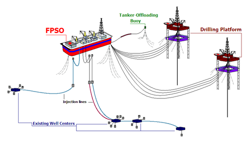

## Table of Contents

## What is Floating Production Storage and Offloading (FPSO)?

Floating Production Storage and Offloading (FPSO) is a type of floating vessel used in the offshore oil and gas industry. It is designed to receive, process, store, and offload oil and gas from nearby wells. FPSOs are particularly useful in remote or deep-water locations where it is not practical to build a fixed platform or pipeline to transport the oil and gas to shore.

An FPSO works by connecting to subsea wells through flexible risers and flowlines. The oil and gas are then brought up to the FPSO, where they are processed to remove water, sand, and other impurities. The processed oil is stored in tanks within the FPSO until it can be offloaded onto shuttle tankers or exported through pipelines. The gas can be either reinjected into the reservoir, used as fuel on the FPSO, or exported. FPSOs are a cost-effective solution for oil and gas production in challenging environments.

## How does an FPSO differ from traditional offshore oil platforms?

An FPSO, or Floating Production Storage and Offloading unit, is different from traditional offshore oil platforms in several ways. Traditional platforms are usually fixed structures that sit on the seabed. They are used in shallower waters where it's easier to build a strong base. These platforms have all the equipment needed to drill for oil and gas, and they often connect to pipelines that carry the oil and gas to the shore. On the other hand, an FPSO is a floating vessel that can be moved from one location to another. It's used in deeper waters or remote areas where building a fixed platform is too hard or too expensive.

Another key difference is how they handle the oil and gas once it's extracted. Traditional platforms usually send the oil and gas directly through pipelines to onshore facilities for processing and storage. This means they need to be close enough to the shore to make these pipelines practical. In contrast, an FPSO can process the oil and gas right on the vessel. It has storage tanks to hold the oil until it can be offloaded onto shuttle tankers, which then take it to shore. This makes FPSOs very useful in places where pipelines aren't an option.

## What are the main components of an FPSO system?

An FPSO system has several main parts that work together to get oil and gas from the ocean floor to the shore. The first part is the hull, which is the main body of the FPSO. It's like a big ship that floats on the water and has big tanks inside to store the oil. The hull is strong and can handle rough seas. The second part is the topside facilities, which are all the equipment on the top of the hull. This includes things like separators to clean the oil, compressors to handle the gas, and pumps to move the oil around.

Another important part of an FPSO is the mooring system, which keeps the FPSO in one place even when the water is moving. It's like a big anchor that holds the FPSO steady. The FPSO also has risers and flowlines, which are like long pipes that connect the FPSO to the wells on the ocean floor. These pipes bring the oil and gas up to the FPSO. Finally, there are offloading systems, which are used to move the oil from the FPSO's storage tanks onto shuttle tankers that take it to shore. All these parts work together to make sure the FPSO can do its job well.

## What are the typical operational processes on an FPSO?

On an FPSO, the main job starts when oil and gas come up from the ocean floor through pipes called risers and flowlines. These pipes bring the oil and gas to the FPSO. Once on board, the oil and gas go through separators, which are big machines that help clean the oil by taking out water and other stuff that shouldn't be there. The oil then goes into big tanks inside the FPSO where it waits to be moved to another ship.

The next step is dealing with the gas. Some of the gas can be used to power the FPSO, like a big engine. Other times, the gas might be put back into the ocean floor or sent to shore through more pipes. When the oil in the tanks is full, it's time to offload it. This means moving the oil from the FPSO's tanks onto a shuttle tanker, which is a special ship that takes the oil to land. All these steps keep the FPSO working smoothly to get oil and gas from the ocean to where people need it.

## What are the advantages of using FPSOs in offshore oil and gas production?

Using FPSOs in offshore oil and gas production has many benefits. One big advantage is that FPSOs can be used in deep water or far away places where it's hard to build a fixed platform. They can float on the water and be moved to different spots if needed. This makes them very useful for oil and gas fields that are in tough spots. Also, FPSOs have their own storage tanks for oil, so they don't need pipelines to the shore right away. This saves a lot of money and time because building pipelines can be very expensive and take a long time.

Another advantage is that FPSOs can handle the whole process of getting oil and gas from the ocean floor, cleaning it, storing it, and sending it to shore all in one place. This means they can work in places where it's not easy to set up other kinds of platforms or pipelines. FPSOs are also good because they can be used for a while and then moved to another oil field when the first one runs out. This makes them a flexible choice for oil companies that want to keep exploring new places without building new platforms each time.

## What are the environmental considerations and challenges associated with FPSOs?

Using FPSOs can have some effects on the environment. One big concern is the chance of oil spills. Because FPSOs store a lot of oil, if something goes wrong, like a leak or a big storm, oil could spill into the ocean. This would be bad for sea animals, fish, and the whole ocean environment. Another worry is the gas that comes up with the oil. If this gas isn't handled right, it can be burned off, which adds to air pollution and climate change. So, it's important for people running FPSOs to have good plans to stop spills and handle gas safely.

There are also challenges with how FPSOs affect the local area. They can make noise and light that bother sea animals and fish. This can change how they live and move around. Plus, setting up and taking down an FPSO can disturb the ocean floor and the life there. It's a big job to make sure everything is done without harming the environment too much. Companies need to think about these things and work hard to keep the ocean safe while they use FPSOs to get oil and gas.

## How is safety managed on an FPSO?

Safety on an FPSO is very important because it's a big floating platform with lots of oil and gas. To keep everyone safe, there are strict rules and checks that happen all the time. People who work on the FPSO have to follow safety training and know what to do if something goes wrong. They practice emergency drills, like what to do if there's a fire or a spill. The FPSO also has safety equipment, like fire extinguishers, lifeboats, and alarms that go off if there's a problem.

Another way safety is managed is by keeping the FPSO in good shape. Regular checks and maintenance make sure everything is working right and there are no leaks or other dangers. The people in charge use special systems to watch over the FPSO and make sure it's safe. They also have plans ready for emergencies, so everyone knows what to do to keep safe. By following these rules and being ready, the FPSO can work safely even in the tough conditions of the ocean.

## What are the key factors in the design and construction of an FPSO?

When designing and building an FPSO, one of the most important things to think about is how it will handle the tough conditions of the ocean. The FPSO needs to be strong enough to float safely in deep water and handle big waves and storms. This means the hull, which is the main body of the FPSO, has to be made from strong materials and designed to keep the FPSO stable. The mooring system, which keeps the FPSO in one place, also needs to be very strong and reliable. Engineers have to think about all these things to make sure the FPSO can work safely and effectively.

Another key [factor](/wiki/factor-investing) is how the FPSO will process and store the oil and gas. The topside facilities, which are all the equipment on top of the hull, need to be designed to clean the oil and handle the gas properly. This includes separators to take out water and other stuff from the oil, storage tanks to hold the oil, and systems to deal with the gas, like compressors and reinjection systems. The design also has to make sure it's easy to offload the oil onto shuttle tankers. All these parts need to work together smoothly, so the FPSO can do its job well and safely.

## How does the conversion of existing tankers into FPSOs work?

Converting an old tanker into an FPSO starts with [picking](/wiki/asset-class-picking) a good ship. The ship needs to be strong and big enough to hold all the equipment and oil. Once they choose the right tanker, workers take out some of the old parts inside the ship, like old storage tanks or engines, to make room for new stuff. They then add new tanks to store oil, and put in separators to clean the oil. They also add all the pipes and machines needed to process the oil and gas that comes up from the ocean floor.

After the inside is ready, the next step is to make sure the tanker can stay safely in one spot in the ocean. They add a mooring system, which is like a big anchor, to keep the FPSO steady even when the water is moving. They also add risers and flowlines, which are long pipes that connect the FPSO to the wells on the ocean floor. Once all these changes are done, the old tanker is now an FPSO, ready to work in the oil and gas industry.

## What are the economic implications of deploying an FPSO in a new oil field?

Using an FPSO in a new oil field can save a lot of money. Building a fixed platform in deep water or far away places is very expensive and takes a long time. An FPSO can be moved to the new oil field without needing to build a whole new platform. This means oil companies can start getting oil and gas faster and spend less money on setting things up. Also, FPSOs don't need pipelines to the shore right away because they can store oil on board. This saves even more money because pipelines are costly to build.

However, there are also some costs to think about. Converting an old tanker into an FPSO or building a new one can be expensive. There are also ongoing costs for keeping the FPSO running safely and efficiently, like maintenance and safety checks. If there's an oil spill or other problem, it can cost a lot of money to fix and clean up. But overall, for many oil fields, especially in tough spots, using an FPSO can be a good way to make money because it's often cheaper than other options.

## What are the latest technological advancements in FPSO design and operations?

New technology has made FPSOs even better at their job. One big change is using digital systems to watch over the FPSO all the time. These systems use sensors and computers to check everything is working right. This helps find problems early and fix them before they get worse. Another cool thing is using robots to do some of the work. Robots can go underwater to check the pipes and fix things, which makes it safer for people and can save time and money.

There are also new ways to make FPSOs more friendly to the environment. One way is by using better systems to handle the gas that comes up with the oil. Instead of burning it off, which can pollute the air, the gas can be turned into energy to power the FPSO. This helps cut down on waste and pollution. Also, new designs make FPSOs stronger and more able to handle rough seas, which means they can work in more places and last longer.

## How do regulatory frameworks impact the deployment and operation of FPSOs globally?

Regulatory frameworks have a big impact on how FPSOs are used around the world. Different countries have their own rules about safety, the environment, and how to build and run FPSOs. These rules can make it harder or easier to use an FPSO in a new place. For example, some countries might have strict rules about stopping oil spills and keeping the ocean safe. This means oil companies have to spend more money on safety systems and checks to make sure everything is okay. If the rules are too hard to follow, it might stop companies from using FPSOs in those areas.

On the other hand, some countries have rules that help make it easier to use FPSOs. They might offer special permits or lower costs for companies that want to set up an FPSO. This can make it more attractive for oil companies to use FPSOs in those places. But no matter where they are, all FPSOs have to follow international rules, like those from the International Maritime Organization (IMO). These rules help make sure FPSOs are safe and good for the environment, no matter where they are working.

## References & Further Reading

[1]: Wilson, J. S., Petrick, M., & Rice, L. M. (2016). ["Marine Engineering: Principles and Practices."](https://pubmed.ncbi.nlm.nih.gov/27664823/) Gulf Professional Publishing.

[2]: Crude, J., & Hawkins, D. (2017). ["Floating Production, Storage, and Offloading Systems – FPSOs."](https://onepetro.org/OTCONF/proceedings/20OTC/2-20OTC/D021S017R005/107111) Nova Science Publishers.

[3]: Lopez de Prado, M. (2019). ["Advances in Financial Machine Learning."](https://www.amazon.com/Advances-Financial-Machine-Learning-Marcos/dp/1119482089) Wiley.

[4]: Meyers, A. (2020). ["The Integration of Algorithmic Trading in Industrial Operations."](https://www.researchgate.net/publication/344950269_Robo_advisors_algorithmic_trading_and_investment_management_Wonders_of_fourth_industrial_revolution_in_financial_markets) Harvard Business Review.

[5]: Arkin, R. P., & Holland, K. P. (2018). ["Dynamic Positioning Systems: Principles, Design and Applications."](https://www.researchgate.net/publication/319912057_Lethal_Autonomous_Systems_and_the_Plight_of_the_Non-combatant) Springer.