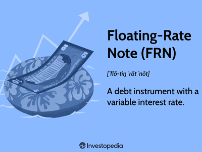

Floating rate funds, also known as floating rate investment funds, have become increasingly popular among investors navigating today's fluctuating financial markets. Their primary appeal is the provision of variable interest payouts, which position these funds as a strategic hedge against the uncertainty of rising interest rates. As global economies face the potential for tightening monetary policies to curb inflation, investors are naturally drawn to financial instruments that offer adaptive and potentially more lucrative returns.

Floating rate funds achieve this adaptability by investing predominantly in financial instruments with interest rates that float or vary, typically in alignment with established benchmarks, such as the London Interbank Offered Rate (LIBOR) or the Federal Funds Rate. This characteristic distinguishes them distinctively from fixed-rate investments, which remain static regardless of market rate changes. Consequently, floating rate funds can benefit during periods of escalating interest rates, as their yields tend to increase in tandem with market conditions.



The rapid evolution of technology in financial markets has introduced innovative strategies for managing these investments. Algorithmic trading, in particular, plays a crucial role in optimizing the performance of floating rate funds. Leveraging advanced algorithms, traders can efficiently adjust portfolios in response to volatile interest rates and changing economic indicators, thereby maximizing returns while mitigating associated risks.

This article examines the complexities of floating rate funds—focusing on how they operate, the influence of algorithmic trading, and their comparison with traditional fixed-rate instruments. Understanding these dynamics is essential for investors aiming to make strategic, informed decisions that align with their financial goals and market forecasts.

## Table of Contents

## Understanding Floating Rate Funds

Floating rate funds primarily invest in financial instruments that offer variable or floating interest rates. These instruments include corporate loans, bonds, and other debt securities with interest rates typically tied to benchmark rates such as the London Interbank Offered Rate (LIBOR) or the Federal Funds Rate. The floating rate nature means that the interest payments on these securities adjust periodically, often every one to three months, to align with changes in the benchmark rates. 

A key advantage of floating rate funds is their lower sensitivity to interest rate changes compared to fixed-rate bonds. The prices of fixed-rate bonds tend to decrease when interest rates rise, as newer bonds are issued at higher rates, making older bonds with lower rates less attractive. However, floating rate securities adjust their interest payments in response to rising rates, thus preserving their relative value and potentially offering higher yields during such periods. This characteristic makes floating rate funds particularly appealing in environments where interest rates are expected to increase.

Despite their benefits, floating rate funds are not without risks. Credit risk, the risk that a borrower will default on its obligations, is a primary concern. This is particularly relevant because many floating rate instruments, such as leveraged loans, are issued by companies with lower credit ratings. Default risk, or the risk that borrowers will be unable to repay the principal or interest, can impact the fund's performance and investors' returns. Additionally, while floating rate funds mitigate [interest rate](/wiki/interest-rate-trading-strategies) risk, they might expose investors to [liquidity](/wiki/liquidity-risk-premium) risk, as some underlying securities may not be easily tradable in secondary markets. Therefore, potential investors must weigh these risks against the potential rewards, considering their risk tolerance and investment goals.

## How Floating Rate Funds Work

Floating rate funds offer a dynamic approach to income generation by adjusting their interest income in response to changes in market rates. This adaptability makes them a compelling option for investors seeking to capitalize on rising interest rates. The fundamental mechanism behind these funds lies in their investments in financial instruments that feature variable interest rates. Typically, these funds hold a diversified portfolio that may include corporate bonds, loans, and other debt securities, all of which have interest rates tied to market benchmarks such as the London Interbank Offered Rate (LIBOR) or the Federal Funds Rate.

When interest rates increase, the interest payouts from these floating rate instruments also rise, providing investors with the potential for higher income. This characteristic contrasts with fixed-rate bonds, which maintain a constant payout regardless of the prevailing interest rate environment. The inherent flexibility of floating rate funds thus positions them as an attractive investment during periods of tightening monetary policy when interest rates are expected to climb.

The portfolio composition of a floating rate fund is both strategic and diversified, often integrating various corporate bonds and loans. These instruments vary in credit quality and maturities to balance risk and return. By investing in loans, particularly those with short durations, fund managers are able to swiftly reposition their strategies to align with shifting interest rate trends and to manage credit exposure effectively.

Credit quality is an essential consideration within these funds. Instruments within the portfolio are often rated by credit rating agencies, and their ratings can influence both the risk and return profile of the fund. Higher-rated instruments typically offer lower yields but present reduced credit risk, while lower-rated instruments can provide higher yields at the cost of increased risk of default. 

Therefore, an understanding of the interplay between interest rate changes and floating rate fund performance is vital for investors. Fund managers and investors alike must evaluate economic forecasts, interest rate predictions, and the credit landscape to optimize portfolio returns in varying market conditions.

## Algorithmic Trading and Floating Rate Funds

Algorithmic trading is increasingly pivotal in the management of floating rate funds, primarily due to its ability to adapt rapidly to market dynamics. These sophisticated computer programs utilize algorithms to efficiently process vast amounts of financial data, identifying and executing trades that align with evolving interest rate environments. This agile adaptability is crucial for optimizing the performance of floating rate funds, allowing for prompt adjustments in response to fluctuations in interest rates, market conditions, and economic indicators.

At the core of [algorithmic trading](/wiki/algorithmic-trading) is its capacity to quickly analyze inputs such as the Federal Funds Rate or the London Interbank Offered Rate (LIBOR), which directly influence the interest payouts of floating rate funds. As interest rates increase, algorithms can dynamically reconfigure investment strategies to enhance yield optimization, thereby providing a flexible investment approach.

Incorporating [machine learning](/wiki/machine-learning) and predictive modeling significantly enhances the effectiveness of these trading strategies. Machine learning algorithms can sift through historical data to identify patterns and predict future market movements. By utilizing techniques such as regression analysis or neural networks, these algorithms can forecast interest rate trends and assess the potential impact on floating rate funds. For example, a simple linear regression model could be used to predict the future interest rate `r` based on historical rates:

$$
r_{future} = \beta_0 + \beta_1 \times r_{past} + \epsilon
$$

where $\beta_0$ is the intercept, $\beta_1$ is the slope of the line (estimated through fitting the model to historical data), and $\epsilon$ is the error term.

Predictive modeling assists in fine-tuning investment strategies by simulating various interest rate scenarios, allowing traders to mitigate risks associated with unexpected rate hikes or downturns. This strategic foresight enables the creation of resilient portfolios that capitalize on interest rate movements without succumbing to undue risk exposure.

The integration of algorithmic trading in floating rate funds not only facilitates real-time decision-making but also offers substantial improvements in the risk-return profile of these investments. By leveraging advanced computational power and data analytics, investors can manage their portfolios with enhanced precision and confidence, ultimately striving for maximized returns in fluctuating interest rate scenarios.

## Comparing Floating Rate Funds with Fixed Rate Instruments

Floating rate funds and fixed-rate instruments serve distinct purposes in an investor's portfolio and present unique benefits and risks depending on the economic climate and individual financial objectives.

Floating rate funds are characterized by their variable interest payouts, which adjust according to prevailing market interest rates. This adaptability makes them particularly appealing in environments where interest rates are on the rise, as the income generated from these funds increases in tandem with the rate hikes. Investors seeking to hedge against the eroding effects of inflation or aiming for potentially higher returns during such periods may find floating rate funds advantageous.

Conversely, fixed-rate instruments offer a degree of certainty and predictability that floating rate funds lack. With bonds or securities that have a fixed coupon rate, investors can anticipate consistent returns over the life of the investment. This feature is particularly beneficial when interest rates are stable or declining, as fixed-rate instruments secure higher yields than what might be available in the current market. Moreover, the fixed nature of these investments can act as a safeguard against rising rates, as long-term bonds issued with higher yields during low-rate periods can maintain their attractiveness.

The decision to invest in floating rate funds or fixed-rate instruments hinges on a variety of factors. Investors with a higher tolerance for risk and a belief that interest rates will continue to rise might prefer floating rate funds for their potential to deliver increased yields. Meanwhile, those prioritizing stability and predictability, or expecting rates to decline, might favor fixed-rate instruments to secure consistent income.

An illustrative comparison can be drawn using basic financial principles:

- Floating Rate Funds: $\text{Interest Payment} = \text{Principal} \times (\text{Benchmark Rate} + \text{Spread})$

- Fixed-Rate Instruments: $\text{Interest Payment} = \text{Principal} \times \text{Coupon Rate}$

The selection between these two types of instruments should align with the investor's broader financial strategy and market outlook. Diversification, assessments of risk tolerance, and projections of interest rate trends will all play pivotal roles in shaping investment decisions.

## The Role of Interest Rates in Floating Rate Fund Performance

Interest rate fluctuations are fundamental in determining the performance of floating rate funds. These funds primarily invest in instruments with interest rates tied to benchmark rates, such as the London Interbank Offered Rate (LIBOR) or the Federal Funds Rate. As these benchmark rates change, so do the interest payouts from the floating rate instruments, directly influencing the fund's returns.

When interest rates increase, the yields on floating rate bonds or loans tend to rise, providing higher returns to investors. This characteristic makes floating rate funds particularly appealing in upward-trending interest rate environments, as these funds can offer protection against inflation and interest rate risk. Conversely, if interest rates decline, the income-generating potential of these funds might decrease, posing a challenge to fund managers seeking to maintain optimal performance.

Effective evaluation of the economic environment is crucial for fund managers aiming to maximize yield performance. By closely monitoring indicators such as inflation rates, economic growth projections, and central bank policies, managers can forecast interest rate trends. This foresight allows managers to strategically adjust the composition and duration of the fund's portfolio, ensuring it aligns with anticipated rate adjustments. For instance, during periods of expected interest rate hikes, increasing the fund's exposure to shorter-duration instruments might mitigate interest rate risk.

Incorporating advanced analytical tools and financial models can further enhance fund performance. By utilizing quantitative models, managers can simulate various interest rate scenarios and their potential impacts on portfolio returns. Here is a simple Python example illustrating how to calculate the potential yield change in a floating rate bond based on interest rate adjustments:

```python
def calculate_yield_change(initial_yield, interest_rate_change):
    """
    Calculate the new yield for a floating rate bond based on interest rate changes.

    Parameters:
    initial_yield (float): The initial yield of the bond.
    interest_rate_change (float): The change in interest rates.

    Returns:
    float: The new yield after interest rate adjustment.
    """
    new_yield = initial_yield + interest_rate_change
    return new_yield

# Example usage
initial_yield = 2.5  # Initial yield of 2.5%
interest_rate_change = 0.75  # Interest rate change of 0.75%
new_yield = calculate_yield_change(initial_yield, interest_rate_change)
print(f"The new yield after interest rate change is: {new_yield}%")
```

In conclusion, understanding and reacting to interest rate movements is essential for optimizing floating rate fund performance. By strategically managing portfolio allocations in response to economic forecasts and leveraging quantitative tools, fund managers can enhance their ability to navigate variable interest rate environments effectively.

## Examples of Popular Floating Rate Funds

The iShares Floating Rate Bond [ETF](/wiki/etf-trading-strategies) is a prominent choice among floating rate funds. This fund primarily invests in U.S. dollar-denominated, investment-grade floating rate bonds and notes. The primary advantage of this ETF is its ability to provide a hedge against rising interest rates due to its focus on bonds with variable interest rates. The performance of the iShares Floating Rate Bond ETF is closely tied to the fluctuations in interest rates, offering attractive returns in a rising rate environment while maintaining lower sensitivity to interest rate changes compared to fixed-rate bonds.

On the other hand, the iShares Short-Term Corporate Bond ETF diversifies its investments across a portfolio of short-duration corporate bonds. Although primarily focusing on fixed-income securities, this ETF includes floating rate bonds within its investments, providing a balanced approach between stability and the potential for yield enhancement in a changing interest rate landscape. The short-term nature of the underlying assets makes this fund appealing to investors who seek lower duration risk and enhanced liquidity.

Both ETFs offer a glimpse into the potential of floating rate investments, catering to different investor preferences. The iShares Floating Rate Bond ETF is suitable for those prioritizing protection against interest rate hikes, while the iShares Short-Term Corporate Bond ETF caters to investors combining short-duration fixed-income stability with floating rate elements. These options demonstrate the adaptability and breadth of floating rate funds in meeting diverse investment goals.

## Advantages and Disadvantages of Floating Rate Investments

Floating rate investments, such as floating rate funds, offer distinct advantages that can appeal to certain segments of investors, particularly those anticipating or experiencing a rising interest rate environment. One of the primary benefits of these funds is their potential for higher yields compared to fixed-rate instruments when interest rates are on the rise. This is because the interest income from floating rate securities is typically tied to benchmark rates like LIBOR or the Federal Funds Rate, which adjust periodically. As these benchmark rates increase, so do the interest payments from the floating rate securities, thereby potentially offering investors higher returns.

Another advantage is the reduced interest rate risk compared to fixed-rate bonds. Fixed-rate bonds generally experience price declines in rising interest rate scenarios, as the fixed interest payments become comparatively less attractive. Floating rate instruments, however, are less sensitive to such changes because their payments adjust with prevailing rates, often maintaining or even increasing their value relative to fixed-rate securities in rising rate environments.

Despite these benefits, floating rate investments are not without drawbacks. A significant risk associated with these investments is credit risk. Floating rate funds often include loans or bonds from corporations, which can be subject to downgrades or defaults, especially during economic downturns. This credit risk can lead to potential losses for investors if the issuing entity is unable to meet its financial obligations.

Additionally, floating rate funds might not perform as well in declining interest rate environments compared to fixed-rate investments. When interest rates fall, the variable interest payments on floating rate securities also decrease. In contrast, fixed-rate instruments continue to provide the same level of income, which may become more attractive relative to declining rates. Hence, the advantage of higher returns in rising rates reverses when interest rates drop, potentially resulting in lower yields for investors in floating rate funds.

In summary, while floating rate investments offer flexibility and the potential for higher yields in an increasing rate environment, they also expose investors to credit risk and may underperform in periods of declining rates. Investors need to carefully consider their risk tolerance, market outlook, and financial goals when deciding to include these instruments in their portfolios.

## Conclusion

Floating rate funds represent a versatile investment tool for those aiming to capitalize on changing interest rate environments. Unlike fixed-rate instruments, these funds adjust their payouts based on prevailing market rates, offering a dynamic income solution for investors. This adaptability allows floating rate funds to potentially deliver higher yields when interest rates rise, aligning well with the goals of investors concerned about inflation and interest rate risks. 

The integration of algorithmic trading further augments the appeal of floating rate funds, providing a mechanism for effectively navigating and responding to market fluctuations. Algorithms, powered by advanced data analytics and machine learning, enable the rapid adjustment of fund portfolios, enhancing the precision of investment strategies. This technology-driven approach allows fund managers to make data-backed decisions, optimizing returns while managing the inherent risks associated with credit defaults and market [volatility](/wiki/volatility-trading-strategies).

Algorithmic models can [factor](/wiki/factor-investing) in a multitude of variables, from global economic indicators to credit spreads, helping investors anticipate market movements. For instance, the use of predictive modeling can identify trends that may signal future rate hikes, enabling proactive adjustments to investment portfolios. By balancing flexibility with an informed risk management strategy, algorithmic trading helps unlock the full potential of floating rate funds, aligning their performance closely with the economic landscape.

In conclusion, floating rate funds offer a compelling alternative for investors desiring exposure to interest-sensitive financial markets. While these funds [carry](/wiki/carry-trading) inherent risks, the strategic use of algorithmic trading provides a sophisticated toolkit for maximizing returns and managing vulnerabilities. Through careful consideration and strategic execution, investors can harness the power of floating rate funds to achieve financial objectives in an ever-shifting economic backdrop.

## References & Further Reading

[1]: ["Advances in Financial Machine Learning"](https://www.amazon.com/Advances-Financial-Machine-Learning-Marcos/dp/1119482089) by Marcos Lopez de Prado

[2]: ["Machine Learning for Algorithmic Trading"](https://github.com/stefan-jansen/machine-learning-for-trading) by Stefan Jansen

[3]: ["Quantitative Trading: How to Build Your Own Algorithmic Trading Business"](https://www.amazon.com/Quantitative-Trading-Build-Algorithmic-Business/dp/1119800064) by Ernest P. Chan

[4]: ["Floating Rate Notes and Credit Markets: Dynamic Strategies for Managing Interest Rate Risk"](https://fastercapital.com/content/Floating-Rate-Notes--A-Dynamic-Approach-to-Fixed-Interest-Securities.html) by Frank J. Fabozzi

[5]: ["Handbook of Fixed-Income Securities"](https://www.amazon.com/Handbook-Fixed-Income-Securities-Ninth/dp/1260473899) by Frank J. Fabozzi