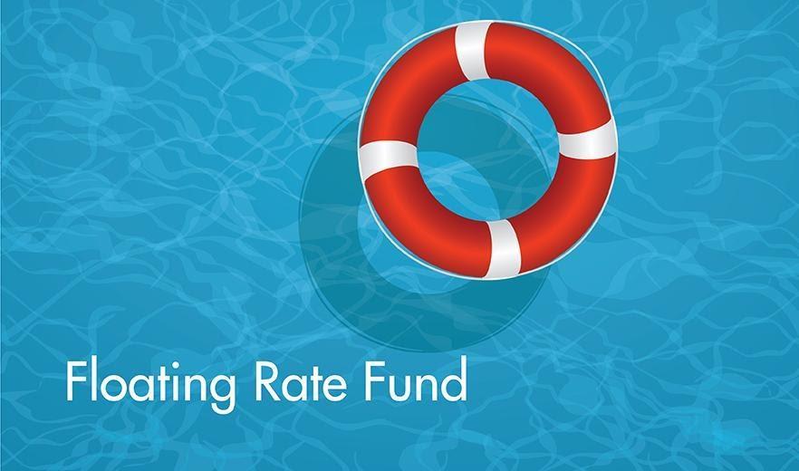

## Table of Contents

## What is a Floating Rate Fund?

A Floating Rate Fund is a type of investment fund that mainly invests in loans or bonds that have interest rates which change over time. These interest rates usually go up and down based on a reference rate, like the LIBOR or the federal funds rate. This means that if the reference rate goes up, the interest payments from the loans or bonds in the fund will also go up, and if the reference rate goes down, the interest payments will go down too.

These funds are often seen as a good choice for investors who want to protect their investments from rising interest rates. Because the interest rates of the loans and bonds in the fund can change, the value of the fund might not drop as much as it would with fixed-rate bonds when interest rates go up. However, floating rate funds can still have risks, like the risk that the borrowers might not be able to pay back their loans, which is known as credit risk.

## How does a Floating Rate Fund work?

A Floating Rate Fund is like a big basket where money is collected from many people to invest in special kinds of loans or bonds. These loans or bonds have interest rates that can change over time. The interest rates are usually tied to a benchmark rate, like the LIBOR or the federal funds rate. When this benchmark rate goes up, the interest payments from the loans or bonds in the fund also go up. If the benchmark rate goes down, the interest payments go down too.

This type of fund can be a good choice for people who want to protect their money from rising interest rates. When interest rates go up, the value of regular bonds might drop, but the value of a Floating Rate Fund might not drop as much because its interest payments can adjust. However, there are still risks involved. For example, there's a chance that the people or companies who borrowed the money might not be able to pay it back, which is called credit risk. So, while Floating Rate Funds can help with some risks, they come with their own set of challenges.

## What are the benefits of investing in a Floating Rate Fund?

One big benefit of putting your money into a Floating Rate Fund is that it can help protect you from rising interest rates. When interest rates go up, the value of regular bonds can go down. But with a Floating Rate Fund, the interest payments can change to match the new rates, so the value of the fund might not drop as much. This can be really helpful if you think interest rates are going to go up soon.

Another benefit is that these funds can give you a steady stream of income. Because the interest rates on the loans and bonds in the fund can change, you might get more money when rates go up. This can be good if you're looking for an investment that can grow with the market. But remember, there are risks too, like the chance that the borrowers might not be able to pay back their loans. So, while Floating Rate Funds can offer some protection and income, they're not without their challenges.

## What are the risks associated with Floating Rate Funds?

One risk of investing in a Floating Rate Fund is credit risk. This means that the people or companies who borrowed the money might not be able to pay it back. If a lot of borrowers can't pay, the value of the fund could go down, and you could lose money. These funds often invest in loans that are considered riskier, so the chance of borrowers not paying back is higher than with other types of investments.

Another risk is interest rate risk, but it's a bit different from what you might expect. While Floating Rate Funds can help protect against rising interest rates, they might not do as well when interest rates are falling. If rates go down, the interest payments from the loans and bonds in the fund will also go down, which means less income for you. So, even though these funds can help with rising rates, they can be less helpful when rates are dropping.

Lastly, there's also liquidity risk to consider. Sometimes, it can be hard to sell the loans or bonds in the fund quickly without losing money. If a lot of people want to take their money out of the fund at the same time, the fund might have to sell these loans or bonds at a lower price, which could hurt the value of the fund. So, while Floating Rate Funds can offer some benefits, they come with their own set of risks that you should think about before investing.

## How do Floating Rate Funds differ from Fixed Rate Funds?

Floating Rate Funds and Fixed Rate Funds are two different types of investment funds, and the main difference between them is how their interest rates work. A Floating Rate Fund invests in loans or bonds where the interest rates can change over time. These rates usually go up or down based on a benchmark rate, like the LIBOR or the federal funds rate. So, if the benchmark rate goes up, the interest payments from the loans or bonds in the fund will also go up, and if it goes down, the interest payments will go down too. This can help protect your investment if interest rates are rising because the value of the fund might not drop as much as it would with fixed-rate bonds.

On the other hand, a Fixed Rate Fund invests in bonds where the interest rates stay the same for the whole time you own them. This means that no matter what happens with the benchmark rates, the interest payments from these bonds will always be the same. Fixed Rate Funds can be good if you want a steady income and don't mind if interest rates go up because the value of these funds can drop when rates rise. So, the choice between a Floating Rate Fund and a Fixed Rate Fund depends on what you think will happen with interest rates and how much risk you're willing to take.

## Who should consider investing in a Floating Rate Fund?

People who think interest rates are going to go up soon should think about putting their money into a Floating Rate Fund. These funds can help protect your money when rates rise because the interest payments from the loans and bonds in the fund can change to match the new rates. This means the value of the fund might not drop as much as it would with regular bonds. If you're worried about losing money because of rising rates, a Floating Rate Fund could be a good choice for you.

Also, if you want an investment that can give you a steady stream of income that might grow with the market, a Floating Rate Fund could work well. When interest rates go up, you might get more money from the interest payments. But remember, these funds come with risks too, like the chance that the people or companies who borrowed the money might not be able to pay it back. So, if you're okay with taking on some risk for the chance to protect against rising rates and get growing income, a Floating Rate Fund might be right for you.

## How are the interest rates determined in a Floating Rate Fund?

In a Floating Rate Fund, the interest rates are determined by a benchmark rate, like the LIBOR or the federal funds rate. This means that the interest payments from the loans or bonds in the fund change when the benchmark rate changes. If the benchmark rate goes up, the interest payments will go up too. If the benchmark rate goes down, the interest payments will go down as well. This link to the benchmark rate helps the fund adjust to changes in the market.

The specific way the interest rate changes in a Floating Rate Fund is usually set by adding a fixed percentage, called a spread, to the benchmark rate. For example, if the benchmark rate is 2% and the spread is 1%, the total interest rate for the loan or bond would be 3%. This spread stays the same, but the benchmark rate can change, so the total interest rate can go up or down over time. This setup helps the fund give you income that can grow when interest rates rise.

## What is the typical performance of Floating Rate Funds during different economic cycles?

Floating Rate Funds can do well when the economy is growing and interest rates are going up. During these times, the benchmark rates, like the LIBOR or the federal funds rate, usually go up too. Since the interest payments from the loans and bonds in a Floating Rate Fund change with these benchmark rates, the fund can give you more income when rates rise. This can help protect your money because the value of the fund might not drop as much as it would with regular bonds when interest rates go up. So, in a growing economy with rising rates, Floating Rate Funds can be a good choice.

However, Floating Rate Funds might not do as well when the economy is slowing down and interest rates are falling. When rates go down, the interest payments from the loans and bonds in the fund will also go down, which means less income for you. Also, if the economy is not doing well, there's a bigger chance that the people or companies who borrowed the money might not be able to pay it back. This is called credit risk, and it can hurt the value of the fund. So, in a slowing economy with falling rates, Floating Rate Funds can be riskier and might not perform as well as other types of investments.

## How do Floating Rate Funds manage credit risk?

Floating Rate Funds try to manage credit risk by being careful about who they lend money to. They often do a lot of research to make sure the people or companies borrowing money can pay it back. Sometimes, they might also spread out their loans to different borrowers so that if one borrower can't pay, it won't hurt the whole fund too much. This is called diversification, and it's like not putting all your eggs in one basket.

Even with these efforts, there's still a chance that some borrowers might not be able to pay back their loans. To help with this, Floating Rate Funds might also use something called credit enhancements. These are ways to make the loans safer, like getting insurance on the loans or making sure the borrowers have something valuable they can give up if they can't pay. By using these methods, Floating Rate Funds try to keep credit risk under control and protect your money.

## What role do Floating Rate Funds play in a diversified investment portfolio?

Floating Rate Funds can be a helpful part of a diversified investment portfolio. They can help balance out other investments that might lose value when interest rates go up. Because the interest payments from the loans and bonds in a Floating Rate Fund can change with the market, they can give you more income when rates rise. This means they can protect your money from losing value in a way that other types of investments might not. So, having some money in a Floating Rate Fund can make your overall portfolio safer if you think interest rates might go up soon.

Adding a Floating Rate Fund to your portfolio also helps spread out your risks. Since these funds often invest in different types of loans and bonds, they can help balance out other investments that might be more affected by things like the economy slowing down or companies not being able to pay back their debts. By mixing in a Floating Rate Fund with other types of investments, you can have a portfolio that is better prepared for different situations and can give you a steady stream of income that might grow over time.

## How can one evaluate the performance of a Floating Rate Fund?

To evaluate the performance of a Floating Rate Fund, you should look at how well it has done over time compared to other similar funds. One way to do this is by checking the fund's total return, which tells you how much money you would have made if you had invested in the fund. You can also see how the fund has done during different times, like when interest rates were going up or down. This can give you a good idea of how the fund might do in the future if similar things happen.

Another thing to look at is the fund's yield, which shows you how much income you can expect to get from the fund. Since Floating Rate Funds change their interest payments based on benchmark rates, the yield can go up or down. You should compare the yield of the fund to the yields of other Floating Rate Funds to see if it's doing well. Also, think about the fees you have to pay to invest in the fund. Lower fees can mean more money in your pocket, so a fund with good performance and low fees might be a good choice.

## What are the tax implications of investing in Floating Rate Funds?

When you invest in a Floating Rate Fund, you need to think about how it might affect your taxes. The interest income you get from the fund is usually taxed as regular income. This means you'll pay taxes on it at the same rate you pay on your salary or other income. If the fund also makes money by selling loans or bonds at a higher price than it bought them, you might have to pay capital gains tax on those profits. The tax rate for capital gains can be different depending on how long the fund held the investment before selling it.

Some Floating Rate Funds might also invest in municipal bonds, which can have different tax rules. If the fund earns interest from these bonds, that interest might not be taxed at the federal level, and sometimes not at the state level either. But, this depends on where you live and the specific rules of the bonds the fund invests in. So, before you invest, it's a good idea to talk to a tax advisor to understand how a Floating Rate Fund might affect your taxes and make sure you're ready for any tax bills that might come your way.

## What is the relationship between Algorithmic Trading and Floating Rate Funds?

Algorithmic trading is increasingly pivotal in the management of floating rate funds, primarily due to its ability to adapt rapidly to market dynamics. These sophisticated computer programs utilize algorithms to efficiently process vast amounts of financial data, identifying and executing trades that align with evolving interest rate environments. This agile adaptability is crucial for optimizing the performance of floating rate funds, allowing for prompt adjustments in response to fluctuations in interest rates, market conditions, and economic indicators.

At the core of [algorithmic trading](/wiki/algorithmic-trading) is its capacity to quickly analyze inputs such as the Federal Funds Rate or the London Interbank Offered Rate (LIBOR), which directly influence the interest payouts of floating rate funds. As interest rates increase, algorithms can dynamically reconfigure investment strategies to enhance yield optimization, thereby providing a flexible investment approach.

Incorporating [machine learning](/wiki/machine-learning) and predictive modeling significantly enhances the effectiveness of these trading strategies. Machine learning algorithms can sift through historical data to identify patterns and predict future market movements. By utilizing techniques such as regression analysis or neural networks, these algorithms can forecast interest rate trends and assess the potential impact on floating rate funds. For example, a simple linear regression model could be used to predict the future interest rate `r` based on historical rates:

$$
r_{future} = \beta_0 + \beta_1 \times r_{past} + \epsilon
$$

where $\beta_0$ is the intercept, $\beta_1$ is the slope of the line (estimated through fitting the model to historical data), and $\epsilon$ is the error term.

Predictive modeling assists in fine-tuning investment strategies by simulating various interest rate scenarios, allowing traders to mitigate risks associated with unexpected rate hikes or downturns. This strategic foresight enables the creation of resilient portfolios that capitalize on interest rate movements without succumbing to undue risk exposure.

The integration of algorithmic trading in floating rate funds not only facilitates real-time decision-making but also offers substantial improvements in the risk-return profile of these investments. By leveraging advanced computational power and data analytics, investors can manage their portfolios with enhanced precision and confidence, ultimately striving for maximized returns in fluctuating interest rate scenarios.

## References & Further Reading

[1]: ["Advances in Financial Machine Learning"](https://www.amazon.com/Advances-Financial-Machine-Learning-Marcos/dp/1119482089) by Marcos Lopez de Prado

[2]: ["Machine Learning for Algorithmic Trading"](https://github.com/stefan-jansen/machine-learning-for-trading) by Stefan Jansen

[3]: ["Quantitative Trading: How to Build Your Own Algorithmic Trading Business"](https://www.amazon.com/Quantitative-Trading-Build-Algorithmic-Business/dp/1119800064) by Ernest P. Chan

[4]: ["Floating Rate Notes and Credit Markets: Dynamic Strategies for Managing Interest Rate Risk"](https://fastercapital.com/content/Floating-Rate-Notes--A-Dynamic-Approach-to-Fixed-Interest-Securities.html) by Frank J. Fabozzi

[5]: ["Handbook of Fixed-Income Securities"](https://www.amazon.com/Handbook-Fixed-Income-Securities-Ninth/dp/1260473899) by Frank J. Fabozzi