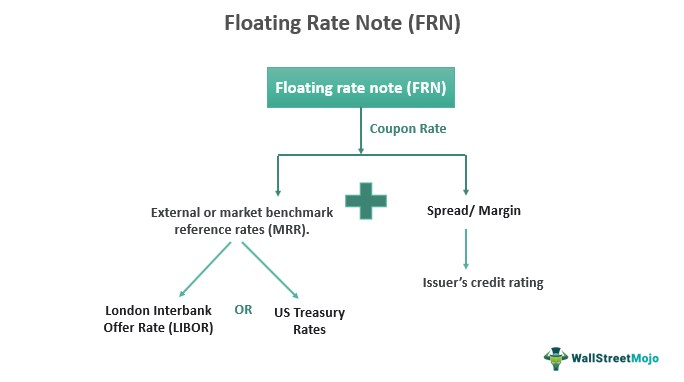

## Table of Contents

## What are floating-rate mutual funds?

Floating-rate mutual funds are a type of investment where the interest rate changes over time. These funds invest in loans and bonds that have interest rates that go up and down based on a benchmark rate, like the LIBOR or the prime rate. This means that if the benchmark rate goes up, the interest payments from the loans and bonds in the fund also go up, and if the benchmark rate goes down, the interest payments go down too.

These funds can be a good choice for people who want to protect their investments from rising interest rates. When interest rates go up, the value of fixed-rate bonds usually goes down. But with floating-rate funds, the interest payments adjust, which can help keep the value of the fund more stable. However, these funds can still have risks, like credit risk if the borrowers can't pay back their loans, so it's important to understand these risks before investing.

## How do floating-rate mutual funds work?

Floating-rate mutual funds work by investing in loans and bonds that have interest rates that change over time. These rates are usually tied to a benchmark like the LIBOR or the prime rate. When the benchmark rate goes up, the interest payments from the loans and bonds in the fund also go up. If the benchmark rate goes down, the interest payments go down too. This means the income from the fund can change, but it also helps protect the fund's value when interest rates rise.

These funds can be a good choice for people who want to avoid losing money if interest rates go up. When interest rates rise, the value of fixed-rate bonds usually falls. But with floating-rate funds, the interest payments adjust to the new rates, which can help keep the fund's value more stable. However, there are still risks involved. For example, if the borrowers can't pay back their loans, the fund could lose money. So, it's important to understand these risks before deciding to invest in floating-rate mutual funds.

## What are the main benefits of investing in floating-rate mutual funds?

One big benefit of investing in floating-rate mutual funds is that they can help protect your money when interest rates go up. When interest rates rise, the value of fixed-rate bonds usually goes down. But with floating-rate funds, the interest payments change to match the new rates. This can help keep the value of your investment more stable. It's like having a safety net for your money if interest rates start to climb.

Another benefit is that floating-rate mutual funds can give you a regular income that changes with interest rates. If the benchmark rate, like the LIBOR or the prime rate, goes up, the interest payments you get from the fund will also go up. This can be good if you want your income to keep up with changing rates. But remember, there are risks too. If the people or companies borrowing the money can't pay it back, the fund could lose money. So, it's important to think about these risks before you invest.

## What are the primary risks associated with floating-rate mutual funds?

One big risk with floating-rate mutual funds is credit risk. This means that the people or companies who borrowed the money might not be able to pay it back. If they can't pay, the fund could lose money. This is more likely to happen if the fund invests in loans or bonds from borrowers who are seen as riskier. So, it's important to check how safe the borrowers are before you invest.

Another risk is that floating-rate funds can be affected by changes in the economy. If the economy gets worse, more borrowers might struggle to pay back their loans. This can make the value of the fund go down. Also, even though these funds are meant to protect against rising interest rates, they can still lose value if the benchmark rate doesn't change as expected or if there are big changes in the market.

Lastly, floating-rate mutual funds might not be as liquid as other types of investments. This means it can be harder to sell your investment quickly if you need to. If lots of people want to sell their shares at the same time, it could be tough for the fund to meet everyone's requests. So, you need to think about how easy it will be to get your money out if you need it.

## How do floating-rate mutual funds compare to fixed-rate mutual funds?

Floating-rate mutual funds and fixed-rate mutual funds are different in how they handle interest rates. Floating-rate funds invest in loans and bonds where the interest rate changes based on a benchmark like the LIBOR or the prime rate. This means if the benchmark rate goes up, the interest payments from the fund also go up, and if it goes down, the payments go down too. On the other hand, fixed-rate mutual funds invest in bonds where the interest rate stays the same for the whole time you own them. So, if you buy a fixed-rate bond that pays 5%, it will keep paying 5% no matter what happens to interest rates.

The main advantage of floating-rate funds is that they can protect your money when interest rates go up. When rates rise, the value of fixed-rate bonds usually goes down because new bonds will pay more. But with floating-rate funds, the interest payments adjust to the new rates, which can help keep the value of your investment more stable. However, floating-rate funds can be riskier because they often invest in loans from riskier borrowers, which means there's a higher chance the borrowers might not pay back the money. Fixed-rate funds, on the other hand, might be safer but they won't adjust to rising rates, so you could lose money if you need to sell them when rates are high.

## Who should consider investing in floating-rate mutual funds?

People who are worried about interest rates going up might want to think about investing in floating-rate mutual funds. These funds can help protect your money when rates rise. If you have money in fixed-rate bonds and rates go up, those bonds could lose value. But with floating-rate funds, the interest payments change to match the new rates, which can help keep your investment safe. So, if you think interest rates will go up, these funds could be a good choice for you.

Also, if you want your investment income to change with interest rates, floating-rate mutual funds could be right for you. When the benchmark rate, like the LIBOR or the prime rate, goes up, the interest payments you get from the fund will also go up. This can be good if you want your income to keep up with changing rates. But remember, there are risks too. If the people or companies borrowing the money can't pay it back, the fund could lose money. So, it's important to think about these risks before you decide to invest.

## How are the interest rates of floating-rate mutual funds determined?

The interest rates of floating-rate mutual funds are set based on a benchmark rate, like the LIBOR or the prime rate. These benchmarks change over time, and when they do, the interest rates on the loans and bonds in the fund change too. For example, if the LIBOR goes up by 1%, the interest rate on a loan in the fund might also go up by 1%. This means the interest payments from the fund can go up or down, depending on what happens to the benchmark rate.

Floating-rate mutual funds are made up of many different loans and bonds, and each one might have its own way of figuring out the interest rate. But they all follow the same basic idea: the interest rate changes based on a benchmark. This helps protect the value of the fund when interest rates go up, because the payments from the loans and bonds adjust to the new rates. So, if you invest in these funds, your income can change, but it might also be safer if rates start to rise.

## What role do floating-rate mutual funds play in a diversified investment portfolio?

Floating-rate mutual funds can be a helpful part of a diversified investment portfolio. They can help protect your money when interest rates go up. When rates rise, the value of fixed-rate bonds usually goes down. But with floating-rate funds, the interest payments change to match the new rates. This can help keep your investment safe. So, if you think interest rates will go up, adding these funds to your portfolio can be a smart move.

These funds can also help balance out other investments that might lose value if rates rise. For example, if you have a lot of fixed-rate bonds, adding some floating-rate funds can make your portfolio more stable. But remember, there are risks too. If the people or companies borrowing the money can't pay it back, the fund could lose money. So, it's important to think about these risks and how floating-rate funds fit with your other investments before you decide to add them to your portfolio.

## How have floating-rate mutual funds performed historically during different economic cycles?

Floating-rate mutual funds have done well during times when interest rates were going up. This is because the interest payments from the loans and bonds in these funds go up when rates rise. For example, during the early 2000s, when the Federal Reserve was raising rates to fight inflation, floating-rate funds often did better than fixed-rate bonds. They helped investors keep their money safe and even make more money as rates went up. But, these funds can also be riskier because they often invest in loans from riskier borrowers, which means there's a higher chance the borrowers might not pay back the money.

During times when the economy was doing badly, like during the 2008 financial crisis, floating-rate mutual funds faced more challenges. The value of these funds can go down if a lot of borrowers can't pay back their loans. In tough economic times, more people and companies might struggle to pay, which can hurt the fund's performance. But even in these tough times, floating-rate funds can still be better than fixed-rate bonds because their interest payments can adjust to lower rates, which helps keep their value more stable compared to fixed-rate bonds.

Overall, floating-rate mutual funds can be a good choice for people who want to protect their money when interest rates go up. But they can also be riskier and might not do as well during bad economic times. So, it's important to think about these risks and how these funds have performed in the past before you decide to invest in them.

## What are the tax implications of investing in floating-rate mutual funds?

When you invest in floating-rate mutual funds, you need to think about taxes. The money you make from these funds can be taxed in different ways. If the fund pays you interest, that money is usually taxed as regular income. This means you'll pay the same tax rate on it as you do on your salary or wages. If the fund makes money by selling loans or bonds at a higher price than it bought them, that's called a capital gain. Short-term capital gains, from investments held for a year or less, are also taxed as regular income. But if you hold the investment for more than a year, it's a long-term capital gain, and that's usually taxed at a lower rate.

Another thing to think about is if the fund invests in municipal bonds. If it does, the interest from those bonds might not be taxed at all, depending on where you live. But this is less common with floating-rate funds because they usually invest in other types of loans and bonds. Also, if you sell your shares in the mutual fund for more than you paid, you'll have to pay capital gains tax on that profit. And if you sell for less than you paid, you might be able to use that loss to lower your taxes on other gains. So, it's a good idea to talk to a tax advisor to understand how these rules apply to you and your investments.

## How can investors mitigate the risks associated with floating-rate mutual funds?

Investors can lower the risks of floating-rate mutual funds by being careful about which funds they pick. It's a good idea to look at the credit quality of the loans and bonds in the fund. Funds that invest in loans from borrowers who are less likely to pay back the money can be riskier. So, choosing funds with better credit quality can help reduce the chance of losing money if borrowers can't pay. Also, it's smart to spread your money across different types of investments. This way, if one investment doesn't do well, others might help balance it out.

Another way to manage the risks is to keep an eye on the economy. Floating-rate funds can be affected by economic changes, so knowing what's happening can help you make better choices. If you think the economy might get worse, you might want to have less money in these funds. Also, think about how easy it is to get your money out of the fund. Some floating-rate funds can be harder to sell quickly, so make sure you're okay with that before you invest. Talking to a financial advisor can also help you understand these risks better and make a plan that fits your needs.

## What advanced strategies can be used to optimize returns from floating-rate mutual funds?

One way to get more from floating-rate mutual funds is to pay attention to interest rate changes. If you think rates will go up, putting more money into these funds can be a good idea. They can help protect your money and even make more as rates rise. You can also look at the fund's performance history and see how it did when rates went up before. This can help you pick funds that do well in those times. Another thing to think about is the credit quality of the loans and bonds in the fund. Choosing funds with better credit quality can lower the risk of losing money if borrowers can't pay, but it might also mean lower returns. So, you need to find a balance that fits your goals.

Another strategy is to use floating-rate funds as part of a bigger plan. You can mix them with other types of investments to spread out your risk. For example, you might have some money in stocks, some in fixed-rate bonds, and some in floating-rate funds. This way, if one type of investment doesn't do well, the others might help balance it out. Also, you can change how much money you have in floating-rate funds based on what's happening in the economy. If things are looking good, you might want to have more in these funds. But if you think the economy might get worse, you might want to have less. Talking to a financial advisor can help you come up with a plan that fits your needs and helps you make the most of your investments.

## References & Further Reading

[1]: ["Mutual Funds For Dummies"](https://www.dummies.com/article/business-careers-money/personal-finance/investing/investment-vehicles/funds/mutual-funds-for-dummies-cheat-sheet-209064/) by Eric Tyson

[2]: Fabozzi, F. J., & Mann, S. V. (2012). ["The Handbook of Fixed Income Securities, Eighth Edition"](https://www.amazon.com/Handbook-Fixed-Income-Securities-Eighth/dp/0071768467). McGraw-Hill Education.

[3]: ["Principles of Financial Engineering"](https://www.sciencedirect.com/book/9780123869685/principles-of-financial-engineering) by Salih N. Neftci

[4]: Johnson, B., & O’Neill, B. (2018). ["An Investor’s Guide to Floating-Rate Securities"](https://scholar.google.com/citations?user=LaXJcpkAAAAJ&hl=en)

[5]: Aldridge, I. (2013). ["High-Frequency Trading: A Practical Guide to Algorithmic Strategies and Trading Systems"](https://www.amazon.com/High-Frequency-Trading-Practical-Algorithmic-Strategies/dp/1118343506) by Irene Aldridge

[6]: Biais, B., Foucault, T., & Moinas, S. (2015). ["Equilibrium High-Frequency Trading"](https://www.sciencedirect.com/science/article/abs/pii/S0304405X15000288). The Review of Financial Studies, 28(5), 1234-1263.

[7]: ["Invest with the Fed: Maximizing Portfolio Performance by Following Federal Reserve Policy"](https://www.amazon.com/Invest-Fed-Maximizing-Portfolio-Performance/dp/0071834400) by Robert R. Johnson and Gerald R. Jensen