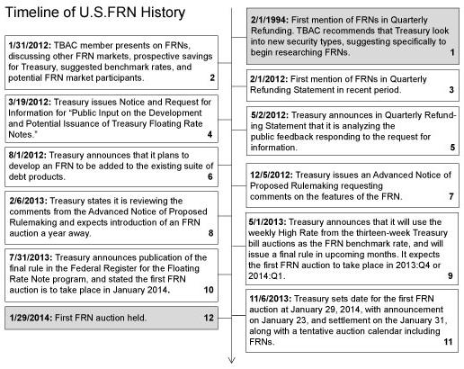

## Table of Contents

## What are Floating-Rate Notes (FRNs)?

Floating-Rate Notes (FRNs) are a type of bond where the interest rate changes over time. Unlike regular bonds that have a fixed interest rate, FRNs have rates that go up or down based on a benchmark, like the LIBOR or the federal funds rate. This means that if the benchmark rate goes up, the interest you earn on your FRN will also go up, and if the benchmark rate goes down, your interest will go down too.

People like FRNs because they help protect against rising interest rates. If rates go up, the value of regular bonds can go down, but FRNs adjust their rates, so they are less affected. This makes them a good choice for investors who want to keep their money safe from interest rate changes. However, the interest payments can be less predictable because they change with the benchmark rate.

## How do FRNs differ from fixed-rate bonds?

Floating-Rate Notes (FRNs) and fixed-rate bonds are both types of bonds, but they work differently. FRNs have interest rates that change over time. They are tied to a benchmark rate, like LIBOR or the federal funds rate. This means if the benchmark rate goes up, the interest you get from your FRN will also go up. If the benchmark rate goes down, your interest will go down too. This makes FRNs good for when interest rates might rise because they adjust to keep up.

On the other hand, fixed-rate bonds have an interest rate that stays the same for the whole time you own the bond. Once you buy a fixed-rate bond, you know exactly how much interest you will get until it matures. This can be good if you want a steady, predictable income. But if interest rates go up after you buy a fixed-rate bond, its value might go down because new bonds will offer higher rates. So, FRNs can be safer in a rising rate environment, while fixed-rate bonds give you a steady income.

## What is the reference rate for FRNs?

The reference rate for Floating-Rate Notes (FRNs) is usually a benchmark interest rate that changes over time. Common benchmarks include the London Interbank Offered Rate (LIBOR), the Secured Overnight Financing Rate (SOFR), and the federal funds rate. These benchmarks are used to set the interest rate on FRNs, which means the interest you earn can go up or down depending on what happens to the benchmark.

For example, if an FRN uses LIBOR as its reference rate and LIBOR goes up, the interest rate on your FRN will also go up. This helps protect your investment from rising interest rates because your FRN adjusts to keep up with changes in the market. If the reference rate goes down, your interest rate will go down too, so your earnings can be less predictable than with a fixed-rate bond.

## How is the interest rate on FRNs calculated?

The interest rate on Floating-Rate Notes (FRNs) is calculated using a reference rate plus a spread. The reference rate could be something like LIBOR, SOFR, or the federal funds rate. This rate changes over time, so the interest you earn on your FRN will go up or down depending on what happens to the reference rate. The spread is a fixed percentage that stays the same and is added to the reference rate to find the total interest rate for your FRN.

For example, if the reference rate is LIBOR and it's at 1%, and your FRN has a spread of 0.5%, then the interest rate on your FRN would be 1% (LIBOR) + 0.5% (spread) = 1.5%. If LIBOR goes up to 1.5%, your FRN's interest rate would then be 1.5% (LIBOR) + 0.5% (spread) = 2%. This way, your FRN adjusts to changes in the market, helping to protect your investment from rising interest rates.

## What are the advantages of investing in FRNs?

One big advantage of investing in Floating-Rate Notes (FRNs) is that they help protect your money from rising interest rates. When interest rates go up, the value of regular bonds can go down. But FRNs change their interest rate based on a benchmark like LIBOR or the federal funds rate. This means if rates go up, your FRN will pay you more interest, so you don't lose out. This makes FRNs a good choice if you think interest rates might go up in the future.

Another advantage is that FRNs can be less risky than some other types of bonds. Because their interest rate changes with the market, they don't lose value as much when rates go up. This can make them safer for people who want to keep their money safe but still earn some interest. Also, FRNs can be easier to sell because they adjust to the market, which means they might be more popular with other investors.

## What are the risks associated with FRNs?

One risk with Floating-Rate Notes (FRNs) is that their interest payments can be less predictable. Since the interest rate changes based on a benchmark like LIBOR or the federal funds rate, if these rates go down, the interest you get from your FRN will also go down. This means your income from FRNs can change a lot, which might not be good if you need a steady amount of money each month.

Another risk is that FRNs might not keep up with inflation. If the benchmark rate stays low or doesn't go up as fast as inflation, the interest you earn might not be enough to cover rising prices. This could mean your money loses value over time, even if you're getting some interest.

Also, FRNs can be affected by changes in the credit quality of the issuer. If the company or government that issued the FRN runs into financial trouble, the value of your FRN could go down, and there's a risk they might not be able to pay you back at all. So, it's important to check the creditworthiness of the issuer before you invest in their FRNs.

## How does the coupon reset mechanism work in FRNs?

The coupon reset mechanism in Floating-Rate Notes (FRNs) is how the interest rate gets updated. It happens at certain times, like every three or six months. When it's time for a reset, the interest rate on the FRN changes to match the current level of the benchmark rate, like LIBOR or the federal funds rate, plus a fixed spread. So, if the benchmark rate goes up, your FRN's interest rate will go up too, and if it goes down, your interest rate will go down.

This reset keeps the interest payments in line with what's happening in the market. It helps protect your investment from changes in interest rates because your FRN adjusts to keep up. But it also means your interest payments can be less predictable because they change every time the coupon resets. This is different from fixed-rate bonds, where the interest stays the same no matter what happens to market rates.

## Can you explain the role of the spread in FRNs?

The spread in Floating-Rate Notes (FRNs) is like a little extra interest that stays the same no matter what happens to the benchmark rate. It's added to the benchmark rate, like LIBOR or the federal funds rate, to figure out the total interest you get from your FRN. If the benchmark rate changes, the spread doesn't change, so it's a fixed part of your interest payment. This spread helps make sure you get at least a little more interest than just what the benchmark rate is.

The spread also shows how risky the FRN is. If the spread is bigger, it means the FRN might be riskier, and the issuer is willing to pay you more to take that risk. If the spread is smaller, the FRN is seen as less risky. So, the spread is important because it affects how much interest you earn and how safe your investment is. It's a key part of understanding and choosing FRNs.

## What are some common indices used as benchmarks for FRNs?

Some common indices used as benchmarks for Floating-Rate Notes (FRNs) are the London Interbank Offered Rate (LIBOR), the Secured Overnight Financing Rate (SOFR), and the federal funds rate. LIBOR was one of the most popular benchmarks for a long time, but it's being phased out because of some problems with how it was calculated. SOFR is becoming more popular as a replacement for LIBOR because it's based on real transactions in the market, which makes it more reliable.

The federal funds rate is another common benchmark. It's the rate at which banks lend money to each other overnight, and it's set by the Federal Reserve. This rate is important because it affects a lot of other interest rates in the economy. When you invest in an FRN that uses the federal funds rate as its benchmark, your interest payments will change based on what the Federal Reserve decides to do with this rate.

## How do FRNs perform in different interest rate environments?

Floating-Rate Notes (FRNs) are good when interest rates are going up. This is because their interest payments change based on a benchmark rate like LIBOR or the federal funds rate. So, if rates go up, the interest you get from your FRN will go up too. This helps protect your investment because it keeps up with the market. If you think interest rates might rise in the future, FRNs can be a smart choice because they adjust to give you more interest.

On the other hand, FRNs might not be as good when interest rates are going down. If the benchmark rate drops, the interest you earn on your FRN will also drop. This means your income from FRNs can be less predictable because it changes with the market. If you need a steady amount of money each month, FRNs might not be the best choice because their payments can go down when rates fall.

## What should investors consider when including FRNs in their portfolio?

When thinking about adding Floating-Rate Notes (FRNs) to your portfolio, it's important to consider your goals and how comfortable you are with risk. FRNs can be a good choice if you're worried about interest rates going up because they adjust to keep up with the market. This means you won't lose as much money if rates rise. But if you need a steady income, FRNs might not be the best fit because their interest payments can change a lot. Also, think about how long you plan to keep your investment. FRNs are usually better for short to medium-term goals because their interest rates change often.

Another thing to think about is the credit quality of the issuer. If the company or government that issued the FRN has money problems, your investment could lose value, or they might not be able to pay you back. So, it's a good idea to check how reliable the issuer is before you invest. Also, consider how FRNs fit with the rest of your investments. They can help balance out other bonds that don't adjust to interest rate changes, making your whole portfolio safer. But remember, FRNs might not keep up with inflation if the benchmark rate stays low, so think about how this fits with your overall financial plan.

## How can advanced investors use FRNs for hedging purposes?

Advanced investors can use Floating-Rate Notes (FRNs) to hedge against the risk of rising interest rates. When interest rates go up, the value of regular bonds can go down because new bonds will offer higher rates. But FRNs change their interest payments based on a benchmark rate like LIBOR or the federal funds rate. So, if rates go up, the interest you get from your FRN will also go up. This means you can use FRNs to balance out the risk in your portfolio, especially if you have a lot of fixed-rate bonds that might lose value when rates rise.

Another way advanced investors can use FRNs for hedging is by matching them with other investments that are sensitive to interest rate changes. For example, if you have loans or other investments that pay a floating rate, FRNs can help you manage the ups and downs of those payments. By including FRNs in your portfolio, you can make sure that some of your investments will do better when interest rates go up, which can help protect your overall investment strategy from big losses. This way, FRNs act like a safety net, helping to keep your money safe no matter what happens with interest rates.

## What are Floating-Rate Notes and How Do They Work?

Floating-rate notes (FRNs) are a type of debt instrument characterized by an interest rate that fluctuates with a specific benchmark rate. Unlike fixed-rate bonds, which have a constant interest rate throughout their lifetime, the interest payments for FRNs are periodically adjusted based on prevailing market interest rates. This feature makes FRNs particularly attractive during periods of rising interest rates, as they allow investors to benefit from increasing returns rather than being locked into lower rates associated with fixed-rate bonds.

### Structure of Floating-Rate Notes

The core structure of FRNs revolves around two key components: a reference rate and a spread. The reference rate is a commonly accepted interest rate benchmark such as the London Interbank Offered Rate (LIBOR), the Secured Overnight Financing Rate (SOFR), or the Federal Funds Rate. These benchmarks are used globally as a standard for determining the floating rate. The interest rate on an FRN is typically calculated as:

$$
\text{Interest Rate} = \text{Reference Rate} + \text{Spread}
$$

The spread is a fixed percentage added to the reference rate and represents the issuer's credit risk premium. It compensates the investors for the potential default risk associated with the issuer. The spread remains constant over the life of the note, whereas the reference rate is subject to change based on market conditions.

### Issuers of Floating-Rate Notes

FRNs are issued by a variety of organizations, including governments, financial institutions, and corporations. These issuers choose FRNs to manage their [interest rate](/wiki/interest-rate-trading-strategies) exposure and to appeal to investors who are looking for variable income streams. 

1. **Government Issuers**: Sovereign entities may issue FRNs to take advantage of lower borrowing costs in fluctuating interest rate environments. Governments use these instruments to finance their budgetary requirements while maintaining flexibility in debt servicing costs.

2. **Financial Institutions**: Banks and other financial entities often issue FRNs to manage their interest rate risk, align asset-liability durations, and raise capital. These institutions prefer FRNs for their ability to adjust with market shifts, thus helping to stabilize financial operations in volatile markets.

3. **Corporate Issuers**: Companies issue FRNs to fund their operations, capital investments, or refinance existing debt. Corporations may select FRNs as a financing tool to gain investor interest through potentially higher returns and to adapt their debt profiles as interest rates change.

In summary, the adaptability of interest rates in floating-rate notes positions them as a strategic instrument for both issuers and investors. They play an essential role in providing investors with interest rate risk protection and allow issuers to benefit from flexible financial solutions in changing economic conditions.

## References & Further Reading

[1]: Brigo, D., & Mercurio, F. (2007). ["Interest Rate Models - Theory and Practice: With Smile, Inflation, and Credit"](https://www.amazon.com/Interest-Rate-Models-Practice-Inflation/dp/3540221492). Springer Finance.

[2]: ["Advances in Financial Machine Learning"](https://www.amazon.com/Advances-Financial-Machine-Learning-Marcos/dp/1119482089) by Marcos Lopez de Prado.

[3]: ["Quantitative Trading: How to Build Your Own Algorithmic Trading Business"](https://www.amazon.com/Quantitative-Trading-Build-Algorithmic-Business/dp/1119800064) by Ernest P. Chan.

[4]: Scherer, M. (2012). ["Algorithmic Trading and Quantitative Strategies"](https://www.researchgate.net/publication/343613472_Algorithmic_Trading_and_Quantitative_Strategies). Springer.

[5]: ["Machine Learning for Algorithmic Trading - Second Edition"](https://www.amazon.com/Machine-Learning-Algorithmic-Trading-alternative/dp/1839217715) by Stefan Jansen.

[6]: Fabozzi, F. J., & Mann, S. V. (2005). ["Handbook of Fixed Income Securities"](https://www.mhebooklibrary.com/doi/book/10.1036/9781260473902?contentTab=true) (7th ed.). McGraw-Hill Education.