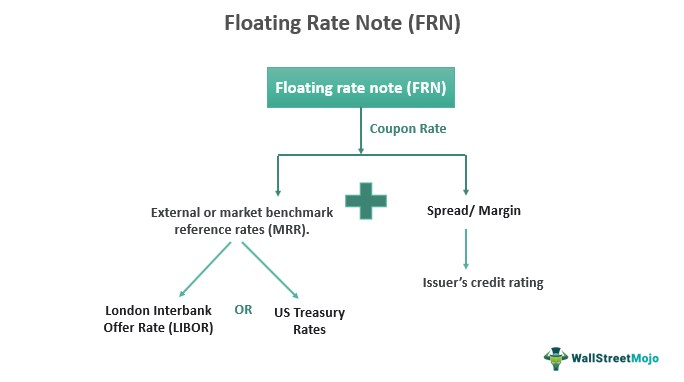

Floating-rate notes (FRNs) are distinct financial instruments characterized by their variable interest rates, which are typically linked to established benchmark rates such as the London Interbank Offered Rate (LIBOR), the Secured Overnight Financing Rate (SOFR), or the Federal Funds Rate. This linkage allows FRNs to automatically adjust their interest payments in response to shifting market conditions, making them particularly appealing during periods of rising interest rates. Unlike fixed-rate bonds, FRNs provide investors with the opportunity to capitalize on changing interest environments, offering a hedge against interest rate risks.

The integration of FRNs into algorithmic trading strategies has marked a significant evolution in the trading and analysis of these financial instruments. Algorithmic trading, which employs complex algorithms and vast datasets for rapid trade execution, has revolutionized the financial markets by increasing trading efficiency and accuracy. By incorporating machine learning and advanced data processing techniques, algorithmic trading systems can swiftly identify and exploit trading opportunities within the FRN market. This advancement not only enhances liquidity but also reduces transaction costs, providing investors with a competitive advantage.



In modern financial markets, the strategic utilization of FRNs in conjunction with algorithmic trading offers profound implications for both investors and financial institutions. As market dynamics continue to evolve, understanding and leveraging the synergistic potential of technology and variable-rate instruments like FRNs becomes crucial for optimizing investment returns and managing interest rate exposures. This article investigates into the complex nature of floating-rate notes, their pivotal role in financial markets, and the transformative effect of algorithmic trading on these instruments.

## Table of Contents

## Understanding Floating-Rate Notes

Floating-rate notes (FRNs) are a type of debt instrument characterized by an interest rate that fluctuates with a specific benchmark rate. Unlike fixed-rate bonds, which have a constant interest rate throughout their lifetime, the interest payments for FRNs are periodically adjusted based on prevailing market interest rates. This feature makes FRNs particularly attractive during periods of rising interest rates, as they allow investors to benefit from increasing returns rather than being locked into lower rates associated with fixed-rate bonds.

### Structure of Floating-Rate Notes

The core structure of FRNs revolves around two key components: a reference rate and a spread. The reference rate is a commonly accepted interest rate benchmark such as the London Interbank Offered Rate (LIBOR), the Secured Overnight Financing Rate (SOFR), or the Federal Funds Rate. These benchmarks are used globally as a standard for determining the floating rate. The interest rate on an FRN is typically calculated as:

$$
\text{Interest Rate} = \text{Reference Rate} + \text{Spread}
$$

The spread is a fixed percentage added to the reference rate and represents the issuer's credit risk premium. It compensates the investors for the potential default risk associated with the issuer. The spread remains constant over the life of the note, whereas the reference rate is subject to change based on market conditions.

### Issuers of Floating-Rate Notes

FRNs are issued by a variety of organizations, including governments, financial institutions, and corporations. These issuers choose FRNs to manage their [interest rate](/wiki/interest-rate-trading-strategies) exposure and to appeal to investors who are looking for variable income streams. 

1. **Government Issuers**: Sovereign entities may issue FRNs to take advantage of lower borrowing costs in fluctuating interest rate environments. Governments use these instruments to finance their budgetary requirements while maintaining flexibility in debt servicing costs.

2. **Financial Institutions**: Banks and other financial entities often issue FRNs to manage their interest rate risk, align asset-liability durations, and raise capital. These institutions prefer FRNs for their ability to adjust with market shifts, thus helping to stabilize financial operations in volatile markets.

3. **Corporate Issuers**: Companies issue FRNs to fund their operations, capital investments, or refinance existing debt. Corporations may select FRNs as a financing tool to gain investor interest through potentially higher returns and to adapt their debt profiles as interest rates change.

In summary, the adaptability of interest rates in floating-rate notes positions them as a strategic instrument for both issuers and investors. They play an essential role in providing investors with interest rate risk protection and allow issuers to benefit from flexible financial solutions in changing economic conditions.

## Benefits and Risks of Floating-Rate Notes

Floating-rate notes (FRNs) are financial instruments that adjust their interest payments based on benchmark rates, offering distinct advantages and challenges for investors. One of the primary benefits of FRNs is their ability to provide protection against interest rate risk. Unlike fixed-rate bonds, which can lose value as interest rates rise, FRNs periodically adjust their coupon payments, making them particularly attractive in a rising interest rate environment. This feature can lead to an increase in returns as the interest payments align more closely with prevailing market conditions.

However, the variable-rate structure of FRNs is not without its complexities. One significant risk is credit risk, which stems from the issuer's potential inability to meet financial obligations. Even if a FRN adjusts for changes in interest rates, the underlying issuer's creditworthiness remains a critical [factor](/wiki/factor-investing). Investors need to assess the likelihood of default or downgrade, which can adversely affect the bond's value.

Additionally, FRNs can present the potential for lower returns in falling interest rate scenarios. As benchmark rates decrease, so do the interest payments on FRNs, which could result in yields lower than those of fixed-rate bonds issued at higher rates. Investors accustomed to the stability and predictability of fixed-income securities may find this variability challenging.

It is crucial for investors to weigh these factors, using tools like yield curves and economic forecasts to predict interest rate movements and assess credit risk. For instance, incorporating a Python model to simulate interest rate scenarios could help determine the potential impact on FRN yields. Here is a simple example of a Python code snippet that simulates different interest rate environments:

```python
import numpy as np

# Simulate interest rate scenarios
np.random.seed(0)  # For reproducibility
interest_rate_changes = np.random.normal(0.001, 0.01, 1000)  # Simulate 1000 interest rate movements

# Assume initial benchmark rate and spread
initial_rate = 0.03  # 3%
spread = 0.002  # 20 basis points

# Calculate potential interest rates for the FRN
interest_rates = initial_rate + spread + np.cumsum(interest_rate_changes)

# Calculate average yield
average_yield = np.mean(interest_rates)

print("Simulated average yield of the FRN:", average_yield)
```

In summary, while FRNs offer flexibility and the potential for enhanced returns in a dynamic rate environment, they also require careful analysis of credit risk and interest rate trends. Investors must balance these benefits and risks to make informed decisions about including FRNs in their portfolios.

## Algorithmic Trading and Its Impact on FRNs

The adoption of [algorithmic trading](/wiki/algorithmic-trading) in bond markets, including floating-rate notes (FRNs), has significantly improved trading efficiency by enabling rapid data analysis and execution. Algorithmic trading systems utilize sophisticated algorithms that process extensive datasets to identify lucrative trading opportunities. These systems often leverage [machine learning](/wiki/machine-learning) techniques, allowing them to learn from historical data patterns and adapt to changing market conditions, thus refining trading strategies over time.

Algorithmic trading enhances market [liquidity](/wiki/liquidity-risk-premium) by increasing the frequency and [volume](/wiki/volume-trading-strategy) of transactions. The continuous input of buy and sell orders facilitated by algorithms ensures that there is a more consistent and accessible market for FRNs. This increased liquidity is crucial for facilitating price discovery and reducing bid-ask spreads, which in turn lowers transaction costs for investors.

One of the primary advantages of algorithmic trading in FRNs is its ability to execute trades with minimal latency. Algorithms can react to market events in milliseconds, a speed unmatched by human traders. This rapid execution is essential in exploiting small price discrepancies or [arbitrage](/wiki/arbitrage) opportunities that can arise due to the ever-changing interest rates linked with FRNs.

Furthermore, algorithmic trading can optimize execution strategies by determining the best times to trade, the ideal quantities to buy or sell, and the best venues for executing trades. This optimization is achieved through the continuous monitoring of market conditions and the adjustment of trading parameters in real-time.

Python, with its extensive libraries for data analysis and machine learning, is a popular choice for developing and deploying trading algorithms. For example, the use of the Pandas library for data manipulation, along with Scikit-learn for implementing machine learning models, simplifies the process of analyzing large datasets and building predictive models. Here's a basic illustration of how Python might be used in an algorithmic trading setup for FRNs:

```python
import pandas as pd
from sklearn.ensemble import RandomForestRegressor
from sklearn.model_selection import train_test_split

# Load historical market data for FRNs
data = pd.read_csv('frn_market_data.csv')

# Select features and target for the model
features = data[['interest_rate', 'market_volatility', 'liquidity_index']]
target = data['price_change']

# Split the data into training and test sets
X_train, X_test, y_train, y_test = train_test_split(features, target, test_size=0.2, random_state=42)

# Initialize and train the machine learning model
model = RandomForestRegressor(n_estimators=100, random_state=42)
model.fit(X_train, y_train)

# Make predictions on test data
predictions = model.predict(X_test)
```

In conclusion, the integration of algorithmic trading in the FRN market not only improves trading efficiency but also provides a competitive edge through enhanced liquidity and reduced transaction costs. As the technology continues to evolve, its impact on FRNs and the broader bond market is poised to grow, offering significant advantages for investors and financial institutions alike.

## Application of FRNs in Investment Portfolios

Floating-rate notes (FRNs) serve a strategic role in investment portfolios, functioning as a complement to fixed-rate instruments. Their unique feature of variable interest rates tied to benchmark rates enables them to offer several advantages in dynamic and fluctuating market conditions.

Investors employ FRNs primarily to hedge against interest rate fluctuations. In an environment where interest rates are rising, fixed-rate bonds can suffer as their value diminishes with the opportunity cost of [earning](/wiki/earning-announcement) higher returns elsewhere. FRNs, on the other hand, adjust their payments according to the changes in reference rates such as the Secured Overnight Financing Rate (SOFR) or the Federal Funds Rate. This means that as rates increase, the interest payments on FRNs also rise, helping to preserve the purchasing power of the investment and maintaining investor yield. This feature is particularly attractive for portfolio managers who aim to mitigate duration risk—the risk associated with the sensitivity of a bond's price due to changes in interest rates.

FRNs also act as a buffer against inflationary pressures. Since their interest payments reset periodically, they can better reflect current economic conditions, including inflation expectations, compared to fixed-rate bonds that might lag behind. This automatic alignment with market rates provides a safeguard for maintaining real returns in environments where inflation is rising.

Liquidity is another essential consideration in portfolio construction where FRNs contribute significantly. The periodic adjustment of interest payments coupled with short maturity cycles typically associated with FRNs makes them a preferred choice for investors who require liquidity. This liquidity feature means that they can be easily bought or sold in the market without a significant loss of value, ensuring that portfolio managers can reallocate resources as needed without incurring substantial transaction costs.

Strategies for integrating FRNs into investment portfolios include using them as interest rate risk management tools. A common quantitative strategy might involve a portfolio model where exposure to fixed-rate bonds is partially offset with FRNs, achieving a desired level of duration management. Here’s a simplified illustration using Python:

```python
# Portfolio allocation example using Python

# Total portfolio value
total_portfolio = 1000000  # 1 million USD

# Desired duration of the portfolio
desired_duration = 3.0

# Assume durations for different instruments
fixed_rate_bond_duration = 6.0
frn_duration = 0.5

# Calculate the weight of FRNs to achieve desired duration
def calculate_frn_weight(total_portfolio, fixed_bond_value, frn_duration, 
                         fixed_rate_bond_duration, desired_duration):
    frn_value = total_portfolio - fixed_bond_value
    current_duration = (fixed_bond_value * fixed_rate_bond_duration + 
                        frn_value * frn_duration) / total_portfolio
    return (desired_duration * total_portfolio - 
            current_duration * total_portfolio) / (frn_duration - fixed_rate_bond_duration)

# Assume 50% of portfolio is currently in fixed-rate bonds
fixed_bond_value = 0.5 * total_portfolio

# Calculate required weight of FRNs
frn_weight = calculate_frn_weight(total_portfolio, fixed_bond_value, frn_duration, 
                                  fixed_rate_bond_duration, desired_duration)

print(f"Percentage of total portfolio to allocate to FRNs: {frn_weight * 100:.2f}%")
```

In conclusion, FRNs provide a viable solution for balancing portfolios by offering variable rate payouts, enhancing liquidity, and acting as a hedge against interest rate and inflation risks. By carefully integrating FRNs into a broader investment strategy, portfolio managers can align their objectives with financial goals, optimizing returns while managing risk effectively. Leveraging their adaptable nature allows for dynamic portfolio adjustments, maintaining an efficient investment strategy in ever-evolving market conditions.

## Conclusion

Floating-rate notes (FRNs) offer considerable benefits for managing interest rate risks and enhancing investment returns in rapidly changing financial environments. Their primary advantage lies in their capacity to adjust interest payments based on current market conditions, providing investors with a hedge against rising rates and inflation.

The integration of algorithmic trading with FRNs enhances trading strategies by enabling swift data processing and execution, leading to improved efficiency. Algorithms, equipped with machine learning capabilities, assess extensive datasets to identify optimal trading opportunities, facilitating better decision-making and reducing transaction costs. This synergy not only increases market liquidity but also offers a competitive edge to investors engaging in FRN transactions.

To capitalize on these advantages, investors and financial institutions need to stay current with the advancements in FRNs and the dynamic nature of the financial markets. Leveraging technology and maintaining an agile approach in trading and investment decisions are crucial for maximizing financial outcomes. By combining FRNs with algorithmic trading techniques, investors can build more resilient investment portfolios, capable of navigating the complexities of modern financial landscapes.

## References & Further Reading

[1]: Brigo, D., & Mercurio, F. (2007). ["Interest Rate Models - Theory and Practice: With Smile, Inflation, and Credit"](https://www.amazon.com/Interest-Rate-Models-Practice-Inflation/dp/3540221492). Springer Finance.

[2]: ["Advances in Financial Machine Learning"](https://www.amazon.com/Advances-Financial-Machine-Learning-Marcos/dp/1119482089) by Marcos Lopez de Prado.

[3]: ["Quantitative Trading: How to Build Your Own Algorithmic Trading Business"](https://www.amazon.com/Quantitative-Trading-Build-Algorithmic-Business/dp/1119800064) by Ernest P. Chan.

[4]: Scherer, M. (2012). ["Algorithmic Trading and Quantitative Strategies"](https://www.researchgate.net/publication/343613472_Algorithmic_Trading_and_Quantitative_Strategies). Springer.

[5]: ["Machine Learning for Algorithmic Trading - Second Edition"](https://www.amazon.com/Machine-Learning-Algorithmic-Trading-alternative/dp/1839217715) by Stefan Jansen.

[6]: Fabozzi, F. J., & Mann, S. V. (2005). ["Handbook of Fixed Income Securities"](https://www.mhebooklibrary.com/doi/book/10.1036/9781260473902?contentTab=true) (7th ed.). McGraw-Hill Education.