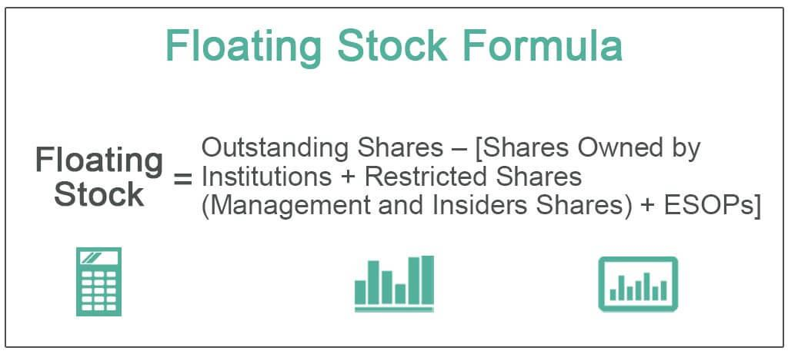

The stock market serves as a pivotal pillar in the global economy, facilitating capital formation, enabling economic growth, and providing investors with avenues to build wealth. As an organized platform for buying, selling, and issuing shares of publicly-traded companies, the stock market plays a critical role in the financial system, influencing economic stability and performance globally.

Key concepts in stock trading include floating stock, trading, and algorithmic trading, each crucial for investors to understand. Floating stock refers to the number of shares available for public trading out of the total shares issued by a company. This figure excludes closely-held shares by insiders such as company executives or significant stakeholders. In essence, floating stock determines a company’s stock liquidity, with higher floating stock generally leading to increased liquidity. 



Trading, the act of buying and selling financial instruments, is a fundamental mechanism that injects vitality, liquidity, and dynamism into the stock market. Trading occurs on various platforms and can involve stocks, bonds, currencies, and derivatives, each with its strategies and complexities. 

Algorithmic trading, or algo trading, employs computer algorithms to execute trades based on pre-defined criteria, such as timing, price, or quantity. These sophisticated algorithms can process vast amounts of market data rapidly, executing trades with speed and precision unattainable by human traders. Algorithmic trading has grown exponentially, accounting for a substantial volume of trades in modern financial markets due to its efficiency and ability to eliminate human emotional biases.

Understanding these core elements is vital for both novice and experienced investors. Grasping the dynamics of floating stock can help investors assess stock volatility and liquidity, aiding in more informed investment decisions. Familiarity with algorithmic trading can enable investors to leverage technological advancements for enhanced trading strategies.

This article investigates into the interplay between floating stock and algorithmic trading strategies. It explores the nuances of floating stock, demystifies the intricacies of algorithmic trading, and analyzes how these elements interact to influence trading strategies and market behavior. The intention is to equip investors with an informed perspective, enabling them to navigate and thrive in the ever-evolving landscape of stock market trading.

## Table of Contents

## Understanding Floating Stock

Floating stock refers to the number of shares of a company that are available for trading by the general public. Unlike the total shares outstanding, which encompass all shares a company has issued, floating stock excludes shares that are held by insiders, including company officers and directors, as well as shares that are restricted from trading. Thus, floating stock is calculated by subtracting closely held shares from the total shares outstanding.

The formula for calculating floating stock is:

$$
\text{Floating Stock} = \text{Total Shares Outstanding} - \text{Closely Held Shares}
$$

Floating stock plays a significant role in determining a stock's [volatility](/wiki/volatility-trading-strategies) and [liquidity](/wiki/liquidity-risk-premium). Stocks with a lower float tend to be more volatile, as smaller supply can lead to more pronounced price swings when there is buying or selling pressure. Conversely, a higher floating stock generally indicates greater liquidity, as there are more shares available for trading, which can mitigate large price fluctuations.

For instance, technology companies like Apple Inc. and Microsoft Corporation generally have high floating stocks, resulting in greater liquidity and relatively stable trading environments. In contrast, smaller companies or those with significant insider holdings might exhibit lower float, leading to increased volatility. An example is Snap Inc., which, at the time of its initial public offering, had a relatively low float due to the substantial holdings retained by its founders.

Institutional investors, such as mutual funds and pension funds, wield considerable influence on floating stock levels. Their large-scale purchases or sales can significantly impact a stock's float. When institutions decide to invest in a company, they can reduce the floating stock available to other investors, potentially increasing stock volatility due to decreased liquidity.

Floating stock is a critical consideration in investment decision-making. For investors, understanding the float helps assess a stock’s liquidity and potential volatility. A stock with low float might attract investors looking for significant price movements but may also discourage those seeking stable investments. On the other hand, stocks with high float are generally more attractive to conservative investors due to their stable nature.

Being aware of floating stock levels can also inform tactical trading strategy adjustments. Traders might exploit low float stocks for short-term gains, while long-term investors may prefer high float stocks as a safer harbor during market volatility.

## Basics of Algo Trading

Algorithmic trading, often referred to as algo trading, has revolutionized financial markets by employing computer programs to execute trades at speeds and frequencies that far surpass human abilities. This approach allows traders to leverage computational power to optimize trading decisions, aiming for improved returns and risk management.

The rise of algo trading can be traced back to the late 20th century when financial markets began integrating technology to handle increasingly complex trading environments. Initially, algorithms were simple and focused on executing large trades with minimal market impact. Over time, with advancements in technology and increasing market sophistication, [algorithmic trading](/wiki/algorithmic-trading) expanded to include a variety of strategies and execution techniques.

### Key Components of Algo Trading

1. **Trading Signals**: Trading signals are the triggers that initiate a trade, generated based on predefined criteria, such as technical indicators (e.g., moving averages) or market conditions (e.g., volume surge). These signals are often derived from historical data analysis and statistical models, aiming to predict future price movements. For example, a common signal might involve a moving average crossover, where a short-term moving average crosses above a long-term moving average, indicating a buy opportunity.

2. **Algorithms**: At the core of algo trading are the algorithms that decide how trades will be executed once a signal is generated. These algorithms strategically manage the timing, price, and quantity of orders. They can take many forms, ranging from simple rule-based systems to complex, machine learning-driven models. A simple trading algorithm might follow this pseudocode logic:
   ```python
   def trading_strategy(prices):
       short_mavg = calculate_moving_average(prices, window=5)
       long_mavg = calculate_moving_average(prices, window=20)
       if short_mavg > long_mavg:
           return "Buy"
       elif short_mavg < long_mavg:
           return "Sell"
       else:
           return "Hold"
   ```

3. **Execution Strategies**: Execution strategies determine how the trade is carried out in the market. Popular execution strategies include time-weighted average price (TWAP), volume-weighted average price (VWAP), and implementation shortfall. These strategies aim to execute trades efficiently, minimizing costs and market impact.

### Benefits of Algo Trading

The benefits of algorithmic trading are multifaceted:

- **Speed**: Algorithms can react to market conditions in fractions of a second, executing orders faster than any human trader could. This advantage is crucial in volatile markets where price dynamics change rapidly.

- **Efficiency**: By automating the trading process, algo trading minimizes manual errors and reduces operational costs associated with human traders.

- **Elimination of Human Emotion**: Trading decisions driven by algorithms are free from human emotions such as fear and greed, which often lead to irrational trading behavior.

### Evolution of Algo Trading

The evolution of algo trading has been marked by several key developments:

- **1970s and 1980s**: The introduction of electronic exchanges laid the groundwork for algo trading. Simple strategies focused on execution efficiency.

- **1990s and 2000s**: The proliferation of internet technology and advanced computing enabled more complex strategies involving statistical arbitrage and high-frequency trading.

- **2010s to present**: Advances in artificial intelligence and machine learning have further transformed algo trading, allowing for the creation of sophisticated predictive models and adaptive algorithms.

### Technologies Driving Algo Trading

Technologies underpinning modern algo trading include:

- **Artificial Intelligence (AI)**: AI enables the development of smart algorithms that can learn from data and adapt their strategies over time. Machine learning models can uncover intricate patterns in large datasets, providing a competitive edge in predictive accuracy.

- **Machine Learning**: Techniques such as neural networks, reinforcement learning, and decision trees are extensively employed to refine trading strategies, optimize execution, and enhance risk management.

Python, as the preferred language in financial technology, facilitates the implementation of [machine learning](/wiki/machine-learning) algorithms and offers a plethora of libraries, such as NumPy, pandas, and scikit-learn, which streamline the development of trading models.

Algorithmic trading continues to grow in significance, reshaping market dynamics and offering both opportunities and challenges to traders worldwide. Understanding these basics provides a foundation for navigating the complexities of modern financial markets.

## The Relationship Between Floating Stock and Algo Trading

Algorithmic trading, an automated process leveraging computer algorithms to make trading decisions, increasingly considers floating stock as a pivotal [factor](/wiki/factor-investing) in its strategies. Floating stock refers to the shares of a company available for trading by the general public and does not include closely held shares by insiders, executives, or controlling investors. Its significance arises from its impact on liquidity and volatility, two critical elements in forming algorithmic trading strategies.

**Impact of Floating Stock Levels on Trading Algorithms**

Floating stock can profoundly influence the behavior of trading algorithms. In environments with low floating stock, shares available for trading are limited, potentially leading to higher volatility. Prices may shift dramatically with relatively minor trading volumes. This scenario requires trading algorithms to adjust their strategies accordingly, often incorporating volatility predictions and risk mitigation mechanisms to handle sudden price fluctuations effectively.

Conversely, high floating stock typically implies greater liquidity, leading to more stable price movements. Algorithms might favor such conditions due to the reduced risk of significant price slippage and the ability to execute large-[volume](/wiki/volume-trading-strategy) trades without markedly affecting stock prices. Consequently, many trading algorithms are designed to incorporate liquidity measures and may adjust their trading frequency and volume based on the current floating stock levels.

**Case Studies in Algorithmic Trade Decisions**

Several historical instances demonstrate the role of floating stock in shaping algorithmic trading decisions. For instance, during company share buybacks, the floating stock may reduce significantly as stocks are repurchased, affecting liquidity and volatility. Trading algorithms programmed to monitor such corporate actions often adjust their parameters, either reducing trading volumes or implementing hedging strategies to protect against heightened volatility.

As an example, consider a hypothetical scenario where a technology firm announces a significant share buyback. Trading algorithms, noticing the anticipated reduction in floating stock, would reassess their trading strategies—potentially reducing the frequency of trades or employing stop-loss orders to minimize losses from potential price fluctuations. Such dynamic adjustments underscore the ongoing import of floating stock in algorithmic trading frameworks.

**Risk Management in Algo Trading**

Risk management is integral to algorithmic trading, particularly concerning floating stock levels. Algorithms employ various risk management approaches, such as setting thresholds for acceptable levels of volatility and liquidity. Changes in floating stock levels might prompt algorithms to recalibrate these thresholds, ensuring that trading actions fall within predefined risk limits. For instance, machine learning algorithms can adaptively learn from market data, identifying patterns associated with changes in floating stock and incorporating these insights into ongoing risk assessments.

**Triggers for Algorithmic Trading Decisions**

Algorithmic trading systems often include triggers based on changes in floating stock. These triggers are rooted in various factors, including corporate actions (e.g., secondary offerings) and market movements (e.g., substantial institutional sell-offs). Algorithms might employ event-driven strategies, where such changes act as signals prompting specific trading actions, such as increasing micro-[arbitrage](/wiki/arbitrage) activities when new shares enter the market, thereby elevating floating stock levels.

In conclusion, the relationship between floating stock and algorithmic trading is intricate and dynamic. Algo traders account for varying levels of floating stock to devise optimized strategies that enhance efficiency and regulate risk exposure. As trading algorithms become more sophisticated and adaptive, their reliance on accurately modeling and responding to floating stock dynamics will likely continue to play a significant role in their strategic operations.

## Benefits and Challenges of Algo Trading in the Stock Market

Algorithmic trading, often referred to as algo trading, has fundamentally transformed the landscape of financial markets. Its adoption brings several benefits alongside certain challenges that market participants need to navigate carefully. 

One of the primary advantages of algo trading is cost reduction. By automating trading processes, firms and individual traders can significantly decrease the transaction costs associated with manual trading. Automation eliminates the need for extensive workforce involvement in executing trades, leading to operational efficiency and reduced overhead. Algo trading can execute orders at optimal speeds, minimizing transaction time and impacts on the market prices, further contributing to cost-effectiveness.

Additionally, algo trading absorbs and processes vast datasets, leading to improved market stability and liquidity. Algorithms can react to market conditions faster than human traders, providing a stabilizing influence during volatile periods. By facilitating continuous trading, these algorithms enhance market liquidity, ensuring that there's always a buyer or seller, which helps in reducing bid-ask spreads.

However, the advantages of algo trading are accompanied by challenges. Technological failures pose significant risks. The 2010 Flash Crash exemplifies how technical glitches in trading algorithms can lead to rapid, dramatic market movements and losses. Market participants must ensure robust technological infrastructure and implement fail-safes to mitigate these risks. Additionally, market volatility can greatly impact the effectiveness of algorithms, which are typically designed under historical assumptions that might not hold in unpredictable conditions.

Regulatory considerations are another critical aspect affecting algo trading. Regulatory bodies are increasingly scrutinizing algorithmic trading to prevent manipulative practices and ensure fair trading conditions. For example, the European Union's Markets in Financial Instruments Directive (MiFID II) mandates enhanced transparency and risk control measures for algo traders. Such regulations require trading firms to maintain high compliance costs and rigorous oversight mechanisms.

The ethical implications of algorithmic trading also warrant discussion. Algorithms capable of high-frequency trading ([HFT](/wiki/high-frequency-trading-strategies)) can create unfair advantages for those who can afford the necessary technology. This situation raises concerns about market fairness and equal access, potentially disadvantaging smaller market participants.

Looking forward, the future outlook of algo trading appears promising with advancing technology. Developments in [artificial intelligence](/wiki/ai-artificial-intelligence) (AI) and machine learning are likely to further enhance the capabilities of trading algorithms by enabling them to learn and adapt to market conditions dynamically. Future algo trading strategies might incorporate sophisticated models that can predict market trends with greater accuracy and automate decision-making with minimal human intervention.

In conclusion, while algorithmic trading offers numerous benefits like cost reduction, enhanced liquidity, and increased market stability, it also presents challenges such as technological failures and regulatory hurdles. Ethical considerations and future advancements in technology will continue to shape the trajectory of algo trading in the stock market. Traders and firms must remain vigilant and informed to harness the benefits of algo trading while mitigating its inherent risks.

## Implementing Algo Trading for Individual Investors

To start implementing algorithmic trading within one's investment strategy, individuals need to first gain a foundational understanding of what algo trading entails. This involves learning about its core components such as strategy development, [backtesting](/wiki/backtesting), risk management, and execution. Various platforms and tools cater to retail traders, providing them with the necessary infrastructure to execute algorithmic strategies.

Popular platforms available to retail algo traders include platforms like MetaTrader, which offers a wide range of automated trading capabilities and supports custom strategy development. QuantConnect and Quantopian are also notable mentions, providing cloud-based platforms for developing and backtesting algorithms using historical data. [Interactive Brokers](/wiki/interactive-brokers-api) provides API support, allowing traders to develop customized trading algorithms using programming languages like Python, Java, and C++.

Aspiring algorithmic traders should leverage educational resources and training opportunities to deepen their knowledge. Many online courses, such as those offered by Coursera, Udemy, and edX, cover algorithmic trading, with modules on Python programming, financial markets, and quantitative finance. Books like "Algo Trading - Winning Strategies and Their Rationale" by Ernie Chan and "Algorithmic Trading" by Jeffrey Bacidore also provide valuable insights into building and understanding trading algorithms.

Practical tips for testing and refining algo trading strategies include backtesting and paper trading. Backtesting involves testing a strategy using historical data to assess its potential performance. It is important to use a sound backtesting framework that accounts for transaction costs, slippage, and market impact. Python libraries like Backtrader and Quantlib can facilitate the backtesting process. Paper trading, or simulated trading, helps in refining strategies in a live market environment without risking actual capital.

Continuous monitoring and adjustment of algorithms are crucial given market dynamics and evolving conditions. Traders should regularly evaluate their algorithmic strategies to ensure consistent alignment with the investor's risk tolerance and market conditions. Employing analytics and performance metrics can aid in identifying areas for improvement. Adaptation to new data inputs and technological advancements will enhance strategy robustness.

In conclusion, individual investors can harness algorithmic trading by leveraging available platforms, engaging with educational resources, and employing rigorous testing methods. Continuous vigilance in monitoring and refining strategies is essential to remain competitive in the fast-paced stock market.

## Conclusion

The article discussed critical aspects of the stock market, particularly the roles of floating stock and algorithmic trading in shaping investment strategies. Understanding floating stock, which refers to the shares available for public trading, is essential as it influences a stock's volatility and liquidity. Likewise, grasping the basics of algorithmic trading, with its emphasis on speed, efficiency, and data-driven decision-making, is increasingly important due to the rapid computerization of financial markets.

Investors, both novice and experienced, are encouraged to integrate knowledge of floating stock and algorithmic trading into their strategies. Recognizing how floating stock levels impact algorithmic trading decisions can aid in better risk management and more informed investment choices. As technology continues to evolve, the stock market will likely see further integration of advanced techniques such as AI and machine learning, providing both opportunities and challenges.

The future of stock market trading will likely be defined by technological advancements and regulatory adjustments. As such, staying informed about market trends, regulatory changes, and technological innovations is crucial for investors aiming to harness the benefits of algorithmic trading while mitigating associated risks.

Staying educated and adaptable will empower investors to navigate the complex dynamics of the stock market effectively, leveraging the interplay of floating stock and algorithmic trading to optimize their portfolios and achieve desired financial goals.

## References & Further Reading

[1]: Bergstra, J., Bardenet, R., Bengio, Y., & Kégl, B. (2011). ["Algorithms for Hyper-Parameter Optimization."](https://dl.acm.org/doi/10.5555/2986459.2986743) Advances in Neural Information Processing Systems 24.

[2]: ["Advances in Financial Machine Learning"](https://www.amazon.com/Advances-Financial-Machine-Learning-Marcos/dp/1119482089) by Marcos Lopez de Prado

[3]: ["Evidence-Based Technical Analysis: Applying the Scientific Method and Statistical Inference to Trading Signals"](https://www.amazon.com/Evidence-Based-Technical-Analysis-Scientific-Statistical/dp/0470008741) by David Aronson

[4]: ["Machine Learning for Algorithmic Trading"](https://github.com/stefan-jansen/machine-learning-for-trading) by Stefan Jansen

[5]: ["Quantitative Trading: How to Build Your Own Algorithmic Trading Business"](https://www.amazon.com/Quantitative-Trading-Build-Algorithmic-Business/dp/1119800064) by Ernest P. Chan