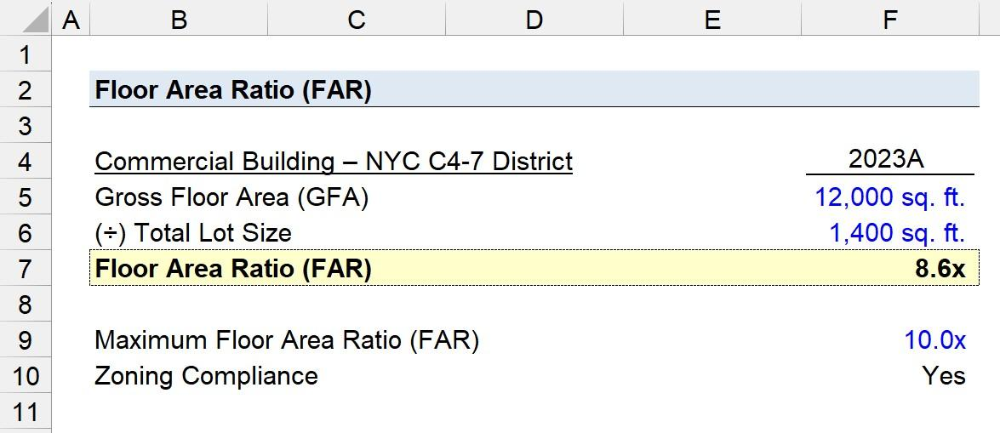

## Table of Contents

## What is Floor Area Ratio (FAR)?

Floor Area Ratio (FAR) is a way to measure how much of a building can be built on a piece of land. It is calculated by dividing the total floor area of a building by the area of the land it sits on. For example, if a building has a total floor area of 10,000 square feet and the land it sits on is 5,000 square feet, the FAR would be 2. This number helps city planners and builders know how much they can build on a given plot of land.

FAR is important because it helps control how dense a city or neighborhood becomes. By setting limits on the FAR, city officials can make sure that there is enough space for things like parks, roads, and other public areas. It also helps keep buildings from getting too close together, which can affect things like sunlight and air flow. Understanding and using FAR helps create balanced and livable communities.

## Why is Floor Area Ratio important in urban planning?

Floor Area Ratio (FAR) is important in urban planning because it helps control how much can be built on a piece of land. This is key for making sure cities don't get too crowded. By setting rules on FAR, city planners can decide how tall and big buildings can be. This helps them plan for enough space for homes, offices, and shops without making areas too packed.

FAR also helps keep cities livable. When planners use FAR, they can make sure there's enough room for parks, roads, and other public spaces. This makes cities nicer places to live. It also helps with things like making sure buildings don't block too much sunlight or air. By using FAR, planners can create neighborhoods that are balanced and good for people to live in.

## How is Floor Area Ratio calculated?

Floor Area Ratio, or FAR, is a way to figure out how much you can build on a piece of land. You find it by dividing the total floor area of a building by the area of the land it's on. For example, if a building has a total floor area of 10,000 square feet and the land it sits on is 5,000 square feet, you would divide 10,000 by 5,000. That gives you a FAR of 2.

This number is important because it helps city planners decide how much to build. If the FAR is high, you can build more on the land. If it's low, you can build less. This helps keep cities from getting too crowded and makes sure there's enough space for parks and roads.

## What are the typical units of measurement for Floor Area Ratio?

Floor Area Ratio, or FAR, is usually measured without any special units. It's just a number that shows how many times bigger the total floor area of a building is compared to the land it's on. For example, if a building's floor area is 10,000 square feet and the land is 5,000 square feet, the FAR would be 2. This means the building is twice as big as the land it sits on.

This simple number helps city planners decide how much can be built in a certain area. It doesn't need any units like feet or meters because it's a ratio. By using FAR, planners can make sure cities don't get too crowded and that there's enough space for parks and roads.

## Can you provide a simple example of how to calculate Floor Area Ratio?

Imagine you have a piece of land that is 2,000 square feet. On this land, you want to build a building that has a total floor area of 6,000 square feet. To find the Floor Area Ratio (FAR), you divide the total floor area of the building by the area of the land. So, you would divide 6,000 square feet by 2,000 square feet. This gives you a FAR of 3.

This number, 3, means that the building is three times bigger than the land it sits on. City planners use this number to decide how much can be built in a certain area. If the FAR is high, like in this example, it means you can build more on the land. If it's low, you can build less. This helps keep cities from getting too crowded and makes sure there's enough space for parks and roads.

## How does Floor Area Ratio affect building design and zoning regulations?

Floor Area Ratio (FAR) plays a big role in how buildings are designed and what rules are set for different areas. When city planners set a certain FAR for a piece of land, it tells builders how much they can build. If the FAR is low, builders might have to make smaller buildings or use less of the land. This can lead to designs that are more spread out or lower to the ground. On the other hand, a high FAR means builders can go bigger, which might lead to taller buildings or more floors. This can change how a building looks and how it fits into the neighborhood.

Zoning regulations also use FAR to control how cities grow. By setting different FAR limits in different zones, cities can make sure some areas stay quiet and low-density, while others can become busy and packed with buildings. For example, a city might set a low FAR in a residential area to keep it from getting too crowded, but allow a higher FAR in a business district where more people and activity are wanted. This helps cities plan for the future and make sure there's a good mix of spaces for living, working, and relaxing.

## What are the common Floor Area Ratio limits in different types of zoning districts?

Floor Area Ratio (FAR) limits can be different depending on the type of zoning district. In residential areas, where people live, the FAR is usually low. This helps keep neighborhoods from getting too crowded. For example, a single-family home zone might have an FAR limit of 0.5 to 1.0. This means the total floor area of a house can be up to the same size as the land it sits on, or a bit less. In multi-family zones, where there are apartments or condos, the FAR might go up to 2.0 or 3.0, allowing for more units and taller buildings.

In commercial and business districts, where shops and offices are, the FAR can be much higher. These areas are meant to be busy and full of activity, so the FAR might be set at 5.0 or even higher. This allows for big buildings with lots of floors, making room for many businesses and workers. Industrial zones, where factories and warehouses are, might have a medium FAR, like 1.0 to 3.0, depending on what kind of industry is there. By setting different FAR limits, cities can control how much can be built in each area, making sure there's a good mix of spaces for living, working, and relaxing.

## How can Floor Area Ratio be used to promote sustainable development?

Floor Area Ratio (FAR) can help make cities more sustainable by controlling how much can be built on a piece of land. If city planners set a lower FAR in certain areas, it can lead to less crowded neighborhoods with more space for parks and green areas. These open spaces help the environment by letting in more sunlight and fresh air, which is good for people and nature. A lower FAR can also encourage builders to use their space more wisely, like using solar panels or green roofs, which can save energy and help the planet.

On the other hand, a higher FAR in busy city centers can support sustainable development too. When buildings are taller and closer together, it can make it easier for people to live near where they work or shop. This means fewer cars on the road, which cuts down on pollution. Also, with more people in a smaller area, it's easier to set up public transportation like buses and trains, which are better for the environment than everyone driving alone. By using FAR smartly, cities can grow in a way that's good for both people and the planet.

## What are the potential impacts of high Floor Area Ratio on infrastructure and quality of life?

When the Floor Area Ratio (FAR) is high, it means more can be built on a piece of land. This can put a lot of pressure on the city's infrastructure like roads, water, and electricity. With more buildings and people in a small area, there might not be enough space for everyone to get around easily. Roads can get crowded, and there might be long waits for buses or trains. Also, the city might need to spend more money to make sure everyone has enough water and power. If the infrastructure can't keep up, it can make life harder for people living there.

A high FAR can also affect the quality of life in other ways. When buildings are packed close together, it can make neighborhoods feel cramped and busy. There might not be enough space for parks or places to relax outside. This can make it harder for people to enjoy their time at home. Also, with more people living in a small area, there can be more noise and less privacy. But, if the city plans well, a high FAR can also mean more places to live and work close by, which can make life easier in some ways. It's all about finding the right balance to make sure everyone can live well.

## How do different cities around the world regulate Floor Area Ratio?

Different cities around the world have their own ways of using Floor Area Ratio (FAR) to control how much can be built. In New York City, for example, the FAR can be different in different parts of the city. In places like Midtown Manhattan, where there are lots of tall buildings, the FAR can be as high as 15 or more. This lets builders make big skyscrapers. But in quieter neighborhoods, the FAR might be much lower, like 1 or 2, to keep the area from getting too crowded.

In Tokyo, Japan, the rules for FAR are also different depending on where you are. In busy areas like Shinjuku, the FAR can be very high, allowing for tall buildings and lots of people. But in places where they want to keep things calm and quiet, the FAR is kept low. This helps make sure there's enough space for everyone and keeps the city balanced. By changing the FAR in different parts of the city, Tokyo can control how it grows and make sure it stays a good place to live.

## What are some advanced considerations or adjustments that can be made to the standard Floor Area Ratio calculation?

Sometimes, cities need to make special changes to the Floor Area Ratio (FAR) to fit their needs better. One way they do this is by adding bonuses to the FAR. This means if a builder does something good for the city, like building a park or using green energy, they might be allowed to build more than the normal FAR allows. Another way is by setting different FAR rules for different parts of a building. For example, a city might let the first few floors have a higher FAR if they are used for shops or restaurants, but keep the upper floors lower to make sure the building fits well with the neighborhood.

Also, cities might use something called "transfer of development rights." This lets builders buy extra FAR from other places where building isn't allowed, like historic areas or parks. By doing this, cities can protect important places while still letting builders make bigger projects where it makes sense. These special rules help cities grow in a smart way, making sure there's enough space for everyone and that new buildings help make the city a better place to live.

## How does Floor Area Ratio interact with other urban planning metrics like density and building coverage ratio?

Floor Area Ratio (FAR) works together with other urban planning metrics like density and building coverage ratio to shape how cities grow. Density tells us how many people or homes are in a certain area. If the FAR is high, it means you can build more on the land, which can lead to higher density. This is because more floor space means room for more people to live or work. So, by setting the FAR, city planners can control how dense a neighborhood gets, making sure it stays a good place to live without getting too crowded.

Building coverage ratio is another important metric that goes hand-in-hand with FAR. It tells us how much of the land can be covered by buildings. If the building coverage ratio is high, it means more of the land is taken up by buildings, leaving less room for parks or open spaces. A high FAR combined with a high building coverage ratio can make a neighborhood feel very packed. But if the building coverage ratio is low, even with a high FAR, there might be more space for green areas. By balancing these metrics, city planners can make sure cities have enough room for everything people need, like homes, shops, and places to relax.

## What is the Understanding of Floor Area Ratio (FAR)?

Floor Area Ratio (FAR) is a key concept in urban planning, representing the ratio of the total floor area of a building to the area of the land parcel on which it stands. Mathematically, it is expressed as:

$$
\text{FAR} = \frac{\text{Total Floor Area}}{\text{Land Area}}
$$

This metric is instrumental in determining building density and optimizing land use. By dictating the relationship between built space and land area, FAR serves as a tool for urban planners to guide the spatial development and growth of cities.

A higher FAR value often signifies a higher degree of urbanization, with more densely constructed buildings. Such areas tend to support taller buildings and multiple-story structures, maximizing the use of limited land resources. This can be particularly advantageous in urban settings where land is scarce and expensive.

From an infrastructural perspective, higher FAR values necessitate careful planning to accommodate increased demands on transportation, utilities, and other public services. Furthermore, regions with elevated FAR values can present lucrative opportunities for real estate investments, as they commonly show heightened market activity and land appreciation potential. Therefore, understanding and applying FAR is crucial to striking a balance between maximizing urban growth and maintaining sustainable living conditions.

## References & Further Reading

[1]: Bertolini, L., le Clercq, F., & Kapoen, L. (2005). ["Sustainable Accessibility: A Conceptual Framework to Integrate Transport and Land Use Plan-Making."](https://www.sciencedirect.com/science/article/pii/S0967070X05000193) Transport Policy, 12(3), 207-220.

[2]: Gindy, Y., & Yeh, A. G. O. (2008). ["Intelligent urban planning: Information technology and the virtual planning environment."](https://scholar.google.com/citations?user=0zhn9YUAAAAJ) Cities, 25(3), 120-132.

[3]: Lopez de Prado, M. (2018). ["Advances in Financial Machine Learning."](https://www.amazon.com/Advances-Financial-Machine-Learning-Marcos/dp/1119482089) John Wiley & Sons.

[4]: Chan, E. (2009). ["Quantitative Trading: How to Build Your Own Algorithmic Trading Business."](https://github.com/ftvision/quant_trading_echan_book) John Wiley & Sons.

[5]: Batty, M. (2009). ["Cities and Complexity: Understanding Cities with Cellular Automata, Agent-Based Models, and Fractals."](https://mitpress.mit.edu/9780262524797/cities-and-complexity/) The MIT Press.