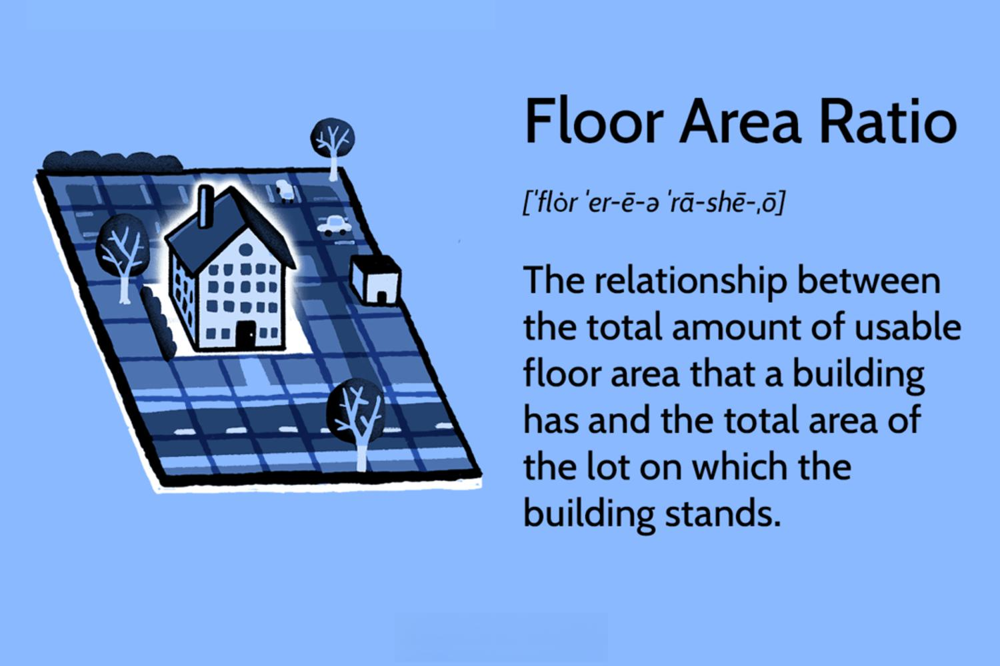

Urban planning and building density are crucial determinants in the development of sustainable and efficient cities. A key concept in this domain is the Floor Area Ratio (FAR), which dictates how land can be utilized for various types of developments. FAR is essentially the ratio of a building's total floor area to the size of the land parcel it occupies. This metric is pivotal in urban planning, as it influences building density, infrastructure development, and land use efficiency.

Simultaneously, technology has ushered in new methodologies that intersect with urban planning. One such advancement is algorithmic trading, predominantly used in the financial sector, which is now gaining traction in real estate investment. Algorithmic trading utilizes complex algorithms to perform rapid financial transactions and optimize investment strategies. In the context of urban development, these algorithms can be employed to identify lucrative investment opportunities, particularly in high FAR zones where the value of real estate is dynamic.



This article investigates the connections among building density, FAR, urban planning, and technological applications like algorithmic trading. It addresses essential definitions, showcases practical examples, and examines the innovative role of technology in shaping urban planning. As technology continues to evolve, its integration with urban planning paradigms such as FAR will be instrumental in driving sustainable urban growth and optimizing the investment landscape in real estate markets.

## Table of Contents

## Understanding Floor Area Ratio (FAR)

Floor Area Ratio (FAR) is a key concept in urban planning, representing the ratio of the total floor area of a building to the area of the land parcel on which it stands. Mathematically, it is expressed as:

$$
\text{FAR} = \frac{\text{Total Floor Area}}{\text{Land Area}}
$$

This metric is instrumental in determining building density and optimizing land use. By dictating the relationship between built space and land area, FAR serves as a tool for urban planners to guide the spatial development and growth of cities.

A higher FAR value often signifies a higher degree of urbanization, with more densely constructed buildings. Such areas tend to support taller buildings and multiple-story structures, maximizing the use of limited land resources. This can be particularly advantageous in urban settings where land is scarce and expensive.

From an infrastructural perspective, higher FAR values necessitate careful planning to accommodate increased demands on transportation, utilities, and other public services. Furthermore, regions with elevated FAR values can present lucrative opportunities for real estate investments, as they commonly show heightened market activity and land appreciation potential. Therefore, understanding and applying FAR is crucial to striking a balance between maximizing urban growth and maintaining sustainable living conditions.

## The Role of FAR in Urban Planning

Floor Area Ratio (FAR) is a pivotal element in urban planning, serving as a tool for regulating building density to encourage sustainable urban growth and maintaining a balance with open spaces and community resources. FAR is defined as the ratio of a building’s total floor area to the size of the land on which it is constructed. By controlling this ratio, urban planners can carefully guide the intensity of development in various areas, ensuring that infrastructure, resources, and services are not overwhelmed.

FAR regulations are subject to variation depending on zoning laws and specific land use objectives. In residential zones, lower FAR values might be prescribed to preserve the character of neighborhoods and ensure adequate green space. Conversely, commercial or mixed-use areas might have higher FAR values to promote economic growth and efficient land use. For example, a FAR value of 2.0 could mean that for a plot size of 1,000 square meters, a total floor area of 2,000 square meters is permissible, which could be achieved through a single-story structure covering the entire plot or a two-story building covering half the plot.

The application of FAR must consider not only economic development but also environmental and social impacts. Higher FAR can lead to economic benefits by maximizing the use of urban land, promoting vertical growth in densely populated areas, and facilitating the development of commercial hubs. However, such increases must be weighed against potential downsides, such as traffic congestion, strain on existing infrastructure, and reduced open space. 

Urban planners and policymakers strive to find a balance that aligns economic development goals with broader sustainability and community welfare. This includes incorporating green spaces, protecting cultural heritage sites, and ensuring that any increases in density do not adversely affect the quality of life for residents. Adjustments in FAR are often accompanied by measures to enhance urban infrastructure, such as transportation and utilities, to support the higher density. 

Effective FAR regulation thus plays a crucial role in orchestrating the growth of cities while preserving essential environmental and social values, ensuring that urban development is harmonious and sustainable for future generations.

## Examples of FAR in Practice

New York City is a prime example of how high Floor Area Ratio (FAR) values influence urban landscapes. In its downtown area, the FAR can reach up to 12, allowing for the development of skyscrapers that dominate the skyline. This densified urban form supports a concentrated mix of residential, commercial, and retail spaces, significantly impacting the real estate market. High-rise developments facilitated by generous FAR allocations have contributed to the city's economic vibrancy by attracting businesses and fostering tourism. However, this comes with challenges such as increased pressure on infrastructure and public services, necessitating careful urban planning and management.

Tokyo employs strategic FAR regulations to address its population density and limited land availability. The city promotes vertical growth to efficiently use available space, reflected in its mixed-use high-rise buildings. FAR policies in Tokyo are tailored to different areas, allowing for intensive development in central business districts while controlling growth in residential neighborhoods to maintain quality of life. This strategic use of FAR supports Tokyo's economic and residential functions while trying to balance urban pressures and living standards.

Singapore's approach to FAR is characterized by its dual focus on maximizing land use and maintaining green spaces despite high-density developments. The city-state employs a high FAR in urban centers to accommodate its growing population and economic activities. For example, developments in Marina Bay and the Central Business District demonstrate effective use of vertical space, with residential, commercial, and recreational areas seamlessly integrated. Additionally, Singapore incorporates mandatory green spaces and sky gardens in high-rise structures, demonstrating how FAR can be used to strike a balance between development and environmental sustainability. This model exemplifies how high-density urban planning can coexist with ecological considerations, providing a template for other cities faced with similar challenges.

## Algo Trading and Real Estate Investments

Algorithmic trading, often referred to as algo trading, employs algorithms to execute trading strategies at speeds and frequencies that far surpass human capabilities. It has revolutionized investment approaches across various financial markets, including the real estate sector. In real estate investments, algo trading exploits computational techniques to analyze large datasets, providing a strategic advantage in identifying profitable opportunities in specific zones characterized by high Floor Area Ratio (FAR).

The methodology behind algo trading involves using algorithms that can ingest numerous variables, such as market trends, economic indicators, and property valuations, to make data-driven decisions. For instance, an algorithm might consider a multitude of factors like interest rates, demographic trends, and urban development plans to assess the attractiveness of a real estate investment in high-density areas. By systematically evaluating FAR metrics, these algorithms can pinpoint undervalued properties likely to appreciate as urban environments evolve.

Moreover, the integration of [machine learning](/wiki/machine-learning) can enhance the predictive accuracy of these algorithms. Using Python, a popular language for building and testing algo trading strategies, investors can harness libraries such as `pandas` for data manipulation and `scikit-learn` for deploying machine learning models.

```python
import pandas as pd
from sklearn.model_selection import train_test_split
from sklearn.tree import DecisionTreeRegressor

# Example: Predicting real estate value based on FAR and other factors
data = pd.read_csv('real_estate_data.csv')
features = data[['FAR', 'location_rating', 'economic_growth_index']]
target = data['property_value']

X_train, X_test, y_train, y_test = train_test_split(features, target, test_size=0.2, random_state=0)
model = DecisionTreeRegressor()
model.fit(X_train, y_train)
predictions = model.predict(X_test)
```

This sample code demonstrates a basic decision tree model applied to estimate property values using FAR alongside other variables. Such models are foundational in developing sophisticated [algorithmic trading](/wiki/algorithmic-trading) strategies that can dynamically adjust to market conditions.

The confluence of algo trading and urban planning is particularly promising for investors aiming to harness future growth potential within urban settings. High FAR zones often translate to vertical growth and increased urbanization, conditions favorable for strategic long-term investments. Deploying algo trading tools allows investors to seamlessly align their strategies with urban planning trends, fostering a data-driven approach to capitalize on emerging opportunities in urban development.

As cities continue to expand and innovate, the application of algorithmic trading in real estate investment will likely advance, offering enhanced tools to navigate and exploit the intricate dynamics of urban growth. This integration underscores a growing synergy between technological advancement and strategic investment in real estate, setting the stage for an era of informed, precise urban development decisions.

## Challenges and Considerations

Balancing Floor Area Ratio (FAR) with infrastructure capabilities is pivotal for ensuring sustainable urban growth. As cities expand, the capacity of infrastructure, including transportation networks, water supply systems, and waste management facilities, must be taken into account to support increased densities. Higher FAR values commonly found in urbanized zones necessitate robust and efficient infrastructure to maintain functionality and quality of life. For instance, high-density areas may require enhanced public transit options to reduce congestion and improve accessibility.

Managing the potential for gentrification and maintaining housing affordability in areas with high FAR values presents substantial social challenges. As urban areas become denser and potentially more desirable, property values may rise, leading to the displacement of existing residents, particularly those from lower-income backgrounds. This can result in the loss of cultural diversity and community cohesion, alongside increased living costs. Tools such as inclusionary zoning and affordable housing mandates are often deployed to mitigate these impacts, although their effectiveness varies based on regional market dynamics and policy implementation.

Effective regulatory frameworks and community engagement are crucial for addressing these challenges. Urban planners and policymakers must establish clear regulations that not only guide development but also protect community interests and promote equitable growth. Engaging local communities in the planning process can ensure that development aligns with the needs and values of current residents, fostering a sense of ownership and reducing resistance to change.

By integrating these considerations into urban planning practices, cities can leverage high FAR values to drive growth while safeguarding social equity and ensuring infrastructure resilience.

## The Future of Urban Planning and Technology

Emerging technologies like [artificial intelligence](/wiki/ai-artificial-intelligence) (AI) and blockchain have the potential to significantly impact urban planning and real estate development. As cities grow more complex, the incorporation of these technologies can enhance the efficiency, sustainability, and inclusivity of urban environments.

AI can offer predictive analytics and machine learning capabilities to urban planners and developers. These tools enable the analysis of vast datasets—from traffic patterns to energy consumption—allowing for more informed decisions regarding infrastructure and resource management. AI can automate routine planning tasks, improving efficiency and accuracy. For example, AI algorithms can optimize land use and building placement based on predictive models of urban growth and demographic changes.

Blockchain technology, with its decentralized and transparent nature, can enhance the real estate sector by providing secure and immutable records of property transactions. This technology can increase trust and reduce fraud in real estate deals. It also has the potential to streamline processes related to land registration and title management, reducing bureaucratic delays and enhancing the robustness of property rights.

Sustainable development goals (SDGs) increasingly rely on innovative applications of the Floor Area Ratio (FAR) integrated with advanced technologies. AI and blockchain can aid in achieving SDGs by promoting optimized resource use, reducing carbon footprints, and enhancing community engagement through participatory planning processes. These technologies can support dynamic and real-time adjustments to urban plans, ensuring that developments align with environmental standards and community needs.

Stakeholders in urban planning and real estate investment must adapt to these technological advances to ensure sustainable urban growth. This involves embracing a multidisciplinary approach that combines urban planning expertise with technological proficiency. Urban planners, investors, and policymakers need to collaborate effectively, leveraging data-driven tools and transparent systems to build adaptable, resilient, and equitable urban futures.

In conclusion, AI and blockchain present opportunities for redefining urban planning and real estate strategies. As these technologies evolve, their integration with FAR principles will be crucial for shaping cities that meet the demands of the 21st century while adhering to sustainable development imperatives.

## Conclusion

The integration of Floor Area Ratio (FAR) into urban planning, coupled with the utilization of modern technologies like algorithmic trading, presents significant opportunities for shaping the cities of the future. FAR serves as a fundamental tool in determining building density and land use efficiency, directly influencing urban design and development. By aligning FAR strategies with technological advancements, we can forge pathways toward innovative urban solutions.

A multidisciplinary approach is crucial in this context, blending insights from urban planning, financial analysis, and technological innovation to guide sustainable urban growth. Urban planners, financiers, and technologists must work together to understand and apply FAR metrics effectively, ensuring that growth is not only economically viable but socially and environmentally sustainable. Technologies such as algorithmic trading can enhance real estate investment strategies by proficiently navigating complex data and forecasting trends in high-density zones.

The challenge lies in achieving a harmonious balance between density and livability. This involves careful planning to avoid overburdening infrastructure, protect green spaces, and maintain community well-being. As cities strive for efficiency, incorporating pedestrian-friendly designs, efficient public transport, and renewable energy solutions becomes increasingly important.

Leveraging technology responsibly is key to creating vibrant, inclusive urban environments. Embracing digital tools, from AI-driven data analytics to blockchain for transparency, can improve decision-making processes in urban and financial planning. However, it is essential that these technologies are applied ethically, prioritizing public interest and environmental stewardship.

Ultimately, the integration of FAR with cutting-edge technologies offers a promising framework for developing future cities that are economically prosperous, socially inclusive, and environmentally resilient. This journey, however, demands continuous adaptation and collaboration among stakeholders, guided by the overarching goal of sustainable and thriving urban landscapes.

## References & Further Reading

[1]: Bertolini, L., le Clercq, F., & Kapoen, L. (2005). ["Sustainable Accessibility: A Conceptual Framework to Integrate Transport and Land Use Plan-Making."](https://www.sciencedirect.com/science/article/pii/S0967070X05000193) Transport Policy, 12(3), 207-220.

[2]: Gindy, Y., & Yeh, A. G. O. (2008). ["Intelligent urban planning: Information technology and the virtual planning environment."](https://scholar.google.com/citations?user=0zhn9YUAAAAJ) Cities, 25(3), 120-132.

[3]: Lopez de Prado, M. (2018). ["Advances in Financial Machine Learning."](https://www.amazon.com/Advances-Financial-Machine-Learning-Marcos/dp/1119482089) John Wiley & Sons.

[4]: Chan, E. (2009). ["Quantitative Trading: How to Build Your Own Algorithmic Trading Business."](https://github.com/ftvision/quant_trading_echan_book) John Wiley & Sons.

[5]: Batty, M. (2009). ["Cities and Complexity: Understanding Cities with Cellular Automata, Agent-Based Models, and Fractals."](https://mitpress.mit.edu/9780262524797/cities-and-complexity/) The MIT Press.