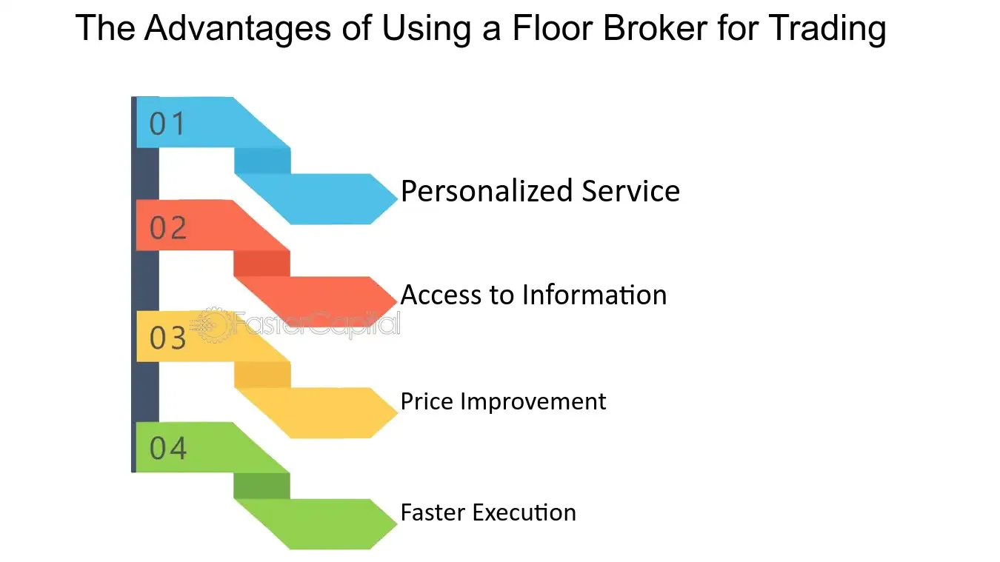

## Table of Contents

## What is a floor broker?

A floor broker is a person who works on the trading floor of a stock exchange. Their main job is to buy and sell stocks and other financial products for their clients. They do this by shouting out prices and making deals with other traders on the floor. This is different from electronic trading, where computers do the buying and selling.

Floor brokers are important because they help make sure that the prices of stocks are fair. They do this by finding the best possible price for their clients. They also help keep the market running smoothly by making sure that there are always people willing to buy and sell. Even though electronic trading is more common now, floor brokers are still used in some of the biggest stock exchanges around the world.

## What are the primary functions of a floor broker?

A floor broker's main job is to buy and sell stocks and other financial products for their clients on the trading floor of a stock exchange. They do this by shouting out prices and making deals with other traders around them. This is different from electronic trading, where computers handle the buying and selling. Floor brokers work hard to get the best possible price for their clients, which helps make sure that the prices of stocks are fair.

Another important function of a floor broker is to help keep the market running smoothly. They do this by making sure there are always people willing to buy and sell stocks. This helps prevent big price swings and keeps the market stable. Even though electronic trading is more common now, floor brokers are still important in some of the biggest stock exchanges around the world because they add a human touch to the trading process.

## How does a floor broker operate on the trading floor?

A floor broker works on the busy trading floor of a stock exchange. They move around quickly, shouting out prices and making deals with other traders. When a client wants to buy or sell a stock, the floor broker uses hand signals and shouts to communicate with other traders. They try to find the best price for their client by talking to many different people on the floor. This way, they can make sure the client gets a good deal.

Floor brokers also help keep the market running smoothly. They make sure there are always people ready to buy and sell stocks. This helps stop big price changes and keeps the market stable. Even though computers do a lot of trading now, floor brokers are still important. They add a human touch to the trading process and help make sure the prices are fair for everyone.

## What qualifications are needed to become a floor broker?

To become a floor broker, you need a good education, usually a bachelor's degree in finance, economics, or a related field. This helps you understand how markets work and how to make good trading decisions. You also need to know a lot about the stock market and be good at math. Some people get extra qualifications like the Series 7 license, which lets them trade securities.

Besides education, you need to be quick and good at talking to people. Floor brokers work in a fast and loud place, so you need to be able to think fast and make decisions quickly. You also need to be good at working with others because you'll be talking to other traders all the time. Experience in trading or finance can help you get a job as a floor broker, and some people start as clerks or assistants on the trading floor before becoming brokers.

## How do floor brokers communicate and execute trades?

Floor brokers communicate and execute trades by using hand signals and shouting on the trading floor. When they get an order from a client, they move around quickly to find other traders who want to buy or sell the same stock. They use their hands to show what they want to do, like pointing up to show they want to buy or down to show they want to sell. They also shout out prices to make deals with other traders. This way, they can find the best price for their client and make the trade happen fast.

Once a floor broker finds someone to trade with, they agree on a price and make the trade. They write down the details of the trade, like the price and how many shares were traded. Then, they report this information back to their client and to the stock exchange. This helps keep everything clear and makes sure the trade is recorded correctly. Even though computers do a lot of trading now, floor brokers still use these old ways to add a human touch and keep the market fair.

## What is the role of a floor broker in the context of electronic trading?

Even though electronic trading is common now, floor brokers still have an important job. They work on the trading floor of a stock exchange, where they buy and sell stocks for their clients. They use hand signals and shouting to talk to other traders and make deals. This helps them find the best price for their clients, which keeps the market fair. Floor brokers also help keep the market running smoothly by making sure there are always people ready to buy and sell stocks.

In the world of electronic trading, floor brokers add a human touch that computers can't. They can see and react to what's happening on the trading floor in real time, which helps them make quick decisions. This is different from electronic trading, where everything is done by computers. Even though most trades happen electronically, floor brokers are still important in some of the biggest stock exchanges. They help make sure the market stays stable and that prices are fair for everyone.

## How do floor brokers manage risk and ensure compliance with trading regulations?

Floor brokers manage risk by carefully watching the market and making smart decisions. They use their knowledge of the stock market to guess how prices might change. They also talk to other traders to learn more about what's happening. This helps them decide when to buy or sell stocks to avoid losing money. They also set limits on how much they are willing to spend or lose on a trade. This way, they can protect their clients' money and make sure they don't take too big of a risk.

Floor brokers also have to follow trading rules to make sure everything is fair. They need to know all the rules set by the stock exchange and the government. They keep records of all their trades and report them correctly. This helps make sure they are doing everything right. If they don't follow the rules, they could get in trouble. So, they always make sure to do things the right way and keep everything clear and honest.

## What are the advantages of using a floor broker over electronic trading platforms?

Using a floor broker has some big advantages over electronic trading platforms. One big advantage is that floor brokers can see and react to what's happening on the trading floor in real time. This means they can make quick decisions based on what they see and hear from other traders. They can also talk to other traders face-to-face, which helps them find the best price for their clients. This human touch can make a big difference in getting a good deal.

Another advantage is that floor brokers help keep the market fair and stable. They make sure there are always people ready to buy and sell stocks, which helps stop big price swings. They also know a lot about the market and can use this knowledge to make smart decisions for their clients. Even though electronic trading is faster and can handle more trades, floor brokers add a personal touch that computers can't, which can be really helpful in some situations.

## How has the role of floor brokers evolved with advancements in technology?

The role of floor brokers has changed a lot because of new technology. In the past, floor brokers were the main people who made trades happen on the stock exchange floor. They shouted and used hand signals to buy and sell stocks for their clients. But now, most trades are done by computers on electronic trading platforms. This means that there are fewer floor brokers working on the trading floor. Even though their numbers have gone down, floor brokers still have an important job to do.

Today, floor brokers work alongside electronic trading systems. They use their knowledge and quick thinking to make trades that might be hard for computers to do. They can see and react to what's happening on the trading floor in real time, which helps them make smart decisions for their clients. Floor brokers also help keep the market fair and stable by making sure there are always people ready to buy and sell stocks. Even with all the new technology, floor brokers still add a human touch to the trading process that computers can't.

## Can you explain the typical daily routine of a floor broker?

A floor broker's day starts early in the morning. They get to the stock exchange before it opens to get ready for the day. They check their clients' orders and make a plan for what they need to do. When the market opens, they go onto the trading floor. It's a busy and loud place with lots of people moving around. The floor broker moves quickly, shouting and using hand signals to talk to other traders. They try to find the best price for their clients' orders by making deals with other traders.

During the day, the floor broker keeps an eye on the market. They watch how prices are changing and talk to other traders to learn more about what's happening. If something big happens, like a company making a big announcement, they need to react fast. They keep making trades all day, always trying to get the best price for their clients. At the end of the day, they write down all the trades they made and report them to their clients and the stock exchange. This helps make sure everything is clear and honest.

## What are the key challenges faced by floor brokers in today's market?

One big challenge for floor brokers today is competition from electronic trading. Most trades happen on computers now, which means there are fewer floor brokers needed. This makes it harder for them to find work. Also, electronic trading can happen faster and handle more trades at once. So, floor brokers need to show that they can still add value in a world where computers do a lot of the work.

Another challenge is keeping up with new technology and rules. The stock market changes all the time, with new tools and laws coming out often. Floor brokers need to learn these new things quickly to stay good at their job. They also have to follow all the rules carefully, which can be hard when things are always changing. Even though it's tough, floor brokers who can adapt and use their skills well can still do well in today's market.

## How do floor brokers contribute to market liquidity and efficiency?

Floor brokers help make the market more liquid by being ready to buy and sell stocks all the time. When they are on the trading floor, they can quickly find other traders who want to trade the same stock. This means there are always people ready to make a trade, which keeps the market moving smoothly. If there weren't enough people willing to buy and sell, it would be hard to make a trade, and prices could change a lot. Floor brokers help stop this from happening by being active on the trading floor.

Floor brokers also help make the market more efficient. They use their knowledge and quick thinking to find the best price for their clients. They talk to other traders face-to-face and use hand signals to make deals fast. This human touch can help get a better price than what might be available on electronic trading platforms. Even though computers do a lot of trading now, floor brokers still add a personal touch that helps keep the market fair and efficient for everyone.

## References & Further Reading

[1]: Hasbrouck, J. (2007). ["Empirical Market Microstructure."](https://archive.org/details/empiricalmarketm0000hasb) Oxford University Press.

[2]: Aldridge, I. (2013). ["High-Frequency Trading: A Practical Guide to Algorithmic Strategies and Trading Systems."](https://www.wiley.com/en-us/High+Frequency+Trading%3A+A+Practical+Guide+to+Algorithmic+Strategies+and+Trading+Systems%2C+2nd+Edition-p-9781118343500) Wiley Finance.

[3]: Harris, L. (2003). ["Trading and Exchanges: Market Microstructure for Practitioners."](https://academic.oup.com/book/52292) Oxford University Press.

[4]: Kissell, R. (2013). ["The Science of Algorithmic Trading and Portfolio Management."](https://www.sciencedirect.com/book/9780124016897/the-science-of-algorithmic-trading-and-portfolio-management) Academic Press.

[5]: Narang, R. K. (2009). ["Inside the Black Box: A Simple Guide to Quantitative and High-Frequency Trading."](https://onlinelibrary.wiley.com/doi/book/10.1002/9781118267738) Wiley Finance.