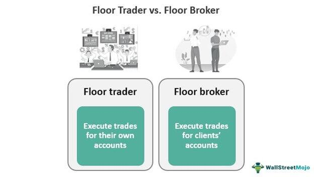

The world of stock exchange has witnessed significant evolution with the progression of technology. At the heart of its early operations were floor brokers, who played a crucial role by executing trades directly on the exchange floor. They facilitated transactions through oral communications, written notes, and hand signals. This method required a deep understanding of market dynamics and sharp negotiation skills to secure the best possible prices for their clients. Floor brokers chiefly catered to the needs of financial institutions and high-net-worth individuals, establishing themselves as pivotal figures in the financial markets.

However, with the technological revolution came the emergence of algorithmic trading, revolutionizing the landscape of stock exchanges. Algorithmic trading leverages pre-programmed instructions to execute orders with unparalleled speed and precision, significantly reducing the scope for human error. This development allows for the analysis of large datasets and the execution of trades within milliseconds, offering a competitive advantage over traditional methods.



The evolution from floor-based trading to algorithmic systems marks a paradigm shift in the industry. This article examines the historical significance of floor brokers and the increasing dominance of algorithmic trading. It analyzes how these two trading approaches are currently integrated and their roles in today's stock exchanges. Understanding these dynamics is essential for comprehending the current trends in financial markets and anticipating future developments.

## Table of Contents

## What is a Floor Broker?

A floor broker, often referred to as a pit broker, is a professional who executes buy and sell orders on behalf of clients directly on the trading floor of a stock exchange. This role is crucial in facilitating the trading process and ensuring the best possible prices for client transactions. The primary responsibility of a floor broker is to strive for optimal pricing by competing with other traders on the exchange floor.

Traditionally, floor brokers heavily relied on written notes and a system of hand signals, known as "open outcry," to communicate trade details on the bustling trading floors. This method of communication was necessary because of the noise and hectic environment of traditional exchanges. However, with advancements in technology, floor brokers now have access to electronic systems and devices that enhance the accuracy and speed of executing trades. These technological tools help brokers keep up with the rapid pace of modern trading and maintain a competitive edge.

Floor brokers predominantly cater to larger clients, such as financial institutions and high-net-worth individuals. These clients require the expertise and negotiation skills provided by brokers to transact large volumes or complex trades that may not suit electronic systems alone. The expertise of floor brokers becomes particularly valuable in scenarios where nuanced human judgment can make a significant difference in trade outcomes.

The operations of floor brokers are subject to stringent regulation to maintain fair and orderly markets. In the United States, for example, the Securities and Exchange Commission (SEC) is one of the primary regulatory bodies ensuring that floor brokers adhere to established trading laws and ethical standards. Compliance with these regulations is paramount to safeguarding the integrity of the trading environment and protecting clients' interests.

In summary, floor brokers play a vital role in the trading ecosystem by executing trades, negotiating prices, and leveraging both traditional and modern communication methods. Their work ensures that clients' large and often complex trades are handled with precision and care, within the bounds of regulatory frameworks designed to maintain market fairness.

## Algorithmic Trading: The New Age

Algorithmic trading, often termed as algo trading, leverages pre-programmed instructions to execute trades at exceptional speeds, far exceeding human capability. At its core, [algorithmic trading](/wiki/algorithmic-trading) involves the use of complex mathematical models and sophisticated software to automate the trading process. This method contrasts significantly with traditional trading methods, primarily due to its speed, efficiency, and data handling capabilities.

One of the primary advantages of algorithmic trading is its ability to process and analyze vast datasets swiftly, executing trades within milliseconds. The efficiency and speed offered by automated trading systems present a significant competitive advantage, especially in financial markets where time is equated with value. A typical algorithm might evaluate numerous market factors such as price, timing, and [volume](/wiki/volume-trading-strategy) before executing a trade, ensuring that all possible conditions are optimized.

By reducing the reliance on human traders, algorithmic trading significantly minimizes human error, enabling more precise trading decisions. The algorithms are designed to follow specific rules, which eliminates emotional decision-making that often affects human traders during volatile market conditions. For instance, a simple moving average crossover strategy can be programmed to trigger buy or sell signals:

```python
# Example of a moving average crossover strategy
import pandas as pd

def moving_average_crossover_strategy(data, short_window, long_window):
    # Compute short and long moving averages
    data['short_mavg'] = data['close'].rolling(window=short_window, min_periods=1).mean()
    data['long_mavg'] = data['close'].rolling(window=long_window, min_periods=1).mean()

    # Create signals
    data['signal'] = 0
    data['signal'][short_window:] = np.where(data['short_mavg'][short_window:] > data['long_mavg'][short_window:], 1, 0)

    # Generate trading orders
    data['positions'] = data['signal'].diff()

    return data
```

Algorithmic trading platforms have become increasingly prevalent, overshadowing roles traditionally filled by floor brokers. The rise of automated trading systems aligns with the broader trend of digital transformation across industries. These platforms not only execute trades with precision but also continuously adapt to new market patterns, providing enhanced execution capabilities compared to manual trading methods.

The evolution of algorithmic trading is bolstered by advancements in [artificial intelligence](/wiki/ai-artificial-intelligence) (AI) and [machine learning](/wiki/machine-learning) technologies. These technologies enhance the capability of trading algorithms by enabling them to learn from historical data and adjust strategies dynamically. Machine learning models can detect intricate patterns and correlations in market data, allowing for more sophisticated trading strategies that evolve as they are exposed to new information.

As technology continues to advance, algorithmic trading systems are expected to become even more integral to the operations of trading floors across the globe. The ongoing improvements in computational power, data availability, and analytical techniques are likely to further increase the precision and efficiency of these systems, reshaping the landscape of global financial markets.

## The Coexistence and Transition

The emergence of algorithmic trading has dramatically transformed the landscape of financial markets. However, traditional floor brokers continue to play a significant role, particularly in handling complex trade situations that benefit from human judgment and experience. Despite the growing prevalence of technology, certain scenarios still require the nuanced decision-making and adaptability that human brokers offer. 

Floor brokers now frequently leverage algorithms to enhance their trading decisions. By integrating algorithmic tools, brokers can analyze large volumes of data rapidly, refine their decision-making strategies, and optimize the timing and execution of trades. This integration allows brokers to maintain a competitive edge by combining the speed and efficiency of algorithms with their expertise.

Hybrid systems, which couple the strengths of both floor brokers and algorithmic trading systems, have become increasingly common. These systems enable brokers to utilize algorithmic analyses for real-time market insight while reserving final decision-making for more intricate trades to human judgment. Such hybridity underscores the complementary nature of human intuition and machine precision.

The continued relevance of brokers is underscored by their ability to navigate unforeseen market conditions, which often require a level of flexibility and intuition that machines cannot fully replicate. For instance, during times of market [volatility](/wiki/volatility-trading-strategies) or when executing large block trades that might disrupt market prices, the nuances of human decision-making are invaluable. Brokers can interpret non-quantifiable factors, such as market sentiment or geopolitical events, that might impact trading outcomes in ways that purely algorithmic approaches might miss.

In this evolving landscape, technology serves as an ally rather than a replacement. By augmenting human capabilities, technology enhances the efficiency and effectiveness of traditional roles. As the trading environment continues to advance, skilled brokers equipped with algorithmic tools will remain pivotal in managing complex trades, ensuring that they continue to add value in the technologically enhanced marketplace.

## The Future of Trading

Algorithmic trading continues to expand, driven predominantly by rapid advancements in technology such as artificial intelligence (AI) and machine learning (ML). These technological breakthroughs enable algorithms to process and analyze vast amounts of financial data with unprecedented speed and accuracy, offering traders distinct advantages in executing high-frequency and complex strategies. Algorithmic systems can respond instantaneously to market conditions, optimizing trading efficiency and potentially increasing profitability.

As a consequence of this technological evolution, the role of floor brokers is expected to become more specialized. While traditional broker functions might decline, floor brokers will focus on intricate and nuanced trades that demand human insights, creativity, and judgment—qualities that remain challenging for algorithms to replicate. Complex transactions, such as large block trades or those requiring negotiation, benefit from the personal touch and strategic thinking floor brokers provide.

Regulations will likely continue to evolve in response to the growing prevalence of algorithmic trading. Regulatory bodies are tasked with addressing potential issues such as market manipulation and ensuring fair trading practices. As algorithms become more sophisticated, so too must the frameworks governing their operation, to mitigate risks such as flash crashes or unintended trading anomalies.

In future trading environments, trading floors are anticipated to undergo further technological integration, reshaping the roles and responsibilities of traditional brokers. Advanced trading systems that combine the strengths of human intuition and technological precision are likely to emerge. Brokers who traditionally operated in a purely manual capacity may find their roles supplemented by technology, enabling them to make more informed decisions and act swiftly in dynamic market situations.

Continuous learning and adaptation will be vital for brokers in this forward-looking trading landscape. As technology progresses, so too must the skillsets of those engaged in trading. Brokers will need to be adept at understanding and leveraging new tools and technologies, requiring a commitment to ongoing education and professional development. This adaptability is crucial not only for maintaining relevance but also for capitalizing on new opportunities presented by an ever-evolving market ecosystem.

## Conclusion

Trading on stock exchanges has undergone a significant transformation due to technological advancements, with algorithmic trading playing a leading role in this evolution. Algorithmic trading, characterized by its speed, efficiency, and precision, has redefined how trades are executed and has become an indispensable tool for modern traders. Despite this technological shift, floor brokers continue to retain an important position, particularly in managing complex trading scenarios that benefit from human experience and judgment.

The interplay between traditional floor brokers and modern algorithmic systems manifests a symbiotic relationship that enhances the trading landscape. Floor brokers bring invaluable insights and intuition to situations where market dynamics may deviate from expected patterns, thus adding a qualitative layer to the quantitative approach of algorithms. This collaboration helps bridge the gap between purely mechanical trading and human strategic thinking, ensuring more robust market operations.

For those engaged in financial markets, understanding the intricacies of both traditional and emerging trading methodologies is essential. It allows market participants to appreciate the evolution of trading practices and develop strategies that leverage both human expertise and technological innovations. As we look ahead, the trajectory of trading will be influenced by the extent to which traditional practices can adapt to and integrate with these advancements. Continuous innovation and adaptation will shape the future of trading, emphasizing the importance of merging past wisdom with modern technology to achieve optimal trading outcomes.

## References & Further Reading

[1]: Hasbrouck, J. (2007). ["Empirical Market Microstructure."](https://archive.org/details/empiricalmarketm0000hasb) Oxford University Press.

[2]: Aldridge, I. (2013). ["High-Frequency Trading: A Practical Guide to Algorithmic Strategies and Trading Systems."](https://www.wiley.com/en-us/High+Frequency+Trading%3A+A+Practical+Guide+to+Algorithmic+Strategies+and+Trading+Systems%2C+2nd+Edition-p-9781118343500) Wiley Finance.

[3]: Harris, L. (2003). ["Trading and Exchanges: Market Microstructure for Practitioners."](https://academic.oup.com/book/52292) Oxford University Press.

[4]: Kissell, R. (2013). ["The Science of Algorithmic Trading and Portfolio Management."](https://www.sciencedirect.com/book/9780124016897/the-science-of-algorithmic-trading-and-portfolio-management) Academic Press.

[5]: Narang, R. K. (2009). ["Inside the Black Box: A Simple Guide to Quantitative and High-Frequency Trading."](https://onlinelibrary.wiley.com/doi/book/10.1002/9781118267738) Wiley Finance.