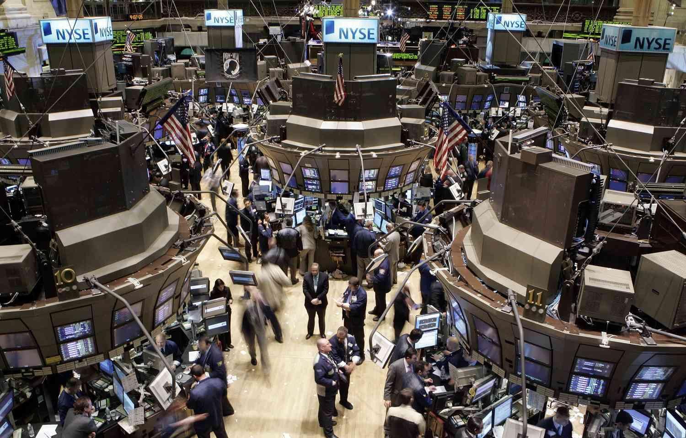

## Table of Contents

## What is a floor in trading?

A floor in trading is the lowest price that a trader is willing to accept for a stock or other financial asset. It's like setting a bottom limit. When traders set a floor, they are saying they won't sell the asset for less than that price. This can help them avoid selling at a loss if the market price drops suddenly.

Setting a floor can be a part of a trading strategy. It helps traders manage risk by making sure they don't sell their assets too cheaply. For example, if a trader bought a stock at $50 and the market price drops to $45, they might set a floor at $48. This way, they wait for the price to recover to at least $48 before selling, instead of selling at a bigger loss at $45.

## How does a trading floor operate?

A trading floor is a big room where lots of people buy and sell stocks and other financial things. It's a busy place with people shouting and using hand signals to make trades happen quickly. Each person on the floor has a special job, like a broker who buys and sells for clients, or a market maker who helps set prices by buying and selling certain stocks.

The trading floor is run by an exchange, like the New York Stock Exchange. The exchange makes rules to keep everything fair and orderly. There are big screens showing prices and lots of phones for talking to clients. Even though a lot of trading happens on computers now, some big trades still happen on the floor because it's fast and people can talk face-to-face.

## What are the different types of trading floors?

There are mainly two types of trading floors: open outcry trading floors and electronic trading floors. An open outcry trading floor is a big, noisy place where traders shout and use hand signals to buy and sell things like stocks and futures. They do this to make trades happen quickly and to show what they want to buy or sell. This type of floor is used by big exchanges like the Chicago Mercantile Exchange.

An electronic trading floor, on the other hand, uses computers and the internet to make trades. Traders sit at desks with screens and use software to buy and sell things. This type of floor is quieter and more spread out because traders can be anywhere in the world as long as they have a computer and internet connection. Most trading today happens electronically, but some big trades still happen on open outcry floors because they can be faster and let traders talk face-to-face.

## What is the role of a floor trader?

A floor trader works on a trading floor, buying and selling things like stocks and futures. They are usually part of a big exchange, like the New York Stock Exchange. Their main job is to make trades happen quickly. They use shouts and hand signals to show what they want to buy or sell. This way, they can make deals fast and keep the market moving.

Floor traders also help set prices. They do this by being ready to buy or sell at certain prices. This helps keep the market fair and orderly. Even though a lot of trading now happens on computers, floor traders are still important for big trades. They can talk face-to-face with other traders, which can make big deals happen faster and more smoothly.

## How has technology impacted trading floors?

Technology has changed trading floors a lot. Before, trading floors were noisy places where people shouted and used hand signals to buy and sell stocks. Now, a lot of trading happens on computers. Traders sit at desks with screens and use software to make trades. This makes trading faster and easier because they don't have to be in the same place. They can trade from anywhere in the world as long as they have a computer and internet.

Even though technology has made trading more electronic, some big trades still happen on the old-style trading floors. This is because talking face-to-face can be faster and more personal for big deals. But overall, technology has made trading quieter and more spread out. It has also made it possible for more people to trade because they don't need to be on a special floor to do it.

## What are the advantages of trading on a floor?

Trading on a floor has some big advantages. One of the main ones is speed. When traders are all in the same place, they can make deals happen very quickly. They use shouts and hand signals to show what they want to buy or sell. This can be faster than using a computer, especially for big trades. Also, being on the floor lets traders talk face-to-face. This can help them understand each other better and make deals more smoothly.

Another advantage is that floor trading can help set prices in a fair way. Traders on the floor are ready to buy or sell at certain prices, which helps keep the market orderly. This can be important for big trades where the price can change a lot. Being on the floor also lets traders see what's happening around them. They can watch other traders and get a feel for the market, which can help them make better decisions.

## What are the disadvantages of trading on a floor?

Trading on a floor can be hard because it's noisy and busy. All the shouting and hand signals can be confusing, especially for new traders. It can also be stressful because everything happens so fast. Traders have to make quick decisions, and if they make a mistake, it can cost a lot of money. Plus, being on a floor means you have to be in a certain place at certain times, which can be hard if you want more freedom in where and when you work.

Another problem with floor trading is that it can be expensive. The big exchanges that run the floors have to pay for the space and all the technology they use. They also have to follow a lot of rules to make sure everything is fair. All these costs can make trading on a floor more expensive than trading on a computer. Also, even though floor trading can be fast, it might not be as fast as electronic trading for some kinds of trades. Computers can handle a lot of trades at once, which can be hard for people on a floor to do.

## How do floor traders use hand signals?

Floor traders use hand signals to show what they want to buy or sell without shouting. They move their hands and fingers in special ways that other traders can understand. For example, if a trader wants to buy, they might hold up a certain number of fingers to show how many shares they want. If they want to sell, they might use a different hand signal. These signals help traders make deals quickly and quietly in the busy trading floor.

Using hand signals is important because it lets traders communicate even when it's very noisy. On a trading floor, there can be a lot of shouting and it's hard to hear. Hand signals help traders get their messages across without having to yell. This makes trading faster and more efficient. Even though a lot of trading happens on computers now, hand signals are still used on some trading floors for big trades where speed and face-to-face communication are important.

## What is the difference between a trading floor and electronic trading?

A trading floor is a big room where lots of people buy and sell things like stocks. They use shouts and hand signals to make trades happen quickly. It's a busy and noisy place. Trading floors are run by big exchanges like the New York Stock Exchange. They have rules to make sure everything is fair. Even though a lot of trading happens on computers now, some big trades still happen on the floor because it's fast and people can talk face-to-face.

Electronic trading is different because it uses computers and the internet. Traders sit at desks and use software to buy and sell things. This makes trading faster and easier because they don't have to be in the same place. They can trade from anywhere in the world as long as they have a computer and internet. Electronic trading is quieter and more spread out, but it can handle a lot of trades at once. Most trading today happens electronically, but some big trades still use the old-style trading floors.

## How do regulations affect trading floors?

Regulations are rules that make sure trading floors are fair and safe for everyone. These rules come from big groups like the government or the exchanges themselves. They tell traders what they can and can't do. For example, rules might say that traders have to be honest and can't do things like insider trading, which is using secret information to make money. Regulations also make sure that the prices on the trading floor are fair and that everyone has the same chance to buy and sell.

These rules can make trading floors a bit slower because traders have to follow them carefully. But they also help keep the market orderly and trustworthy. Without regulations, the trading floor could be a confusing and unfair place. So, even though regulations might make things a bit harder for traders, they are important for making sure the trading floor works well for everyone.

## What skills are necessary to succeed as a floor trader?

To succeed as a floor trader, you need to be good at making quick decisions. The trading floor is a fast and busy place, so you have to think fast and act fast. You also need to be good at understanding numbers and prices. This helps you know when to buy and sell to make money. Being able to read other traders and see what they are doing is important too. You can learn a lot by watching what's happening around you on the floor.

Another important skill is being able to communicate well. On the trading floor, you use shouts and hand signals to buy and sell. You need to be clear and quick so other traders understand you. It's also good to be able to stay calm under pressure. The trading floor can be stressful, but if you can keep your cool, you'll make better decisions. Finally, knowing the rules and following them is key. Regulations keep the trading floor fair, so you need to know them well to succeed.

## What are some historical events that have influenced trading floors?

One big event that changed trading floors was the stock market crash of 1929. This crash started the Great Depression, a time when a lot of people lost their jobs and money. Before the crash, trading floors were busy places where people bought and sold stocks hoping to make money. But when the market crashed, many people lost everything. This made people and the government think more about rules to keep the market safe. After the crash, new rules were made to stop big problems like this from happening again.

Another event that changed trading floors was the introduction of electronic trading in the 1990s. Before this, trading floors were noisy places where people shouted and used hand signals to buy and sell stocks. But when computers started being used for trading, things changed a lot. Trading became faster and easier because people could do it from anywhere with a computer. Even though some big trades still happen on the old-style trading floors, most trading now happens electronically. This change made trading floors quieter and less busy, but it also made trading more accessible to more people.

## References & Further Reading

[1]: Aldridge, I. (2009). ["High-Frequency Trading: A Practical Guide to Algorithmic Strategies and Trading Systems"](https://www.ahmetbeyefendi.com/wp-content/uploads/2020/07/High-Frequency-Trading-Irene-Aldridge.pdf). Wiley Finance.

[2]: Narang, R. J. (2009). ["Inside the Black Box: The Simple Truth About Quantitative Trading"](https://onlinelibrary.wiley.com/doi/book/10.1002/9781118267738). Wiley.

[3]: Patterson, S. (2013). ["Dark Pools: The Rise of the Machine Traders and the Rigging of the U.S. Stock Market"](https://www.amazon.com/Dark-Pools-Machine-Traders-Rigging/dp/0307887189). Crown Business.

[4]: Harris, L. (2003). ["Trading and Exchanges: Market Microstructure for Practitioners"](https://academic.oup.com/book/52292). Oxford University Press.

[5]: O'Hara, M. (1995). ["Market Microstructure Theory"](https://www.semanticscholar.org/paper/Market-Microstructure-Theory-O'Hara/2bd0833b023f3270a2a6bf301e86b8e02e2f28ed). Wiley-Blackwell.