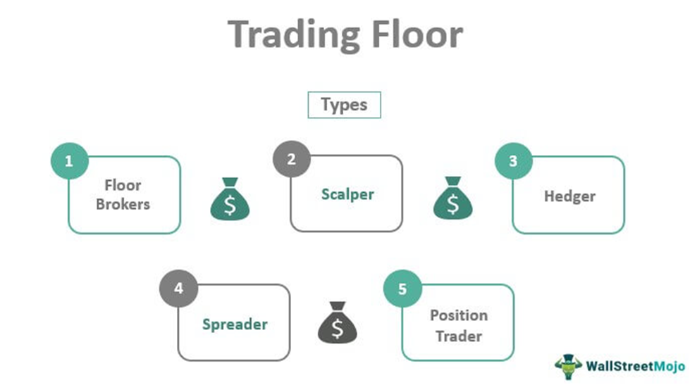

Financial markets are complex ecosystems that facilitate the exchange of financial instruments such as stocks, bonds, and currencies. These markets are essential for the functioning of modern economies, providing liquidity and enabling the efficient allocation of resources. Traders play a critical role in these markets, acting as intermediaries who buy and sell assets to capitalize on price fluctuations and, in doing so, contribute significantly to liquidity and price discovery. By accommodating both buyers and sellers, traders help ensure that markets operate smoothly and efficiently.

The concept of the trading floor has been central to financial markets since their inception. Traditionally, these were physical spaces where traders gathered to execute transactions through an open outcry system—a method that involved verbal bids and offers. The trading floor was not just a location but a dynamic environment where market orders were communicated in a highly structured yet frantic manner. This method was instrumental in establishing transparent pricing and nurturing robust market dynamics during the early years of organized exchanges.

However, the landscape of trading began to shift drastically with the emergence of algorithmic trading in the latter part of the 20th century. Algorithmic trading refers to the use of computer algorithms to automate trading decisions, execute orders, and manage positions. This technological breakthrough marked a departure from the traditional, human-driven process, introducing a level of speed and efficiency previously unattainable. Algorithms can process vast amounts of data and execute trades in milliseconds, a capability that has redefined trading strategies across financial markets.

The purpose of this article is to explore the evolution and interplay of traditional trading methods with modern algorithmic approaches. As these two paradigms have developed, they have not only transformed the mechanics of trading but have also prompted significant shifts in the skills and strategies required by traders. Understanding both traditional and algorithmic trading is crucial in appreciating the nuances of current market operations and for effectively navigating future innovations.

For traders and financial professionals, this exploration is particularly pertinent. The transition towards more automated forms of trading demands a reevaluation of skill sets and strategies. At the same time, the enduring principles of traditional trading still hold significant value. This article aims to shed light on this transition, offering insights that are vital for anyone engaged in financial markets today. As the industry continues to evolve, traders must be adept at leveraging both traditional insights and cutting-edge technologies to maintain a competitive edge.

## Table of Contents

## Understanding Financial Markets

Financial markets are platforms where individuals and entities engage in the exchange of financial assets, such as stocks, bonds, and currencies. These markets play a crucial role in the global economy by enabling the allocation of resources, facilitating the raising of capital, and offering a means for risk management through derivative products.

**Types of Financial Markets**

1. **Stock Markets**: These are venues where shares of publicly held companies are issued and traded. The buying and selling of these share represent an investment in corporate equity. Major stock markets include the New York Stock Exchange (NYSE) and the NASDAQ.

2. **Bond Markets**: Also known as debt markets, these involve the issuance and trading of debt securities. Corporations and governments use this market to raise capital by issuing bonds. The major participants are institutional investors, government treasuries, and corporations.

3. **Foreign Exchange Markets (Forex)**: The forex market is a global decentralized market for the trading of currencies. It is the largest financial market in the world, with a daily trading volume exceeding $6 trillion. Currency pairs, such as EUR/USD or GBP/JPY, are traded continuously across various time zones.

4. **Commodity Markets**: These markets deal in primary economic sector products, such as oil, gold, or agricultural products. They facilitate trading either in the spot market or through futures contracts.

5. **Derivatives Markets**: In these markets, financial instruments such as futures, options, and swaps are traded, which derive their value from underlying assets like stocks, bonds, or commodities.

**Role of Traders**

Traders are instrumental in maintaining the [liquidity](/wiki/liquidity-risk-premium) and efficiency of financial markets. They facilitate price discovery, which is the process of determining the fair market price of an asset through the interaction of supply and demand. Market liquidity refers to the ease with which an asset can be bought or sold without affecting its price. Traders ensure that markets remain liquid by constantly buying and selling assets, thereby reducing the bid-ask spread and enhancing market stability.

**Differences Between Retail and Institutional Traders**

Traders can be broadly classified into two categories: retail and institutional. 

- **Retail Traders**: These traders are individual investors who buy and sell securities for their personal accounts. They usually engage in trading through online brokerage platforms with relatively small investment capital.

- **Institutional Traders**: These comprise large entities such as mutual funds, pension funds, insurance companies, and hedge funds. They trade in much larger volumes, often influencing market movements due to their substantial buying and selling power. Institutional traders have access to advanced trading tools, research, and insights that are typically not available to retail traders.

**Market Dynamics and Trading Decisions**

Market dynamics are influenced by various factors such as economic data releases, geopolitical events, [interest rate](/wiki/interest-rate-trading-strategies) changes, and corporate earnings reports. Traders analyze these factors to make informed trading decisions. 

For instance, economic indicators like GDP growth, unemployment rates, or inflation can signal the health of an economy, influencing investor sentiment and trading activity. Geopolitical tensions, such as trade wars or military conflicts, can create uncertainty and [volatility](/wiki/volatility-trading-strategies), impacting riskier assets such as equities.

Interest rates, determined by central banks, have a critical role in financial markets. They affect the cost of borrowing, consumer spending, and investment, influencing asset prices across the board. Traders often employ a combination of technical analysis, which involves statistical tools and chart patterns, and [fundamental analysis](/wiki/fundamental-analysis), focusing on economic indicators and company financials, to predict market movements and devise their strategies.

In summary, understanding the intricacies of financial markets involves recognizing the various types and roles of traders, the significance of liquidity and price discovery, and the multitude of factors affecting market sentiment and decision-making.

## The Trading Floor: A Hub of Financial Activity

The trading floor has long been a central element of financial markets, serving as a bustling hub where traders gather to buy and sell financial instruments. Historically, trading floors operated on a system known as open outcry, where traders vocalized bids and offers across the trading pit. This system, while robust in its time, was characterized by a chaotic atmosphere filled with hand signals and shouting. Open outcry facilitated real-time price discovery and allowed for immediate trade executions, elements crucial to market efficiency.

As technology advanced, electronic trading platforms began to supplant physical trading floors. By the late 20th century, exchanges like the New York Stock Exchange (NYSE) and the Chicago Mercantile Exchange (CME) incorporated electronic systems, gradually transitioning away from open outcry. This shift enabled faster trade execution, improved market access, and reduced the cost of trading. The digitization of trading floors marked a significant transformation in how financial markets operated, echoing broader technological trends across industries.

A traditional trading floor was a vibrant environment where each person had a specific role. Key figures included brokers, who acted as intermediaries executing trades on behalf of clients; traders, who bought and sold assets for profit; and market makers, who provided liquidity by continuously quoting buy and sell prices. These roles were integral to market functionality, ensuring liquidity and facilitating smooth trading operations.

Trading on a physical floor afforded several advantages. The immediate human interaction provided a dynamic form of communication and negotiation, invaluable for complex trades. The tangible nature of this environment also fostered a strong sense of camaraderie and competition among traders, motivating performance and innovation. However, the physicality of trading floors also posed challenges. The intensity of open outcry environments could lead to errors, and the necessity of physical presence limited access to those in proximity to the exchange.

Despite the decline of traditional trading floors due to the rise of electronic systems, their legacy persists. The physical trading floor was not only a place of business but also a symbol of financial markets’ dynamism and the human element in trading, aspects that continue to influence modern market structures.

 to Algorithmic Trading

Algorithmic trading refers to the use of computer algorithms to execute trades in financial markets with minimal human intervention. These algorithms are designed to make rapid decisions based on predetermined criteria, allowing traders to take advantage of market movements and execute large volumes of trades with high precision. Algorithmic trading has emerged as a dominant force in financial markets, driven by the advent of advanced technology and increased computational power.

The rise of technology has profoundly impacted trading strategies, enabling the development of sophisticated algorithms that can analyze vast datasets at lightning speed. This technological revolution in trading is characterized by the deployment of high-frequency trading ([HFT](/wiki/high-frequency-trading-strategies)), where algorithms execute trades within fractions of a second. This level of speed is unattainable by human traders, offering a significant competitive advantage by enabling the exploitation of minute price discrepancies that can occur in extremely short time frames.

Common [algorithmic trading](/wiki/algorithmic-trading) strategies vary in complexity and purpose. Arbitrage strategies seek to profit from price differentials of the same asset in different markets, ensuring a risk-free profit. Market making algorithms provide liquidity to the markets by simultaneously placing buy and sell orders, benefiting from the bid-ask spread. Trend following strategies, on the other hand, involve identifying and riding on established market trends, relying on historical price data and technical indicators to forecast future movements.

The benefits of algorithmic trading are numerous. Speed and efficiency are perhaps the most notable advantages, as algorithms can process information and execute trades far more quickly than human traders. This rapid execution not only increases the chances of profiting from market opportunities but also reduces the impact of market volatility on large trades. Additionally, algorithms are devoid of the emotional biases that can affect human traders, allowing for more consistent and strategic decision-making.

In conclusion, algorithmic trading represents a significant transformation in trading methodologies, driven by technological advancements that enable faster, more efficient, and consistent trading operations. As technology continues to evolve, the role of algorithms in trading is expected to expand, further shaping the dynamics of financial markets.

## Comparing Traditional and Algorithmic Trading

Traditional and algorithmic trading represent two distinct methodologies in financial markets, primarily differing in their decision-making processes. Human traders rely on intuition, experience, and emotional intelligence to make trading decisions. This approach leverages qualitative insights, such as an understanding of market sentiment, geopolitical events, and economic announcements, which can significantly impact market movements. However, this subjectivity can lead to inconsistent results due to cognitive biases or emotional responses.

In contrast, algorithmic trading employs quantitative, data-driven strategies to execute trades. Algorithms use mathematical models to analyze vast amounts of data, identifying patterns and executing trades based on predefined criteria. For example, algorithmic trading often involves statistical [arbitrage](/wiki/arbitrage), where algorithms exploit price discrepancies between related financial instruments. The use of algorithms allows for high-frequency trading, leading to improved speed and efficiency in executing trades.

The role of human intuition, while valuable, is often constrained by biases and the limited capacity to process large datasets quickly. Algorithms, however, are designed to handle complex calculations and data analyses rapidly, enabling them to respond to market changes with precision and consistency. This transition from human-centric trading to a more algorithmic approach has transformed the trading floor, reducing the need for physical presence and enabling global, 24/7 market participation.

However, both traditional and algorithmic trading have inherent risks and limitations. Traditional trading is susceptible to human errors, psychological biases, and slower reaction times. On the other hand, algorithmic trading can face issues such as technical failures, reliance on historical data that may not predict future market conditions, and the potential for exacerbating market volatility through high-frequency trades.

In summary, while algorithmic trading offers enhanced efficiency and objectivity, the human intuition prevalent in traditional trading remains valuable for interpreting nuances that purely quantitative strategies might overlook. Both methods have distinct advantages and drawbacks, which traders must consider when developing their strategies. As financial markets continue to evolve, a hybrid approach may merge the strengths of human and algorithmic trading to optimize performance and manage risks effectively.

## Regulations and Ethical Considerations

Financial markets are complex ecosystems, governed by a myriad of regulatory frameworks designed to ensure fairness, transparency, and stability. These regulatory norms vary significantly across different regions and types of markets but generally aim to prevent fraudulent activities, protect investors, and maintain orderly market conduct.

## Regulatory Frameworks Governing Financial Markets

The regulatory landscape of financial markets is shaped by agencies such as the U.S. Securities and Exchange Commission (SEC) and the European Securities and Markets Authority (ESMA) in Europe. These bodies formulate rules overseeing market activities, aiming to mitigate systemic risk and enhance investor protection. For instance, the Dodd-Frank Wall Street Reform and Consumer Protection Act in the United States was enacted following the 2008 financial crisis to promote financial stability by enhancing accountability and transparency in the financial system.

In Europe, the Markets in Financial Instruments Directive (MiFID II) serves a similar purpose, aiming to integrate financial markets across the European Union and improve market efficiency by increasing transparency and safeguarding investors. Both frameworks underscore the importance of compliance and set stringent requirements for trading activities and reporting standards. 

## Ethical Concerns: High-Frequency Trading and Market Manipulation

Ethical concerns prominently arise regarding high-frequency trading (HFT), a form of algorithmic trading leveraging powerful computers to execute large numbers of orders at extremely rapid speeds. Critics argue that HFT can lead to market manipulation and create unfair advantages, undermining market fairness. For example, the practice of "quote stuffing" involves placing a large number of orders with the intent to slow down other participants’ trading processes, thus distorting market behavior.

Moreover, the potential for flash crashes, sudden and steep market price drops caused by HFT algorithms, raises significant concerns. The infamous 2010 flash crash, where the Dow Jones Industrial Average plunged about 1,000 points within minutes, underscored the risks associated with high-speed trading.

## Importance of Compliance and Responsible Trading Practices

Amid these ethical concerns, compliance with regulations is crucial. Firms are required to implement robust monitoring systems to ensure adherence to legal standards and protect against misconduct. Compliance helps maintain market integrity and investor trust, which are foundational to the functioning of financial markets. Traders and financial institutions must adopt responsible trading practices, implementing ethical guidelines that not only follow the law but also promote fair play and transparency.

For traders engaging in algorithmic strategies, it is essential to ensure that their algorithms are regularly audited, and potential loopholes are identified and addressed. Robust risk management practices, along with thorough testing and validation of algorithms, are vital steps in maintaining compliance and upholding ethical standards.

## Future Regulatory Trends

Looking ahead, regulatory frameworks are expected to evolve alongside advancements in technology and trading practices. As [artificial intelligence](/wiki/ai-artificial-intelligence) and [machine learning](/wiki/machine-learning) become increasingly integrated into trading, regulators may introduce more specialized guidelines to address the unique challenges posed by these technologies. Concepts such as explainability of AI and accountability for algorithmic decisions are likely to gain prominence in regulatory discussions.

Additionally, ongoing debates around [cryptocurrency](/wiki/cryptocurrency) trading and decentralized finance (DeFi) are prompting regulators worldwide to consider novel approaches for overseeing these rapidly developing markets. The evolving landscape suggests that traders and financial professionals must stay abreast of regulatory changes, ensuring that they remain compliant while adapting to new market dynamics. 

Continuous dialogue between regulatory bodies, market participants, and technology developers will be crucial in shaping a regulatory environment that balances innovation with the need for robust market oversight.

## The Future of Trading: A Hybrid Approach

The landscape of trading continues to evolve rapidly, with emerging trends indicating a shift toward more integrated systems that leverage both human expertise and algorithmic efficiency. This hybrid approach is anticipated to be a transformative phase in the trading environment, driven by advancements in artificial intelligence (AI) and machine learning technologies.

AI and machine learning are increasingly being applied to financial markets, enhancing decision-making through data-driven insights. Algorithms can analyze vast datasets at speeds far beyond human capability, identifying patterns and executing trades with precision. Machine learning models, particularly those involving [deep learning](/wiki/deep-learning) and [reinforcement learning](/wiki/reinforcement-learning), contribute to the predictive analytics essential for developing sophisticated trading strategies.

A hybrid model presents the potential to optimize trading operations by combining the nuanced understanding and intuition of human traders with the computational power of algorithms. Humans excel in qualitative analysis, understanding market sentiment, and establishing strategic long-term perspectives. Algorithms, conversely, handle quantitative analysis, processing large volumes of data to identify short-term opportunities and execute trades swiftly. 

The integration of AI can be exemplified in the development of systems where human oversight works alongside algorithmic processes to adjust strategies dynamically based on real-time feedback—a method commonly referred to as "human-in-the-loop" systems. This collaborative method aims to mitigate the limitations inherent in both human-led and fully automated trading systems.

The implications for employment and skill requirements are significant. As trading becomes increasingly tech-driven, demand grows for professionals who can bridge finance and technology—individuals skilled not only in trading but also in coding, statistical analysis, and the use of AI tools. Financial institutions are likely to seek individuals with expertise in data sciences, quantitative analysis, and software development to adapt to the changing landscape.

To thrive in this evolving environment, traders must focus on continuous learning and skill enhancement. Adapting involves acquiring proficiency in algorithmic trading platforms, understanding AI models, and developing coding skills, particularly in languages like Python, which is widely used for its versatility and extensive libraries supporting financial analysis and machine learning.

The trading sector is on the brink of a paradigm shift, where the synthesis of human ingenuity and machine precision is set to redefine market strategies. Traders poised to embrace these changes and enhance their capabilities through education and expertise diversification are more likely to succeed in the technology-driven future of trading.

## Conclusion

The financial markets have undergone a dramatic evolution, transitioning from bustling trading floors filled with the clamor of human activity to the silent, efficient operations of advanced algorithmic systems. This transformation has significantly reshaped the landscape in which traders operate, highlighting the necessity for participants to remain agile and informed.

Traditional trading methods, characterized by the vibrant energy of open outcry on physical trading floors, have played a pivotal role in shaping the history and dynamics of financial markets. Human traders brought intuition and personal judgment to their roles, facilitating liquidity and price discovery. The rise of algorithmic trading, driven by technological advancements, has introduced an era marked by speed, precision, and data-driven decision making. Algorithmic strategies, such as arbitrage, [market making](/wiki/market-making), and [trend following](/wiki/trend-following), have emerged as influential forces, capable of executing trades at speeds unattainable by humans.

Understanding both these approaches is crucial for financial professionals aiming to navigate the continually evolving market landscape. While the efficiencies of algorithmic trading are undeniable, traditional methods still hold value, particularly in areas where human intuition and complex decision-making are required. The interplay between these two modes of trading presents both challenges and opportunities, necessitating robust regulatory frameworks to ensure ethical practices and market integrity.

As technology continues to advance, the future will likely favor a hybrid model that synergizes human expertise with algorithmic efficiency. Traders and financial professionals must remain committed to lifelong learning and adaptability, acquiring new skills that merge computational proficiency with traditional market insights. Embracing this dual approach will enable them to thrive in an industry poised for further innovation and transformation.

## References & Further Reading

[1]: Aldridge, I. (2009). ["High-Frequency Trading: A Practical Guide to Algorithmic Strategies and Trading Systems"](https://www.ahmetbeyefendi.com/wp-content/uploads/2020/07/High-Frequency-Trading-Irene-Aldridge.pdf). Wiley Finance.

[2]: Narang, R. J. (2009). ["Inside the Black Box: The Simple Truth About Quantitative Trading"](https://onlinelibrary.wiley.com/doi/book/10.1002/9781118267738). Wiley.

[3]: Patterson, S. (2013). ["Dark Pools: The Rise of the Machine Traders and the Rigging of the U.S. Stock Market"](https://www.amazon.com/Dark-Pools-Machine-Traders-Rigging/dp/0307887189). Crown Business.

[4]: Harris, L. (2003). ["Trading and Exchanges: Market Microstructure for Practitioners"](https://academic.oup.com/book/52292). Oxford University Press.

[5]: O'Hara, M. (1995). ["Market Microstructure Theory"](https://www.semanticscholar.org/paper/Market-Microstructure-Theory-O'Hara/2bd0833b023f3270a2a6bf301e86b8e02e2f28ed). Wiley-Blackwell.