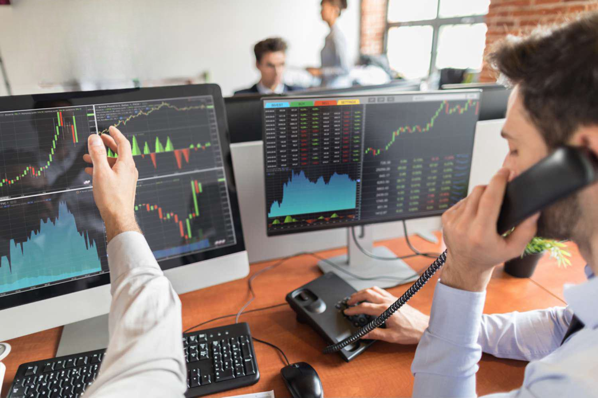

The financial trading landscape has undergone significant changes with the integration of technology, fundamentally altering how trades are executed and how traders operate within markets. Initially dominated by traditional floor traders, who physically managed trades in bustling exchange pits, the trading industry has shifted towards electronic platforms and algorithmic strategies. This shift has transformed both the speed and efficiency of trading, rendering the roles and skill sets in this sector increasingly diverse and technologically oriented.

Floor traders, once central to trading activities, were indispensable in facilitating transactions and ensuring market liquidity by acting as intermediaries in the trading pits. Their expertise in interpreting signals from the trading floor and making split-second decisions was crucial. As technology progressed, the physical presence and unique skills of floor traders began to be supplanted by the efficiency and precision of algorithmic trading systems, which have become a vital component of modern financial markets.



Algorithmic trading employs computer programs to execute trades based on pre-established criteria, allowing for rapid analysis of market data and execution of trades with minimal human intervention. Its rise represents a paradigm shift in market operations, offering significant advantages such as speed, precision, and the ability to handle massive volumes of data. This technological evolution requires traders and financial firms to adapt by acquiring new skills and understanding the complexities of algorithm-driven environments.

Understanding both traditional and modern trading methods is essential for professionals engaged in today's trading industry. As the market continues to evolve, the ability to combine traditional trading wisdom with cutting-edge technology will be crucial. This grasp of the changing dynamics is not only relevant for current market participants but also offers valuable insights for those aspiring to enter the financial trading sector.

## Table of Contents

## Role of a Floor Trader

Floor traders have historically played a critical role in stock and commodity exchanges, acting as the intermediaries who physically executed trades on the floor of a trading exchange. Operating amidst the vibrant and noisy environment of trading pits, they became iconic figures of financial markets. These traders primarily engaged in buying and selling financial instruments for their accounts, thereby providing essential liquidity to the market. This function helps to tighten the bid-ask spreads, which are the differences between the highest price a buyer is willing to pay for an asset and the lowest price a seller is willing to accept. By narrowing these spreads, floor traders contribute to more efficient market pricing.

Despite the technological advancements that have significantly altered the landscape of financial trading, replacing many traditional roles with electronic systems, the importance of floor traders persists in certain market segments. Particularly in niche markets where personal interactions and physical presence still yield a competitive edge, floor traders remain vital. Their expertise in gauging market sentiment through human interactions and their adeptness at executing large trades without negatively impacting market prices are skills that are less replicable by automated systems.

Overall, while the number of floor traders has dwindled with the rise of [algorithmic trading](/wiki/algorithmic-trading) and electronic platforms, they continue to maintain a significant presence in specific contexts where human experience and the ability to operate in dynamic situations are of paramount importance.

## Requirements to Become a Floor Trader

Becoming a floor trader requires a solid understanding of trading practices and the specific rules and requirements of the exchange on which one intends to trade. The process begins with a thorough screening that assesses the applicant's suitability and preparedness for active trading. One of the primary steps is the submission of Form 8-R, a regulatory document that collects necessary personal and professional information. This form is typically required by entities such as the National Futures Association (NFA) and provides a basis for the applicant's registration as an associated person of a member firm.

In addition to Form 8-R, applicants must provide fingerprint cards. This step is crucial for conducting background checks, ensuring compliance with legal and regulatory standards. The use of fingerprint identification helps maintain the integrity of the trading environment by preventing individuals with problematic legal histories from participating in trade activities.

Another critical requirement is proof of granted trading privileges. This involves demonstrating that the applicant has been authorized to trade on the exchange. This authorization can be obtained through membership in the exchange or through an association with a member firm that provides access to the trading platform. Such proof underscores the applicant's readiness to engage actively in trading and their adherence to exchange protocols.

Success in floor trading also hinges on strict adherence to the exchange's rules. Each exchange has a unique set of guidelines that govern trading activities, and understanding these regulations is essential. Floor traders must be adept at interpreting and complying with these rules to avoid penalties and ensure smooth trading operations.

Additionally, a key attribute for any successful floor trader is the ability to analyze market conditions effectively. This involves staying informed about market trends, economic indicators, and other factors that influence market dynamics. A trader's ability to make informed decisions based on this analysis often distinguishes profitable trades from less successful ones.

Overall, becoming a floor trader involves a combination of regulatory compliance, market analysis skills, and a commitment to upholding the standards of the trading community. As technology and markets evolve, these requirements may also shift, necessitating ongoing education and adaptation.

## Transition to Algorithmic Trading

The emergence of electronic trading platforms has fundamentally altered how trading occurs, effectively transitioning many traditional roles of floor traders towards algorithmic trading. Floor traders, who once populated bustling trading pits, are being progressively replaced by algorithms that facilitate trades faster and more efficiently through the power of technology.

Algorithmic trading, often referred to as algo trading, involves the use of computer programs to execute trades based on predefined rules and instructions. These algorithms utilize high-speed data analysis, enabling them to swiftly process vast quantities of market information and make informed decisions almost instantaneously. The efficiency of algo trading stems from its ability to analyze data beyond human capacity and execute trades at speeds measured in milliseconds. This capability is crucial in modern markets where price discrepancies and [arbitrage](/wiki/arbitrage) opportunities exist only momentarily.

When comparing algorithmic trading to traditional floor trading methods, several key differences emerge:

1. **Speed**: Algo trading is markedly faster than manual methods. Algorithms can scan and react to market conditions within milliseconds, leveraging electronic market data feeds and executing trades before a human trader can even recognize the opportunity. This speed advantage is particularly critical in volatile markets.

2. **Precision**: Algorithmic trading provides a level of precision unattainable by human traders. Algorithms execute trades based on specific criteria, ensuring that trades conform to strategies without the interference of human emotions or errors. For example, an algorithm can precisely enter or exit a position when a stock reaches a predetermined price, with no deviation from its programmed conditions.

3. **Scope and Scalability**: Algorithms can manage a vast array of trades simultaneously across multiple markets and asset classes. This scalability allows for widespread diversification and risk management strategies that would be impossible for floor traders due to physical and cognitive limitations. Additionally, algorithms can be programmed to execute complex strategies, such as spread trading or arbitrage, on a scale that human traders cannot efficiently replicate.

The transition to algorithmic trading signifies a move towards automated and data-driven strategies. As markets continue to evolve with technology, the role of traders is increasingly becoming one of oversight and strategy development, leaving the rapid execution and analysis to sophisticated algorithms that can operate continuously across global markets. This shift underscores the ongoing transformation in trading roles, fueled by technological advancement and market dynamics.

## Types and Strategies of Algorithmic Trading

Algorithmic trading uses various strategies, each designed to meet specific market objectives. Key strategies include trend-following, [statistical arbitrage](/wiki/statistical-arbitrage), and market-making. These strategies utilize algorithmic precision and speed, enabling traders to maximize efficiency and market responsiveness.

Trend-following strategies exploit the [momentum](/wiki/momentum) of price movements in financial markets. They rely on technical indicators like moving averages and breakouts to determine entry and [exit](/wiki/exit-strategy) points. The goal is to capitalize on sustained market trends without predicting specific price levels.

Statistical arbitrage involves exploiting price discrepancies between correlated instruments and may utilize models such as the mean-reversion model. This approach often relies on statistical and mathematical models, employing quantitative methods to identify mispriced securities. A simple example is the pairs trading strategy, where two correlated stocks diverge in their relative prices.

Market-making strategies provide [liquidity](/wiki/liquidity-risk-premium) by offering to buy at a lower price and sell at a higher price, profiting from the bid-ask spread. This approach requires rapid execution and continuous pricing updates to maintain competitive quotes.

High-frequency trading ([HFT](/wiki/high-frequency-trading-strategies)) represents the forefront of algorithmic strategies, capable of executing trades within microseconds. This approach leverages advanced technologies and infrastructure to capitalize on fleeting market opportunities. HFT strategies often incorporate elements from the aforementioned strategies but with an emphasis on speed and [volume](/wiki/volume-trading-strategy).

To effectively utilize algorithmic strategies, traders must comprehend their underlying mechanics. This involves analyzing historical data, understanding market behavior, and employing robust risk management practices. By mastering these strategies, traders can enhance their market participation and potential profitability.

## Benefits and Challenges of Algorithmic Trading

Algorithmic trading, often referred to as algo trading, has revolutionized modern financial markets by leveraging automated systems to execute trades. This method offers several advantages that have made it an attractive choice for many traders and institutions.

One of the primary benefits of algorithmic trading is the reduction of transaction costs. By automating the trading process and reducing the need for human intervention, algo trading minimizes the inefficiencies associated with manual trading. Algorithms can rapidly analyze market data and execute orders without the delays that typically impact human traders.

Additionally, algorithmic trading allows for emotional detachment from trading decisions. Human traders can be influenced by emotions such as fear and greed, which can result in impulsive decisions and trading errors. In contrast, algorithms adhere strictly to predefined rules and strategies, ensuring that trades are executed based on systematic analysis rather than emotional reactions.

Rapid execution is another significant advantage. Algorithms operate at high speeds, processing and executing orders in milliseconds or microseconds. This speed is crucial in markets where price movements occur in fractions of a second, allowing traders to capitalize on fleeting opportunities and maintain competitive edges.

However, algorithmic trading also presents several challenges. Technical failures can pose serious risks; software or hardware malfunctions can lead to unintended trades or missed opportunities. Additionally, algorithms can be subject to overfitting, where they perform well on historical data but fail to adapt to real-time, changing market conditions. This risk underscores the importance of rigorous testing and adaptive algorithms.

Market impact is another challenge. As many traders employ similar algorithms, there's a potential for market disruption. If numerous algorithms execute similar trades simultaneously, it can lead to [volatility](/wiki/volatility-trading-strategies) and significant price movements. This scenario necessitates that algorithms are designed with consideration for their potential impact on market liquidity and [order book](/wiki/order-book-trading-strategies) dynamics.

In navigating these pros and cons, traders must remain vigilant. Successful algorithmic trading demands robust technical infrastructure, continuous monitoring, and a thorough understanding of the strategies employed. By addressing the inherent challenges, traders can harness the full potential of algorithmic methods while mitigating risks.

## The Future of Trading Roles

As the trading world continues to evolve, the roles and tools available to traders must adapt to keep pace with technological advancements. Algorithmic trading has established itself as a crucial component of modern trading, allowing for the execution of trades at lightning speed with a level of precision that far surpasses human capabilities. However, understanding the core principles of traditional trading, such as intuition and understanding market sentiment, remains vital for traders navigating this evolving landscape.

Algorithmic trading, often relying on complex mathematical models and high-frequency trading (HFT), processes transactions in microseconds ([Aldridge, I. (2013). _High-Frequency Trading: A Practical Guide to Algorithmic Strategies and Trading Systems._ Wiley](https://www.wiley.com/en-us/High+Frequency+Trading:+A+Practical+Guide+to+Algorithmic+Strategies+and+Trading+Systems-p-9781118343500)). These algorithms can identify and exploit market inefficiencies that human traders might miss. However, their effectiveness largely depends on clean data, robust algorithms, and powerful computing capabilities. As trading technology advances, the collaboration between human expertise and algorithmic precision becomes increasingly significant. Human traders are required to design and monitor these algorithms, ensuring they function as intended and adapt to market changes.

Python code, often used for developing algorithmic trading strategies, can illustrate this blend of technology and human oversight. Consider a simple moving average crossover strategy, where a buy signal is generated when a short-term moving average crosses above a long-term moving average:

```python
import numpy as np
import pandas as pd

# Generate example data
data = pd.DataFrame({'price': np.random.rand(100)})

# Calculate moving averages
data['short_mavg'] = data['price'].rolling(window=5).mean()
data['long_mavg'] = data['price'].rolling(window=20).mean()

# Generate trading signals
data['signal'] = 0
data.loc[data['short_mavg'] > data['long_mavg'], 'signal'] = 1

print(data.tail())
```

This simple strategy showcases the potential for combining human-devised strategies with automated execution. Future trading landscapes are expected to feature such a blend of human and machine strengths. While algorithms offer speed and efficiency, human intuition and judgment remain critical for decision-making and strategy formulation.

Market efficiency is likely to be enhanced by this symbiosis. Algorithms handle the execution of trades, data analysis, and identification of patterns, while human expertise contributes to strategic oversight and adaptation to unforeseen market conditions. Traders who can seamlessly integrate these two elements will likely lead the charge in the future of trading.

The trading roles of tomorrow will not only include technical experts capable of developing sophisticated trading systems but also those who understand traditional market dynamics. As algorithmic trading continues to grow, traders' ability to maintain a balance between technological advancements and fundamental trading knowledge will be crucial in navigating future trading landscapes.

## Conclusion

The dynamic landscape of financial trading is evolving rapidly, influenced heavily by technological advances and shifting market demands. As a result, trading roles are being redefined, with a significant shift from traditional floor trading methods towards modern algorithmic strategies. This evolution demands that traders not only remain informed but also adaptable to the changing tools and practices.

Traditional floor trading, characterized by direct human interaction and decision-making on trading floors, instilled a deep understanding of market mechanisms. This intuitive grasp of market dynamics is still crucial, providing a foundational knowledge that supports informed decision-making. However, the rise of algorithmic trading is transforming how trades are executed, emphasizing speed, precision, and efficiency through advanced computational methods.

Algorithmic trading strategies utilize complex algorithms to analyze market data and execute trades, often at speeds and volumes unattainable by human traders. This trading evolution provides opportunities for enhanced market analysis and transaction optimization. Nonetheless, it poses challenges, including the risk of algorithmic errors and the need for technical expertise in developing and managing these systems.

Balancing these technological advancements with traditional trading knowledge is essential for success in contemporary markets. While technology offers numerous advantages, the human element—insight, intuition, and experience—remains invaluable. The future of trading will likely be characterized by a harmonious blend of these elements, where human expertise and algorithmic precision work together to optimize market efficiency. Embracing this future requires a commitment to ongoing learning and adaptation, equipping traders to navigate an ever-evolving financial landscape effectively.

## References & Further Reading

[1]: ["Advances in Financial Machine Learning"](https://www.amazon.com/Advances-Financial-Machine-Learning-Marcos/dp/1119482089) by Marcos Lopez de Prado

[2]: ["High-Frequency Trading: A Practical Guide to Algorithmic Strategies and Trading Systems"](https://www.amazon.com/High-Frequency-Trading-Practical-Algorithmic-Strategies/dp/1118343506) by Irene Aldridge

[3]: Bergstra, J., Bardenet, R., Bengio, Y., & Kégl, B. (2011). ["Algorithms for Hyper-Parameter Optimization."](https://dl.acm.org/doi/10.5555/2986459.2986743) Advances in Neural Information Processing Systems 24.

[4]: ["Quantitative Trading: How to Build Your Own Algorithmic Trading Business"](https://www.amazon.com/Quantitative-Trading-Build-Algorithmic-Business/dp/1119800064) by Ernest P. Chan

[5]: ["Evidence-Based Technical Analysis: Applying the Scientific Method and Statistical Inference to Trading Signals"](https://www.amazon.com/Evidence-Based-Technical-Analysis-Scientific-Statistical/dp/0470008741) by David Aronson

[6]: ["Machine Learning for Algorithmic Trading"](https://www.amazon.com/Machine-Learning-Algorithmic-Trading-alternative/dp/1839217715) by Stefan Jansen