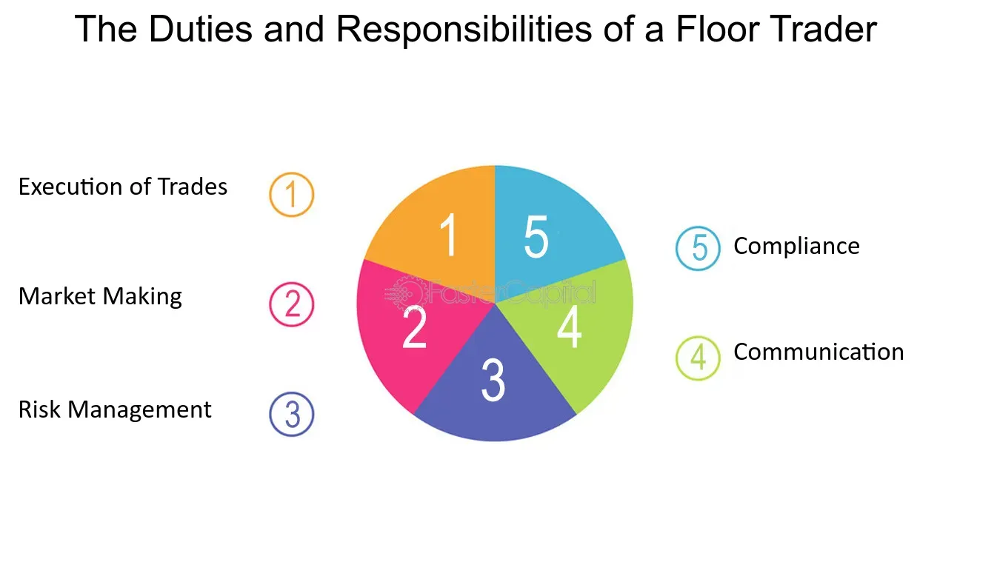

## Table of Contents

## What is a floor trader?

A floor trader is a person who works on the trading floor of a stock exchange. They buy and sell stocks, bonds, and other financial products for their own account. This means they are not working for a client but are trying to make money for themselves. Floor traders use their knowledge and experience to make quick decisions about when to buy and sell.

In the past, floor traders were very important because they helped to set the prices of stocks and other financial products. They would shout and use hand signals to communicate with each other on the busy trading floor. However, with the rise of electronic trading, the role of floor traders has become less common. Today, most trading is done through computers, but some exchanges still have floor traders.

## What are the primary responsibilities of a floor trader?

A floor trader's main job is to buy and sell stocks, bonds, and other financial products for their own account. This means they use their own money to make trades and try to make a profit. They need to be quick and smart because they have to make fast decisions about when to buy and sell. They also need to keep an eye on the market all the time to know what is happening.

Another important responsibility is to help set the prices of the financial products they trade. On the trading floor, floor traders communicate with each other using shouts and hand signals to agree on prices. This helps to create a fair market where everyone knows the current price. Even though electronic trading is more common now, floor traders still play a role in some exchanges by adding to the market's energy and helping to set prices.

## How does a floor trader differ from other trading roles?

A floor trader is different from other trading roles because they trade for themselves, not for clients. This means they use their own money to buy and sell stocks, bonds, and other financial products. They try to make a profit for themselves, not for someone else. Other trading roles, like brokers or dealers, usually trade on behalf of clients. Brokers help clients buy and sell, while dealers trade for their firm and hold an inventory of securities.

Another big difference is where floor traders work. They are on the trading floor of a stock exchange, where they shout and use hand signals to communicate. This is very different from other traders who might work in quiet offices and use computers to trade. Floor traders help set prices by agreeing on them with other traders on the floor. While electronic trading has become more common, floor traders still play a unique role in some exchanges by adding energy and helping to set prices in a very direct way.

## What are the basic educational requirements to become a floor trader?

To become a floor trader, you usually need at least a bachelor's degree. Many floor traders have degrees in finance, economics, or business. These subjects help you understand how markets work and how to make smart trading decisions. Some people also get a master's degree, like an MBA, to learn even more about finance and business.

Besides a degree, you need to know a lot about the stock market and trading. You can learn this by working in a related job first, like being a stockbroker or a financial analyst. Some people also take special courses or get certifications to learn more about trading. It's important to keep learning because the market changes all the time.

## What kind of licenses or certifications are needed for a floor trader?

To become a floor trader, you need to get a license from the Financial Industry Regulatory Authority (FINRA). The most common license for this job is the Series 7 license, which lets you buy and sell securities. To get this license, you have to pass a test that covers topics like stocks, bonds, and how the market works. It's a hard test, so you need to study a lot.

Besides the Series 7, you might need other licenses too. For example, if you want to trade options, you need the Series 4 license. Some exchanges also have their own rules and might need you to get special certifications. It's a good idea to check with the exchange where you want to work to see what licenses they need. Keeping up with these licenses means you have to take classes and pass tests every few years to stay current.

## What skills are essential for someone aspiring to be a floor trader?

To be a good floor trader, you need to be quick and smart. You have to make fast decisions about when to buy and sell stocks, bonds, and other things. This means you need to be good at math and understand how the market works. You also need to be able to handle a lot of stress because the trading floor can be very busy and loud. Being able to stay calm and focused is really important.

Another important skill is communication. On the trading floor, you use shouts and hand signals to talk to other traders. You have to be clear and fast so everyone understands what you're saying. Being good at working with others is also helpful because you might need to make deals with other traders. Finally, you need to keep learning because the market changes all the time. Staying up to date with new information and rules is a big part of the job.

## How does the trading environment affect the role of a floor trader?

The trading environment on the floor of a stock exchange is very busy and loud. Floor traders have to shout and use hand signals to talk to each other quickly. This fast and noisy place makes the job exciting but also stressful. Traders need to stay calm and focused even when things are moving fast around them. The energy of the trading floor can help traders make quick decisions, but it also means they have to be good at handling pressure.

As more trading moved to computers, the role of floor traders changed. Electronic trading made things quieter and more calm, but floor traders still have a special job. In some exchanges, they help set prices by talking directly to other traders. This adds energy to the market and helps keep things fair. Even though electronic trading is common, the lively and direct way floor traders work can still make a big difference in how the market works.

## What are the typical daily activities of a floor trader?

A floor trader starts their day early, usually before the market opens. They check the news and market reports to see what's happening. They look at the prices of stocks, bonds, and other things they trade. They also talk to other traders to get more information. Once the market opens, they go to the trading floor. They use shouts and hand signals to buy and sell things for themselves. They have to be quick and smart to make good trades.

During the day, a floor trader keeps watching the market. They make a lot of trades, trying to buy low and sell high to make money. They have to stay focused because the trading floor is busy and loud. They also need to talk to other traders to agree on prices. At the end of the day, they look at how they did. They see if they made money or lost money. They also think about what they can do better the next day.

## How does technology impact the work of floor traders?

Technology has changed the job of floor traders a lot. Before, floor traders had to be on the trading floor, shouting and using hand signals to buy and sell stocks. But now, with computers and electronic trading, many trades happen online. This means fewer people are needed on the trading floor. Some exchanges still have floor traders, but their job is different now. They use technology to help them make quick decisions and stay connected to the market.

Even though electronic trading is common, floor traders still have a special role. They add energy to the market and help set prices by talking directly to other traders. Technology helps them do this better by giving them more information and making it easier to communicate. But the fast and noisy trading floor is still important because it helps keep the market fair and lively. So, while technology has changed their job, floor traders still play a key part in how the market works.

## What are the potential career paths for a floor trader?

A floor trader can move into many different jobs in the finance world. They might become a stockbroker, where they help clients buy and sell stocks. Or they could become a financial analyst, looking at companies and giving advice on which stocks to buy. Some floor traders also go into trading for big banks or investment firms, where they trade for the company instead of themselves. These jobs use the skills floor traders learn, like understanding the market and making quick decisions.

Another path is to become a market maker, where they help keep the market running smoothly by always being ready to buy and sell certain stocks. Some floor traders also start their own trading firms, using their experience to make money for themselves and others. As they get more experience, they might move into management roles, like running a trading desk or even becoming a chief trading officer at a big company. The skills and knowledge they gain as floor traders can open up many different opportunities in the finance world.

## What are the common challenges faced by floor traders?

Being a floor trader can be tough. The trading floor is loud and busy, so traders have to handle a lot of stress. They need to make quick decisions about buying and selling stocks, and if they make a mistake, they can lose money. The market changes all the time, so they have to keep learning and stay up to date. It's hard to stay focused when things are moving so fast around them.

Another challenge is that electronic trading is becoming more common. This means fewer people are needed on the trading floor, so there are fewer jobs for floor traders. Even though they still have a special role, they need to adapt to new technology and learn how to use it to their advantage. It can be hard to keep their job when the way trading is done keeps changing.

## How can one stay competitive and advance in the role of a floor trader?

To stay competitive and advance as a floor trader, you need to keep learning. The market changes all the time, so you have to read news, study market trends, and take courses to stay up to date. Using technology can also help you make better trades. Many floor traders use computers to get more information and make quick decisions. By understanding and using new technology, you can be better at your job and stay ahead of others.

Building good relationships with other traders is also important. On the trading floor, talking to others can help you get the best prices and make good deals. Being friendly and working well with others can make you more successful. As you get more experience, you might also think about moving into other jobs in finance, like becoming a stockbroker or a financial analyst. This can help you advance your career and use the skills you learned as a floor trader in new ways.

## References & Further Reading

[1]: ["Advances in Financial Machine Learning"](https://www.amazon.com/Advances-Financial-Machine-Learning-Marcos/dp/1119482089) by Marcos Lopez de Prado

[2]: ["High-Frequency Trading: A Practical Guide to Algorithmic Strategies and Trading Systems"](https://www.amazon.com/High-Frequency-Trading-Practical-Algorithmic-Strategies/dp/1118343506) by Irene Aldridge

[3]: Bergstra, J., Bardenet, R., Bengio, Y., & Kégl, B. (2011). ["Algorithms for Hyper-Parameter Optimization."](https://dl.acm.org/doi/10.5555/2986459.2986743) Advances in Neural Information Processing Systems 24.

[4]: ["Quantitative Trading: How to Build Your Own Algorithmic Trading Business"](https://www.amazon.com/Quantitative-Trading-Build-Algorithmic-Business/dp/1119800064) by Ernest P. Chan

[5]: ["Evidence-Based Technical Analysis: Applying the Scientific Method and Statistical Inference to Trading Signals"](https://www.amazon.com/Evidence-Based-Technical-Analysis-Scientific-Statistical/dp/0470008741) by David Aronson

[6]: ["Machine Learning for Algorithmic Trading"](https://www.amazon.com/Machine-Learning-Algorithmic-Trading-alternative/dp/1839217715) by Stefan Jansen