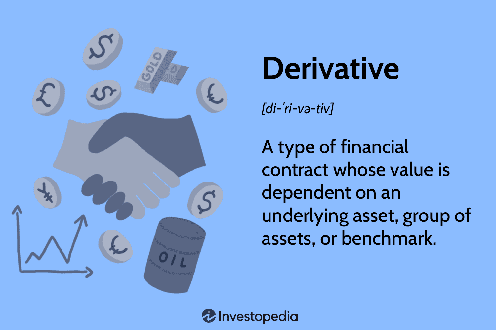

In the rapidly changing landscape of financial trading, flow derivatives are essential instruments that optimize leverage and enhance profit potential. These derivatives are key components in algorithmic trading, offering traders a strategic tool for efficiently placing directional bets on market movements. By capitalizing on minute fluctuations in market values, flow derivatives enable leveraged positions that can magnify returns, albeit with proportionate risks.

Flow derivatives are generally derived from underlying assets such as currencies, indices, commodities, and stocks. By securitizing these underlying assets, flow derivatives provide traders with a mechanism to participate in the markets with significant leverage. This aspect is particularly advantageous in the context of algorithmic trading, where automation and speed are paramount. Algorithmic systems can execute complex trading strategies that take advantage of the immediate pricing and trading capabilities provided by derivatives.



The significance of flow derivatives in trading cannot be understated. As financial markets become more sophisticated and interconnected, the ability to harness derivative products like these becomes increasingly valuable. This article examines the structure and components of flow derivatives and showcases their application through examples in algorithmic trading, highlighting their potential to yield substantial financial gains when used judiciously.

## Table of Contents

## Understanding Flow Derivatives

Flow derivatives are securitized financial instruments that capitalize on minor fluctuations in market valuations for enhanced profitability. Primarily structured around various underlying assets, these derivatives encompass a wide range of financial elements, such as currencies, indices, commodities, and stocks.

Currency-based flow derivatives facilitate transactions that aim to leverage the volatility inherent in foreign exchange markets. For instance, traders use derivatives based on currency pairs to speculate on exchange rate movements, thus obtaining exposure to foreign exchange fluctuations without directly owning the currency itself.

Indices serve as another key foundation for flow derivatives. By focusing on indices, such as the S&P 500 or FTSE 100, these derivatives enable investors to gain exposure to broader market movements. They allow traders to express bullish or bearish outlooks on entire markets rather than individual securities, offering potential gains from overall market trends.

Commodities, including gold, oil, and agricultural products, provide further diversification opportunities through flow derivatives. By investing in commodity-based derivatives, traders can benefit from price movements driven by supply and demand dynamics, geopolitical factors, and other market influencers without physically holding the commodities.

Stocks are also frequently utilized as the underlying assets for flow derivatives. These derivatives allow traders to bet on individual company performance by capitalizing on stock price [volatility](/wiki/volatility-trading-strategies). This offers a strategic approach to trading, where investors can execute positions in single equities with the leverage provided by derivatives.

Flow derivatives typically operate on exchanges or electronic platforms. These platforms provide crucial real-time pricing and trading facilities, which are essential for decision-making and rapid execution. By capitalizing on electronic trading environments, market participants gain immediate access to market data, enhancing their ability to respond to price movements and shifting conditions swiftly.

These instruments thus bridge gaps between traditional asset trading and modern technological advancements, emphasizing the importance of real-time data in financial decision-making. As such, flow derivatives stand as potent tools for traders looking to exploit small market changes for potentially significant financial rewards.

## Components of Flow Derivatives

Flow derivatives are constructed using several key components, each contributing to their function as advanced financial trading instruments. The first element is the underlying asset, which serves as the reference point for the derivative's value. Common underlying assets include currencies, indices, commodities, and stocks. These assets provide the basis upon which derivatives are structured, allowing traders to speculate on the direction of market movements.

Leverage is a critical mechanism within flow derivatives, enabling traders to gain exposure to larger positions than their initial investment would normally allow. This is achieved through financial instruments such as options, futures, and other synthetic structures. Leverage magnifies the potential returns on a trade but also increases the risk of loss, requiring traders to carefully manage their position sizes and exposure.

The WAVE XXL product is a notable example of a flow derivative that leverages synthetic spot positions with perpetual futures and includes stop-loss features. This derivative offers traders an opportunity to take a long or short position on an underlying asset, like an index or commodity, with built-in mechanisms to limit potential losses. The stop-loss feature acts as a safeguard by automatically terminating a position if the market moves against the trader beyond a predefined threshold. This limitation helps protect traders from excessive losses, stabilizing risk exposure.

In terms of implementation, leverage in flow derivatives can be represented mathematically, for instance, through the formula:

$$
L = \frac{\text{Position Size}}{\text{Initial Investment}}
$$

where $L$ denotes leverage. This quantifies the amplification of market exposure achieved through the derivative.

Flow derivatives' leverage and synthetic structures involve a complex interplay of financial mechanisms, extending beyond simple options and futures. The designed products cater to various market strategies, enabling traders to optimize positions according to their market outlooks and risk tolerance profiles.

The intricacies of these financial instruments necessitate a comprehensive understanding of both their potential rewards and inherent risks. Consequently, they are commonly utilized within [algorithmic trading](/wiki/algorithmic-trading) systems to allow for rapid execution that maximizes the strategic advantages of flow derivatives, while adhering to predefined risk parameters.

## Market Accessibility and Real-Time Trading

Flow derivatives are pivotal in modern trading due to their accessibility and sophistication on electronic platforms. These platforms enable traders to engage with real-time market data, fostering swift decision-making and efficient execution of trades. Unlike traditional methods, where time delays could lead to missed opportunities or unfavorable pricing, electronic platforms ensure traders can operate in a dynamic environment where every second counts.

The real-time capability is especially advantageous for algorithmic trading, which relies heavily on precise timing and rapid execution. Algorithms are designed to interpret and respond to market movements instantaneously, capitalizing on opportunities that might only be available for a brief window. This level of efficiency is crucial, as slight delays can result in substantial opportunity costs or increased risk exposure.

However, the instantaneous nature of real-time pricing introduces complexity in managing flow derivatives. Traders must navigate the constantly shifting price landscapes and execute trades that align with predetermined strategies, which requires sophisticated risk management systems. These systems must be capable of assessing potential risks quickly and taking corrective actions to mitigate losses. For instance, algorithms may include stop-loss features that automatically liquidate positions when prices reach certain levels, thus containing potential downside.

Moreover, the valuation of derivatives in real-time demands a robust analytical framework capable of factoring in various market conditions and volatilities. This includes understanding the intricacies of leverage, funding levels, and the synthetics of the derivatives themselves. As trades are executed, continuous monitoring ensures that portfolios are aligned with strategic goals while adapting to market shifts.

In summary, the blend of electronic trading platforms and real-time market data provides traders with an edge in exploiting fleeting market opportunities. This technological advancement is a double-edged sword, offering both enhanced potential for returns and the challenge of navigating its inherent complexities effectively.

## Examples of Flow Derivatives in Algo Trading

Flow derivatives play a significant role in algorithmic trading, offering structured opportunities for leveraging market movements. A notable example of such derivatives is the WAVE XXL, provided by institutions like Deutsche Bank. This derivative is designed to allow traders to speculate on index movements, such as those of the S&P 500, by using leverage mechanisms.

The primary advantage of WAVE XXL derivatives is their ability to provide significantly amplified exposure to the underlying index's movements. Traders take positions by leveraging components like the funding level, cover ratio, and integrated stop-loss mechanisms. The funding level indicates the price level at which the derivative is financed, essentially setting the initial point for calculating price changes. The cover ratio, on the other hand, reflects the degree of exposure relative to the underlying asset. These derivatives also incorporate a stop-loss feature that automatically restricts losses if the underlying index moves unfavorably beyond a certain threshold. This risk management mechanism allows traders to protect capital while maintaining the potential for high returns on leveraged positions.

Algorithmic trading systems can effectively utilize WAVE XXL derivatives by integrating them into pre-programmed trading strategies. Algorithms can continuously monitor market conditions, assess movements in the S&P 500 index, and execute trades automatically when preset conditions are met. For example, an algorithm might initiate a buy order when certain technical indicators suggest a bullish trend and close the position based on stop-loss parameters or predefined profit targets.

To implement such a strategy in Python, a simple pseudo-code example might look like this:

```python
import yfinance as yf  # For more datasets, visit: https://paperswithbacktest.com/datasets
from datetime import datetime
import numpy as np

# Define trading condition thresholds
BUY_THRESHOLD = 0.02  # Example threshold for a bullish signal
STOP_LOSS_THRESHOLD = -0.01  # Example stop-loss level
TAKE_PROFIT_THRESHOLD = 0.05  # Example take-profit level

# Fetch data for the S&P 500 index
data = yf.download('^GSPC', start='2023-01-01', end=datetime.now().strftime('%Y-%m-%d'))

# Example simple moving average strategy
data['SMA_50'] = data['Close'].rolling(window=50).mean()
data['SMA_200'] = data['Close'].rolling(window=200).mean()

# Determine signals
data['Signal'] = np.where(data['SMA_50'] > data['SMA_200'], 1, 0)

# Execute trades based on signals
positions = []
for i in range(1, len(data)):
    if data['Signal'][i] == 1 and data['Signal'][i-1] == 0:
        buy_price = data['Close'][i]
        positions.append({'type': 'buy', 'price': buy_price, 'date': data.index[i]})

    if positions and (data['Close'][i] <= buy_price * (1 + STOP_LOSS_THRESHOLD) or
                      data['Close'][i] >= buy_price * (1 + TAKE_PROFIT_THRESHOLD)):
        # Closing the position at loss or profit
        sell_price = data['Close'][i]
        positions[-1]['sell_date'] = data.index[i]
        positions[-1]['sell_price'] = sell_price

# Print executed trades
for p in positions:
    if 'sell_price' in p:
        print(f"Bought at {p['price']} on {p['date'].date()}, sold at {p['sell_price']} on {p['sell_date'].date()}")
```

This example demonstrates a basic moving average crossover strategy, where a buy signal is generated if the short-term average (SMA_50) crosses above the long-term average (SMA_200), characteristic of a bullish movement. The system sells when a stop-loss or take-profit level is triggered. This programmed logic allows traders to capitalize on small price movements efficiently, thereby leveraging the capabilities of flow derivatives like WAVE XXL in algorithmic trading.

## The Role of Algorithmic Trading

Algorithmic trading leverages automated systems to harness the potential of financial instruments such as flow derivatives efficiently. These systems rely on sophisticated algorithms capable of processing vast volumes of data in real-time, allowing them to identify market trends and execute trades with precision and minimal latency. The integration of algorithms with flow derivatives empowers traders to craft strategies specifically tailored to the nuanced characteristics of these instruments.

The algorithms employed in trading flow derivatives are designed to analyze extensive data sets rapidly and execute trades based on pre-defined conditions and market signals. This capacity to process information swiftly is crucial, as market conditions can change in fractions of a second. For instance, algorithms might use statistical methods such as moving averages or more complex techniques like [machine learning](/wiki/machine-learning) models to predict short-term market movements and trigger trades accordingly.

Importantly, flow derivatives offer unique features such as leverage and stop-loss mechanisms that can be optimized by algorithms. Leverage allows traders to magnify their exposure to market movements, thus increasing the potential return on investment. Algorithms can dynamically adjust the level of leverage according to the volatility and predicted trend of the underlying asset, optimizing the risk-reward ratio. Moreover, by incorporating stop-loss features, algorithms can limit potential losses, presetting thresholds at which trades are automatically exited to protect against unfavorable market shifts.

Python, with its extensive libraries for data analysis and algorithm development, is particularly suited for implementing algorithmic trading strategies. For example, traders can utilize libraries like NumPy and pandas for efficient data manipulation and analysis, while machine learning frameworks such as scikit-learn can assist in building predictive models. A simplified Python example for a moving average crossover strategy might look like this:

```python
import numpy as np
import pandas as pd

# Dummy data for demonstration
data = pd.DataFrame({'Close': np.random.rand(100)})

# Calculate moving averages
data['Short_MA'] = data['Close'].rolling(window=10).mean()
data['Long_MA'] = data['Close'].rolling(window=50).mean()

# Generate signals
data['Signal'] = 0
data.loc[data['Short_MA'] > data['Long_MA'], 'Signal'] = 1
data.loc[data['Short_MA'] < data['Long_MA'], 'Signal'] = -1
```

This code snippet calculates short-term and long-term moving averages of a stock's closing price to generate buy (1) and sell (-1) signals. Such strategies can be integrated into automated trading platforms to execute trades whenever specified criteria are met.

The role of algorithmic trading transcends mere speed and efficiency; it fundamentally alters the trader's interaction with markets by significantly reducing emotional bias. Trading decisions are made based on quantitative analysis rather than subjective judgment, leading to more consistent and objective outcomes. Moreover, algorithms can exploit subtle inefficiencies in the market, capturing profits from price discrepancies that may be imperceptible to human traders. As financial markets continue to evolve, the use of algorithmic trading for products like flow derivatives is poised to become even more integral, driven by advances in technology and data analytics.

## Conclusion

Flow derivatives play a significant role in enhancing leverage and capturing minor yet impactful market movements in algorithmic trading. By understanding their intrinsic components and inherent risks, traders can effectively incorporate these instruments into their trading strategies. Fundamental aspects such as the underlying assets, leverage mechanisms, and built-in safety nets like stop-loss features ensure optimal utilization of flow derivatives. Traders who thoroughly comprehend these elements can better manage volatility and uncertainties associated with high-leverage trades.

Algorithmic trading systems have increasingly capitalized on the benefits offered by flow derivatives. With the capability of executing trades at remarkable speeds, these systems mitigate human emotional biases and refine strategic approaches geared toward minute market inefficiencies. As technology continues to evolve, the sophistication and prevalence of flow derivatives within algorithmic trading frameworks will likely expand. Advanced computational models and cutting-edge platforms are being developed, further integrating these derivatives seamlessly into automated trading operations. Consequently, traders can expect to leverage even greater granularity and customization in their strategies, positioning themselves advantageously in rapidly changing markets.

## References & Further Reading

[1]: Bergstra, J., Bardenet, R., Bengio, Y., & Kégl, B. (2011). ["Algorithms for Hyper-Parameter Optimization."](https://papers.nips.cc/paper/4443-algorithms-for-hyper-parameter-optimization) Advances in Neural Information Processing Systems 24.

[2]: ["Advances in Financial Machine Learning"](https://www.amazon.com/Advances-Financial-Machine-Learning-Marcos/dp/1119482089) by Marcos Lopez de Prado

[3]: ["Evidence-Based Technical Analysis: Applying the Scientific Method and Statistical Inference to Trading Signals"](https://www.amazon.com/Evidence-Based-Technical-Analysis-Scientific-Statistical/dp/0470008741) by David Aronson

[4]: ["Machine Learning for Algorithmic Trading"](https://github.com/stefan-jansen/machine-learning-for-trading) by Stefan Jansen

[5]: ["Quantitative Trading: How to Build Your Own Algorithmic Trading Business"](https://www.amazon.com/Quantitative-Trading-Build-Algorithmic-Business/dp/1119800064) by Ernest P. Chan