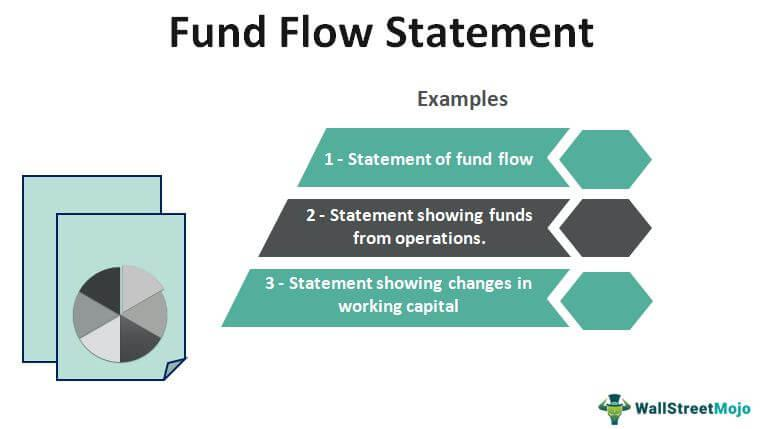

Flow of Funds (FOF) accounts play a crucial role in understanding the financial dynamics within an economy. These accounts offer detailed insights into the movement of money across different sectors, enabling analysts and policymakers to make informed decisions. By systematically tracking financial transactions, such as borrowing, lending, and investment activities, FOF accounts reveal how funds circulate among households, corporations, governments, and the foreign sector. This comprehensive view aids in assessing the economic health of these sectors and helps identify potential imbalances or trends that require attention.

In recent years, the significance of FOF accounts has been magnified with the rise of algorithmic trading. Traders who understand the implications of FOF data can gain a competitive edge in predicting market movements. Algorithmic trading relies on data-driven strategies that exploit market inefficiencies. By integrating FOF insights, algorithms can identify larger macroeconomic trends that might influence financial markets, such as interest rate changes or shifts in liquidity. As a result, traders equipped with FOF data can better anticipate market responses to economic shifts, enhancing their trading strategies.



This article investigates FOF accounts as a concept and their significance in macroeconomic analysis, focusing on their implications for algorithmic trading. Understanding the flow of funds not only aids traditional economic policymaking but also provides a robust foundation for modern financial strategies.

## Table of Contents

## What Are Flow of Funds (FOF) Accounts?

Flow of Funds (FOF) accounts serve as a critical tool in economic analysis, tracking the financial transactions within a national economy over a specific period. These accounts systematically record the inflows and outflows of money, thus providing a comprehensive snapshot of economic activity. Compiled and released quarterly by central banks, such as the Federal Reserve in the United States, FOF accounts allow economists and analysts to assess the movement of funds within and between various sectors.

FOF accounts encompass multiple economic sectors, including households, businesses, government, and the foreign sector. Each sector exhibits distinct financial activities and interactions that contribute to the overall economic landscape. For instance, household accounts may reflect savings and consumption patterns, while corporate accounts document investments and production expenditures. Government accounts track fiscal activities, encompassing taxation and public spending, whereas the foreign sector shows international trade and investment dynamics.

The core purpose of FOF accounts is to offer a detailed view of the economy's financial health. Analysts utilize this data to evaluate sectoral productivity and economic performance. For example, by examining the net borrowing by households or corporations, economists gain insights into consumer confidence and business investment trends, respectively. Additionally, changes in government borrowing or lending can indicate shifts in fiscal policy or economic stimulus measures.

In essence, FOF accounts function as a vital analytical tool, furnishing key indicators of economic well-being. By monitoring these flows, policymakers and economists can make informed decisions aimed at fostering economic stability and growth. The structured data provided by FOF accounts helps illustrate economic trends, offering a basis for projecting future economic developments and potential policy interventions.

## Components of Flow of Funds Accounts

Flow of Funds (FOF) accounts provide a detailed structure for analyzing the economic interactions between various sectors of an economy by examining assets, liabilities, net worth, and net financial flows. This structure is essential for understanding how capital moves and accumulates within an economy, offering a vital tool for economic analysis and decision-making.

Assets and liabilities are the fundamental components of FOF accounts and are categorized into financial and non-financial sections. Financial assets typically include items such as stocks, bonds, and loans, which represent claims on future income. Non-financial assets are tangible resources like real estate and machinery that can influence productive capacity. Liabilities, on the other hand, represent obligations owed to other parties, which can detract from the net economic resource pool available to a sector.

Net worth in FOF accounts is a measure of the financial health of a sector. It is calculated as the difference between a sector's total assets and total liabilities:

$$
\text{Net Worth} = \text{Total Assets} - \text{Total Liabilities}
$$

A positive net worth indicates a surplus, suggesting that a sector has more assets than liabilities and is typically in good financial health. Conversely, a negative net worth suggests financial stress, as liabilities exceed assets.

Net financial flows track the movement of money over time and are crucial for observing trends and changes in economic activity. These flows include transactions like payments, investments, and repayments, reflecting the dynamic nature of financial interactions across various sectors. By analyzing net financial flows, economists can deduce whether an economy tends to save or spend, and identify periods of economic expansion or contraction.

All these components interact to form a comprehensive view of the economic environment. For instance, an increase in financial assets might indicate economic growth or investment in productive capacity, whereas rising liabilities could suggest increasing financial vulnerabilities. Similarly, changes in net worth can signal shifts in economic stability, while net financial flows help track [liquidity](/wiki/liquidity-risk-premium) and credit movement across markets.

Understanding these components aids analysts and policymakers in evaluating the economic landscape, predicting potential vulnerabilities, and crafting appropriate fiscal and monetary policies. Consequently, FOF accounts are indispensable in navigating the complexities of financial systems and ensuring sustainable economic development.

## The Importance of FOF in Economic Analysis

Flow of Funds (FOF) accounts are pivotal in macroeconomic analysis because they provide comprehensive insights into the financial interactions between various sectors of the economy. These accounts detail the flow of money among households, businesses, government, and the external sector, making them instrumental in predicting changes in Gross Domestic Product (GDP). By offering a clear picture of how money moves, FOF accounts help forecasters anticipate economic trends and potential shifts in economic activity.

The ability of FOF data to inform monetary and fiscal policy is another crucial aspect of its importance. Central banks and fiscal authorities rely on these accounts to understand the dynamics of economic sectors and make informed decisions about interest rates, public spending, and taxation. For example, if FOF accounts reveal increased borrowing in the corporate sector, policymakers might consider adjusting interest rates to prevent overheating in the economy. Conversely, a decline in household consumption might prompt fiscal measures to stimulate demand.

Additionally, FOF accounts provide valuable insights into the economic resilience of a nation. By tracking the accumulation and depletion of financial assets and liabilities, these accounts offer a snapshot of the financial health of each sector. Economists and policymakers can use this information to strengthen resilience by identifying vulnerabilities and crafting targeted interventions. For instance, if FOF data shows excessive reliance on foreign debt, policymakers can work on strategies to bolster domestic savings or diversify financing sources.

The predictive power of FOF accounts in economic analysis enhances their utility. By quantifying financial relationships and dependencies, FOF data helps to identify potential stress points within the economy, allowing for preemptive measures to mitigate risks. It enables a proactive approach to economic management, whereby policymakers can enhance economic stability and growth prospects. Ultimately, FOF accounts are not just a tool for understanding current economic conditions but a vital resource for shaping future economic strategies.

## Using FOF in Algorithmic Trading

Algorithmic trading, often referred to as algo trading, leverages complex algorithms to execute trades at exceptional speeds by analyzing a wide array of market data. Integrating Flow of Funds (FOF) data into these algorithms introduces a profound layer of macroeconomic analysis, enhancing the capability of traders to forecast market trends and respond to economic shifts effectively.

FOF accounts provide a granular view of the money supply and demand across various sectors, highlighting shifts in liquidity which can signal potential market movements. This data is pivotal in identifying macroeconomic trends that may impact market behavior. For instance, a surge in corporate borrowing captured in FOF accounts might indicate increased investment activity, leading to potential growth in related equities sectors. Moreover, changes in household net savings could predict shifts in consumer spending, an essential indicator for market demand.

In the context of interest rates, FOF data allows traders to anticipate movements driven by macroeconomic conditions. For example, a consistent increase in government borrowing could signal rising interest rates to combat inflation or deficits. This insight is crucial for algorithmic strategies that seek to capitalize on bond markets' reactions to anticipated [interest rate](/wiki/interest-rate-trading-strategies) changes. Therefore, incorporating FOF data into algorithms can assist in modeling the potential trajectory of interest rates, ensuring timely and strategic decisions.

Currency markets also benefit from FOF insights. Consider the net international flows recorded in FOF accounts: substantial inflows or outflows may affect a country's exchange rate. Algorithms that include this macroeconomic data can predict currency fluctuations, offering traders a comparative advantage. These insights help forecast movements driven by trade imbalances or foreign investment trends.

In equity markets, FOF data serves as a vital input in evaluating the broader economic environment influencing stock prices. Analyzing net lending and borrowing trends across financial and non-financial sectors helps inform algorithms about the liquidity and leverage within the economy. Such factors can influence equity valuations, helping traders make informed buy or sell decisions based on anticipated market corrections or rallies.

Python, widely used in financial data analysis, can be employed to parse and analyze FOF accounts. By using libraries like pandas or numpy, traders can efficiently handle large datasets, integrate FOF data, and develop predictive models. Consider the following example of a basic script that could be expanded for analyzing FOF trends:

```python
import pandas as pd

# Load FOF data
fof_data = pd.read_csv('fof_data.csv')

# Example to calculate a basic trend in corporate borrowing
corporate_borrowing_trend = fof_data.loc[:, 'corporate_borrowing'].pct_change()

# Example calculation to indicate potential interest rate changes based on government borrowing
government_borrowing_trend = fof_data.loc[:, 'government_borrowing'].pct_change()
interest_rate_indication = government_borrowing_trend.apply(lambda x: 'Increase' if x > 0.05 else 'Stable')

# Print insights
print(corporate_borrowing_trend.tail())
print(interest_rate_indication.tail())
```

In summary, the integration of FOF data into [algorithmic trading](/wiki/algorithmic-trading) provides a robust framework for interpreting financial environments. By forecasting interest rate changes, currency fluctuations, and equity market trends through FOF analysis, traders gain a strategic advantage, enhancing their ability to predict and capitalize on market movements with greater precision.

## The Impact of Interest Rates and Government Policies

Interest rates play a pivotal role in shaping the flow of funds (FOF) within an economy, as they directly influence both borrowing and investment behaviors. When interest rates are low, borrowing becomes more attractive due to the reduced cost of financing. Consequently, businesses and consumers are more likely to take loans, thus stimulating economic activity and altering the FOF accounts. Conversely, high interest rates increase borrowing costs, discouraging loans and slowing economic expansion. This dynamic can be captured by the basic formula:

$$
\text{Cost of Loan} = \text{Principal} \times \left(1 + \text{Interest Rate}\right)^n
$$

where $n$ represents the number of periods.

Similarly, government policies profoundly impact FOF accounts by manipulating monetary flows within various sectors. Fiscal stimulus, such as government spending on infrastructure or direct financial aid to citizens, increases the liquidity in the economy, thereby influencing how funds circulate across different segments. Taxation policies also have a significant impact on FOF by modifying disposable incomes and corporate profits, which in turn affects consumer spending and investment rates.

Understanding the implications of interest rates and government policies on FOF accounts allows traders and policymakers to make more accurate predictions of economic trends. For instance, an anticipated increase in interest rates might signal a contraction in borrowing, guiding investors to adjust their portfolios accordingly. Similarly, an upcoming fiscal stimulus could indicate increased liquidity, prompting adjustments in investment strategies to capitalize on potential market gains.

Ultimately, the interplay between interest rates, government policies, and FOF accounts highlights the interconnectedness of financial decisions and macroeconomic conditions. By analyzing these factors, stakeholders can better anticipate shifts in economic activity and formulate strategic responses, optimizing both economic stability and investment outcomes.

## Case Studies and Real-World Applications

Historical analysis of Flow of Funds (FOF) data provides valuable insights into the economic responses during financial crises. Notably, the FOF accounts serve as a critical tool in dissecting how different sectors react under financial duress, enabling analysts to evaluate the effectiveness of policy interventions and market responses.

During the 2008 financial crisis, FOF data revealed striking patterns concerning asset-liability management across households, corporations, and governments. The crisis was marked by a substantial decline in household net worth, primarily driven by plummeting real estate and equity values. FOF accounts highlighted that while household liabilities decreased, the impact on consumptive expenditure was profound, resulting in contractionary pressures on the GDP. This data allowed policymakers to justify the implementation of significant monetary easing policies, such as near-zero interest rates and quantitative easing, which ultimately aimed to stabilize financial markets and stimulate economic recovery.

In the corporate sector, FOF data illustrated a rise in cash holdings and a decline in capital expenditure during the crisis, reflecting a shift towards risk aversion. The comprehensive tracking of intra-sector flows through FOF accounts assisted in identifying the bottlenecks in credit flows, which were critical for justifying government interventions, such as the Troubled Asset Relief Program (TARP). This program aimed to unfreeze credit markets and restore confidence among financial institutions.

During the Eurozone crisis, FOF accounts were instrumental in assessing the economic impact of austerity measures across different member states. For instance, by analyzing the changes in government liabilities and net borrowing needs, policymakers were able to understand the varying fiscal constraints across nations. This analysis shed light on the effectiveness of fiscal consolidation and the need for policy coordination within the Eurozone.

FOF data has consistently demonstrated its value by providing a detailed and structured account of sectoral financial positions and flows. These accounts serve as an empirical foundation upon which policy decisions can be evaluated for their efficacy and adjusted to mitigate future economic disturbances. By scrutinizing these patterns, economists and policymakers can devise strategies that enhance economic stability and resilience, affirming the practical utility of FOF accounts in real-world economic management.

## Conclusion

Flow of Funds (FOF) accounts are essential instruments for dissecting economic structures and creating effective economic strategies. These accounts provide a detailed map of the movement of financial resources across various sectors such as households, businesses, and the government, enabling analysts to understand complex economic interactions. By highlighting the flows of money, FOF accounts furnish the data necessary for predicting trends in macroeconomic variables, such as GDP and inflation.

In the context of algorithmic trading, integrating insights from FOF accounts can greatly improve the ability to anticipate market movements. Algorithmic trading systems, which depend on data accuracy and timing, can benefit from FOF data to identify emerging trends and market inefficiencies. For instance, by analyzing the net financial flows and corresponding changes in interest rates recorded in FOF data, trading algorithms can predict potential fluctuations in the markets for currencies, equities, and fixed income.

Moreover, a comprehensive understanding of FOF accounts empowers stakeholders to make well-informed economic and investment decisions. By effectively interpreting these financial data, investors and policymakers can devise strategies that align with financial market conditions and anticipate economic shifts. This informed approach can offer significant competitive advantages in the financial landscape, enhancing decision-making processes related to asset allocation, risk assessment, and policy formation.

In summary, the utility of FOF accounts extends beyond theoretical economic analysis, offering practical implications for improving economic resilience and market performance. As financial systems continue to evolve with technological advancements in trading, the strategic inclusion of FOF data serves as a critical tool for those seeking to optimize economic policy and capital market investments.

## References & Further Reading

[1]: Board of Governors of the Federal Reserve System. ["Financial Accounts of the United States."](https://www.federalreserve.gov/releases/z1/) Washington, D.C.

[2]: Ferguson, Niall. ["The Ascent of Money: A Financial History of the World."](https://www.amazon.com/Ascent-Money-Financial-History-World/dp/0143116177) New York: Penguin Books, 2009.

[3]: Mishkin, Frederic S. ["The Economics of Money, Banking, and Financial Markets."](https://www.pearsonhighered.com/assets/preface/0/1/3/4/0134855388.pdf) New York: Pearson, 2018.

[4]: Tapiero, Charles S. ["Risk Finance and Asset Pricing: Value, Measurements, and Markets."](https://www.amazon.com/Risk-Finance-Asset-Pricing-Measurements/dp/0470549467) Hoboken, NJ: John Wiley & Sons, 2010.

[5]: Allen, Franklin, and Douglas Gale. ["Comparative Financial Systems: A Survey."](https://core.ac.uk/download/pdf/6649943.pdf) Journal of Financial Regulation and Compliance, 2001.

[6]: Brunnermeier, Markus K., & Oehmke, Martin. ["The Maturity Rat Race."](https://www.jstor.org/stable/42002583) The Journal of Financial Economics, 2013.