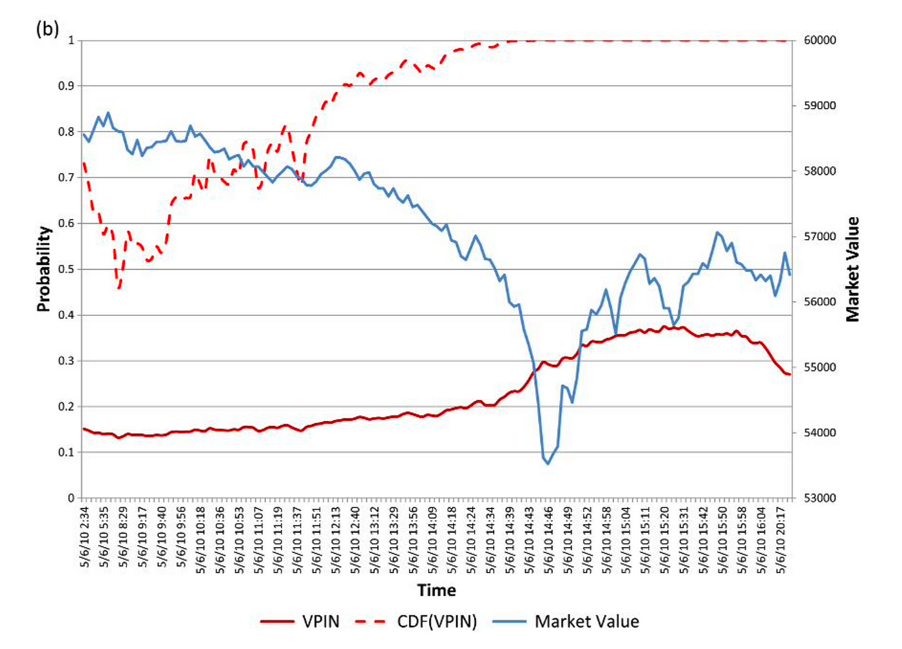

## Table of Contents

## What is flow toxicity in the context of market making?

Flow toxicity in market making refers to the situation where the incoming orders from clients are more likely to result in losses for the market maker. Imagine a market maker as someone who always tries to buy low and sell high. If the orders they receive push them to buy high and sell low instead, those orders are considered toxic because they harm the market maker's profits.

To understand this better, think of a market maker as someone standing in the middle of a busy trading floor, constantly buying and selling securities. If the majority of the orders coming in are from informed traders who know the true value of the security and are trying to take advantage of the market maker, these orders can lead to losses. This is flow toxicity – when the flow of orders is harmful to the market maker's bottom line.

## How does flow toxicity affect market makers?

Flow toxicity can hurt market makers a lot. When market makers get a lot of orders that make them lose money, it's like they're always buying high and selling low. This is bad because market makers need to make money to keep doing their job. If they keep losing money, they might have to change how they work or even stop being a market maker.

To deal with flow toxicity, market makers might change their prices to try and make money again. They might also try to figure out which orders are likely to lose them money and avoid those. It's a tricky balance because they need to keep trading to make money, but they also need to avoid the orders that hurt them.

## What are the common sources of flow toxicity?

Flow toxicity often comes from informed traders. These are people who know more about what's going on with a stock than most other people. They might have inside information or be really good at figuring out what's going to happen next. When these informed traders send orders to market makers, they're trying to make money by using their special knowledge. This can be bad for market makers because they end up buying high and selling low, which loses them money.

Another source of flow toxicity can be big orders from big investors. When a big investor wants to buy or sell a lot of a stock, they might send a bunch of orders to different market makers. These big orders can move the price of the stock a lot, and market makers can get caught in the middle. If they buy a stock just before its price goes down because of a big sell order, they lose money. So, big orders from big investors can also make the flow of orders toxic for market makers.

## Can you explain the basic mechanisms market makers use to manage flow toxicity?

Market makers use a few key ways to handle flow toxicity. One way is by adjusting their prices. If they see a lot of orders that might lose them money, they might change the prices they offer to buy and sell to try and make money again. This means they might not buy as high or sell as low as they used to, which can help them avoid losing money on bad orders.

Another way market makers manage flow toxicity is by trying to figure out which orders are likely to lose them money. They might use special computer programs to look at the orders coming in and try to spot the ones from informed traders or big investors. If they can spot these orders, they might choose not to take them or change how they handle them to reduce their losses. It's like playing a game where they need to be smart about which orders they take and which they avoid.

## What are the indicators that a market maker should look for to identify flow toxicity?

Market makers should keep an eye on a few things to spot flow toxicity. One big sign is if they see a lot of orders coming in that make them lose money. If they're buying high and selling low more often than usual, it might mean that informed traders or big investors are sending them toxic orders. Another sign is if the orders they get are bigger than normal. Big orders can move the price of a stock a lot, and if market makers get caught in the middle, they can lose money.

Another thing to watch out for is if the orders they're getting are different from what they usually see. If the pattern of orders changes suddenly, it could mean that something new is happening, like a big investor making a move or someone using inside information. By looking at these signs, market makers can try to figure out if the orders they're getting are toxic and adjust how they work to avoid losing money.

## How does flow toxicity impact liquidity provision?

Flow toxicity can make it harder for market makers to provide [liquidity](/wiki/liquidity-risk-premium). Liquidity is like having enough buyers and sellers so that people can easily trade a stock. When market makers get a lot of orders that make them lose money, they might not want to keep buying and selling as much. This can make it harder for people to trade because there are fewer market makers around to help them.

To deal with flow toxicity, market makers might change their prices or try to avoid the bad orders. If they do this, it can make the market less liquid. When market makers change their prices a lot or stop taking certain orders, it can make it harder for people to buy and sell stocks quickly and at good prices. So, flow toxicity can make the market less smooth and more difficult for everyone.

## What are the advanced strategies market makers employ to mitigate flow toxicity?

Market makers use smart computer programs to help them deal with flow toxicity. These programs can look at all the orders coming in and try to figure out which ones might lose them money. If they spot an order that looks like it's from an informed trader or a big investor, they might choose not to take it or change how they handle it. This can help them avoid losing money on bad orders and keep making money from good ones.

Another way market makers handle flow toxicity is by working together with other market makers. They might share information about the orders they're seeing and help each other figure out which ones are toxic. By working as a team, they can make better decisions about which orders to take and which to avoid. This teamwork can help them keep providing liquidity to the market even when there are a lot of toxic orders around.

## How can market makers use data analytics to predict and manage flow toxicity?

Market makers use data analytics to look at the orders coming in and figure out if they might lose money. They use special computer programs to study the patterns of the orders, like how big they are, how often they come, and where they come from. If the program sees a lot of big orders or orders that are different from usual, it might mean that informed traders or big investors are sending toxic orders. By spotting these patterns early, market makers can decide not to take those orders or change how they handle them to avoid losing money.

Another way market makers use data analytics is to predict when flow toxicity might happen. They look at past data to see what kinds of orders have caused problems before. If they see similar patterns starting to show up again, they can get ready for it. This might mean changing their prices or working with other market makers to share information. By using data analytics to predict and manage flow toxicity, market makers can keep providing liquidity to the market and avoid big losses.

## What role does technology play in managing flow toxicity for market makers?

Technology helps market makers a lot when they're dealing with flow toxicity. They use special computer programs that can look at all the orders coming in and figure out which ones might make them lose money. These programs can spot big orders or orders that are different from usual, which might be from informed traders or big investors. By using technology to see these patterns early, market makers can decide not to take those orders or change how they handle them to avoid losing money.

Market makers also use technology to predict when flow toxicity might happen. They look at past data to see what kinds of orders have caused problems before. If they see similar patterns starting to show up again, they can get ready for it. This might mean changing their prices or working with other market makers to share information. By using technology to predict and manage flow toxicity, market makers can keep providing liquidity to the market and avoid big losses.

## How do regulatory environments influence the management of flow toxicity?

Regulatory environments play a big role in how market makers manage flow toxicity. Rules set by regulators can change how market makers work. For example, some rules might limit how much market makers can change their prices or how they can use data to spot toxic orders. If the rules are too strict, it can make it harder for market makers to avoid losing money on bad orders. On the other hand, if the rules are clear and fair, they can help market makers deal with flow toxicity better by giving them the right tools and information.

Regulators also keep an eye on the market to make sure everyone is playing fair. They might step in if they see a lot of toxic orders coming from one place or if they think someone is using inside information. By keeping the market fair, regulators can help reduce flow toxicity. But if the rules change a lot or are hard to follow, it can make it tough for market makers to do their job well. So, the regulatory environment can really affect how market makers handle flow toxicity and keep the market running smoothly.

## What are the long-term effects of flow toxicity on market efficiency and stability?

Flow toxicity can make the market less efficient over time. When market makers get a lot of orders that make them lose money, they might not want to keep buying and selling as much. This can make it harder for people to trade because there are fewer market makers around to help them. When it's harder to trade, the prices of stocks might not reflect their true value as quickly. This means the market can't do its job of matching buyers and sellers as well as it should, which makes it less efficient.

Flow toxicity can also make the market less stable. If market makers keep getting toxic orders, they might change their prices a lot to try and avoid losing money. This can make the prices of stocks go up and down more than they should. When prices move a lot, it can scare people and make them not want to trade. If fewer people are trading, it can make the market less stable because there's less activity to keep things balanced. So, flow toxicity can make the market less efficient and less stable in the long run.

## Can you discuss case studies where flow toxicity significantly impacted market making operations?

One big example of flow toxicity affecting [market making](/wiki/market-making) was during the 2010 Flash Crash. On that day, the stock market suddenly dropped a lot and then quickly went back up. A lot of market makers got hit with toxic orders that made them lose money fast. These orders were coming from high-frequency traders and big investors who were trying to sell their stocks quickly. Because market makers were getting so many bad orders, they pulled back from the market, which made it even harder for people to trade and caused the prices to go crazy. This showed how flow toxicity can mess up the whole market and make it hard for market makers to do their job.

Another case was with the market maker Knight Capital in 2012. They had a computer problem that made them send out a lot of bad orders. These orders were toxic because they made Knight Capital lose a lot of money very quickly. Because of these toxic orders, Knight Capital almost went out of business. They had to get help from other companies to stay alive. This case showed how important it is for market makers to have good technology to spot and handle toxic orders, or they can get into big trouble.

## References & Further Reading

[1]: Easley, D., López de Prado, M. M., & O'Hara, M. (2012). ["Flow Toxicity and Liquidity in a High-Frequency World."](https://www.jstor.org/stable/41485533) The Journal of Financial Economics, 22(2), 43-54.

[2]: Kissell, R. (2013). ["The Science of Algorithmic Trading and Portfolio Management."](https://www.sciencedirect.com/book/9780124016897/the-science-of-algorithmic-trading-and-portfolio-management) Academic Press.

[3]: Harris, L. (2002). ["Trading and Exchanges: Market Microstructure for Practitioners."](https://academic.oup.com/book/52292) Oxford University Press.

[4]: Cartea, Á., Jaimungal, S., & Penalva, J. (2015). ["Algorithmic and High-Frequency Trading."](https://assets.cambridge.org/97811070/91146/frontmatter/9781107091146_frontmatter.pdf) Cambridge University Press.

[5]: Aldridge, I. (2013). ["High-Frequency Trading: A Practical Guide to Algorithmic Strategies and Trading Systems."](https://www.amazon.com/High-Frequency-Trading-Practical-Algorithmic-Strategies/dp/1118343506) Wiley.

[6]: Lehalle, C. A., & Laruelle, S. (2013). ["Market Microstructure in Practice."](https://www.semanticscholar.org/paper/Market-Microstructure-in-Practice-Lehalle-Laruelle/2df52569ee044db799cc9ae865de4689847d6f83) Wiley-ISTE.

[7]: Gomber, P., Arndt, B., Lutat, M., & Uhle, T. (2011). ["High-Frequency Trading."](https://papers.ssrn.com/sol3/papers.cfm?abstract_id=1858626) In: The Handbook of Research on Enterprise Systems.