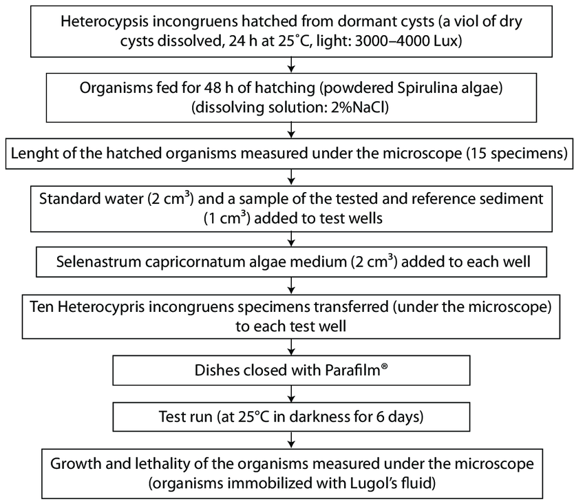

Flow toxicity is a critical concept in algorithmic trading, referring to the adverse effect on liquidity and market efficiency due to the presence of informed or aggressive trading flows. These flows often result in significant market impact and slippage, affecting the execution quality of trades. In essence, flow toxicity occurs when the order flow signals adverse information to market participants, typically leading to a deterioration of the price received by uninformed traders. This concept underscores the importance of examining the composition and sources of market orders, particularly focusing on their impact on liquidity provision and price discovery.

In the context of trading, flow toxicity implies a scenario where the presence of informed traders causes liquidity providers to incur losses. This phenomenon can lead to a recalibration of spreads and adjustment of execution strategies by liquidity providers, as they try to protect themselves from potential adverse selection. The presence of flow toxicity signifies inefficiencies in the market where information asymmetry leads to increased transaction costs for some participants. High levels of flow toxicity often force market makers to widen their spreads to hedge against the potential losses from informed trades, thus reducing overall market efficiency.

Measuring flow toxicity is of paramount importance for several reasons. By quantifying flow toxicity, trading firms can enhance the robustness of their algorithmic strategies, ensuring more efficient executions and improving their risk management frameworks. Accurate measurement of flow toxicity allows traders to adapt their strategies in real-time, minimizing the negative impacts and optimizing their trading performance. Moreover, understanding flow toxicity contributes to the development of fairer and more stable financial markets by facilitating better liquidity provision and narrowing bid-ask spreads.

In conclusion, flow toxicity plays a crucial role in shaping trading outcomes and the overall health of financial markets. By accurately measuring and managing flow toxicity, market participants can enhance their strategy execution, optimize trading performance, and contribute to more efficient market dynamics.

## Table of Contents

## Understanding Flow Toxicity

Flow toxicity refers to a condition in financial markets where the presence of informed traders adversely impacts the price discovery process and market liquidity. It occurs when the incoming order flow is dominated by traders who possess superior information, thereby creating an imbalance that can lead to inefficiencies in the market. Informed traders are able to detect or anticipate future price movements more accurately than others, leading to a disadvantage for less-informed participants.

The impact of flow toxicity on market efficiency is significant. Market efficiency is predicated on the idea that prices reflect all available information at any given time. However, when flow toxicity is present, the dominance of informed traders can lead to price distortions and increased market volatility. This distortion arises because informed traders execute orders that push prices away from their underlying value, creating noise and an inaccurate reflection of the asset's true worth. Consequently, the market becomes less efficient as the price signals that guide investment decisions are compromised.

Several scenarios can lead to flow toxicity. One common situation is during the release of critical economic data or corporate earnings announcements. These events often result in a surge of trading activity by those with timely or advanced insights, potentially sidelining less-informed traders. Another scenario occurs in the presence of high-frequency trading ([HFT](/wiki/high-frequency-trading-strategies)) strategies, where algorithms react to market data at such speed that they outpace traditional trading activities, leading to toxic flow conditions. Additionally, market environments characterized by asymmetric information, where one group of traders has access to more or better information than others, can give rise to flow toxicity.

Accurate detection and assessment of flow toxicity are crucial for maintaining an efficient and fair trading environment. Market regulators and participants alike strive to identify and mitigate these situations to enhance market integrity and ensure a level playing field for all traders.

## Significance of Flow Toxicity in Algorithmic Trading

Flow toxicity significantly influences [algorithmic trading](/wiki/algorithmic-trading) strategies by impacting market predictability and the effectiveness of trading algorithms. Flow toxicity refers to the adverse effect on market conditions caused by uninformed or imbalanced market orders, affecting price stability and trader performance. When flow toxicity is present, it can lead to increased market [volatility](/wiki/volatility-trading-strategies) and reduced efficiency, making it challenging for algorithms to execute profitable trades.

Algorithmic traders must monitor flow toxicity to ensure strategy robustness and adaptability to market changes. Monitoring allows traders to refine algorithms, reduce slippage costs, and improve order execution. By assessing toxicity levels, traders can adjust their strategies to withstand competitive pressures from high-frequency trading firms, which may exacerbate toxic flows. High flow toxicity can lead to detrimental outcomes such as adverse selection, where algorithms repeatedly incur losses due to trading against more informed market participants.

In the long term, unchecked flow toxicity can erode trading performance. Algorithms operating in toxic environments may yield suboptimal results, causing significant financial losses over time. This deterioration manifests in decreased alpha generation and elevated transaction costs, reducing the overall efficiency of trading operations. Continual monitoring helps mitigate these risks and sustain algorithmic profitability by adapting to variable market conditions and optimizing strategies in response to changing flow toxicity levels.

## Methods to Measure Flow Toxicity

Flow toxicity is a critical parameter in understanding market dynamics and ensuring efficient trading strategies. Assessing flow toxicity involves various methods, each with unique tools and indicators that provide different insights into market [liquidity](/wiki/liquidity-risk-premium) and potential adverse selection risks.

One common method to measure flow toxicity is the Volume-Synchronized Probability of Informed Trading (VPIN) metric. VPIN estimates the likelihood of informed trading by analyzing order flow imbalances over a specified [volume](/wiki/volume-trading-strategy) bucket. A higher VPIN indicates potential flow toxicity, suggesting that informed traders are exploiting market inefficiencies to the detriment of liquidity providers. This metric is particularly valuable for identifying times of increased risk due to toxic order flow, which can impair the performance of algorithmic trading systems.

Another approach involves evaluating the Order Flow Imbalance (OFI). This metric monitors the difference between buy and sell orders over a given period. An excessive imbalance can indicate potential flow toxicity as it may reflect informed trading or manipulative strategies. By examining the OFI, traders can gain insights into the pressures affecting supply and demand, providing early warnings of possible market instability.

Tools such as the Order Book Imbalance Indicator (OBI) also play a significant role in assessing flow toxicity. The OBI analyzes the current state of the [order book](/wiki/order-book-trading-strategies) to determine the disparity between buy and sell pressures. A persistent imbalance indicates that one side is dominating the market, potentially leading to toxic flows. By constantly monitoring the OBI, traders can adjust their strategies to minimize potential adverse effects from asymmetric information distribution.

Flow toxicity can also be measured using statistical techniques such as the Implicit Information Ratio (IIR). IIR evaluates the profitability of trades based on the informational edge they exploit. Higher ratios suggest that trades are leveraging significant informational advantages, indicating elevated flow toxicity levels. By quantifying the informational content of trades, IIR helps in identifying periods when market conditions are skewed by informed trading.

Comparing these measurement techniques reveals distinct advantages and limitations. VPIN is highly effective in real-time analysis, enabling traders to take proactive measures, but it requires detailed input parameters that might not be available in every market setting. OFI is straightforward and easy to compute; however, its effectiveness depends on accurately capturing real-time order flow data. The OBI is advantageous for its granularity in analyzing order book conditions, yet it may generate false signals under highly volatile market conditions. Finally, while IIR offers a direct measure of the informational advantage, it is retrospective in nature and may not facilitate immediate strategic adjustments.

In conclusion, effectively measuring flow toxicity necessitates a combination of these methods, as they collectively offer a comprehensive understanding of market dynamics. By utilizing multiple tools and indicators, traders can better anticipate market risks and devise strategies that mitigate the impacts of toxic order flows on their trading performance.

## Real-World Applications and Case Studies

### Real-World Applications and Case Studies

Flow toxicity is a critical [factor](/wiki/factor-investing) in understanding market dynamics and its implications are far-reaching, particularly in real-world trading environments. Examining past cases highlights the complexity and necessity of managing flow toxicity effectively.

One notable case is the "Flash Crash" of May 6, 2010, when the U.S. stock market experienced a rapid decline and recovery within minutes. This event underscored how aggressive execution algorithms could exacerbate flow toxicity, causing liquidity to dry up almost instantaneously. The incident prompted regulatory bodies and trading firms to reconsider their approaches to algorithmic trading and flow management. By studying the Flash Crash, trading firms recognized the necessity of incorporating more robust risk management practices, including real-time monitoring for any signs of flow toxicity that could affect their strategy execution.

Top trading firms have taken various steps to manage flow toxicity effectively. They employ advanced algorithmic models with built-in safeguards to limit the negative impacts of toxic flow. For instance, many firms utilize [machine learning](/wiki/machine-learning)-driven predictive analytics to assess the potential for flow toxicity dynamically. These models analyze large datasets to discern patterns that may indicate evolving market conditions capable of triggering flow toxicity. By doing so, they can adjust their trading strategies proactively, mitigating potential risk.

Moreover, firms like Goldman Sachs and JPMorgan Chase have developed proprietary tools capable of measuring liquidity risks and identifying toxic flow patterns. These tools help traders make informed decisions about trade executions, enhancing their market resilience even in volatile conditions.

Lessons learned from past incidents emphasize the importance of comprehensive data analysis and continuous improvement in trading algorithms. Trading firms now prioritize transparency and communication with market participants to prevent misinterpretations that could lead to toxic flows. They have also increased the sophistication of their order types, using smarter algorithms to decrease the market impact during high-stress periods.

In conclusion, real-world applications and case studies of flow toxicity demonstrate the significance and challenges involved in this area of algorithmic trading. The lessons drawn from these experiences have driven significant improvements in how firms manage flow toxicity, utilizing advanced technological tools and strategies to navigate and mitigate its effects effectively. As markets continue to evolve, these insights remain crucial for maintaining robust trading systems.

## Strategies to Mitigate Flow Toxicity

In algorithmic trading, effectively mitigating flow toxicity is critical to maintaining optimal trading performance and market stability. Various strategies and technological solutions are employed to address and manage the challenges associated with flow toxicity, which can have detrimental effects if left unchecked.

### Best Practices for Reducing Flow Toxicity in Trading

1. **Enhanced Risk Management**: Traders can employ advanced risk management techniques to detect and respond to toxic flow conditions swiftly. This involves setting precise risk parameters, such as stop-loss and take-profit thresholds, to minimize potential losses.

2. **Order Flow Analysis**: Continuously monitoring the order flow provides insights into market dynamics that contribute to toxicity. Analyzing order book changes and trade executions can help identify signs of toxic flow and enable traders to adjust their strategies accordingly.

3. **Algorithmic Adjustments**: Regularly updating trading algorithms to adapt to current market conditions is essential. Algorithms should be capable of recognizing patterns indicative of toxicity and dynamically altering their trading strategies to mitigate its impact.

### Technological Solutions and Their Roles in Mitigating Flow Toxicity

1. **Machine Learning and Artificial Intelligence**: Leveraging AI and machine learning models enables the detection and prediction of flow toxicity patterns. These models can process vast amounts of market data to identify anomalies and suggest real-time corrective actions.

2. **Latency Optimization**: Reducing the time delay in trade execution (latency) can prevent the exploitation of stale prices by toxic flows. Employing cutting-edge hardware and software solutions to enhance processing speed can mitigate latency-related risks.

3. **Blockchain Technology**: The use of blockchain can provide greater transparency and traceability in trading transactions, reducing the likelihood of manipulative practices that contribute to flow toxicity.

### Future Trends in Managing Flow Toxicity in Algorithmic Trading

1. **Real-Time Flow Toxicity Indices**: Developing and utilizing indices that provide real-time assessments of flow toxicity levels could become a standard practice. These indices would enable traders to make informed decisions and anticipate market movements influenced by toxic flows.

2. **Collaborative Platforms**: As exchanges and trading platforms become more interconnected, collaboration between different stakeholders—such as regulators, trading firms, and technology providers—will be crucial in developing unified standards and strategies for addressing flow toxicity.

3. **Integration of Quantum Computing**: While still in its nascent stages, quantum computing has potential applications in trading, promising unprecedented processing power to analyze complex datasets and forecast toxicity scenarios.

By implementing these strategies and leveraging technological advancements, traders can reduce the adverse effects of flow toxicity, thereby enhancing the efficiency and stability of algorithmic trading markets.

## Conclusion

In conclusion, flow toxicity remains a pivotal aspect of algorithmic trading, influencing both the effectiveness and longevity of trading strategies. Throughout the article, we've explored how flow toxicity, characterized by the adverse effects of information-laden order flows, poses significant challenges to market participants. It affects market efficiency, alters liquidity dynamics, and can lead to suboptimal trading outcomes when left unmonitored.

The importance of monitoring flow toxicity cannot be overstated. Algorithmic traders need robust tools and methodologies that can accurately measure the extent of toxicity in the market. This is imperative not just for immediate risk management but also for sustaining competitive advantage in increasingly automated trading environments. As highlighted, measures like market impact analysis and order book dynamics are essential components in this monitoring process.

Looking ahead, the future of flow toxicity measurement is poised for advancements with the integration of machine learning and [artificial intelligence](/wiki/ai-artificial-intelligence). These technologies promise more precise, real-time identification of toxic flows and potential mitigation strategies. Additionally, as regulatory landscapes evolve, trading firms must adapt to maintain compliance while safeguarding against the detrimental impacts of flow toxicity. Addressing these challenges will require ongoing innovation and collaboration across the trading community, ensuring that markets remain efficient, transparent, and resilient.

## References & Further Reading

[1]: Easley, D., López de Prado, M. M., & O'Hara, M. (2012). ["Flow Toxicity and Liquidity in a High-Frequency World."](https://www.jstor.org/stable/41485533) The Review of Financial Studies, 25(5), 1457-1493.

[2]: Cartea, Á., Jaimungal, S., & Penalva, J. (2015). ["Algorithmic and High-Frequency Trading."](https://assets.cambridge.org/97811070/91146/frontmatter/9781107091146_frontmatter.pdf) Cambridge University Press.

[3]: Zhang, F., & Kukai, D. (2011). ["Flash Crash 2010: A New Deconstruction of Market Events."](https://papers.ssrn.com/sol3/papers.cfm?abstract_id=2721922.) CFA Institute.

[4]: Aït-Sahalia, Y., & Saglam, M. (2018). ["High-Frequency Traders: Taking Advantage of Speed."](https://www.nber.org/papers/w19531) The Review of Financial Studies, 31(4), 1309-1346.

[5]: Arnuk, S., & Saluzzi, J. (2012). ["Broken Markets: How High Frequency Trading and Predatory Practices on Wall Street are Destroying Investor Confidence and Your Portfolio."](https://ptgmedia.pearsoncmg.com/images/9780132875240/samplepages/0132875241.pdf) FT Press.