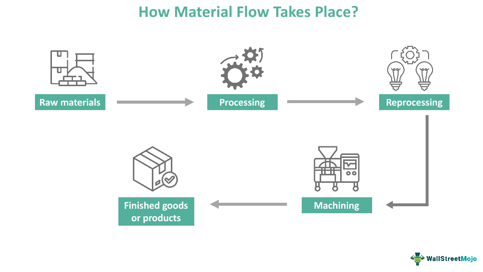

Hydraulic fracturing, commonly known as fracking, is a pivotal technique employed in the oil and gas industry to enhance the extraction rates and recovery from reservoir wells. The fundamental process involves the high-pressure injection of a specialized fracturing fluid into subterranean rock formations. This high-pressure fluid creates fissures in the rocks, which subsequently allows for the more efficient flow of oil and gas toward the production wells.

A critical aspect of hydraulic fracturing is the control over flowback, the phase during which the fracturing fluid, along with hydrocarbons, returns to the surface. Effective flowback control is essential to avoid the production of sand, a phenomenon where sand particles can obstruct the production pathways and significantly impair well productivity.



In recent years, advancements in artificial intelligence (AI) have introduced innovative methods to optimize hydraulic fracturing processes. AI technologies, particularly automated systems and predictive models, offer new dimensions in enhancing operational efficiencies and decision-making capabilities. By integrating AI, it is now possible to apply precise predictions and adjustments in real-time, improving overall productivity and sustainability in hydraulic fracturing activities.

This article examines how AI-enabled strategies, such as the AU-RES neural network, are revolutionizing flowback control in hydraulic fracturing. The AU-RES model is specifically designed to predict and manage flowback scenarios, thus reducing operational costs and enhancing the sustainability of oil and gas extraction operations. Furthermore, the article explores the intersection between hydraulic fracturing flowback control, AI advancements, and algorithmic trading. This amalgamation serves to improve operational efficiencies and financial outcomes in the oil and gas sector through enhanced precision and optimized trading strategies.

## Table of Contents

## Understanding Hydraulic Fracturing and Flowback Control

Hydraulic fracturing, popularly known as "fracking," is a technique designed to enhance the extraction of hydrocarbons such as oil and gas from challenging shale rock formations. This process becomes crucial as conventional reservoirs are depleted, necessitating innovative methods to tap into shale resources effectively. 

Flowback refers to the phase immediately following hydraulic fracturing, where the fracturing fluid returns to the surface. This fluid predominantly consists of water, sand, and a variety of chemical additives used to sustain the fissures created in the rock. Proper flowback control is paramount to ensure the integrity of the well and the maximization of resource recovery. Effective control of this process can mitigate potential issues such as sand production, which occurs when sand particles escape with the flowback fluid. This problem can significantly impair the well's productivity by blocking production pathways and reducing the efficiency of hydrocarbon extraction.

Traditional approaches to managing flowback have largely depended on the expertise and judgment of operators, who may manually adjust the fluid parameters to optimize the return process. This method, however, has inherent limitations due to its reliance on human intervention and the potential for error, making it less adaptive to the dynamic and complex conditions present during fracking operations. As such, there is a growing interest in advancing these processes through technological innovations that can offer more reliable and efficient solutions.

## The Role of AI in Hydraulic Fracturing

Artificial intelligence (AI) has become an essential asset in the oil and gas industry by enhancing operational efficiencies and decision-making processes. Traditionally, hydraulic fracturing relied on manual adjustments and empirical methods to manage operations. However, the integration of AI provides the ability to process and analyze complex datasets, offering a transformative approach to optimizing hydraulic fracturing, particularly in flowback control.

AI models are designed to handle vast and complex datasets, enabling the prediction and dynamic adjustment of flowback patterns. These predictive models process a variety of input parameters, such as pressure, flow rates, and geological characteristics, to generate actionable insights. This capability is crucial in managing the high variability and uncertainty inherent in hydraulic fracturing operations. By leveraging [machine learning](/wiki/machine-learning) algorithms, operators can adjust operational parameters in real time, which enhances the precision of flowback control and prevents complications such as sand production.

A prominent example of AI application in hydraulic fracturing is the AU-RES (Augmented Residual) [neural network](/wiki/neural-network). The AU-RES model improves the accuracy of flowback predictions by using a sophisticated architecture designed to handle multiple inputs effectively. The model employs a combination of residual and convolutional layers to manage diverse data types and correlate them coherently. By learning from historical and real-time data, the AU-RES network refines its predictive capabilities, allowing operators to make informed decisions that optimize fracturing fluid flow and enhance well integrity.

In real-world applications, AI systems in hydraulic fracturing utilize learning mechanisms similar to those in data-driven performance analysis. Python libraries such as TensorFlow or PyTorch can be used to implement neural networks capable of processing high-dimensional data. For instance, a simple neural network structure in Python for flowback prediction might start as follows:

```python
import tensorflow as tf

# Define a simple sequential model
model = tf.keras.models.Sequential([
    tf.keras.layers.Dense(64, activation='relu', input_shape=(input_dim,)),
    tf.keras.layers.Dense(64, activation='relu'),
    tf.keras.layers.Dense(output_dim)
])

# Compile the model
model.compile(optimizer='adam', loss='mean_squared_error')
```

This code snippet outlines the creation of a simple feed-forward neural network that can be used as a starting point for more complex models like AU-RES. Such models not only improve operational efficiency but also contribute to the sustainability and cost-effectiveness of hydraulic fracturing processes by minimizing resource wastage and reducing environmental impact. 

The deployment of AI in hydraulic fracturing signifies a shift towards more intelligent and responsive operations, tapping into the potential of machine learning to address longstanding challenges in the industry. As AI technology evolves, its integration into hydraulic fracturing will likely yield even greater efficiencies and innovations.

## Algorithmic Trading in the Oil and Gas Industry

Algorithmic trading utilizes sophisticated computer algorithms to analyze market data and automate trading decisions, aiming to optimize financial performance. In financial markets, these algorithms can detect patterns and execute trades at speeds and frequencies beyond human capabilities. This approach has found significant applicability in the oil and gas industry, where market [volatility](/wiki/volatility-trading-strategies) and the rapid pace of trading demand advanced methods of optimization.

In the oil and gas sector, [algorithmic trading](/wiki/algorithmic-trading) plays a pivotal role in commodity trading, allowing companies to efficiently manage their trading strategies based on precise predictions of oil and gas production. For instance, predictive models can analyze historical production data, current market conditions, and geopolitical factors to forecast future production rates. By integrating these forecasts with real-time market data, algorithms can automatically adjust trading positions, thereby maximizing profit opportunities and minimizing risks.

Algorithmic trading capitalizes on the ability to process vast amounts of data at high speeds. Techniques such as machine learning and [artificial intelligence](/wiki/ai-artificial-intelligence) are often employed to enhance the predictive accuracy of these algorithms. The adaptability of these technologies means that trading strategies can be continuously refined to respond to market dynamics, ensuring that trading decisions are data-driven and proactive.

One of the critical advantages of using algorithmic trading in the oil and gas industry is its potential to improve financial outcomes. By anticipating market fluctuations more accurately, companies can optimize their trading strategies, leading to a reduction in losses from unfavorable market movements and an increase in profitability. For example, a well-designed algorithm might detect early indicators of supply disruptions and adjust positions in anticipation of price spikes, thereby capturing additional value from market swings.

Furthermore, the automation inherent in algorithmic trading reduces the impact of human emotion and bias on trading decisions. This results in more consistent execution of trading strategies and can lead to more stable financial performance over time. The reduction in manual intervention not only enhances efficiency but also decreases the likelihood of costly errors associated with human oversight.

Overall, the integration of algorithmic trading into the oil and gas sector represents a significant shift towards data-led decision making. As these technologies continue to evolve, they are likely to further transform commodity trading, offering the potential for greater financial gains and more robust risk management strategies.

## Case Study: AU-RES Neural Network for Flowback Control

The AU-RES neural network represents a significant advancement in the optimization of flowback control in hydraulic fracturing. This AI model primarily focuses on predicting necessary adjustments in nozzle diameters during the fracturing process to ensure optimal fluid flow and minimize sand production, a common issue that can obstruct extraction pathways and hamper productivity.

To achieve its objectives, the AU-RES network employs a methodology that integrates both historical and real-time data. This dual-use of data allows the model to make informed predictions and dynamically adjust operational parameters to maintain the integrity of the well. By analyzing patterns and detecting anomalies, the neural network autonomously calibrates the system to prevent excessive or insufficient flowback, reducing the likelihood of operational disruptions.

The architecture of the AU-RES neural network is meticulously designed to handle the complex dynamics of flowback control. It incorporates advanced data conversion techniques to preprocess input data, ensuring that the information fed into the system is relevant and actionable. The model utilizes residual and convolutional layers, which are pivotal in capturing and managing the intricate correlations between various input parameters. This architecture enables the network to learn from subtle nuances in the data, enhancing its prediction accuracy and operational effectiveness.

Experiments conducted on the AU-RES neural network indicate a marked improvement in the precision of flowback control compared to traditional methods. The ability of the model to anticipate and adjust to real-time changes significantly reduces the chances of sand production, thereby ensuring smoother operational flow and increased well productivity. This evidence is indicative of the network's potential to transform hydraulic fracturing practices, presenting a viable solution for challenges associated with flowback management.

In summary, the AU-RES neural network exemplifies how AI can be leveraged to optimize complex industrial processes like hydraulic fracturing. By integrating sophisticated modeling techniques and real-time data analysis, it stands as a promising tool that enhances efficiency and sustainability in the oil and gas industry.

## Conclusion

AI-assisted flowback control stands as a pivotal advancement within the hydraulic fracturing domain, offering the prospect of significant gains in both operational efficiency and cost reduction. The application of AI models, such as the AU-RES neural network, is poised to revolutionize traditional fracturing methods by delivering enhanced precision and predictive capabilities. These models enable real-time adjustments to fracturing processes, thus mitigating issues such as sand production and inefficient fluid recovery—problems that have traditionally plagued the industry.

The integration of AI not only promises efficiency in operational procedures but also opens avenues for optimizing the alignment of flowback control with algorithmic trading strategies. This synchronization could play a crucial role in amplifying the economic benefits realized by the oil and gas industry, allowing firms to better anticipate market trends and optimize their trading strategies based on precise production forecasts.

Continuous research and development in AI technologies are imperative for unlocking their full potential in improving the sustainability and profitability of hydraulic fracturing operations. As AI models evolve, there lies an opportunity to enhance their application further, potentially leading to more environmentally friendly and economically viable extraction processes. The focus must remain on refining these technologies to balance productivity with ecological responsibility, ensuring long-term benefits for both the industry and the environment.

## References & Further Reading

[1]: Montgomery, Carl W. & Smith, Mark B. (2010). ["Hydraulic Fracturing: History of an Enduring Technology"](https://onepetro.org/JPT/article/62/12/26/194396/Hydraulic-Fracturing-History-of-an-Enduring) Journal of Petroleum Technology, Vol. 62, No. 12.

[2]: Williams, B. N., & Keith, D. W. (2012). ["Evaluation of Flowback Measurements in Hydraulic Fracturing Operations."](https://www.researchgate.net/publication/287409365_Hydraulic_fracturing_overview_How_where_and_its_role_in_oil_and_gas) Society of Petroleum Engineers.

[3]: Goodfellow, I., Bengio, Y., & Courville, A. (2016). ["Deep Learning"](https://www.deeplearningbook.org/) MIT Press.

[4]: ["AI for Earth: Perspectives on an Emerging Technology"](https://www.sciencedirect.com/science/article/pii/S0098300422000036) by UN Habitat

[5]: Russell, S. J., & Norvig, P. (2016). ["Artificial Intelligence: A Modern Approach"](https://www.amazon.com/Artificial-Intelligence-A-Modern-Approach/dp/0134610997) Pearson.

[6]: ["Fracking: The Operations and Environmental Impacts of Hydraulic Fracturing"](https://biologyinsights.com/environmental-impacts-of-hydraulic-fracturing-a-comprehensive-review/) Academic Press.