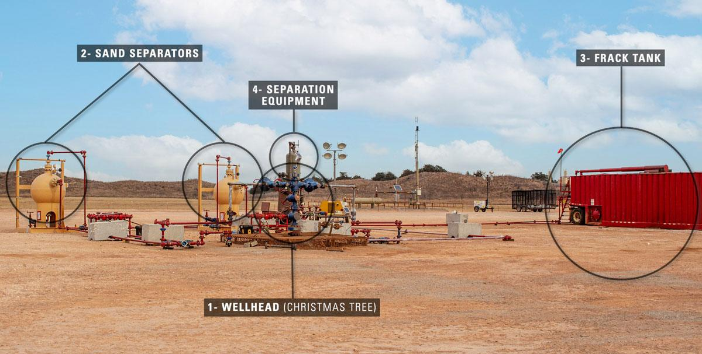

## Table of Contents

## What is flowback in the context of oil and gas production?

Flowback is a term used in the oil and gas industry to describe the process of bringing fluids back to the surface after a well has been hydraulically fractured, or "fracked." During fracking, a mixture of water, sand, and chemicals is pumped into the ground at high pressure to create cracks in the rock formation, which allows oil and gas to flow more freely. After the fracking is done, the pressure is released, and the mixture, along with any oil and gas that was released, starts to flow back up the well.

This flowback fluid is important because it helps operators understand how well the fracking worked. By analyzing the fluid, they can see how much of the fracking mixture was used and how much oil and gas is coming out. The flowback process can last from a few days to several weeks, depending on the well. After the flowback is complete, the well goes into production, and the oil and gas are extracted for use.

## Why is flowback important in the extraction process?

Flowback is important in the extraction process because it helps us see if the fracking worked well. When we frack a well, we use a mix of water, sand, and chemicals to break the rock and let oil and gas come out. After fracking, we let this mix, along with the oil and gas, come back up the well. By looking at the flowback fluid, we can tell how much of our fracking mix was used and how much oil and gas we are getting.

This information is very useful for the people working on the well. It helps them know if they need to change anything to get more oil and gas out. The flowback period can last from a few days to several weeks. Once it's done, the well starts producing oil and gas that can be used. So, flowback is a key step to make sure the well works well and gives us the energy we need.

## What are the typical components of flowback fluid?

Flowback fluid is made up of different things that come back up the well after fracking. The main part of the fluid is water, which was used in the fracking process. Along with water, there's also sand, which is used to keep the cracks in the rock open so oil and gas can flow out.

There are also chemicals in the flowback fluid. These chemicals were added to the fracking mix to help break the rock and keep the well working well. Sometimes, the fluid can also have oil and gas mixed in it, which is what we want to get from the well.

All these parts together make up the flowback fluid. By looking at what's in the fluid, people working on the well can learn a lot about how well the fracking worked and what they might need to do next.

## How is flowback managed and treated after extraction?

After flowback fluid comes up from the well, it needs to be managed and treated carefully. The fluid is collected in special tanks or pits at the well site. From there, it is usually taken away by trucks to a treatment facility. At the treatment facility, the fluid is separated into its different parts like water, sand, chemicals, and any oil or gas that might be in it. This helps to get rid of harmful stuff and makes the fluid safer to handle.

Once the flowback fluid is treated, the water part can sometimes be reused for more fracking or other uses, if it's clean enough. The sand can be used again too, or it might be thrown away safely. The chemicals and any leftover oil or gas need to be dealt with carefully to follow rules and keep the environment safe. Managing flowback fluid well is important to make sure it doesn't harm people or nature.

## What are the environmental concerns associated with flowback?

Flowback fluid can be a problem for the environment if it's not handled right. It has chemicals that can be harmful to plants, animals, and people if they get into the water or soil. If flowback fluid leaks or spills, it can pollute rivers, lakes, and groundwater, which is the water we drink. This pollution can make it hard for wildlife to live and can make people sick if they use the water.

Another worry is what to do with the flowback fluid after it's been treated. Even after treatment, the fluid might still have some harmful stuff in it. If it's not disposed of the right way, it can still cause problems. People are working on better ways to treat and reuse the fluid to help reduce these risks, but it's still a big challenge to make sure flowback doesn't harm the environment.

## Can you describe the process of flowback operations?

Flowback operations start right after a well has been fracked. Fracking means pumping water, sand, and chemicals into the ground to break the rock and let oil and gas come out. Once the fracking is done, the pressure is let go, and the mix of water, sand, chemicals, and any oil or gas starts to flow back up the well. This is called flowback. The fluid is collected in special tanks or pits at the well site. People working on the well watch the flowback closely to see how well the fracking worked and how much oil and gas they are getting.

After the flowback fluid is collected, it needs to be taken away and treated. Trucks carry the fluid to a treatment facility where it's separated into water, sand, chemicals, and any oil or gas. The treatment helps get rid of the harmful stuff in the fluid. Once treated, the water might be used again for fracking or other things if it's clean enough. The sand can be reused or thrown away safely. The chemicals and any leftover oil or gas need to be handled carefully to make sure they don't harm the environment. The whole process of flowback operations is important to make sure the well works well and to keep the environment safe.

## What technologies are used to monitor and control flowback?

To monitor and control flowback, people use special tools and machines. One common tool is a flow meter, which measures how much fluid is coming out of the well. This helps workers know if the flowback is going as planned. They also use sensors to check the pressure and temperature of the fluid. These sensors send information back to a control room where people can see what's happening and make changes if needed. Another important technology is the data logger, which keeps track of all the information over time so workers can see if anything is changing.

Sometimes, workers use automatic control systems to manage the flowback. These systems can adjust things like valves and pumps without people having to do it by hand. This makes the process safer and more accurate. There are also special cameras and drones that can watch the well site from far away. They help spot any problems like leaks or spills quickly. All these technologies work together to make sure the flowback goes smoothly and safely.

## How does flowback impact the overall efficiency of a well?

Flowback is really important for making a well work well. When we frack a well, we use water, sand, and chemicals to break the rock and let oil and gas come out. After fracking, we let this mix come back up the well. By looking at the flowback fluid, we can see how much of our fracking mix was used and how much oil and gas we are getting. This helps us know if the fracking worked well and if we need to change anything to get more oil and gas out. If the flowback shows that a lot of oil and gas is coming out, it means the well is working efficiently.

If the flowback isn't managed right, it can cause problems. If the fluid leaks or spills, it can pollute the environment and make it hard to keep the well running smoothly. Also, if the flowback fluid isn't treated and reused properly, it can waste resources and make the whole process less efficient. By using the right tools and technologies to monitor and control the flowback, we can make sure the well keeps working well and producing as much oil and gas as possible.

## What are the regulatory requirements for handling flowback?

Handling flowback has to follow strict rules set by the government to keep people and the environment safe. These rules say that companies need to collect the flowback fluid carefully and take it to a special place to be treated. They also need to keep an eye on the fluid to make sure it doesn't leak or spill. If there's a spill, they have to clean it up fast and report it to the people in charge. The rules also say that companies need to keep good records of everything they do with the flowback fluid, so they can show they are following the rules.

Different places might have different rules, but they all want to make sure the flowback fluid is handled in a way that doesn't harm the environment. For example, some places might have special rules about how to treat the fluid before it can be reused or thrown away. Companies also need to follow rules about how to get rid of the chemicals and any leftover oil or gas in the flowback fluid. By following these rules, companies can help make sure that the flowback process is safe and doesn't cause problems for the environment or people nearby.

## How do different geological formations affect flowback characteristics?

Different types of rocks and layers in the ground can change how flowback works. Some rocks are really tight and don't let the fracking fluid come back easily. This means the flowback might be slower and have less fluid. Other rocks might have a lot of cracks and spaces, so the flowback can come back faster and with more fluid. The kind of rock also affects what's in the flowback fluid. For example, if the rock has a lot of salt, the flowback fluid might be saltier.

The way the rock layers are set up can also make a difference. If the layers are flat and even, the flowback might be easier to predict and control. But if the layers are tilted or broken up, the flowback can be harder to manage. This is because the fluid might take different paths to come back up the well. Understanding the geology of the area helps people working on the well know what to expect and how to handle the flowback better.

## What are the latest advancements in flowback management techniques?

The latest advancements in flowback management focus on making the process safer and more efficient. One big change is using better technology to treat the flowback fluid. New machines can separate the water, sand, and chemicals more cleanly and quickly. This helps to reuse more of the water and sand, which saves money and is better for the environment. Another advancement is using special sensors and computers to watch the flowback closely. These tools can spot problems like leaks or changes in the fluid right away, so workers can fix them before they get worse.

Another important advancement is in how we handle the chemicals in the flowback fluid. Scientists are finding new ways to break down these chemicals so they are less harmful. This makes it easier to dispose of the fluid safely. Also, new rules and guidelines are helping to make sure companies follow the best practices for managing flowback. By using these new methods and technologies, we can make the whole process of dealing with flowback better and safer for everyone.

## How can data analytics be used to optimize flowback processes?

Data analytics can help make the flowback process better by looking at all the information collected during the operation. When flowback fluid comes back up the well, sensors and meters measure things like how much fluid there is, how fast it's coming out, and what's in it. By using data analytics, people can see patterns and trends in this information. For example, they can find out if the flowback is slower than usual or if there are more chemicals in the fluid than expected. This helps them know if something needs to be fixed or changed to make the well work better.

Using data analytics also helps to predict what might happen next. By looking at past data from other wells, people can guess how much oil and gas a new well might produce and how long the flowback will last. This can help plan the whole process better and save time and money. Plus, data analytics can help find the best ways to treat and reuse the flowback fluid, making the process more efficient and better for the environment. By using all this information, people can make smarter decisions and improve how they manage flowback.

## References & Further Reading

[1]: Montgomery, Carl W. & Smith, Mark B. (2010). ["Hydraulic Fracturing: History of an Enduring Technology"](https://onepetro.org/JPT/article/62/12/26/194396/Hydraulic-Fracturing-History-of-an-Enduring) Journal of Petroleum Technology, Vol. 62, No. 12.

[2]: Williams, B. N., & Keith, D. W. (2012). ["Evaluation of Flowback Measurements in Hydraulic Fracturing Operations."](https://www.researchgate.net/publication/287409365_Hydraulic_fracturing_overview_How_where_and_its_role_in_oil_and_gas) Society of Petroleum Engineers.

[3]: Goodfellow, I., Bengio, Y., & Courville, A. (2016). ["Deep Learning"](https://www.deeplearningbook.org/) MIT Press.

[4]: ["AI for Earth: Perspectives on an Emerging Technology"](https://www.sciencedirect.com/science/article/pii/S0098300422000036) by UN Habitat

[5]: Russell, S. J., & Norvig, P. (2016). ["Artificial Intelligence: A Modern Approach"](https://www.amazon.com/Artificial-Intelligence-A-Modern-Approach/dp/0134610997) Pearson.

[6]: ["Fracking: The Operations and Environmental Impacts of Hydraulic Fracturing"](https://biologyinsights.com/environmental-impacts-of-hydraulic-fracturing-a-comprehensive-review/) Academic Press.