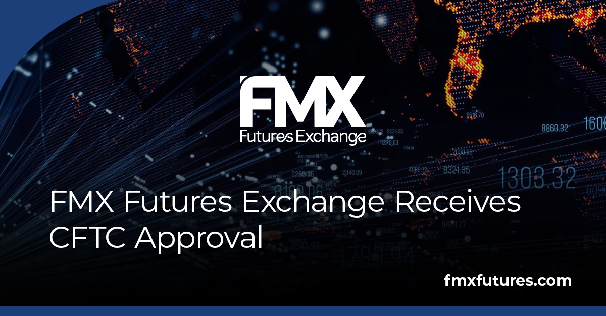

## Table of Contents

## What is FMX Futures Exchange?

FMX Futures Exchange is a place where people can buy and sell futures contracts. Futures contracts are agreements to buy or sell something at a future date, like crops or financial products. FMX Futures Exchange is owned by a company called FEX Group, which is based in Australia. The exchange helps people manage risks by allowing them to lock in prices for things they will need later.

The FMX Futures Exchange started in 2005 and has grown over the years. It is regulated by the Australian Securities and Investments Commission (ASIC), which makes sure that the exchange follows the rules. People use the FMX Futures Exchange to trade many different kinds of futures, including those for agriculture, energy, and metals. This helps farmers, businesses, and investors plan for the future and protect themselves from price changes.

## When was FMX Futures Exchange established?

FMX Futures Exchange was established in 2005. It is a place where people can trade futures contracts. Futures contracts are agreements to buy or sell something at a future date, like crops or financial products.

FMX Futures Exchange is owned by FEX Group, a company based in Australia. The exchange helps people manage risks by allowing them to lock in prices for things they will need later. It is regulated by the Australian Securities and Investments Commission (ASIC), which makes sure that the exchange follows the rules.

## What types of futures contracts are traded on FMX Futures Exchange?

FMX Futures Exchange offers different kinds of futures contracts for people to trade. These include futures for things like grains, oil, and metals. Farmers can use these contracts to lock in prices for their crops before they harvest them. This helps them know how much money they will make, even if prices change later.

Companies that need oil or metals can also use these futures to plan their costs. By buying a futures contract, they can set a price for what they need in the future. This helps them avoid surprises if the prices go up. Investors can trade these futures too, trying to make money by guessing where prices will go.

Overall, FMX Futures Exchange helps a lot of different people manage risks and plan for the future. Whether it's farmers, businesses, or investors, everyone can find futures contracts that meet their needs.

## Who can trade on FMX Futures Exchange?

Anyone who wants to manage risks or invest can trade on FMX Futures Exchange. This includes farmers who want to lock in prices for their crops, businesses that need to plan their costs for things like oil or metals, and investors who want to make money by guessing where prices will go. All these people can use the exchange to buy and sell futures contracts.

To trade on FMX Futures Exchange, you need to follow the rules set by the Australian Securities and Investments Commission (ASIC). This means you have to be honest and follow the laws. The exchange is open to people from many different places, as long as they meet these rules. This helps make sure that trading is fair and safe for everyone involved.

## How does one open an account with FMX Futures Exchange?

To open an account with FMX Futures Exchange, you first need to find a broker who is allowed to trade on the exchange. A broker is someone who helps you buy and sell futures contracts. You can search online or ask other traders for recommendations on which brokers to use. Once you pick a broker, you will need to fill out an application form. This form will ask for your personal information, like your name, address, and phone number. You might also need to provide some documents, like a copy of your ID, to prove who you are.

After you submit your application, the broker will check it to make sure everything is correct. If everything is okay, they will open an account for you. You will then need to put some money into your account, which is called a margin. This money is used to cover any losses you might have when trading. Once your account is set up and funded, you can start trading futures contracts on FMX Futures Exchange. Remember to always follow the rules set by the Australian Securities and Investments Commission (ASIC) to keep your trading fair and safe.

## What are the trading hours for FMX Futures Exchange?

The FMX Futures Exchange is open for trading from Monday to Friday. The trading hours start at 8:00 AM and end at 4:30 PM, Australian Eastern Standard Time (AEST). This means that people can trade during the regular business day in Australia.

If you are in a different time zone, you will need to figure out what these hours are in your local time. For example, if you are in New York, you would need to subtract 14 hours from the AEST time to know when the exchange is open. This helps make sure that traders from around the world can plan their trading times correctly.

## What are the fees associated with trading on FMX Futures Exchange?

Trading on FMX Futures Exchange involves different kinds of fees. One fee is the exchange fee, which is charged every time you buy or sell a futures contract. This fee helps cover the costs of running the exchange. Another fee is the brokerage fee, which you pay to your broker for helping you trade. The amount of these fees can change depending on what you are trading and how much you are trading.

There might also be other costs to think about. For example, if you hold a futures contract until it expires, you might have to pay a delivery fee if you take or give the actual product. Also, if you use margin to trade, you might have to pay interest on the money you borrow. It's a good idea to talk to your broker about all the fees and costs before you start trading, so you know exactly what to expect.

## How does FMX Futures Exchange ensure the security and integrity of trades?

FMX Futures Exchange works hard to make sure that trading is safe and fair for everyone. They use strong computer systems to keep track of all trades and make sure no one can change them after they happen. They also have rules that everyone has to follow, and they check to make sure people are doing what they're supposed to. If someone breaks the rules, FMX can stop them from trading and even tell the Australian Securities and Investments Commission (ASIC) about it.

Another way FMX keeps trading safe is by making sure that everyone has enough money in their accounts to cover their trades. This is called margin, and it helps make sure that if prices move a lot, people can still pay for their trades. FMX also uses special technology to watch for any strange trading patterns that might be cheating. By doing all these things, FMX helps make sure that trading is honest and that everyone can trust the exchange.

## What technological platforms does FMX Futures Exchange use for trading?

FMX Futures Exchange uses a special computer system called FEX Trading Platform to help people trade futures contracts. This platform is easy to use and lets traders buy and sell quickly and safely. It shows real-time prices and lets people see what's happening in the market right away. The FEX Trading Platform is made to work well and keep everything running smoothly, so traders can focus on making their trades without any problems.

To make sure trading stays safe and fair, FMX also uses other technology. They have systems that watch for any strange trading that might be cheating. These systems check every trade to make sure no one is trying to trick the market. FMX also uses strong security measures to protect the information and money of everyone who trades on the exchange. This helps keep everything honest and lets traders trust that their trades are safe.

## Can you explain the clearing and settlement process at FMX Futures Exchange?

At FMX Futures Exchange, the clearing and settlement process is important for making sure trades are safe and fair. When someone trades a futures contract, the exchange steps in to make sure the trade happens correctly. This is called clearing. FMX acts like a middleman, making sure that both the buyer and the seller do what they promised. They check that everyone has enough money in their accounts to cover their trades. This helps prevent problems if prices change a lot.

After the trade is cleared, it moves to the settlement stage. Settlement is when the actual exchange of money or the product happens. If the futures contract expires and someone wants to take or give the actual product, like grains or oil, FMX makes sure this happens smoothly. They also handle any fees that need to be paid. If the contract is settled in cash instead, FMX makes sure the money goes where it needs to go. This whole process helps keep trading trustworthy and safe for everyone involved.

## How does FMX Futures Exchange comply with regulatory requirements?

FMX Futures Exchange follows the rules set by the Australian Securities and Investments Commission (ASIC). They do this by making sure all trades are fair and honest. FMX has strict rules that everyone has to follow. If someone breaks these rules, FMX can stop them from trading and tell ASIC about it. They also keep a close watch on all trades to make sure no one is cheating. This helps keep the market safe and trustworthy for everyone.

To meet these rules, FMX uses special technology to watch for any strange trading patterns. They also make sure everyone has enough money in their accounts to cover their trades. This is called margin, and it helps prevent problems if prices change a lot. FMX also reports to ASIC regularly to show they are following the rules. By doing all these things, FMX helps make sure that trading is honest and that everyone can trust the exchange.

## What are some advanced trading strategies used by professionals on FMX Futures Exchange?

Professionals on FMX Futures Exchange often use advanced trading strategies like spread trading. In spread trading, they buy one futures contract and sell another at the same time. This helps them make money from the difference in prices between the two contracts. For example, a trader might buy a wheat futures contract for one month and sell a wheat futures contract for a later month. If the price difference between the two contracts changes in their favor, they can make a profit. This strategy can be less risky than just buying or selling one contract because it helps balance out price changes.

Another strategy professionals use is called [algorithmic trading](/wiki/algorithmic-trading). This is when they use computer programs to trade automatically. These programs can look at a lot of information very quickly and make trades based on that information. For example, a program might be set up to buy a futures contract if the price goes below a certain level and sell it if the price goes above another level. This can help traders make decisions faster and more accurately than they could by themselves. Algorithmic trading can be very useful, but it also needs careful watching to make sure it works right and follows the rules.

## References & Further Reading

[1]: Gorton, G., Hayashi, F., & Rouwenhorst, K. G. (2013). ["The Fundamentals of Commodity Futures Returns."](https://www.nber.org/papers/w13249) Review of Finance, 17(1), 35–105.

[2]: Hieronymus, T. A. (1977). ["Economics of Futures Trading for Commercial and Personal Profit."](https://archive.org/details/economicsoffutur0000hier) Commodity Research Bureau.

[3]: ["Algorithmic and High-Frequency Trading"](https://www.cambridge.org/us/universitypress/subjects/mathematics/mathematical-finance/algorithmic-and-high-frequency-trading) by Álvaro Cartea, Sebastian Jaimungal, and José Penalva

[4]: Chaboud, A., Chiquoine, B., Hjalmarsson, E., & Vega, C. (2014). ["Rise of the Machines: Algorithmic Trading in the Foreign Exchange Market."](https://papers.ssrn.com/sol3/papers.cfm?abstract_id=1501135) American Economic Journal: Macroeconomics, 6(2): 148-178.

[5]: Narang, R. K. (2013). ["Inside the Black Box: The Simple Truth About Quantitative Trading."](https://onlinelibrary.wiley.com/doi/book/10.1002/9781118267738) Wiley.