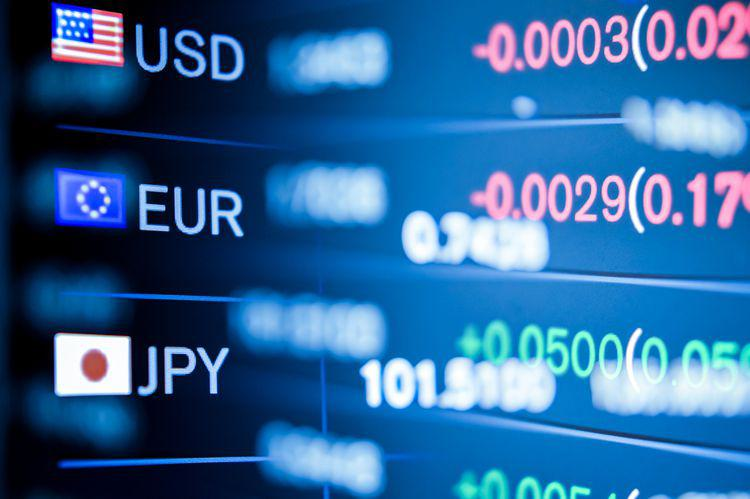

Commodities trading is a crucial component of the global financial market, enabling the buying and selling of raw materials such as energy, metals, and agricultural products. This trading facilitates price discovery, hedging, and speculation, thereby playing a vital role in global economic stability and investment strategies. Futures exchanges are pivotal in this process, providing a centralized marketplace where standardized futures contracts—agreements to buy or sell a commodity at a predetermined future date and price—are traded. These exchanges ensure market efficiency, liquidity, and transparency by bringing together a wide range of market participants, including producers, consumers, investors, and speculators.

FMX, a modern futures exchange, has emerged as a significant player in the landscape of futures trading. Leveraging cutting-edge technology, FMX offers innovative solutions that enhance trading efficiency and security. It distinguishes itself from traditional exchanges through unique features and partnerships, positioning itself as a leader in the rapidly evolving market environment.



Algorithmic trading, or algo trading, has gained substantial importance in recent years, driven by advances in technology and the need for faster, more efficient trading methods. Algo trading involves the use of computer algorithms to execute trades based on pre-defined criteria such as price, volume, and time. This approach minimizes human intervention, reducing the behavioral biases and inefficiencies that can occur in manual trading. Furthermore, it provides traders with the ability to implement complex strategies and execute trades at speeds unattainable by humans.

The purpose of this article is to explore FMX's approach to incorporating algorithmic trading within the commodities market. By examining FMX's practices, tools, and how it integrates algo trading into its platform, we aim to shed light on the innovative strategies being employed to enhance trading outcomes for participants in the commodities market. Through this lens, we will assess the benefits and challenges of algo trading on FMX and consider future trends in the industry.

## Table of Contents

## Understanding Commodities Trading

Commodities trading is a fundamental aspect of the global marketplace, representing a pivotal segment of financial markets that involve the buying and selling of basic goods required by all levels of society. Commodities are typically categorized into energy (e.g., oil, natural gas), metals (e.g., gold, silver, copper), and agricultural products (e.g., wheat, corn, coffee). These categories not only define distinct market segments but also reflect the diverse requirements of global economies.

The importance of commodities in investment portfolios and economic stability cannot be overstated. Commodities often act as a hedge against inflation, and their prices usually move in opposition to those of equities and bonds. This inverse relationship provides a valuable diversification tool for investors, which can mitigate risks and enhance returns when strategically included in investment portfolios [1]. Moreover, commodities are integral to economic stability as they significantly impact the cost of living and production inputs necessary for various industries. Fluctuations in commodity prices can, therefore, influence inflation rates, employment levels, and overall economic growth.

The basic mechanisms of commodities trading revolve around the standardized contracts that facilitate the transaction of these goods. Commodities are primarily traded via futures contracts, which are agreements to buy or sell a specific quantity of a commodity at a predetermined price at a set date in the future. This form of trading allows producers and consumers to manage price risks associated with their operational requirements. Futures exchanges standardize these contracts, making them easier to trade and providing [liquidity](/wiki/liquidity-risk-premium) to the markets.

Historically, commodities trading has evolved from simple bartering systems to sophisticated exchanges. In ancient times, agricultural produce was exchanged in physical markets, driven by the needs of farmers and traders. The establishment of organized exchanges began in the 19th century, with the creation of the Chicago Board of Trade (CBOT) in 1848 marking a significant evolution. The CBOT introduced the concept of futures contracts, enabling better price discovery and risk management [2]. Over time, technological advancements have ushered in electronic trading, enhancing efficiency and accessibility for global participants. The evolution of commodities trading reflects both technological progress and the growing complexity of economic interactions in the modern world.

In summary, commodities trading is a dynamic field integral to financial markets and economic security. It provides opportunities for investment diversification and risk management through sophisticated instruments such as futures contracts. Understanding its historical evolution offers valuable insights into the mechanisms that shape today's trading landscape.

[1] Gorton, G., Hayashi, F., & Rouwenhorst, K. G. (2013). The Fundamentals of Commodity Futures Returns. Review of Finance, 17(1), 35–105.

[2] Hieronymus, T. A. (1977). Economics of Futures Trading for Commercial and Personal Profit. Commodity Research Bureau.

## Futures Exchanges: A Closer Look

Futures exchanges are integral components of global financial markets, facilitating the trading of futures contracts. A futures contract is a standardized legal agreement to buy or sell a particular commodity or financial instrument at a predetermined price at a specified time in the future. These contracts cover a wide variety of underlying assets, including commodities like agricultural products, energy, and metals, as well as financial instruments like currencies and stock indices.

The primary role of futures exchanges is to provide a structured, regulated marketplace where these contracts can be bought and sold. They serve as intermediaries that standardize contracts, thus ensuring security and reducing risk for traders. The transparency and liquidity provided by these exchanges are crucial for price discovery and risk management in the financial markets. Moreover, futures exchanges facilitate hedging, where participants can protect themselves against price [volatility](/wiki/volatility-trading-strategies) in underlying assets, and speculation, where traders attempt to profit from market movements.

Key players in futures exchanges include individual traders, institutional investors, commercial hedgers, and market makers. Traders can be speculators seeking to profit from price changes or hedgers aiming to mitigate financial risks. Market makers, on the other hand, play a significant role by providing liquidity and ensuring smooth trading operations. They do this by continuously offering to buy and sell contracts, thereby facilitating trades even in times of low market activity.

Globally, several major futures exchanges stand out due to their trading volumes and the diversity of contracts they offer. The Chicago Mercantile Exchange (CME) in the United States is one of the largest, known for its diverse product offerings, including agricultural, energy, and financial futures. The Intercontinental Exchange (ICE), also U.S.-based, is another major player, particularly prominent in energy and agricultural commodities. In Europe, the Euronext and Deutsche Börse's Eurex are notable markets for futures and options. Meanwhile, the Asia-Pacific region hosts significant exchanges such as the Shanghai Futures Exchange (SHFE) in China and the Tokyo Commodity Exchange (TOCOM) in Japan, which are pivotal in regional and global commodities trading.

The evolution of futures exchanges continues as they adapt to technological advancements, regulatory changes, and the shifting demands of global markets. These institutions not only provide a venue for trading but also foster innovation in financial instruments and trading strategies, reinforcing their critical role in modern finance.

## FMX: Innovating in Futures Exchanges

FMX has emerged as a significant player in the futures trading landscape by redefining the way futures exchanges operate. As a dynamic platform, FMX offers unique features that distinguish it from traditional exchanges, focusing on technological innovation, user engagement, and collaborative partnerships.

One of the standout features of FMX is its emphasis on seamless user experience and interface customization. Unlike conventional exchanges, FMX allows traders to tailor their trading dashboards, offering personalized insights into market trends and real-time data analytics. This customization aids traders in making informed decisions swiftly, an essential aspect in the volatile world of futures trading.

Technologically, FMX leverages state-of-the-art advancements to enhance trading efficiency and security. The platform employs high-frequency trading capabilities and robust APIs that seamlessly integrate with various trading algorithms. This technological edge minimizes latency and maximizes execution speed, providing a competitive advantage to traders. Moreover, FMX implements advanced encryption protocols and multi-[factor](/wiki/factor-investing) authentication, ensuring a secure environment for transactions and safeguarding user data against cyber threats.

FMX has also established strategic partnerships and collaborations that bolster its position in the marketplace. Collaborations with leading technology firms facilitate continuous innovation, allowing FMX to adapt swiftly to technological advancements. Additionally, alliances with financial institutions and trading firms enhance market liquidity and provide diverse trading opportunities for users.

These unique features and strategic collaborations underscore FMX's significance in modernizing futures exchanges. By combining cutting-edge technology with user-centric features, FMX not only meets the current demands of traders but also sets a precedent for future developments in the industry.

## Algorithmic Trading in Commodities

Algorithmic trading, often known as algo trading, refers to the use of computer programs and algorithms to execute trades in financial markets with speed and precision. This practice leverages technological advancements to automate the trading process, capitalizing on pre-defined criteria such as timing, price, and market conditions to execute orders. In the commodities markets, [algorithmic trading](/wiki/algorithmic-trading) plays a significant role by enhancing efficiency, liquidity, and market dynamics.

### Advantages of Algo Trading in Commodities Markets

The main advantages of algorithmic trading in commodities markets include increased speed and efficiency. Algorithms can process vast amounts of market data and execute trades at speeds beyond human capabilities, allowing traders to capitalize on fleeting market opportunities. This efficiency not only increases the probability of profitable trades but also reduces transaction costs through optimized timing and order placement.

Additionally, algorithmic trading helps to manage risk more effectively. By using predefined rules and back-tested strategies, traders can minimize human emotions that often lead to impulsive decision-making. This systematic approach enhances the consistency of trading outcomes, contributing positively to portfolio performance and risk management.

### Common Strategies in Algorithmic Trading

Several strategies commonly applied in algorithmic trading include:

1. **Arbitrage**: This strategy exploits price discrepancies in different markets or instruments. By simultaneously buying and selling an asset in different markets, traders can profit from price differentials. Algorithms are particularly well-suited for this strategy as they can quickly identify and act on these discrepancies before the market corrects itself.

2. **Trend Following**: Trend following algorithms identify and capitalize on market trends. They are based on technical indicators such as moving averages and channel breakouts. These systems generate buy or sell signals when a specific trend continuation pattern is confirmed, allowing traders to ride the trend until it shows signs of reversal.

   Example Python code for a simple moving average crossover strategy might look like this:
   ```python
   short_window = 40
   long_window = 100

   signals['short_mavg'] = data['Close'].rolling(window=short_window, min_periods=1, center=False).mean()
   signals['long_mavg'] = data['Close'].rolling(window=long_window, min_periods=1, center=False).mean()

   signals['signal'] = 0.0
   signals['signal'][short_window:] = np.where(signals['short_mavg'][short_window:] 
                                               > signals['long_mavg'][short_window:], 1.0, 0.0)
   signals['positions'] = signals['signal'].diff()
   ```

3. **Market Making**: This involves providing liquidity to the market by placing simultaneous buy and sell orders for a particular commodity. Market makers benefit from the bid-ask spread and help maintain an orderly market with sufficient depth.

### Impact of Algorithmic Trading on Market Liquidity and Volatility

Algo trading significantly impacts market liquidity and volatility. By automatically matching buy and sell orders, algorithms improve liquidity, enabling smoother transactions and reducing bid-ask spreads. Increased liquidity is beneficial as it reduces the cost of trading and typically results in more stable prices.

However, algorithmic trading can also contribute to increased volatility, particularly during times of market stress. Algorithms can rapidly withdraw liquidity in response to adverse market movements, exacerbating price swings. Furthermore, the occurrence of flash crashes, where stock prices plummet rapidly due to algorithmic orders, highlights the potential volatility introduction by algo trading systems.

Overall, algorithmic trading in commodities markets harnesses computational power and advanced analytical techniques to optimize trading strategies, offering significant advantages but also posing unique challenges in terms of market behavior and stability.

## FMX's Approach to Algo Trading

FMX has positioned itself as a pioneer in integrating algorithmic trading within the commodities market platform, providing cutting-edge solutions that enhance trading efficiency and offer new opportunities to traders. At the core of FMX's integration of algorithmic trading is its commitment to leveraging advanced technology and data analytics.

**Integration of Algorithmic Trading**  
FMX employs a sophisticated infrastructure that supports the seamless integration of algorithmic trading strategies within its platform. This includes the implementation of high-speed data processing systems and real-time analytics, which allow traders to execute complex algorithms with minimal latency. The platform is designed to accommodate various types of algorithms, enabling traders to deploy customized trading strategies that fit their individual needs.

**Proprietary Algorithms and Tools**  
FMX offers a suite of proprietary algorithms and trading tools developed to maximize market opportunities. These algorithms are designed to handle a range of tasks, from simple execution algorithms that minimize market impact to complex predictive models that analyze historical data to forecast price movements. One notable tool provided by FMX is the Strategy Builder, which allows traders to design and test their algorithms in a simulated environment before live deployment, ensuring robustness and effectiveness.

**Case Studies of Successful Algo Trading on FMX**  
Several case studies underscore the success of algorithmic trading on the FMX platform. For instance, a commodities [hedge fund](/wiki/hedge-fund-trading-strategies) utilized FMX's advanced analytics and proprietary algorithms to optimize their trading strategy, resulting in a 30% increase in annual returns. Another example is an energy trading firm that integrated FMX's algo tools to streamline their market-making operations, significantly reducing transaction costs and improving execution speed.

**Security Measures and Risk Management**  
To protect its users and the integrity of the trading environment, FMX implements stringent security measures and risk management strategies. The platform employs state-of-the-art encryption protocols to safeguard data transmission and storage. Additionally, FMX utilizes real-time risk monitoring systems that provide traders with insights into market exposure and potential risks, enabling them to make informed decisions quickly. The platform also includes automated stop-loss features and position limits to prevent excessive loss exposure, ensuring that algo trading is conducted within predefined risk parameters.

Overall, FMX's approach to algorithmic trading emphasizes a balance between technological innovation and robust security, offering traders the tools they need to succeed while maintaining a secure and transparent trading environment.

## Benefits and Challenges of Algo Trading on FMX

FMX offers a robust platform for algorithmic trading in commodities, providing several advantages that enhance trading efficiency and strategy execution. One of the primary benefits is the platform's ability to process vast amounts of market data at high speeds, allowing traders to capitalize on market movements with minimal latency. This speed is critical in commodities markets, where price fluctuations can be rapid and volatile. By utilizing FMX's algo trading capabilities, traders can automate their trading strategies, thereby reducing the possibility of human error and enabling more disciplined execution.

The platform also supports a range of algorithmic strategies, such as [arbitrage](/wiki/arbitrage), [trend following](/wiki/trend-following), and [market making](/wiki/market-making). Traders can deploy these strategies through proprietary algorithms provided by FMX, which are designed to optimize trade execution and maximize returns. For instance, a trend-following algorithm could be programmed to buy commodities that exhibit upward [momentum](/wiki/momentum), ensuring traders quickly benefit from ongoing market trends without manual intervention.

Despite these advantages, algorithmic trading on FMX is not without its challenges. One potential risk is the occurrence of technical glitches or 'flash crashes' that can lead to significant rapid losses. Another challenge is the need for constant monitoring and updating of algorithms to remain effective in dynamic market conditions. Additionally, developing effective trading algorithms requires both programming skills and a deep understanding of market behaviors, which might be a barrier for some traders.

FMX addresses these challenges by implementing comprehensive security measures and risk management strategies. The platform employs rigorous testing of algorithms in simulated environments before they are deployed in live markets, ensuring they function correctly under various conditions. FMX also offers support and resources for traders to refine their trading models and includes monitoring tools to help identify and mitigate potential issues in real-time.

User feedback highlights the positive experiences of traders who engage in algorithmic trading on FMX. Many users appreciate the platform's ease of use, speed, and the reliability of its trading infrastructure, which contributes to more effective trade execution. These testimonials underscore the platform's effectiveness in providing a conducive environment for algorithmic trading, making it a preferred choice for many commodities traders looking to enhance their trading strategies through automation.

## Future Trends in Commodities Trading and Algo Trading

As commodities trading continues to evolve, predicting its future encompasses examining the impact of technological advancements and trading methodologies. The integration of algorithmic trading is expected to deepen the efficiency and accuracy of commodities trading, with automation and [artificial intelligence](/wiki/ai-artificial-intelligence) driving significant innovations. This shift will likely streamline market operations, reducing latency and enhancing the execution speed of trades.

One of the notable trends expected to shape the future is the increased use of [machine learning](/wiki/machine-learning) and big data analytics. These technologies enable the analysis of vast datasets to identify patterns and optimize trading strategies, potentially leading to more informed decision-making. Furthermore, blockchain technology might transform the trading landscape, offering enhanced transparency and security, which could bolster trust among market participants.

Algorithmic trading is anticipated to further evolve with more sophisticated strategies being developed. For instance, sentiment analysis using natural language processing could become a vital tool for traders to gauge market sentiment from social media and news outlets. Similarly, high-frequency trading ([HFT](/wiki/high-frequency-trading-strategies)) will continue to push the boundaries of speed and precision.

FMX stands well-positioned to adapt to these developments due to its robust technological infrastructure. By investing in cutting-edge technology, FMX aims to support new trading paradigms and provide traders with the resources needed to capitalize on market opportunities. The integration of proprietary algorithms and machine learning models into FMX’s platform indicates its readiness to support advanced trading strategies.

To illustrate this technological growth and adaptation, consider this Python snippet, demonstrating a basic sentiment analysis model for commodities trading:

```python
from textblob import TextBlob
import requests

# Example function to fetch news headlines about a commodity
def get_news(commodity):
    response = requests.get(f"https://newsapi.org/v2/everything?q={commodity}&apiKey=YOUR_API_KEY")
    news_data = response.json()
    headlines = [article['title'] for article in news_data['articles']]
    return headlines

# Function to analyze sentiment of headlines
def analyze_sentiment(headlines):
    polarity_scores = []
    for headline in headlines:
        analysis = TextBlob(headline)
        polarity_scores.append(analysis.sentiment.polarity)
    return sum(polarity_scores) / len(polarity_scores)

# Example usage
commodity_name = "gold"
news_headlines = get_news(commodity_name)
sentiment_score = analyze_sentiment(news_headlines)
print(f"The sentiment score for {commodity_name} is {sentiment_score:.2f}")
```

Such applications highlight the potential for integrating tech-driven trading insights, which FMX aims to enhance. The company's ability to rapidly incorporate new technologies ensures that it remains at the forefront of the industry, allowing it to handle future developments deftly.

In final analysis, the evolution of futures exchanges is inherently linked to ongoing technological advancements. Algorithms and automation herald a new era of commodities trading marked by precision and higher efficiency. As these trends unfold, the role of technology in bridging complexity and opportunity in futures trading will only amplify, underscoring the need for platforms like FMX to innovate continually and lead industry transformation.

## Conclusion

In this article, we explored various facets of commodities trading, the mechanisms of futures exchanges, and the innovative contributions of FMX in this dynamic landscape. Commodities trading, encompassing categories such as energy, metals, and agriculture, remains a crucial component of global economic stability and investment portfolios. Futures exchanges facilitate this trading through structured markets, enabling transactions with futures contracts. FMX distinguishes itself by leveraging advanced technological integrations, setting a benchmark within the futures trading ecosystem.

Algorithmic trading has become an integral strategy for engaging commodities markets, offering benefits such as enhanced market liquidity and reduced volatility. FMX supports traders by providing cutting-edge algo trading capabilities, proprietary tools, and robust security measures, positioning itself as a leader in the industry. Despite inherent risks, FMX's approach allows traders to navigate challenges effectively, supported by real-world case studies and testimonials.

As the commodities trading environment rapidly evolves, it is imperative for market participants to stay informed. Emerging trends in algorithmic trading and technology necessitate continuous learning and adaptation. FMX remains at the forefront, poised to capitalize on future developments and transformative advancements. Through consistent innovation and a commitment to trader success, FMX reaffirms its leadership in both futures and algo trading, contributing significantly to the evolution of the trading industry.

## References & Further Reading

[1]: Gorton, G., Hayashi, F., & Rouwenhorst, K. G. (2013). ["The Fundamentals of Commodity Futures Returns."](https://www.nber.org/papers/w13249) Review of Finance, 17(1), 35–105.

[2]: Hieronymus, T. A. (1977). ["Economics of Futures Trading for Commercial and Personal Profit."](https://archive.org/details/economicsoffutur0000hier) Commodity Research Bureau.

[3]: ["Algorithmic and High-Frequency Trading"](https://www.cambridge.org/us/universitypress/subjects/mathematics/mathematical-finance/algorithmic-and-high-frequency-trading) by Álvaro Cartea, Sebastian Jaimungal, and José Penalva

[4]: Chaboud, A., Chiquoine, B., Hjalmarsson, E., & Vega, C. (2014). ["Rise of the Machines: Algorithmic Trading in the Foreign Exchange Market."](https://papers.ssrn.com/sol3/papers.cfm?abstract_id=1501135) American Economic Journal: Macroeconomics, 6(2): 148-178.

[5]: Narang, R. K. (2013). ["Inside the Black Box: The Simple Truth About Quantitative Trading."](https://onlinelibrary.wiley.com/doi/book/10.1002/9781118267738) Wiley.