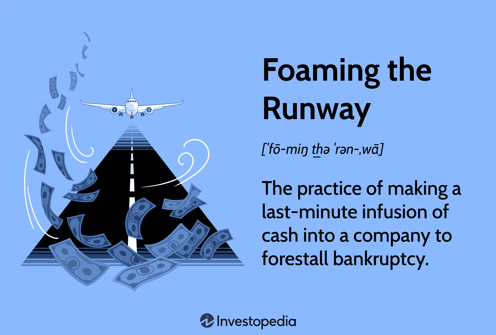

In recent years, both aviation and financial sectors have drawn parallels in managing crises, one notable concept being "foaming the runway." Originally an aviation safety measure, this term has found relevance in finance, particularly in managing financial distress and risk. This article examines how the principles of foaming the runway are applied in both airport safety procedures and financial crisis management, with a special focus on algorithmic trading.

Airport safety measures have evolved significantly, emphasizing robust protocols to manage emergencies, such as emergency landings. The historical use of runway foaming as a safety technique underscores the industry's commitment to minimizing risks associated with emergency landings. Although this method has become obsolete in modern aviation, its underlying principle of proactive crisis management remains relevant.



In finance, the metaphorical use of "foaming the runway" describes strategies to avert financial collapse, primarily through cash infusions to delay bankruptcy. This approach is an integral part of financial risk management, especially during economic downturns. It reflects a structured attempt to stabilize companies facing financial turbulence, albeit without guaranteeing long-term solvency.

Algorithmic trading, a modern development in financial markets, has added complexity to emergency financial strategies. These algorithms can operate as financial safety mechanisms by executing trades rapidly to curb market volatility. However, they also introduce challenges, as improperly managed algorithms can intensify financial crises.

Understanding these interconnected concepts is vital for professionals in both sectors. For aviation, the focus remains on optimizing safety and minimizing risk during emergencies. In finance, it translates to strategic planning and execution of emergency strategies to maintain solvency and prevent systemic shocks. The examination of these parallels offers insights into how both fields prioritize safety and stability, adapting to new technological and strategic advancements.

## Table of Contents

## The History of Foaming the Runway in Aviation

Foaming the runway emerged as a pivotal safety procedure in aviation, serving to minimize friction and mitigate fires during emergency landings. This method involved the application of a foam layer onto the runway surface, a technique that significantly reduced the risks associated with crash landings. The foam, typically composed of water and a foaming agent, acted as a cushion to absorb the kinetic energy of an aircraft, thus effectively decreasing the chances of sparks igniting spilled fuel.

The concept gained widespread utilization during the mid-20th century, aligning with an era marked by rapid advancements in aerospace technology and increased air travel. As more aircraft took to the skies, the demand for robust safety protocols heightened, encouraging the adoption of foaming the runway as a standard procedure during emergencies.

Despite its practical applications, the method encountered criticism over the years. Critics argued that the effectiveness of foaming in vastly varying weather conditions was inconsistent and that it required substantial maintenance and resource allocation to ensure readiness. Furthermore, the complexity of coordinating foam deployment during an active emergency posed challenges. These factors contributed to the decision by the Federal Aviation Administration (FAA) to discontinue the practice in 1987, as it was deemed less effective compared to emerging alternatives that leveraged advancements in aircraft design and fire suppression systems.

Even though foaming the runway is no longer in use, the term persists as a metaphor for strategic preparation in anticipated crisis scenarios. This enduring metaphorical application underscores its historical significance and highlights its role in informing contemporary approaches to safety in aviation. Insights gained from its historical usage illustrate the ongoing evolution of aviation safety standards, embodying the industry's commitment to innovative and efficient safety solutions.

## Modern Safety Measures and Alternatives

With advancements in aircraft technology and emergency response training, modern aviation largely relies on more sophisticated safety protocols than runway foaming. Previously used as a precautionary measure to reduce friction and prevent fires during emergency aircraft landings, foaming the runway has fallen out of favor due to its inefficacy and the availability of more advanced alternatives.

Improved firefighting techniques are a cornerstone of modern aviation safety. Firefighters now employ a variety of advanced tools and methods, such as high-expansion foam systems, which are more effective in suppressing large-scale fires. These systems, along with the use of environmentally friendly fire retardants, provide a rapid response capability. Enhanced training programs ensure that firefighting teams are equipped with the skills necessary to handle complex emergency scenarios, greatly increasing the chance of successful interventions.

Real-time data analytics further augment aviation safety. Aircraft are now equipped with sophisticated monitoring systems capable of transmitting data instantaneously to ground control and emergency response teams. This allows for the immediate assessment of in-flight emergencies, enabling coordinated responses and reducing delay in crisis management. Predictive analytics play a key role by identifying potential equipment failures before they occur, thereby preventing emergencies from happening in the first place.

The transition away from runway foaming signifies a shift towards these efficient, adaptive measures that enhance passenger safety while conserving resources. The aviation industry has invested heavily in new technologies such as reinforced aircraft materials, which are designed to withstand high impact forces and reduce the risk of structural damage during emergency landings. Additionally, improvements in avionics and automated flight control systems contribute significantly to accident prevention and emergency handling, offering pilots better control and decision-making tools during critical situations.

These innovations highlight the industry's commitment to employing cutting-edge technologies and methodologies to ensure safety. By moving past outdated practices like runway foaming, the aviation sector continues to prioritize advancements that preserve both passenger safety and resources, adapting to new challenges with a focus on resilience and efficiency.

## Foaming the Runway in Finance

In financial terms, "foaming the runway" refers to a strategic intervention where an entity infuses a company with capital to delay or prevent bankruptcy. This approach functions as a short-term solution to provide breathing room during periods of financial distress, enabling the organization to stabilize operations, re-evaluate its financial strategies, and explore restructuring options.

This strategy is a critical component of risk management. When companies face insolvency, they often require immediate [liquidity](/wiki/liquidity-risk-premium) to maintain operations and avoid a complete shutdown. A cash infusion can help cover essential costs like payroll, suppliers, and debt obligations, providing the company time to negotiate longer-term solutions such as asset restructuring, renegotiating debt terms, or raising more permanent capital.

Despite its utility, foaming the runway does not ensure long-term solvency. It is a temporary fix, akin to applying a band-aid to a deeper wound. The underlying financial issues must still be addressed to achieve sustainable recovery. Investors and stakeholders should exercise caution and diligence when relying on this strategy, recognizing that it merely postpones potential failure unless accompanied by comprehensive restructuring efforts and a viable business plan.

Risk management professionals should analyze cash flow projections, creditor agreements, and potential operational changes when considering foaming the runway. It's paramount for investors to keep abreast of the company’s strategic plans and financial health indicators post-infusion. Otherwise, without substantive improvements, the company may still face an inevitable downfall when the temporary cash reserves deplete.

In conclusion, while foaming the runway offers a vital pause amidst financial turmoil, it necessitates careful planning and execution of follow-up strategies to transform the short-term reprieve into lasting financial health.

## Algorithmic Trading and Financial Safety Nets

Algorithmic trading, the use of computer algorithms to automate trading decisions, has significantly reshaped the landscape of financial markets. These algorithms can process vast amounts of data at lightning speed, executing trades with precision and without human intervention. This capability introduces a new kind of financial safety net, capable of managing trades swiftly during periods of market [volatility](/wiki/volatility-trading-strategies).

One of the primary benefits of [algorithmic trading](/wiki/algorithmic-trading) is its ability to mitigate risk. By swiftly executing trades based on predefined criteria, algorithms can help stabilize market movements, acting as a buffer during times of financial stress. For example, in moments of sudden market fluctuations, these algorithms can rapidly adjust portfolios to minimize losses or capitalize on emerging opportunities, reducing the impact of volatility on investment portfolios.

However, the reliance on algorithms also presents challenges. If poorly designed or inadequately monitored, algorithms can exacerbate market downturns. A notable example of this risk is the "flash crash" phenomenon, where rapid, automated sell-offs occur due to cascading algorithmic triggers. This can lead to a sharp, sudden drop in prices, followed by a quick rebound, disrupting market stability. To mitigate these risks, regulatory bodies and financial institutions must implement robust oversight and establish stringent risk management protocols.

The mathematical foundations of algorithmic trading often involve complex models and strategies. Common strategies include statistical [arbitrage](/wiki/arbitrage), [market making](/wiki/market-making), and [trend following](/wiki/trend-following), each employing different mathematical techniques to predict and capitalize on market movements. For instance, [statistical arbitrage](/wiki/statistical-arbitrage) relies on statistical methods to identify price discrepancies between securities, allowing traders to profit from mean reversion.

To implement a simple algorithmic trading strategy, consider the moving average crossover strategy. This involves calculating the short-term and long-term moving averages of a stock price and generating buy/sell signals based on their crossover points. Here is a basic Python implementation:

```python
import numpy as np
import pandas as pd

# Sample data: stock prices
data = {'Price': [101, 102, 103, 102, 104, 105, 107, 106, 108, 109]}
df = pd.DataFrame(data)

# Calculate moving averages
short_window = 3
long_window = 5

df['Short_MA'] = df['Price'].rolling(window=short_window, min_periods=1).mean()
df['Long_MA'] = df['Price'].rolling(window=long_window, min_periods=1).mean()

# Generate buy/sell signals
df['Signal'] = 0
df['Signal'][short_window:] = np.where(df['Short_MA'][short_window:] > df['Long_MA'][short_window:], 1, 0)
df['Position'] = df['Signal'].diff()

print(df)
```

This code computes short-term and long-term moving averages for a given dataset, generating a buy signal when the short-term moving average crosses above the long-term one, and a sell signal when the opposite occurs. Such strategies, when properly calibrated and integrated with risk management systems, can offer a degree of financial security amidst market uncertainties.

In summary, while algorithmic trading provides powerful tools for managing financial risk, it requires careful design and ongoing supervision to ensure that these tools perform as intended, safeguarding against potential market disruptions. The balance between exploiting algorithmic trading's benefits and mitigating its risks is crucial for maintaining overall market stability.

## Case Studies: Real-world Applications

## Case Studies: Real-world Applications

The concept of "foaming the runway" emerged as a strategic metaphor during the 2008 financial crisis, depicting the urgency with which financial institutions needed to mitigate impending disasters. A significant example of this strategy was reflected in the actions taken during the bailout of major corporations such as American International Group (AIG) and Lehman Brothers. 

### American International Group (AIG)

AIG, a global insurance giant, faced a liquidity crisis due to its exposure to credit default swaps and mortgage-backed securities that plummeted in value. In September 2008, the Federal Reserve intervened by extending an $85 billion emergency loan to AIG, effectively "foaming the runway" to prevent an abrupt failure that could destabilize the entire financial system. The intervention was intended to provide AIG enough runway to reorganize and stabilize without defaulting immediately. While this strategy bought necessary time, it highlighted the limitations of relying solely on stopgap measures, as it demanded consistent governmental oversight and management to ensure AIG's turnaround.

### Lehman Brothers

In stark contrast, Lehman Brothers was not provided with such a financial lifeline, leading to its infamous collapse. The decision to let Lehman fail rather than "foam the runway" underscored the inherent risks of selective intervention, illustrating how absence of immediate assistance can result in catastrophic failures. Its bankruptcy marked the largest in U.S. history, demonstrating the severe implications of an unbuffered financial downfall. The aftermath of Lehman's collapse provoked widespread panic, triggering a domino effect throughout the financial markets.

### Effectiveness and Limitations

The emergency strategies applied during the crisis serve as a clear lens to evaluate the efficacy of financial runway foaming. In AIG's case, the strategy provided temporary relief and ultimately led to stabilization, albeit at significant costs and extensive government involvement. According to a report by the U.S. Government Accountability Office, the eventual resolution program allowed the government to recover its investment with a profit, proving that such emergency interventions, though expensive, could be fruitful when managed correctly.

In contrast, Lehman's fall highlighted the limitations of non-intervention, stressing the importance of timely support to curb systemic risk. The failure to "foam the runway" for Lehman Brothers prompted a reevaluation of crisis management policies, prompting financial regulators to reassess the balance between moral hazard and systemic stability.

### Conclusion

The 2008 financial crisis offered crucial insights into the application and implications of "foaming the runway" across different corporations. Examining AIG's preservation and Lehman Brothers' collapse provides a nuanced understanding of emergency financial strategies, their potential to avert disaster, and the critical risks of delayed or absent intervention. These case studies continue to inform and shape contemporary risk management practices within global financial systems, underscoring the need for preemptive and strategic action in crisis situations.

## Conclusion

Both the aviation and financial industries have shown remarkable adaptability in addressing emerging challenges, with a strong emphasis on maintaining safety and stability. The concept of "foaming the runway" illustrates the critical need for timely and strategic responses during crises. In aviation, while the literal practice of runway foaming has become obsolete, its legacy persists in guiding strategies that prioritize safety and risk mitigation during emergency landings and other critical situations. The aviation sector continues to evolve, incorporating advanced technologies and methods to ensure the highest level of safety for passengers and crew.

In the financial sector, the metaphorical application of foaming the runway—preparing and executing financial safety measures during periods of instability—remains relevant. The goal is to stabilize companies facing economic downturns or potential bankruptcies through emergency funding or strategic financial interventions. These measures are a testament to the importance of proactive risk management and crisis preparedness. However, they also highlight the need for caution and careful planning, as such strategies do not guarantee long-term solvency.

Future advancements in both industries will likely enhance these practices, driven by technological innovations and refined strategic approaches. In aviation, cutting-edge technologies, such as real-time data analytics and improved emergency response systems, will continue to advance safety protocols. Similarly, in finance, the evolution of algorithmic trading and other technological advancements will provide more robust frameworks for managing market volatility and preventing systemic failures.

Ultimately, the resilience of both the aviation and financial sectors will depend on their ability to integrate these advancements effectively, ensuring that safety and stability remain paramount in their operations. As these industries continue to evolve, the lessons learned from past challenges will serve as valuable guides in crafting strategies that can withstand future uncertainties.

## References & Further Reading

[1]: Cohen, B. H. (2011). ["How to Hedge Systemic Risk: Financial Regulation and Emergency Intervention."](https://bmjopen.bmj.com/content/suppl/2015/04/02/bmjopen-2014-005247.DC1/bmjopen-2014-005247supp_appendix.pdf) Bank for International Settlements Working Papers.

[2]: Federal Aviation Administration (1987). ["Advisory Circular AC 150/5210-7D: Aircraft Rescue and Firefighting Communications."](https://www.faa.gov/airports/resources/advisory_circulars/index.cfm/go/document.current/documentNumber/150_5210-7)

[3]: Lopez de Prado, M. (2018). ["Advances in Financial Machine Learning."](https://www.amazon.com/Advances-Financial-Machine-Learning-Marcos/dp/1119482089) John Wiley & Sons.

[4]: U.S. Government Accountability Office (2011). ["Federal Crisis Management: Lessons from the Financial Crisis."](https://www.gao.gov/products/gao-12-4sp)

[5]: Johnson, R. C., & Stern, A. (2010). ["Too Big to Fail: The Inside Story of How Wall Street and Washington Fought to Save the Financial System—and Themselves."](https://www.amazon.com/Too-Big-Fail-Washington-System/dp/0143118242) Penguin Books.

