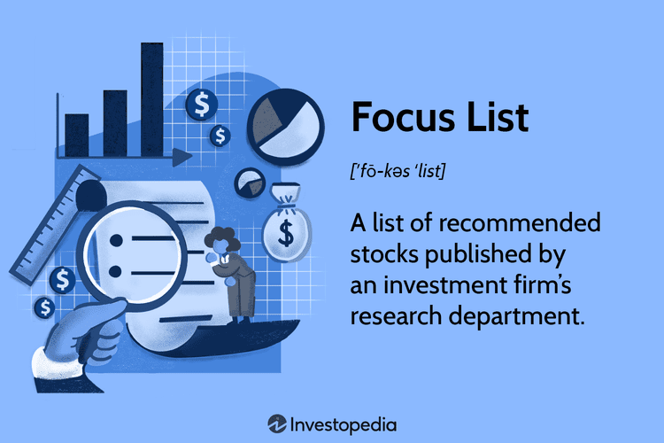

In today's rapidly evolving financial markets, investment strategies are becoming increasingly sophisticated, blending traditional investment techniques with modern innovations such as algorithmic trading. This integration has transformed how investors analyze opportunities and execute trades, leveraging data-driven methods and automation to enhance efficiency and outcomes.

This article explores the concept of utilizing a focus list within an investment strategy, particularly highlighting its significance in algorithmic trading. A focus list, a curated selection of stocks or securities, is a cornerstone in many investment strategies. Its precision in identifying high-potential assets allows investors to streamline decision-making and direct their resources efficiently.



Algorithmic trading, or algo trading, employs computer algorithms to execute trades based on predefined criteria, offering unparalleled speed and accuracy in the investment landscape. By integrating focus lists with algorithmic techniques, investors can harness the power of technology to optimize their portfolios. This combination allows for more agile responses to market dynamics and potentially superior investment performance.

Effective investment strategies, particularly those involving algorithmic trading, rely heavily on identifying and leveraging patterns and insights from financial data. The development and application of successful algorithmic trading strategies can significantly elevate an investor's ability to achieve their financial goals. Understanding these concepts is essential for investors seeking to navigate today's complex financial environment and capitalize on emerging opportunities.

## Table of Contents

## Understanding Focus Lists in Investment

A focus list comprises a selective portfolio of stocks or securities that an investment firm identifies as promising opportunities. These lists arise from in-depth research and analysis and aim to spotlight stocks with the potential for above-average returns. Investment firms employ focus lists as a strategic tool to direct investment decisions, ensuring concentrated attention on essential securities rather than the entire market. By targeting high-potential stocks, these lists help streamline decisions and reduce the distractions that can arise from viewing the whole market. As such, focus lists serve as a key component for investors aiming to build custom portfolios that outperform broader market benchmarks.

The process for developing a focus list is rigorous and involves multiple steps of analysis and assessment. First, firms perform qualitative and quantitative analyses to screen potential candidates. This may involve evaluating a company's financial health through ratios like Price-to-Earnings (P/E), Return on Equity (ROE), and Debt-to-Equity (D/E). Moreover, qualitative factors such as management quality, industry position, and future growth potential are considered.

For instance, a Python script can be crafted to screen stocks based on these financial metrics:

```python
import pandas as pd

# Sample data of stocks
stocks = {
    'Symbol': ['AAPL', 'GOOGL', 'MSFT'],
    'P/E': [32.5, 29.1, 35.6],
    'ROE': [75.5, 25.3, 40.1],
    'D/E': [1.2, 0.8, 0.6], 
}

df = pd.DataFrame(stocks)

# Criteria for focus list
pe_criteria = df['P/E'] < 30
roe_criteria = df['ROE'] > 30
de_criteria = df['D/E'] < 1

# Filter stocks for focus list
focus_list = df[pe_criteria & roe_criteria & de_criteria]
print(focus_list)
```

In this code, stocks are filtered based on predefined criteria: a price-to-earnings ratio under 30, a return on equity over 30%, and a debt-to-equity ratio under 1. The resulting focus list would consist of the stocks meeting all these parameters.

Beyond individual stock metrics, macroeconomic factors and industry trends significantly influence the composition of a focus list. By considering broader economic indicators and sector performance, firms enhance their ability to predict future stock behavior. Regular updates to focus lists ensure they reflect current market conditions and investment firm perspectives.

Focus lists are not static; they require continuous updates and assessments to adapt to ongoing market dynamics. By routinely revisiting these lists, firms ensure they reflect the latest available data and strategic priorities, adhering to their guiding investment philosophy. Consequently, focus lists are both a reflection and a driver of tailored investment strategies, allowing firms and individual investors to pinpoint opportunities poised for success.

 to Algorithmic Trading

Algorithmic trading, commonly referred to as algo trading, utilizes computer algorithms to automate trading processes based on predefined criteria. This sophisticated approach allows for the swift execution of trades by leveraging criteria such as timing, price, and [volume](/wiki/volume-trading-strategy). A key advantage of [algorithmic trading](/wiki/algorithmic-trading) is its ability to conduct high-frequency trades with efficiency levels that far exceed human capabilities. 

By handling vast amounts of market data rapidly, algorithms enhance decision-making processes and improve overall trading performance. Modern algorithms can parse real-time data streams, recognize complex patterns, and execute trades within milliseconds. This computational efficiency is critical for capitalizing on fleeting opportunities in today's fast-paced markets.

Historically, algorithmic trading was primarily the domain of sophisticated institutional investors, who had access to advanced technology and the requisite expertise. However, recent advancements in technology and the proliferation of trading platforms have made algo trading increasingly accessible to retail investors as well. This democratization enables a broader pool of market participants to benefit from automation and data-driven strategies.

Integrating focus lists into algorithmic trading strategies enhances their effectiveness by concentrating on stocks or securities that show the most potential. Focus lists streamline trading activities by narrowing the range of investment prospects to those with higher expected returns, thereby allowing algorithms to prioritize trades and manage risks more efficiently. Through this strategic synergy, traders can optimize their investment tactics, aiming for improved outcomes and performance in the financial markets.

The application of algorithms to predefined trading rules automates crucial aspects of the trading process, thereby reducing emotional biases and errors associated with manual trading. As algorithmic trading continues to evolve, its role in optimizing financial operations is becoming increasingly indispensable, offering substantial advantages for both institutional and individual investors.

## Combining Focus Lists with Algorithmic Trading Strategies

Integrating focus lists into algorithmic trading strategies brings forth several distinct advantages, primarily by zeroing in on stocks with high growth potential. This concentrated approach can significantly improve the effectiveness of trading strategies by ensuring that algorithms focus on a refined list of securities, thereby facilitating prompt and data-driven trading decisions.

Algorithms are programmed to automatically execute trades based on the stocks identified in the focus list. This automation ensures that trading decisions are both timely and informed, using real-time data analytics and historical performance insights. By doing so, the algorithm minimizes human error and emotional bias, contributing to more consistent trading outcomes.

Moreover, the integration of focus lists into algorithmic strategies enhances the likelihood of success while also allowing for diversification and risk mitigation. By concentrating on a pre-selected basket of high-potential stocks, the algorithm can balance trades across different market sectors, thereby distributing risk. For instance, if a focus list comprises stocks from technology, healthcare, and finance, the algorithm can dynamically adjust holdings within these sectors based on real-time market performance, adhering to predefined risk parameters.

Specific trading algorithms, like [momentum](/wiki/momentum) or trend-following strategies, can be tailored to align with focus list securities. For example, a momentum trading algorithm could be adjusted to increase holdings in focus list stocks displaying upward momentum, effectively capitalizing on short-term price trends. Similarly, trend-following strategies may utilize historical data and market signals to identify longer-term trends within the focus list, adjusting positions accordingly to optimize gains.

The strategic combination of algorithmic trading with focus lists results in improved predictive accuracy and enhanced investment outcomes. By leveraging the power of [machine learning](/wiki/machine-learning) and data analytics, investors can utilize focus lists to fine-tune algorithms that anticipate market movements more effectively. This synergy not only streamlines trading operations but also enhances overall portfolio performance by consistently aligning with high-potential investment opportunities.

In summary, the merger of focus lists with algorithmic trading strategies represents an advanced approach to optimizing trading success. By focusing computational resources on a select group of securities, investors can leverage technology to capture market gains more efficiently, thereby achieving superior financial results.

## Examples of Successful Algorithmic Trading Strategies

Algorithmic trading strategies have revolutionized modern investing, with some specific methodologies proving particularly effective. Below are examples of successful strategies that leverage algorithms to enhance trading efficiency and profitability.

**Momentum Trading**

Momentum trading capitalizes on the continuance of existing market trends. The momentum trading strategy involves identifying stocks exhibiting upward momentum and executing purchases to benefit from the continuation of this trend. Sell orders are then placed before any anticipated decline. For instance, when a stock price exceeds a moving average or other momentum indicators (e.g., RSI over 70), it may trigger a buy signal. The mathematical formulation typically involves calculating a moving average or using indicators such as the Relative Strength Index (RSI).

```python
# Python example using the moving average for momentum trading
import pandas as pd

def moving_average(data, period=20):
    return data['Close'].rolling(window=period).mean()

def check_momentum(stock_data):
    stock_data['MA'] = moving_average(stock_data)
    stock_data['Signal'] = 0
    stock_data.loc[stock_data['Close'] > stock_data['MA'], 'Signal'] = 1
    stock_data.loc[stock_data['Close'] <= stock_data['MA'], 'Signal'] = -1
    return stock_data
```

**Mean Reversion**

This strategy is predicated on the belief that prices eventually return to their mean or average. The mean reversion strategy involves identifying stocks that have deviated significantly from their average historical price levels and speculating that they will revert to their mean. It requires calculating a moving average and identifying significant deviations, often using Bollinger Bands or Z-scores.

```python
# Python example of mean reversion strategy
import numpy as np

def calculate_z_score(stock_data, period=20):
    stock_data['Mean'] = stock_data['Close'].rolling(window=period).mean()
    stock_data['STD'] = stock_data['Close'].rolling(window=period).std()
    stock_data['Z-Score'] = (stock_data['Close'] - stock_data['Mean']) / stock_data['STD']
    return stock_data

def mean_reversion(stock_data, threshold=2):
    stock_data = calculate_z_score(stock_data)
    stock_data['Signal'] = 0
    stock_data.loc[stock_data['Z-Score'] > threshold, 'Signal'] = -1
    stock_data.loc[stock_data['Z-Score'] < -threshold, 'Signal'] = 1
    return stock_data
```

**Arbitrage**

Arbitrage exploits price differentials of the same asset in different markets. Traders executing an [arbitrage](/wiki/arbitrage) strategy buy a lower-priced asset in one market and concurrently sell it at a higher price in another, pocketing the difference. This requires rapid execution due to the fleeting nature of price discrepancies and might involve currency conversion formulas and exchange rate calculations for international trades.

**Trend Following**

Trend following strategies aim to profit from sustainable market trends. Unlike momentum trading, which focuses on the strength of price movements, [trend following](/wiki/trend-following) strategies involve identifying the direction of market trends and making trading decisions based on this long-term movement. These strategies often utilize moving averages or the Average Directional Index (ADX) to determine the ongoing trend and its strength.

```python
# Python example of a simple trend following strategy
def simple_trend_following(stock_data, short_window=40, long_window=100):
    stock_data['Short_MA'] = stock_data['Close'].rolling(window=short_window).mean()
    stock_data['Long_MA'] = stock_data['Close'].rolling(window=long_window).mean()
    stock_data['Signal'] = 0
    stock_data.loc[stock_data['Short_MA'] > stock_data['Long_MA'], 'Signal'] = 1
    stock_data.loc[stock_data['Short_MA'] <= stock_data['Long_MA'], 'Signal'] = -1
    return stock_data
```

**Risk-On/Risk-Off**

This strategy dynamically adjusts exposure to risky assets based on broader market conditions. In perceived economically stable times (Risk-On), investors are more likely to invest in volatile, higher-return assets. Conversely, during instability (Risk-Off), they prefer safer assets. This strategy involves using economic indicators or proprietary risk metrics to inform trading decisions for assets within a focus list, optimizing for returns while managing exposure to risk.

These examples demonstrate how algorithmic strategies can systematically address varying market conditions, driving informed, efficient trading decisions to capitalize on market opportunities.

## Real-World Application: Integrating Strategy with Tools

In today's financial landscape, the integration of focus lists with algorithmic trading strategies is more accessible than ever, thanks to a variety of trading platforms that require minimal coding skills. These platforms, such as Composer, EquBot AI Watson, and Tickeron, provide both pre-designed models and custom configuration options to accommodate different trading needs. 

Composer empowers traders to build, test, and deploy strategies in a no-code environment. By combining drag-and-drop functionality with a library of data sources and financial models, even those without programming expertise can create complex trading algorithms. This platform also incorporates visualization tools for [backtesting](/wiki/backtesting), enabling users to review historical performance and refine strategies for better future outcomes.

EquBot AI Watson leverages [artificial intelligence](/wiki/ai-artificial-intelligence) to assist in crafting trading strategies. By integrating IBM Watson’s AI capabilities, EquBot analyzes large datasets in real-time, identifying patterns and opportunities that might not be apparent to human analysts. This AI-driven approach helps traders optimize decisions by adjusting to market changes swiftly, while also incorporating focus lists to zero in on key investment opportunities.

Tickeron offers another avenue for algorithmic trading, equipped with AI tools that facilitate the creation and monitoring of trading strategies. Users can access pre-configured algorithms or develop their own, focusing on variables such as risk tolerance and financial goals. Tickeron's platform provides real-time market analysis, aiding in the detection of trends and the execution of trades based on focus list insights.

These tools not only streamline the integration of focus lists but also allow for extensive testing and optimization of trading strategies. Testing typically involves simulating trades on historical data to ensure a strategy's robustness against market [volatility](/wiki/volatility-trading-strategies). By enabling thorough evaluation and adjustment, these platforms help mitigate risks and potentially enhance returns.

The democratization of algorithmic trading tools ultimately empowers both institutional and retail investors, enabling them to tap into sophisticated trading strategies that were once exclusive to large financial institutions. By effectively integrating focus lists with algorithmic trading, investors can make more informed decisions and better position their portfolios in dynamic market environments.

## Conclusion

The fusion of focus lists and algorithmic trading represents a powerful leap in investment strategy, allowing investors to target high-potential opportunities efficiently. By concentrating on these opportunities, investors can leverage the capabilities of automated trading technologies to enhance decision-making processes, resulting in more effective portfolio management.

Automated trading technologies offer the advantage of executing trades with speed and precision that manual trading cannot match. This efficiency becomes particularly advantageous when managing focus lists, which prioritize securities with promising performance potential. With algorithmic strategies, investors can systematically track and act on these opportunities, potentially increasing returns while managing risk.

Despite the substantial benefits, the domain of algorithmic trading is not without its challenges. Investors must remain vigilant about inherent risks, such as market volatility and technological failures. Ensuring thorough research and rigorous strategy testing are crucial steps in mitigating these risks. Backtesting algorithms against historical data can help predict their performance under various market conditions. However, it is essential to acknowledge that past performance does not guarantee future results.

As investors navigate this evolving landscape, understanding and embracing these tools can significantly enhance portfolio performance and financial success. With platforms increasingly offering user-friendly interfaces for strategy implementation, both institutional and retail investors can access sophisticated algorithmic trading capabilities. However, informed decision-making and continuous strategy optimization remain critical to harnessing the full potential of these innovative approaches.

## References & Further Reading

[1]: Bergstra, J., Bardenet, R., Bengio, Y., & Kégl, B. (2011). ["Algorithms for Hyper-Parameter Optimization."](https://dl.acm.org/doi/10.5555/2986459.2986743) Advances in Neural Information Processing Systems 24.

[2]: ["Advances in Financial Machine Learning"](https://www.amazon.com/Advances-Financial-Machine-Learning-Marcos/dp/1119482089) by Marcos Lopez de Prado

[3]: ["Evidence-Based Technical Analysis: Applying the Scientific Method and Statistical Inference to Trading Signals"](https://www.amazon.com/Evidence-Based-Technical-Analysis-Scientific-Statistical/dp/0470008741) by David Aronson

[4]: ["Machine Learning for Algorithmic Trading"](https://github.com/stefan-jansen/machine-learning-for-trading) by Stefan Jansen

[5]: ["Quantitative Trading: How to Build Your Own Algorithmic Trading Business"](https://www.amazon.com/Quantitative-Trading-Build-Algorithmic-Business/dp/1119800064) by Ernest P. Chan