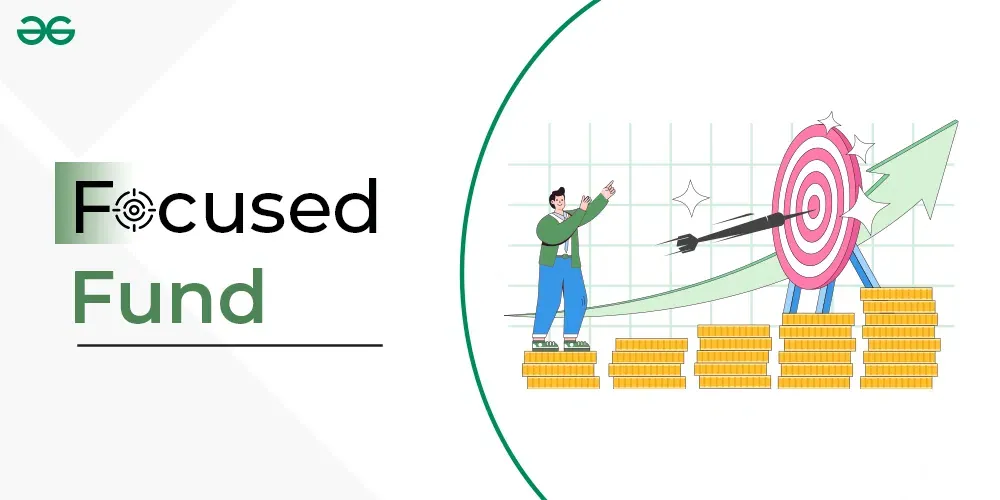

## Table of Contents

## What is a focused fund?

A focused fund is a type of investment fund that puts its money into a small number of stocks or assets, usually between 20 to 30. Unlike other funds that spread their investments across many different companies or sectors, a focused fund concentrates on a few picks. This can lead to higher returns if the chosen investments do well, but it also means more risk because the fund's performance depends heavily on those few choices.

Because focused funds have fewer investments, they can be more volatile. If one or two of the stocks in the fund do poorly, it can significantly impact the overall performance of the fund. However, if the fund manager picks the right stocks, the fund can outperform the market. Investors who choose focused funds are usually looking for higher potential rewards and are willing to accept the increased risk that comes with this type of investment strategy.

## How does a focused fund differ from a diversified fund?

A focused fund and a diversified fund are different in how they spread out their money. A focused fund puts its money into just a few stocks or assets, usually around 20 to 30. This means that if those few choices do well, the fund can make a lot of money. But if they do badly, the fund can lose a lot too. It's like betting on a few horses in a race instead of many.

On the other hand, a diversified fund spreads its money across many different stocks or assets, sometimes hundreds. This is like betting on many horses in a race. If one or two horses don't do well, it won't hurt the overall result as much because there are so many other horses to balance it out. Diversified funds are usually safer because they don't depend on just a few choices, but they might not grow as fast as a focused fund if the right picks are made.

In simple terms, focused funds are riskier but can offer bigger rewards, while diversified funds are safer but might not grow as quickly. It all depends on what an investor is looking for and how much risk they are willing to take.

## What are the typical investment criteria for a focused fund?

A focused fund looks for a small number of investments that it thinks will do really well. The fund manager picks these investments carefully, often looking for companies that are growing fast or are in industries that are doing well. They might also look at how much the company is worth compared to how much money it makes, to see if it's a good deal. The idea is to find a few great companies that can make the fund a lot of money.

Because focused funds only invest in a few places, the fund manager needs to be very sure about their choices. They might spend a lot of time researching and watching the companies they pick. They want to make sure these companies keep doing well and don't run into big problems. If the fund manager is right, the fund can grow a lot, but if they're wrong, the fund can lose a lot too.

## What are the potential benefits of investing in a focused fund?

One big benefit of investing in a focused fund is the chance to make more money. Because the fund puts its money into just a few stocks, if those stocks do really well, the fund can grow a lot. It's like betting on a few horses that you think will win the race. If you're right, you can win big. This can be great for investors who are looking for high rewards and are willing to take more risk.

Another benefit is that focused funds can let you invest in companies that you believe in strongly. If you think a few companies are going to do really well, a focused fund lets you put more of your money into those companies. This way, you can focus your investment on what you think are the best opportunities. It's a way to be more hands-on with your investments and really go after what you believe in.

## What are the risks associated with focused funds?

One big risk of focused funds is that they can lose a lot of money if the few stocks they pick do badly. Because the fund only invests in a small number of companies, if one or two of them have problems, it can hurt the whole fund a lot. It's like putting all your eggs in one basket. If the basket falls, you lose everything. So, if the fund manager picks the wrong stocks, the fund can go down a lot.

Another risk is that focused funds can be more up and down than other funds. This is because they don't spread their money out over many different stocks. If the market changes or something bad happens to one of the companies they picked, the fund can swing wildly. This can be stressful for investors who don't like a lot of ups and downs in their investments. It's important for people to know that focused funds can be a bumpy ride.

## How many holdings does a typical focused fund have?

A typical focused fund usually has between 20 to 30 holdings. This means it invests in just a small number of stocks or assets. The idea is to pick a few really good companies that can make the fund a lot of money.

Because focused funds have fewer holdings, they can be riskier. If one or two of the stocks do badly, it can hurt the whole fund a lot. But if the fund manager picks the right stocks, the fund can do really well.

## Can you explain the strategy behind selecting stocks for a focused fund?

The strategy behind selecting stocks for a focused fund is all about [picking](/wiki/asset-class-picking) a few really good companies. The fund manager looks for companies that are growing fast or are in industries that are doing well. They also check how much the company is worth compared to how much money it makes, to see if it's a good deal. The idea is to find a few great companies that can make the fund a lot of money. Because the fund only invests in a small number of stocks, the manager needs to be very sure about their choices. They spend a lot of time researching and watching these companies to make sure they keep doing well and don't run into big problems.

If the fund manager picks the right stocks, the fund can grow a lot. But if they're wrong, the fund can lose a lot too. That's why the strategy is to be very careful and pick only the best opportunities. The manager might also look at how the company is run and if it has a good plan for the future. They want to make sure the companies they pick can keep growing and making money over time. This way, the focused fund can have a better chance of doing well, even though it's riskier than other types of funds.

## How do focused funds perform compared to broader market indices?

Focused funds can do better than broader market indices if the fund manager picks the right stocks. Because they only invest in a few companies, if those companies do really well, the fund can grow a lot more than the overall market. For example, if a focused fund picks a few tech companies that become very successful, it might beat the performance of a general market index like the S&P 500. But this is not always easy to do, and it takes a lot of skill and research from the fund manager.

On the other hand, focused funds can also do worse than broader market indices if the stocks they pick don't do well. Since they don't spread their money out over many different companies, if one or two of the stocks have problems, it can hurt the whole fund a lot. This means focused funds can be riskier and more up and down than the overall market. So, while they have the chance to do better, they also have a bigger chance of doing worse.

## What should an investor consider before investing in a focused fund?

Before investing in a focused fund, an investor should think about how much risk they are okay with. Focused funds can be riskier because they only put money into a few stocks. If one of those stocks does badly, it can hurt the whole fund a lot. So, if you don't like a lot of ups and downs in your investments, a focused fund might not be right for you. It's important to know that you could lose more money with a focused fund than with a fund that spreads its money out over many different stocks.

Another thing to consider is how much you believe in the fund manager's ability to pick the right stocks. Because focused funds depend on just a few choices, the manager needs to be very good at picking winners. If you trust the manager and think they can find great companies, a focused fund might be a good choice. But if you're not sure about their skills, you might want to look at other types of funds. It's all about finding a balance between the chance to make more money and the risk of losing it.

## How do focused funds manage sector concentration risk?

Focused funds manage sector concentration risk by being very careful about which sectors they invest in. Since they only pick a few stocks, they try to make sure these stocks are not all in the same industry. If all the stocks are in one sector, like tech or healthcare, and that sector does badly, the whole fund can lose a lot of money. So, the fund manager might choose stocks from different sectors to spread out the risk a bit. This way, if one sector has problems, the other sectors might still do well and help balance things out.

Even though focused funds try to manage sector concentration risk, it can still be hard because they only have a few stocks. If a fund has a lot of money in just one or two sectors, it can still be risky. The fund manager needs to keep a close eye on how each sector is doing and be ready to change the fund's investments if things start to go wrong. This takes a lot of research and watching the market carefully. But even with all this work, focused funds can still be more up and down than other types of funds because they don't spread their money out over many different stocks.

## What role do focused funds play in a diversified investment portfolio?

Focused funds can add some excitement to a diversified investment portfolio. They are like the spicy part of a meal. Because they only invest in a few stocks, they can grow a lot if those stocks do well. This means they can help make your whole portfolio grow faster. But, they are also riskier. If one of the stocks in the focused fund does badly, it can hurt the whole fund a lot. So, you need to be okay with more ups and downs if you want to add a focused fund to your portfolio.

To balance this risk, you can use focused funds as just one part of your overall investments. Think of it like adding a little bit of hot sauce to your food. You don't want to use too much, or it might be too spicy. In the same way, you can put some of your money into a focused fund, but keep most of it in safer, more diversified funds. This way, you can still enjoy the potential for big rewards from the focused fund, but the rest of your portfolio can help keep things steady if the focused fund has a rough time.

## How can an investor evaluate the performance of a focused fund manager?

To evaluate the performance of a focused fund manager, an investor should first look at the fund's returns over time. They should compare these returns to a general market index like the S&P 500. If the focused fund is doing better than the market, it might mean the manager is good at picking stocks. But, it's also important to look at how much the fund goes up and down. Focused funds can be more risky, so if the fund's value swings a lot, the manager might be taking too many chances.

Another way to evaluate a focused fund manager is to look at their track record. Have they managed to pick winning stocks in the past? How long have they been managing the fund, and what has the fund's performance been like during that time? It's also good to see if the manager has stuck with the same strategy or if they keep changing things around. A manager who has a clear plan and sticks to it might be more reliable. By looking at these things, an investor can get a better idea of whether the focused fund manager is worth trusting with their money.

## References & Further Reading

[1]: ["Advances in Financial Machine Learning"](https://www.amazon.com/Advances-Financial-Machine-Learning-Marcos/dp/1119482089) by Marcos Lopez de Prado

[2]: ["Machine Learning for Algorithmic Trading"](https://github.com/stefan-jansen/machine-learning-for-trading) by Stefan Jansen

[3]: ["Quantitative Trading: How to Build Your Own Algorithmic Trading Business"](https://www.amazon.com/Quantitative-Trading-Build-Algorithmic-Business/dp/1119800064) by Ernest P. Chan

[4]: ["Evidence-Based Technical Analysis: Applying the Scientific Method and Statistical Inference to Trading Signals"](https://www.amazon.com/Evidence-Based-Technical-Analysis-Scientific-Statistical/dp/0470008741) by David Aronson

[5]: ["The Man Who Solved the Market: How Jim Simons Launched the Quant Revolution"](https://www.amazon.com/Man-Who-Solved-Market-Revolution/dp/073521798X) by Gregory Zuckerman

[6]: Van Vliet, J. (2018). [Algorithmic Trading](https://scholar.google.com/citations?user=WlQzk4sAAAAJ&hl=en). Apress.