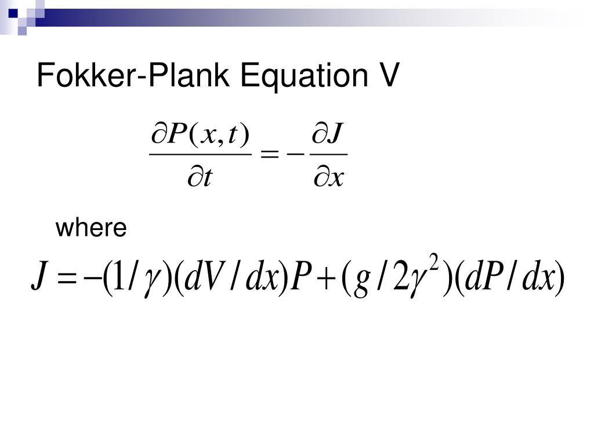

## Table of Contents

## What is the Fokker-Planck equation?

The Fokker-Planck equation is a mathematical tool used to describe how the probability of finding a particle in a certain place changes over time. Imagine you have a bunch of tiny particles moving around randomly, like dust particles in the air. The Fokker-Planck equation helps you predict where these particles are likely to be at any given moment. It's especially useful in physics and chemistry, where scientists study how particles move and interact.

This equation is named after two scientists, Adriaan Fokker and Max Planck, who worked on it. It's a bit like a recipe that tells you how to update the probability distribution of particles as time goes on. The equation takes into account things like how fast the particles are moving and how they might be pushed or pulled by forces around them. By solving the Fokker-Planck equation, scientists can better understand and predict the behavior of systems that involve random movements, like the spread of pollutants in the air or the movement of molecules in a liquid.

## What are the key components of the Fokker-Planck equation?

The Fokker-Planck equation has two main parts: the drift term and the diffusion term. The drift term tells us how the particles move on average due to forces acting on them. Imagine you're pushing a bunch of marbles uphill; the drift term would describe how they roll up the hill because you're pushing them. The diffusion term, on the other hand, deals with the random movements of the particles. It's like if you let go of the marbles and they start rolling around randomly in all directions; the diffusion term helps predict how spread out they'll get over time.

These two terms work together to describe the overall behavior of the particles. The drift term is important because it shows where the particles are likely to go if there are forces pushing or pulling them. The diffusion term is crucial because it accounts for the randomness in the movement, which is always present in real-world systems. By combining these terms, the Fokker-Planck equation gives a complete picture of how the probability of finding a particle in a certain place changes over time, making it a powerful tool in understanding systems with random movements.

## How does the Fokker-Planck equation relate to probability density functions?

The Fokker-Planck equation is all about how the probability of finding a particle in a certain spot changes over time. Imagine you have a map where you color in areas based on how likely it is to find a particle there. This map is called a probability density function (PDF). The Fokker-Planck equation is like a set of instructions that tells you how to update this map as time goes by. It considers both the forces that might push or pull the particles in a certain direction (drift) and the random movements of the particles (diffusion).

By using the Fokker-Planck equation, you can predict how the colors on your map will change. If there's a force pushing the particles one way, the colors will shift in that direction. If the particles are moving randomly, the colors will spread out. This equation helps scientists understand and predict how systems with random movements will behave over time, by showing how the probability density function evolves. It's a powerful tool that connects the dots between the physics of particle movement and the math of probability.

## What are the differences between the Fokker-Planck equation and the Langevin equation?

The Fokker-Planck equation and the Langevin equation are both used to study how particles move, but they do it in different ways. The Fokker-Planck equation looks at the whole group of particles and tells us how the chance of finding a particle in a certain spot changes over time. It's like looking at a map that shows where all the particles are likely to be. This equation is good for understanding the big picture and how the whole system behaves over time. It's often used when you want to know the probability of finding a particle in different places, which is useful in fields like physics and chemistry.

On the other hand, the Langevin equation focuses on one particle at a time. It describes how a single particle moves due to forces and random movements. Imagine following one marble as it rolls around: the Langevin equation would tell you about the path of that marble. It's great for understanding the detailed movements of individual particles. Scientists use the Langevin equation when they want to see how a single particle behaves over time, which can be important in simulations and studies of small-scale systems.

Both equations are related because the Langevin equation can be used to derive the Fokker-Planck equation. If you know how each particle moves (Langevin), you can figure out how the whole group of particles will spread out (Fokker-Planck). They're like two sides of the same coin, giving us different ways to understand the same system. Depending on what you're trying to learn, you might use one or the other, or even both together.

## Can you explain the derivation of the Fokker-Planck equation from the Langevin equation?

The Fokker-Planck equation can be derived from the Langevin equation by looking at how a group of particles behaves based on the movements of individual particles. Imagine you have a bunch of marbles moving around. The Langevin equation describes how each marble moves due to forces and random movements. If you want to know where all the marbles are likely to be, you need to look at the paths of all the marbles together. By doing this, you can figure out how the probability of finding a marble in a certain spot changes over time. This is where the Fokker-Planck equation comes in. It takes the information about how each marble moves (from the Langevin equation) and turns it into a map that shows where all the marbles are likely to be at any given moment.

To derive the Fokker-Planck equation, you start by thinking about how the position of one marble changes over a short period of time. The Langevin equation tells you that the change in position depends on a force pushing or pulling the marble (the drift term) and random movements (the diffusion term). When you look at many marbles, the drift term tells you where the marbles are likely to move on average, while the diffusion term accounts for the random spreading out of the marbles. By using math to combine these effects for all the marbles, you can write down an equation that shows how the probability of finding a marble in any spot changes over time. This equation is the Fokker-Planck equation, and it gives you a way to predict the behavior of the whole group of marbles based on the movements of individual ones.

## What types of physical systems can be modeled using the Fokker-Planck equation?

The Fokker-Planck equation is super useful for studying all sorts of physical systems where things move around in a random way. Imagine you're looking at tiny particles floating in the air or swimming in water. These particles might be pushed around by forces like wind or gravity, but they also move randomly because they're so small. The Fokker-Planck equation helps scientists predict where these particles are likely to be at any moment. It's like having a map that shows where the particles are more likely to be, and how that map changes as time goes by. This equation is really helpful in fields like physics and chemistry, where understanding how particles move and spread out is important.

For example, the Fokker-Planck equation can be used to study how pollutants spread in the air or how molecules move in a liquid. When you release a bunch of smoke into the air, it doesn't just stay in one spot; it spreads out over time. The Fokker-Planck equation can help you predict how fast and in what direction the smoke will spread. It's also used in biology to understand how cells move or how populations of animals spread out across an area. By using this equation, scientists can make better predictions about how these systems will behave, which is really important for things like environmental protection and medical research.

## How is the Fokker-Planck equation used in statistical mechanics?

In statistical mechanics, the Fokker-Planck equation is a key tool for understanding how groups of particles move and change over time. Imagine you have a bunch of tiny particles, like gas molecules in a room. These particles are always moving around and bumping into each other. The Fokker-Planck equation helps scientists predict where these particles are likely to be at any given time. It does this by looking at the forces that push or pull the particles and the random movements they make. This is important in statistical mechanics because it helps scientists understand how the whole system behaves, not just individual particles.

For example, if you want to know how heat spreads through a material, the Fokker-Planck equation can help you figure it out. Heat moves because the particles in the material are moving and bumping into each other. By using the Fokker-Planck equation, scientists can see how the heat spreads out over time. This is useful for all sorts of things, like designing better engines or understanding how materials behave under different conditions. The equation gives scientists a way to connect the tiny movements of individual particles to the big picture of how the whole system changes.

## What numerical methods are commonly used to solve the Fokker-Planck equation?

Solving the Fokker-Planck equation can be tricky because it involves predicting how a bunch of particles move over time. Scientists often use a method called the finite difference method to solve it. This method is like breaking down a big problem into smaller, easier pieces. Imagine you have a map that shows where particles are likely to be. The finite difference method helps you update this map bit by bit, looking at how the particles move in small steps. It's useful because it's pretty simple to understand and can be used on computers to make calculations faster.

Another common way to solve the Fokker-Planck equation is by using the Monte Carlo method. This method is like running a bunch of experiments to see what happens. You start with a group of particles and let them move around according to the rules of the Fokker-Planck equation. By doing this many times, you can see where the particles are likely to end up. It's a bit like playing a game over and over to see all the different ways it can go. The Monte Carlo method is great for understanding how random movements affect the whole system. Both the finite difference and Monte Carlo methods help scientists get a clear picture of how particles move and spread out over time.

## What are some common boundary conditions applied to the Fokker-Planck equation?

When solving the Fokker-Planck equation, scientists often use boundary conditions to make sure the solutions make sense in the real world. One common type of boundary condition is called an absorbing boundary. Imagine you have a bunch of particles moving around in a box. If they hit the walls of the box, they stick to it and don't move anymore. This is like an absorbing boundary, where particles can't leave the system once they reach the edge. This type of boundary condition is useful when you want to study how particles get trapped or removed from the system.

Another type of boundary condition is a reflecting boundary. This is like having a bouncy wall where particles hit it and bounce back into the system. If you think of the particles as balls in a room, a reflecting boundary means the balls keep moving around inside without ever leaving. This is helpful when you want to see how particles move around in a closed system without losing any. Both absorbing and reflecting boundaries help scientists set up the Fokker-Planck equation to match the real-world situation they're studying.

## How does the Fokker-Planck equation handle multi-dimensional systems?

The Fokker-Planck equation can handle multi-dimensional systems by looking at how particles move in more than one direction at the same time. Imagine you have particles moving around in a 3D space, like tiny marbles bouncing around in a box. The Fokker-Planck equation can tell you how likely it is to find these marbles at any spot in the box, not just in one direction but in all three dimensions. It does this by adding more terms to the equation to account for movements in different directions. So, instead of just looking at how particles move left or right, the equation can also consider up and down, and forward and backward.

In multi-dimensional systems, the Fokker-Planck equation still uses the same basic ideas of drift and diffusion but in more directions. The drift term now describes how forces might push or pull the particles in different ways, like gravity pulling them down or a wind blowing them sideways. The diffusion term accounts for the random movements in all directions, showing how the particles spread out over time. By solving the Fokker-Planck equation in multiple dimensions, scientists can get a complete picture of how particles move and spread out in complex systems, like how pollutants spread in the air or how molecules move in a liquid.

## What are the challenges in solving the Fokker-Planck equation for complex systems?

Solving the Fokker-Planck equation for complex systems can be really tough. One big challenge is that the equation gets more complicated when you have a lot of particles moving in many different directions. Imagine trying to keep track of thousands of tiny marbles bouncing around in a 3D space. It's hard to predict where all those marbles will be at any moment, especially when they're moving randomly and being pushed or pulled by forces. This makes the math a lot harder, and you need powerful computers to handle all the calculations.

Another challenge is figuring out the right boundary conditions for the system. In real life, particles might hit walls or get stuck in certain places, and you need to tell the equation how to handle these situations. If you get the boundary conditions wrong, your predictions won't match what's really happening. Also, the more complex the system, the more time and computing power you need to solve the equation accurately. Scientists often have to use special tricks and methods to make the problem easier to solve, but even then, it can be a big headache.

## Can you discuss any recent advances in the application of the Fokker-Planck equation in fields like finance or biology?

In finance, the Fokker-Planck equation has been used to model how stock prices and other financial assets move over time. Imagine you're trying to predict how the price of a stock will change. The Fokker-Planck equation helps you understand how likely it is for the price to go up or down based on past movements and other factors. Recently, researchers have been using this equation to create better models for option pricing and risk management. These models take into account not just the average movement of prices but also the random ups and downs that happen in real markets. By using the Fokker-Planck equation, financial analysts can make more accurate predictions and help investors make smarter decisions.

In biology, the Fokker-Planck equation is helping scientists understand how cells and molecules move and interact. For example, it's used to study how bacteria swim through a liquid or how proteins move inside a cell. Recent advances have focused on using the equation to model complex biological systems, like how cancer cells spread or how neurons communicate in the brain. By applying the Fokker-Planck equation, researchers can get a better picture of these processes and develop new treatments or therapies. The equation helps them see how these tiny movements can lead to big changes in the whole system, making it a powerful tool in modern biology.

## What is the Fokker-Planck Equation and how can it be understood?

The Fokker-Planck equation, also known as the forward Kolmogorov equation, describes the time evolution of the probability density function of the velocity of a particle. It originates from statistical mechanics and is utilized to model systems with stochastic processes. Mathematically, it is a partial differential equation and can be represented as:

$$
\frac{\partial P}{\partial t} = -\nabla \cdot (\mathbf{A} P) + \nabla \cdot (\nabla \cdot (\mathbf{B} P))
$$

where $P$ denotes the probability density function of the stochastic variable, $\mathbf{A}$ is the drift vector, and $\mathbf{B}$ is the diffusion matrix.

**Drift and Diffusion Terms**

The drift term, $\mathbf{A} P$, corresponds to deterministic changes or systematic trends in the state of the system. It describes how the mean value of the stochastic variable changes over time. The drift vector is expressed as:

$$
\mathbf{A}(x, t) = \text{lim}_{\Delta t \to 0} \frac{\mathbb{E}[\Delta X]}{\Delta t}
$$

where $\Delta X$ represents the change in the variable over a small time interval $\Delta t$.

The diffusion term, $\nabla \cdot (\mathbf{B} P)$, accounts for random fluctuations and the spread of the probability distribution. It characterizes how uncertainty in predictions evolves as time progresses. The diffusion matrix is defined by:

$$
\mathbf{B}(x, t) = \text{lim}_{\Delta t \to 0} \frac{\mathbb{E}[(\Delta X - \mathbf{A} \Delta t)(\Delta X - \mathbf{A} \Delta t)^T]}{\Delta t}
$$

**Example**

Consider a simple one-dimensional Brownian motion, often modeled as a stochastic process with no drift and constant diffusion. The Fokker-Planck equation for this process simplifies to:

$$
\frac{\partial P}{\partial t} = D \frac{\partial^2 P}{\partial x^2}
$$

where $D$ is a constant diffusion coefficient. Initially, if a particle is precisely located at the origin, the initial condition is expressed as $P(x, 0) = \delta(x)$, where $\delta(x)$ is the Dirac delta function.

Over time, solving this equation shows that the probability density function of the particle's position becomes a Gaussian distribution centered at the origin with variance $2Dt$, representing the diffusion of the particle over time:

$$
P(x,t) = \frac{1}{\sqrt{4 \pi Dt}} \exp\left(-\frac{x^2}{4Dt}\right)
$$

This simple example illustrates the core function of the Fokker-Planck equation in describing the probabilistic evolution of systems subject to random processes.

## How can Fokker-Planck be applied in algorithmic trading?

The Fokker-Planck equation is a pivotal tool in modeling the temporal evolution of probability distributions, and it can be effectively applied to model price changes in [algorithmic trading](/wiki/algorithmic-trading). This differential equation describes how the probability density function (PDF) of a stochastic process evolves over time. In financial markets, prices often exhibit random movements which can be quantitatively captured through stochastic processes, making the Fokker-Planck equation particularly suitable for this domain.

The equation aids in understanding market [volatility](/wiki/volatility-trading-strategies) by formally modeling how probabilities associated with price levels evolve. Given a set of initial conditions, the equation can predict the likelihood of prices moving to particular levels over time, thus offering insights into market tendencies. In essence, it helps traders anticipate the potential range of price movements and the associated probabilities, providing a clearer picture of potential market volatility.

Mathematically, for a stochastic process described by the Itô process $dX_t = \mu(X_t, t) \, dt + \sigma(X_t, t) \, dW_t$, the Fokker-Planck equation for the PDF $P(x,t)$ of the process is given by:

$$
\frac{\partial P(x,t)}{\partial t} = -\frac{\partial}{\partial x} [\mu(x, t) P(x, t)] + \frac{1}{2} \frac{\partial^2}{\partial x^2} [\sigma^2(x, t) P(x, t)]
$$

Here, $\mu(x, t)$ represents the drift term indicating the expected rate of change, and $\sigma(x, t)$ is the diffusion term reflecting the volatility of the process.

In algorithmic trading, this equation can be leveraged to develop novel trading strategies. By understanding the probability distribution of future prices, algorithms can be designed to activate trades based on probabilistic thresholds. For instance, if the Fokker-Planck model indicates a high probability of price reaching a certain level, a strategy could involve taking positions aligned with this forecast, capitalizing on expected price movements.

Moreover, the incorporation of the Fokker-Planck equation in trading strategies enhances risk management. As financial markets are characterized by uncertainty and fluctuations, understanding the potential distributions of price can inform more robust decision-making, allowing traders to set appropriate stop-loss and take-profit orders.

Overall, the integration of the Fokker-Planck equation into algorithmic trading provides a systematic and mathematical framework to forecast market behavior, refine trading strategies, and optimize risk management. The capacity to quantitatively assess probable future states of price movements offers a significant edge in crafting sophisticated trading algorithms attuned to the dynamics of financial markets.

## What are the benefits of using Fokker-Planck in trading strategies?

The application of the Fokker-Planck equation in trading strategies offers several distinctive benefits by embedding a scientific and quantitative approach into market analysis. This approach aids traders and analysts in making more informed and data-driven decisions, ultimately enhancing the effectiveness of their trading strategies.

One primary benefit of using the Fokker-Planck equation in trading is its enhanced predictive power for market movements. By modeling the probabilities of future states of a financial system, the equation allows traders to better anticipate price changes and market volatility. The Fokker-Planck equation accounts for the drift and diffusion components of stochastic processes, which represent the deterministic trend and the random fluctuations in the system, respectively. This dichotomy provides a nuanced understanding of the forces impacting asset prices, thereby aiding in predicting potential market trends.

For instance, let us consider a simplified stochastic differential equation (SDE) representing asset price dynamics:

$$
dX_t = \mu(X_t, t) \, dt + \sigma(X_t, t) \, dW_t
$$

where $X_t$ is the asset price at time $t$, $\mu$ is the drift term, $\sigma$ is the diffusion term, and $dW_t$ is a Wiener process capturing the stochastic element. The Fokker-Planck equation is used to describe the time evolution of the probability density function $p(x, t)$ for the process $X_t$. By solving the Fokker-Planck equation corresponding to the above SDE, traders can predict how the probability distribution of the asset price evolves, offering insights into future price behavior.

Real-world applications of the Fokker-Planck equation in trading highlight its impact on trading outcomes. Quantitative funds and trading firms leverage this equation to develop sophisticated trading strategies that exploit the probabilistic insights derived from the equation. For example, in high-frequency trading environments, the Fokker-Planck framework can model the short-term dynamics of asset prices, enabling algorithms to execute trades with precision and profit from micro-movements in the market.

Moreover, firms employing the Fokker-Planck equation have reported improved risk management through the enhanced ability to foretell periods of increased volatility. By estimating the variance and higher moments of the price distribution, traders can adjust their positions accordingly to mitigate potential losses.

In summary, the Fokker-Planck equation offers a robust mathematical framework that enriches trading strategies through its predictive capabilities and nuanced analysis of market dynamics. As traders continue to embrace scientific methodologies, the utilization of such mathematical models is expected to provide a significant competitive edge in the evolving landscape of algorithmic trading.

## What are the challenges and limitations?

The Fokker-Planck equation, while powerful in modeling the dynamics of stochastic systems, has certain limitations when applied to highly unpredictable financial markets. A critical challenge is that financial markets often exhibit behaviors that deviate from classical statistical norms, such as fat tails and volatility clustering. Traditional Fokker-Planck models primarily rely on Gaussian processes and linear Brownian motion, which may inadequately capture these non-standard market characteristics. As a result, the assumptions underlying the Fokker-Planck equation can sometimes fail to represent market dynamics accurately, particularly during periods of extreme volatility or financial crises.

Modeling market behaviors that deviate from statistical norms involves intricate techniques to appropriately integrate non-Gaussian processes and discontinuities, such as jumps, into the framework. The standard form of the Fokker-Planck equation is defined for continuous diffusion processes, formulated as:

$$
\frac{\partial P(x,t)}{\partial t} = -\frac{\partial}{\partial x}\left[ A(x) P(x,t) \right] + \frac{\partial^2}{\partial x^2}\left[ B(x) P(x,t) \right],
$$

where $P(x,t)$ represents the probability density function, $A(x)$ the drift term, and $B(x)$ the diffusion term. To accommodate market properties like jumps, modifications such as introducing Lévy flights or fractional Brownian motion are often necessary, complicating both model formulation and solution.

Moreover, deploying these advanced models involves substantial computational complexities. Simulating and solving the modified Fokker-Planck equations on a large scale, as required in high-frequency trading environments, demands significant computational power and sophisticated numerical techniques. Algorithms often need to be specifically tailored to handle the nonlinearity and non-stationarity observed in financial data. Large-scale parallel computing resources may be required to achieve the necessary speed, introducing additional layers of complexity in terms of implementation and maintenance.

Overall, while the Fokker-Planck equation provides a foundational approach to understanding stochastic processes in algorithmic trading, its direct application to financial markets requires overcoming significant challenges relating to non-standard market behaviors and computational demands. These hurdles necessitate continuous advancements in both mathematical modeling and computational techniques to enhance the accuracy and efficiency of such applications in trading.

## References & Further Reading

[1]: Risken, H. (1996). ["The Fokker-Planck Equation: Methods of Solution and Applications"](https://link.springer.com/book/10.1007/978-3-642-61544-3). Springer.

[2]: Merton, R. C. (1973). ["Theory of Rational Option Pricing"](https://www.semanticscholar.org/paper/Theory-of-Rational-Option-Pricing-Merton/f22256599cc513be281a2a82082d4bac7031def2). The Bell Journal of Economics and Management Science.

[3]: Jansen, S. (2020). ["Machine Learning for Algorithmic Trading: Second Edition"](https://www.amazon.com/Machine-Learning-Algorithmic-Trading-alternative/dp/1839217715). Packt Publishing.

[4]: Lopez de Prado, M. (2018). ["Advances in Financial Machine Learning"](https://books.google.com/books/about/Advances_in_Financial_Machine_Learning.html?id=oU9KDwAAQBAJ). Wiley.

[5]: Chan, E. P. (2008). ["Quantitative Trading: How to Build Your Own Algorithmic Trading Business"](https://github.com/ftvision/quant_trading_echan_book). Wiley.

[6]: Gatheral, J. (2006). ["The Volatility Surface: A Practitioner's Guide"](https://books.google.com/books/about/The_Volatility_Surface.html?id=P7ASlvLRsKMC). Wiley Finance.

[7]: Hull, J. C. (2014). ["Options, Futures, and Other Derivatives"](https://elibrary.pearson.de/book/99.150005/9781292410623). Pearson.