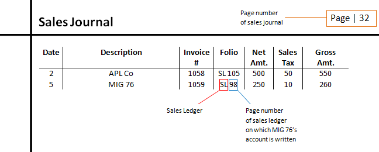

## Table of Contents

## What is a folio number?

A folio number is a unique number given to a document or a group of documents. It helps to keep track of and organize papers easily. For example, in a library, each book might have a folio number so that it can be found quickly.

In finance, a folio number is used in mutual funds to keep track of an investor's account. Each investor gets their own folio number, which helps the fund company manage and record transactions accurately. This makes it easier for investors to check their investments and for the company to handle their records.

## How is a folio number different from a page number?

A folio number and a page number are used to help find things in books or documents, but they are a bit different. A page number is just a number that shows where a single page is in a book. It starts at the beginning of the book and goes up by one for each page. For example, if you want to read chapter 5, you might look for page 50.

A folio number, on the other hand, is a special number given to a whole document or a group of documents. It's not just about one page but can cover many pages or even several documents. For example, in a library, a book might have a folio number like "Folio 1234" to help keep track of it among many other books. So, while a page number helps you find a specific page, a folio number helps you find and organize a whole document or set of documents.

## In which types of documents are folio numbers commonly used?

Folio numbers are often used in legal documents. In court cases, each document or set of documents might have its own folio number. This makes it easy for lawyers and judges to find and organize the papers they need. For example, if there are many documents in a case, a folio number helps everyone keep track of them without getting confused.

In finance, folio numbers are also very common, especially in mutual funds. Each investor gets a folio number for their account. This helps the fund company keep track of who owns what and manage transactions. It's like a special code that makes it easier to look up an investor's details and investments quickly.

## How are folio numbers assigned in a document?

Folio numbers are usually assigned at the start when a document is created or added to a collection. Someone in charge, like a librarian or a records keeper, gives each document its own special folio number. This number is written on the document or added to a record system. The goal is to make sure each document can be found easily and quickly.

In a legal setting, folio numbers help keep track of all the different papers in a case. When new documents come in, they get a folio number to fit into the system. This way, everyone involved can find what they need without getting mixed up. In finance, like with mutual funds, each investor gets a folio number when they start an account. This number stays with their account, helping the company manage and look up their investments easily.

## What is the purpose of using folio numbers in legal documents?

Folio numbers help keep legal documents organized. In a court case, there can be a lot of papers, like evidence, statements, and reports. A folio number is like a special code for each document. It makes it easier for lawyers, judges, and everyone else to find the right papers quickly without getting mixed up.

Using folio numbers also helps keep track of everything in a legal case. When new documents come in, they get their own folio number. This way, everyone knows where to find them. It's like having a map for all the papers, so the court can work smoothly and make sure nothing gets lost.

## Can folio numbers be used in electronic documents?

Yes, folio numbers can be used in electronic documents. Just like in paper documents, folio numbers help to organize and find electronic files easily. In a computer system, each electronic document can have a folio number added to it. This makes it simple for people to search for and manage their files, whether they are legal documents, financial records, or anything else.

Using folio numbers in electronic documents is helpful because it keeps everything in order. For example, in a big case with many electronic files, each file can have its own folio number. This way, lawyers and judges can quickly find the right document without getting confused. It's like having a special code that helps everyone keep track of things in a digital world.

## How do folio numbers assist in document management and organization?

Folio numbers help a lot in keeping documents neat and easy to find. They are like special codes that you give to each document or group of documents. When you have a lot of papers, like in a court case or a big library, folio numbers make it simple to know where everything is. For example, if you need to find a certain document, you just look for its folio number. This way, you don't have to search through everything, which saves time and keeps things from getting mixed up.

In electronic systems, folio numbers work the same way. They help you organize and find digital files easily. When you have a lot of electronic documents, like in a company's records or a legal database, each file can have its own folio number. This makes it easy to search for and manage files on a computer. It's like having a map for all your digital papers, so you can find what you need quickly and keep everything in order.

## What are the best practices for maintaining folio number integrity in large documents?

To keep folio numbers working well in big documents, it's important to be careful and organized. Start by making sure each document gets a unique folio number right when it's added to the collection. This means checking that no two documents have the same number. It's also a good idea to keep a record of all the folio numbers you use, so you can see which ones are taken and which ones are free. If you're using a computer system, make sure the software you use is good at keeping folio numbers in order and doesn't let you use the same number twice by mistake.

Another important thing is to check the folio numbers regularly. This means going through the documents now and then to make sure the numbers haven't changed or gotten mixed up. If you find any mistakes, fix them right away. It's also helpful to train everyone who works with the documents to understand how important folio numbers are and how to use them correctly. This way, everyone helps keep the system working well, and the documents stay easy to find and manage.

## How can errors in folio numbering affect document validity?

Errors in folio numbering can make it hard to trust the documents. If the numbers are wrong or mixed up, people might not be able to find the right papers easily. This can cause confusion and make it difficult to use the documents correctly. For example, in a court case, if the folio numbers are wrong, lawyers and judges might not be able to find important evidence or statements, which can slow down the case and even lead to mistakes in decisions.

To avoid these problems, it's important to check the folio numbers often and fix any errors quickly. If the numbers are kept correct and organized, the documents stay valid and easy to use. This helps everyone trust the system and makes sure that important information can be found when it's needed.

## What technological tools are available to automate folio numbering?

There are several technological tools that can help automate folio numbering. One common tool is document management software. This kind of software can automatically assign unique folio numbers to each document as it is added to the system. It keeps track of the numbers and makes sure no two documents have the same number. This helps keep everything organized and saves time because people don't have to do it by hand.

Another useful tool is a database management system. These systems can also handle folio numbering automatically. They can create and manage folio numbers for large collections of documents, whether they are paper or electronic. By using a database, you can easily search for documents by their folio number and keep everything in order. This makes it easier to manage big collections of documents and reduces the chance of errors.

## How do international standards influence the use of folio numbers?

International standards help make sure that folio numbers are used in the same way around the world. These standards set rules on how folio numbers should be given to documents, so everyone knows what to expect. For example, a standard might say that folio numbers should be unique and written in a certain way. This helps people in different countries work together more easily because they can understand and use the folio numbers correctly, no matter where they are.

Using international standards also makes it easier to share documents between countries. If everyone follows the same rules for folio numbers, it's simpler to keep track of documents and make sure they are organized properly. This is really important in big projects or legal cases that involve people from different places. By following these standards, everyone can trust that the folio numbers will help them find the right documents quickly and without confusion.

## What advanced strategies can be employed to optimize the use of folio numbers in complex document systems?

To optimize the use of folio numbers in complex document systems, it's important to use smart technology. One good way is to use document management software that can automatically give each document a unique folio number. This software can also keep track of the numbers and make sure they are used correctly. Another strategy is to use a database system that can handle lots of documents and keep them organized. By using these tools, you can make sure that folio numbers are always right and easy to find, even when you have a lot of documents.

It's also helpful to have clear rules for how folio numbers are used. Everyone who works with the documents should know these rules and follow them. Regular checks can help find and fix any mistakes quickly. Training people to understand the importance of folio numbers and how to use them properly can make a big difference. By combining technology with good rules and training, you can keep your document system working well and make it easy to find what you need.

## What are the essentials of portfolio management?

Portfolio management is the process of making informed decisions about investment mix and policy, matching investments to objectives, and creating a balanced investment portfolio. It is essential for reaching specific financial goals while managing the appropriate level of risk. The key factors in effective portfolio management include the strategic allocation of assets, risk-return balance, use of modern techniques such as [algorithmic trading](/wiki/algorithmic-trading), and the application of automated systems and data analytics.

Strategic allocation of assets involves distributing investments across various asset classes such as equities, bonds, and real estate to optimize the expected return for a given level of risk. This involves considering the investor's risk tolerance, time horizon, and financial objectives. The aim is to create a diversified portfolio that minimizes unsystematic risk. The formula for expected portfolio return is given by:

$$
E(R_p) = \sum (w_i \times E(R_i))
$$

where $E(R_p)$ is the expected return on the portfolio, $w_i$ is the weight of each asset in the portfolio, and $E(R_i)$ is the expected return of each asset.

Balancing risk and return is crucial in portfolio management. This involves assessing the trade-off between higher returns and higher risks. The standard deviation is commonly used as a measure of risk, whereas the Sharpe ratio can be used to analyze the risk-adjusted returns:

$$
\text{Sharpe Ratio} = \frac{E(R_p) - R_f}{\sigma_p}
$$

where $R_f$ is the risk-free rate, and $\sigma_p$ is the standard deviation of the portfolio’s excess return.

Modern techniques in portfolio management also leverage algorithmic trading, which enhances efficiency and reduces risk. Algorithmic trading utilizes advanced mathematical models and high-speed computer programs to execute trades. This technology provides the ability to execute complex trading strategies with precision and speed, optimizing transaction costs and improving overall returns.

Automated systems and data analytics play significant roles in current practices by providing real-time insights and predictive analytics. These tools help portfolio managers to make data-driven decisions, enhancing accuracy and objectivity in asset allocation and rebalancing strategies. Automation in routine portfolio management tasks reduces human error, streamlines operations, and increases productivity.

Understanding diversification, risk tolerance, and asset allocation is vital for investors. Diversification reduces risk by investing in assets that are not perfectly correlated. It ensures that poor performance in one area can be offset by good performance in another. Recognizing an individual's risk tolerance allows for tailored investment strategies that align with personal comfort levels and financial goals.

Overall, effective portfolio management requires a comprehensive understanding of various financial instruments, market dynamics, and individual investor preferences. Leveraging modern technology and quantitative methods can significantly enhance decision-making in portfolio construction and management, ultimately leading to optimized investment outcomes.

## References & Further Reading

[1]: Bergstra, J., Bardenet, R., Bengio, Y., & Kégl, B. (2011). ["Algorithms for Hyper-Parameter Optimization."](https://dl.acm.org/doi/10.5555/2986459.2986743) Advances in Neural Information Processing Systems 24.

[2]: ["Advances in Financial Machine Learning"](https://www.amazon.com/Advances-Financial-Machine-Learning-Marcos/dp/1119482089) by Marcos Lopez de Prado

[3]: ["Evidence-Based Technical Analysis: Applying the Scientific Method and Statistical Inference to Trading Signals"](https://www.amazon.com/Evidence-Based-Technical-Analysis-Scientific-Statistical/dp/0470008741) by David Aronson

[4]: ["Machine Learning for Algorithmic Trading"](https://github.com/stefan-jansen/machine-learning-for-trading) by Stefan Jansen

[5]: ["Quantitative Trading: How to Build Your Own Algorithmic Trading Business"](https://github.com/LucindaYa/quant-resources/blob/master/Quantitative%20Trading%20How%20to%20Build%20Your%20Own%20Algorithmic%20Trading%20Business.pdf) by Ernest P. Chan