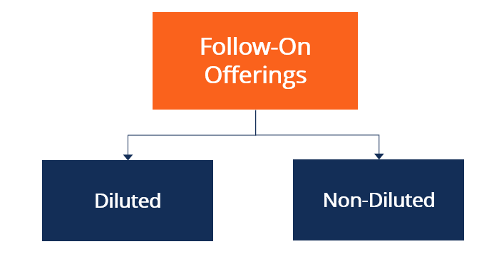

In the financial world, companies often seek ways to raise capital beyond their initial public offering (IPO). These efforts can be crucial for funding further growth, addressing debt obligations, or making strategic acquisitions. One common method that has emerged as a significant tool for such capital raising is the follow-on offering (FPO). This involves the issuance of additional shares to the public after the initial IPO process has been completed.

A follow-on offering is the issuance of additional stock shares by a company that is already publicly traded. Unlike the IPO, which marks a company’s first introduction to public markets, the FPO is aimed at generating additional resources while the company is still under public ownership. Whether a company is looking to finance debt, expand its business operations, or invest in new projects, an FPO provides the flexibility to achieve these objectives. 

This article aims to explore the multi-faceted concept of FPOs, offering a detailed examination of their types, as well as the increasingly important role of algorithmic trading in the process of stock issuance. As technological advancements continue to reshape financial markets, understanding these dynamics becomes essential for investors and companies alike.

## Table of Contents

## What is a Follow-on Offering (FPO)?

A follow-on offering (FPO) is a method by which a publicly traded company issues additional shares to raise capital after its initial public offering (IPO). Unlike the IPO, where a company offers its shares to the public for the first time, an FPO occurs when a company that is already publicly listed decides to issue more shares.

The primary objective of an FPO is to generate additional capital to fund various strategic goals. These objectives can include financing existing debt, acquiring new assets, or expanding current operations. Through an FPO, a company can secure the necessary funds to support growth and development without taking on additional debt, which could impact its financial stability.

There are two main types of follow-on offerings: diluted and non-diluted. A diluted FPO involves the issuance of new shares, which increases the total number of shares outstanding. This can potentially dilute the earnings per share (EPS) since the same amount of profits is now distributed over a larger number of shares. Conversely, a non-diluted FPO entails the selling of shares that are already in existence, usually held by large stakeholders, in the open market. This type of FPO does not increase the total share count, and therefore, does not affect the EPS.

The decision between conducting a diluted or non-diluted FPO depends on various strategic considerations, including the company’s current financial health, market conditions, and long-term goals. By selecting the appropriate type of FPO, companies aim to optimize their capital structure and enhance shareholder value.

## Types of Follow-on Offerings

A follow-on offering (FPO) can take two primary forms: diluted and non-diluted, each serving distinct strategic objectives and influencing the financial landscape of a company differently.

**Diluted FPO**

In a diluted FPO, a company issues new shares to the public, thereby increasing the total number of shares outstanding. This increment in the share count can lead to the dilution of earnings per share (EPS). The formula for EPS is generally:

$$
\text{EPS} = \frac{\text{Net Income}}{\text{Total Outstanding Shares}}
$$

When new shares are issued in a diluted FPO, the denominator in the EPS formula increases, which usually results in a lower EPS if the net income remains constant. This can impact investor perception of the company’s profitability as EPS is a commonly used indicator of financial health and performance. Despite this potential downside, diluted FPOs are strategically utilized to raise substantial amounts of capital, often for substantial projects, acquisitions, or debt reduction, which can ultimately contribute to long-term growth and enhanced shareholder value.

**Non-Diluted FPO**

A non-diluted FPO involves selling existing shares, typically held by major stakeholders like company founders, early investors, or large institutional holders, into the market. Unlike a diluted FPO, this issuance does not alter the total number of outstanding shares, thus leaving the EPS unchanged. The non-diluted approach is usually employed when stakeholders wish to liquidate their positions without injecting additional capital into the company itself. Although it does not impact EPS, the presence of a large number of shares entering the market can influence the stock price through supply and demand dynamics.

Each type of FPO serves specific strategic purposes based on the company's financial objectives and the needs of its stakeholders. Companies need to carefully weigh these options considering their current market position, projected capital needs, and investor expectations, enabling them to optimize their capital structure and sustain growth trajectories.

## Role of Algorithmic Trading in Stock Issuance

Algorithmic trading, often referred to as algo trading, leverages sophisticated mathematical models and high-speed data processing capabilities to automate and optimize stock trading activities. The application of [algorithmic trading](/wiki/algorithmic-trading) in stock issuance, particularly during follow-on public offerings (FPOs), has become indispensable due to its ability to handle large volumes of trades while minimizing market impact and [volatility](/wiki/volatility-trading-strategies).

In an FPO, companies issue additional shares in the market to raise capital. This large-scale transaction can significantly influence share prices and [liquidity](/wiki/liquidity-risk-premium). Algorithmic trading addresses this challenge by executing trades in a manner that distributes the order over time and strategically manipulates order size. This reduces abrupt shifts in stock prices, which can occur if large trades hit the market simultaneously.

The core of algorithmic trading in an FPO setting revolves around the use of execution algorithms. These algorithms are designed to break down large orders into multiple smaller orders based on specific parameters such as time, price, and [volume](/wiki/volume-trading-strategy). Common strategies employed include the Time-Weighted Average Price (TWAP) and the Volume-Weighted Average Price (VWAP):

1. **Time-Weighted Average Price (TWAP)**: The TWAP strategy divides orders into equal snippets that are executed over a preset time frame. This approach minimizes the market impact by ensuring trades are evenly distributed throughout the trading session. 
$$
   \text{TWAP} = \frac{1}{N} \sum_{i=1}^{N} P_i

$$

   where $N$ represents the total number of time intervals and $P_i$ is the price at each interval.

2. **Volume-Weighted Average Price (VWAP)**: VWAP considers the volume of trading at different price levels to achieve a price that reflects the true market sentiment. By aligning order execution with the overall trading volume, VWAP strategies aim to reduce slippage and enhance execution quality.
$$
   \text{VWAP} = \frac{\sum_{i=1}^{N} P_i \times Q_i}{\sum_{i=1}^{N} Q_i}

$$

   Here, $P_i$ is the price and $Q_i$ is the quantity of shares traded in interval $i$.

Algo trading systems also incorporate real-time data analysis and [machine learning](/wiki/machine-learning) to adapt to market conditions dynamically. These systems can instantly react to changes in trading volume, price trends, and other indicators, enabling traders to time the market more effectively and set optimal prices for their transactions.

The increasing reliance on algorithmic trading for FPOs is a testament to the advanced state of financial technologies. It supports companies in achieving smoother and more efficient capital-raising activities while affording traders precision and control over their investments.

## Advantages and Challenges of FPOs

Follow-on public offerings (FPOs) offer companies a strategic and adaptable method to swiftly generate additional capital post their initial public offering. This mechanism benefits both issuing companies and investors, but it also presents inherent challenges that require careful consideration.

One of the primary advantages of FPOs is their capacity to provide companies with rapid access to funds. This liquidity can be crucial for various strategic initiatives such as paying down existing debt, funding new projects, or expanding business operations. For publicly listed entities, FPOs serve as a critical financial tool that can enhance growth prospects without the necessity to resort to debt financing, which often comes with higher costs and financial covenants.

From the investor's perspective, FPOs often present opportunities to purchase additional shares at potentially discounted prices compared to the prevailing market rates. This prospect arises when the share price set for the FPO is lower than the current trading price, offering a financial incentive for investors to participate, which can increase the attractiveness of acquiring more equity in a company.

However, FPOs also come with challenges that must be strategically addressed. One significant issue is market dilution. When a company issues additional shares, the ownership percentage of existing shareholders is reduced, potentially leading to a decrease in earnings per share (EPS). This dilution can affect shareholders' perceived value of their investments. The formula for dilution can be expressed as:

$$
\text{Dilution} = \frac{\text{EPS (Old)}}{\text{EPS (New)}} - 1
$$

where EPS (Old) is the earnings per share before the new shares are issued, and EPS (New) is the earnings per share after accounting for the additional share issuance.

Furthermore, FPOs can introduce volatility in the stock price. The announcement and subsequent execution of an FPO can lead to market speculation, affecting stock prices unpredictably. Increased share supply can exert downward pressure on the stock, impacting its valuation and investor sentiment. Therefore, companies planning an FPO need careful timing and communication strategies to manage these potential fluctuations effectively.

In summary, while FPOs are valuable for their financial flexibility and investor opportunities, they require strategic planning to mitigate dilution and market volatility. Companies must balance the benefits against the potential drawbacks to successfully leverage FPOs for strengthening their market position.

## Case Studies and Examples

Alphabet Inc., commonly known as Google, exemplifies the successful execution of a follow-on offering (FPO). In 2005, Google embarked on this strategic financial maneuver to bolster its capital reserves and sustain its rapid growth trajectory post-IPO. The company issued additional shares to the public, thereby raising approximately $4 billion. This influx of capital enabled Google to further invest in technological innovations and acquisitions, solidifying its dominance in the tech industry. The successful FPO demonstrated Google's ability to leverage public markets to fund expansive growth initiatives while maintaining investor confidence, as reflected by the significant stock price appreciation in the subsequent years.

In contrast, AFC Gamma, a prominent player in the cannabis financing sector, utilized an FPO in 2022 to fuel its expansion within a burgeoning industry. The company aimed to capture new opportunities and increase its market share in the cannabis industry by raising funds through additional share issuance. This strategic move allowed AFC Gamma to allocate resources towards potential acquisition targets and support its lending operations to cannabis entrepreneurs. The FPO's proceeds were instrumental in enhancing AFC Gamma's operational capabilities, signaling the growing importance of FPOs within niche markets like cannabis financing.

These case studies underscore the diverse strategic motivations behind follow-on offerings. Alphabet Inc. leveraged its FPO to augment capital for innovation and market consolidation, setting a precedent for tech companies seeking post-IPO financial boosts. Conversely, AFC Gamma's FPO illustrates how companies in emerging industries capitalize on such offerings to fortify their market positions and pursue growth opportunities. These examples illuminate the varied outcomes of FPOs, ranging from technological advancement to increased market reach in evolving sectors.

## Conclusion

Follow-on offerings (FPOs) are strategic mechanisms that publicly listed companies use to gain additional capital. They provide a structured approach to acquiring funds beyond the initial public offering (IPO), allowing companies to expand operations, pay off debts, or undertake new ventures. These offerings are distinguished by their ability to offer new stock or sell existing shares from major stakeholders, each approach serving different strategic ends.

The integration of algorithmic trading in the execution of FPOs signifies a pivotal advancement in financial market technologies. Algorithmic trading, characterized by its use of complex mathematical models and computational techniques, facilitates the efficient handling of substantial trades with minimal market disruption. This innovation allows traders to optimize the timing and pricing of their transactions, thereby reducing volatility and enhancing liquidity. For example, algorithms can be designed to execute trades at times of lower market activity or to anticipate price movements based on market data. 

Ultimately, the success of FPOs hinges on a company's ability to strike a balance between the benefits and drawbacks associated with additional stock issuance. Companies must weigh possibilities such as capital influx and increased market recognition against potential challenges like stock dilution and market perception shifts. By carefully considering these factors, companies can leverage FPOs to solidify their market standing and fuel long-term growth.

Overall, FPOs remain a cornerstone in financial strategies for raising capital, and their effectiveness is greatly amplified by advances in algorithmic trading. As financial markets continue to evolve, these tools will play an increasingly central role in corporate finance, offering dynamic solutions to the capital needs of publicly traded companies.

## References & Further Reading

[1]: ["Advances in Financial Machine Learning"](https://www.amazon.com/Advances-Financial-Machine-Learning-Marcos/dp/1119482089) by Marcos Lopez de Prado

[2]: ["Quantitative Trading: How to Build Your Own Algorithmic Trading Business"](https://www.amazon.com/Quantitative-Trading-Build-Algorithmic-Business/dp/1119800064) by Ernest P. Chan

[3]: "Follow-on Offerings and equity issues: An international comparison," Journal of Financial Economics, which explores the mechanics and strategic importance of FPOs. 

[4]: ["Algorithmic Trading: Winning Strategies and Their Rationale"](https://www.wiley.com/en-us/Algorithmic+Trading%3A+Winning+Strategies+and+Their+Rationale-p-9781118460146) by Ernie Chan

[5]: "The impact of algorithmic trading on market quality," a report by the Financial Conduct Authority (FCA), analyzing how algo trading affects markets during large trades like FPOs.