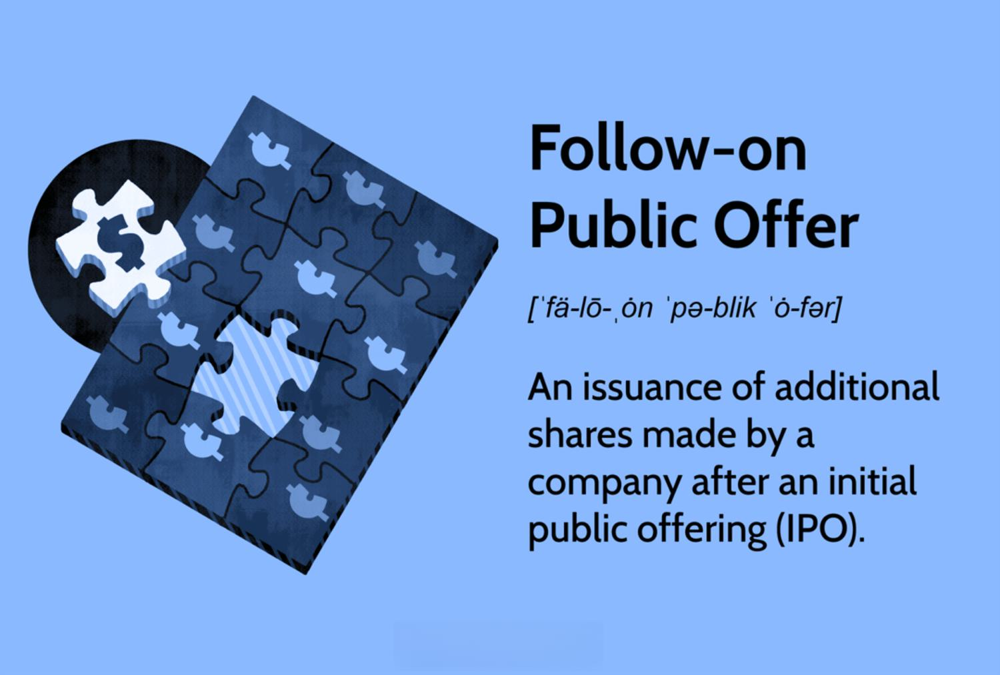

## Table of Contents

## What is a Follow-on Public Offer (FPO)?

A Follow-on Public Offer (FPO) is when a company that is already listed on a stock exchange decides to issue more shares to the public. This is different from an Initial Public Offer (IPO), where a company first goes public. Companies do FPOs to raise more money, which they can use for things like expanding their business, paying off debts, or funding new projects.

There are two main types of FPOs. The first type is a dilutive offering, where new shares are issued, which means the total number of shares goes up. This can lower the value of existing shares because the company's earnings are now spread over more shares. The second type is a non-dilutive offering, where existing shareholders sell their shares to the public. In this case, the total number of shares stays the same, so it doesn't affect the value of existing shares directly.

## How does an FPO differ from an Initial Public Offering (IPO)?

An FPO, or Follow-on Public Offer, is different from an IPO, or Initial Public Offering, in a few key ways. An IPO is when a company first sells its shares to the public and gets listed on a stock exchange. It's the first time the company's shares are available for anyone to buy. On the other hand, an FPO happens after a company is already listed on a stock exchange. It's when the company decides to sell more shares to the public to raise more money.

The main difference is that an IPO is the company's debut on the stock market, while an FPO is like a second round of selling shares. With an IPO, the company is usually trying to raise money to grow or start new projects. With an FPO, the company might want more money for expansion, to pay off debts, or for other reasons. Also, an FPO can be dilutive, meaning it increases the number of shares and might lower the value of existing shares, or non-dilutive, where existing shareholders sell their shares without changing the total number of shares.

## What are the main reasons a company might choose to issue an FPO?

A company might choose to issue an FPO to raise more money. This money can be used for many things, like growing the business. For example, they might want to open new stores, start making new products, or buy other companies. Another reason is to pay off debts. If a company has borrowed money, an FPO can help them get the cash they need to pay it back.

Another reason for an FPO is to fund new projects. Sometimes, a company has a big idea but needs more money to make it happen. An FPO can give them the funds to start these projects. Also, it can be a way to let more people invest in the company. By selling more shares, the company can attract new investors who believe in what they're doing.

## Who can participate in an FPO?

Anyone who wants to invest can take part in an FPO. This includes regular people like you and me, as well as big investors like banks and investment funds. You don't need to be a current shareholder to buy shares in an FPO. All you need to do is have enough money and follow the rules set by the company and the stock exchange.

Sometimes, though, a company might decide to offer the new shares first to its current shareholders. This is called a rights issue. In this case, if you already own shares in the company, you get the first chance to buy more before they are offered to everyone else. But after that, anyone can still buy the shares if there are any left.

## What are the steps involved in launching an FPO?

Launching an FPO starts with the company deciding they need more money and choosing to issue more shares. They work with investment banks to plan the FPO. These banks help figure out how many shares to sell and at what price. The company then files documents with the stock exchange and the securities regulator, like the SEC in the U.S., to get approval. These documents include details about the company and the FPO, so investors know what they're buying.

Once the regulators approve, the company sets a date for the FPO. They start marketing the new shares to potential investors, often through roadshows where they explain why the FPO is a good investment. Investors can then place their orders for the shares. After the order period ends, the company and the investment banks decide how to allocate the shares among the investors. Finally, the shares are sold, and the money is given to the company. The new shares start trading on the stock exchange, and the FPO is complete.

## How is the pricing determined for shares in an FPO?

The price of shares in an FPO is figured out by the company and the investment banks they work with. They look at how much the company is worth now, how much money the company wants to raise, and what the market thinks the shares are worth. They might also think about how the stock has been doing lately and what other companies in the same industry are selling their shares for. The goal is to set a price that will make people want to buy the shares but still raise enough money for the company.

Once they have a good idea of the price, they might do something called a book-building process. This is where they ask investors how many shares they want to buy and at what price. This helps them see what price will work best. After they get all this information, they set the final price for the FPO. This price is usually a bit lower than the current stock price to make it more attractive to new investors.

## What are the regulatory requirements for conducting an FPO?

To conduct an FPO, a company has to follow rules set by the stock exchange and the securities regulator, like the SEC in the U.S. First, the company needs to file a document called a prospectus with the regulator. This document tells investors all about the company, the FPO, and how the money will be used. The regulator checks the prospectus to make sure it has all the right information and that it's honest. If everything looks good, the regulator gives the go-ahead for the FPO.

Once the regulator approves, the company has to follow more rules during the FPO. They need to tell everyone about the FPO and make sure the information they share is true. They also have to be fair about who gets to buy the new shares. After the FPO, the company has to report how much money they raised and how they used it. This helps keep everything open and honest, so investors can trust the company.

## How does an FPO impact existing shareholders?

When a company does an FPO, it can affect people who already own shares in different ways. If the FPO is dilutive, it means the company is making more shares. This can make each share worth a little less because the company's earnings are now spread over more shares. So, if you own shares, your part of the company gets smaller unless you buy more shares in the FPO.

But if the FPO is non-dilutive, it doesn't change the number of shares. In this case, existing shareholders don't see their ownership get smaller directly. However, the price of the shares might still go up or down based on how the market reacts to the FPO. If the company uses the money from the FPO well, it could make the company more valuable, which might be good for shareholders in the long run.

## What are the potential risks and benefits of investing in an FPO?

Investing in an FPO can be a good way to get more shares in a company you like. If the company uses the money from the FPO to grow or pay off debts, it might become more valuable. This could make the price of the shares go up, which is good for you if you own them. Also, sometimes the shares in an FPO are sold at a lower price than they are trading on the stock market. This can be a chance to buy shares at a discount.

But there are risks too. If the FPO is dilutive, it means more shares are being made, which can make each share worth less. This could lower the value of the shares you already own. Also, if the company doesn't use the money well, it might not grow as expected, and the share price could go down. So, it's important to think about how the company plans to use the money and if that plan makes sense before you decide to invest in an FPO.

## Can you explain the difference between a dilutive and non-dilutive FPO?

A dilutive FPO is when a company makes more shares to sell to the public. This means the total number of shares goes up. If you already own shares, your part of the company gets smaller because there are more shares now. This can make each share worth a little less because the company's earnings are spread over more shares. So, if you don't buy more shares in the FPO, your ownership in the company goes down.

On the other hand, a non-dilutive FPO doesn't make new shares. Instead, it's when people who already own shares decide to sell some of theirs to the public. This means the total number of shares stays the same, so your part of the company doesn't get smaller directly. But the price of the shares might still change based on how the market reacts to the FPO. If the company uses the money well, it could become more valuable, which might be good for everyone who owns shares.

## How do market conditions affect the success of an FPO?

Market conditions play a big role in how well an FPO does. If the stock market is doing well and people feel good about investing, they might be more likely to buy shares in an FPO. This is because they think the company's share price will go up. On the other hand, if the market is not doing well or if there's a lot of uncertainty, people might be more careful with their money. They might not want to buy new shares, which could make the FPO less successful.

The company's industry also matters. If the industry is growing and doing well, people might see the FPO as a good chance to invest in a company that could do even better. But if the industry is struggling, people might be worried about the company's future and not want to buy more shares. So, the success of an FPO depends a lot on what's happening in the market and the company's industry at the time.

## What are some notable examples of successful and unsuccessful FPOs in recent years?

A successful FPO in recent years was by Tesla in 2020. Tesla raised over $2 billion by selling new shares. The money helped them grow their business, like building new factories. People wanted to buy Tesla shares because the company was doing well, and the stock price went up after the FPO. This made it a good move for Tesla and good for people who bought the shares.

An example of an unsuccessful FPO was by WeWork in 2019. WeWork tried to raise money through an FPO after their IPO plans fell apart. But people were not sure about WeWork's business and how they were spending money. Not many people wanted to buy the new shares, and the FPO did not go well. This made it hard for WeWork to get the money they needed and showed that people were worried about the company's future.

## References & Further Reading

[1]: Geddes, R., & Appelbaum, B. (2011). ["Initial Public Offerings: A Transfer of Ownership."](https://books.google.com/books/about/IPOs_and_Equity_Offerings.html?id=OhF4P2dWJwoC) Journal of Financial Economics.

[2]: Narang, R. (2009). ["Inside the Black Box: The Simple Truth About Quantitative Trading."](https://onlinelibrary.wiley.com/doi/book/10.1002/9781118267738) Wiley Finance.

[3]: Hasbrouck, J., & Saar, G. (2013). ["Low Latency Trading."](https://pages.stern.nyu.edu/~jhasbrou/Research/lowLatencyTrading/lowLatencyTradingHasbrouckSaarJFM.pdf) Journal of Financial Markets.

[4]: Degryse, H., De Jong, F., & van Kervel, V. (2015). ["The Impact of Dark Trading and Visible Fragmentation on Market Quality."](https://academic.oup.com/rof/article/19/4/1587/1567671) Review of Finance.

[5]: Treleaven, P., Galas, M., & Lalchand, V. (2013). ["Algorithmic Trading Review."](https://dl.acm.org/doi/10.1145/2500117) Communications of the ACM.