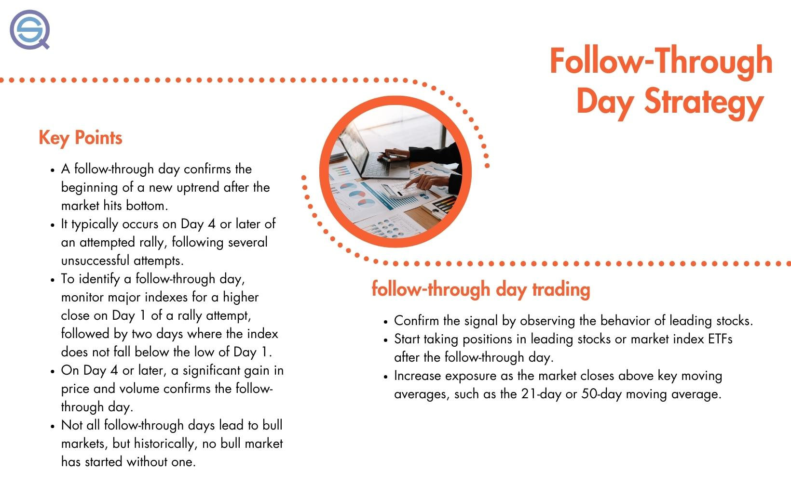

Algorithmic trading, often referred to as algo trading, leverages computer programs to execute orders based on predefined criteria such as timing, price, and quantity. By automating these processes, algo trading removes emotional biases and allows for faster and more precise trade execution. One of the strategic tools often utilized in this domain is the follow-through day strategy, introduced by William J. O'Neil. This strategy plays a pivotal role in identifying potential shifts in market trends, particularly in signaling the transition from a downtrend to a rally.

The follow-through day concept offers a market-timing mechanism that aids traders in discerning the beginning of a new uptrend. It involves a situation where a major index sees a significant upsurge, accompanied by increased trading volume, after a span of at least four days since a rally attempt began. This occurrence provides algo traders with a vital signal to automate entry into new trades, leveraging the power of algorithms to streamline the detection and execution process. By identifying such shifts early, traders can potentially capitalize on new market opportunities, while mitigating losses associated with prolonged market corrections.



In this article, the intricacies of the follow-through day strategy will be examined in detail. The focus will be on its significance within the realm of algo trading, its key components, and the ways in which it can be applied effectively to enhance trading performance.

## Table of Contents

## What is a Follow Through Day?

A follow-through day is a mechanism used in market analysis and trading strategies to indicate a potential shift in market trends, specifically from a correction phase to a budding rally. This concept is pivotal in discerning the beginning of a new uptrend following a period of market decline. 

The identification of a follow-through day commences with an attempted rally, lasting at least four days, during which a major index must close significantly higher than the previous trading day. This upward move is accompanied by an increase in trading volume, which serves as a confirmation indicator. The requirement for increased volume differentiates a follow-through day from a regular upward movement by suggesting institutional involvement, which is critical for sustaining long-term rally trends.

Typically, a follow-through day is observed on the fourth day or later of an attempted rally. This timing criterion filters out premature or false starts that do not gain sufficient momentum. The rationale behind waiting until at least the fourth day is rooted in the statistical analysis of market movements, which indicates a higher probability of sustained rallies when initial uptrends are confirmed by subsequent volume-supported gains.

In practical application, traders use the follow-through day as a signal to initiate or increase positions in anticipation of a market uptrend. It acts as a trigger for potential buy orders, as the criteria of significant price increase, measured by factors such as percentage change or relative strength, and elevated trading volumes offer a degree of assurance about the trend's viability. Therefore, understanding and identifying follow-through days can enhance market timing and strategy deployment, leading to potentially profitable trading outcomes.

## Understanding the Follow Through Day in Algo Trading

Algorithmic trading leverages automated systems to execute trades efficiently, and the follow-through day is an essential signal within this framework for identifying potential market reversals. This approach involves embedding specific criteria into algorithms to detect when a major index exhibits a significant increase in price accompanied by a rise in trading [volume](/wiki/volume-trading-strategy). The goal is to capitalize on these signals to initiate buy orders accurately and swiftly.

The automation of the follow-through day in [algorithmic trading](/wiki/algorithmic-trading) systems primarily revolves around two key criteria: price gain and volume change. An algorithm can be programmed to calculate the percentage increase in the price of a major index over a defined period, usually following a market downturn. Concurrently, it assesses the trading volume to ascertain whether the market movement is supported by substantial trader activity.

The formula for detecting a follow-through day could include calculating the daily percentage change in price and comparing it with a pre-set threshold, while concurrently evaluating the day's trading volume relative to its average. In Python, for instance, a rudimentary version of such an algorithm might resemble:

```python
def detect_follow_through_day(prices, volumes, threshold_price=2.0, volume_multiplier=1.5):
    """
    Detects a follow-through day based on price gain and volume increase criteria.

    :param prices: List of daily closing prices for the index
    :param volumes: List of daily trading volumes for the index
    :param threshold_price: Minimum percentage increase in price to trigger a follow-through
    :param volume_multiplier: Minimum factor by which volume must exceed average to confirm follow-through

    :return: Boolean indicating whether a follow-through day was detected
    """
    rally_attempt_price = prices[-4:]  # last four days for rally attempt
    rally_attempt_volumes = volumes[-4:]  # last four days for rally attempt

    # Check if today's price gain exceeds the threshold percentage relative to previous day's price
    price_gain = ((prices[-1] - prices[-2]) / prices[-2]) * 100

    # Check if today's volume exceeds the average volume by the specified multiplier
    average_volume = sum(rally_attempt_volumes) / len(rally_attempt_volumes)
    is_price_criteria_met = price_gain >= threshold_price
    is_volume_criteria_met = volumes[-1] > average_volume * volume_multiplier

    return is_price_criteria_met and is_volume_criteria_met

# Example usage
prices = [150, 153, 152, 155, 160]  # hypothetical closing prices
volumes = [1000, 1200, 1100, 1250, 2000]  # hypothetical trading volumes

follow_through_detected = detect_follow_through_day(prices, volumes)
```

By systematically implementing such logic, this method enhances trading efficiency and reduces emotional biases typical of human traders. Markets often invoke subjective judgments, where an automated system provides consistent execution based on objective criteria. Consequently, traders can potentially achieve more disciplined entry points, focusing on strategy optimization and portfolio management.

## Key Elements of a Follow Through Day Signal

A valid follow-through day signal is predicated on the formation of a rally attempt, which is required to last a minimum of four consecutive trading days. This period allows market participants to assess whether the observed upward movements represent a sustainable shift rather than a transient fluctuation.

On the initial day of the rally attempt, referred to as Rally Day 1, a major stock index must conclude the trading session with a closing price that is either higher than or marginally below the previous day's close. Importantly, the closing price on Rally Day 1 should be within the top half of the day's price range. This closing position indicates a positive sentiment and potential upward [momentum](/wiki/momentum).

Subsequent to Rally Day 1, each following day leading up to the follow-through day is crucial. These days need to demonstrate higher lows compared to the preceding days, creating a constructive price pattern that strengthens the probability of a genuine market reversal. The higher lows signify diminishing selling pressure and increasing buying interest, which are encouraging signs for a nascent rally.

The culmination of the rally attempt occurs on the follow-through day. On this day, the index must register a significant gain, as well as a substantial increase in trading volume compared to the preceding day. The heightened volume validates the price increase by confirming that a large number of market participants are actively involved in driving the market upwards. This combination of price and volume escalation is critical, as it indicates that the observed price movements are supported by strong investor participation, thereby enhancing the reliability of the signal for a new upward trend in the market.

By adhering to these criteria, traders can use the follow-through day concept to identify potential market reversals with greater confidence, making informed decisions about their trading strategies.

## Backtesting the Follow Through Day Strategy

Backtesting is a pivotal step in evaluating the efficacy of the follow-through day strategy within algorithmic trading. This process involves utilizing historical market data to simulate trades and gauge how the strategy would have performed under past market conditions. By doing so, traders and developers can understand potential outcomes and refine algorithms to enhance future performance.

The follow-through day strategy relies on specific criteria, such as significant index gains accompanied by increased trading volume to signal a new market uptrend. In [backtesting](/wiki/backtesting), these criteria are systematically applied to historical data to simulate buy orders, assessing both the frequency and accuracy of potential market shifts identified by follow-through days.

A crucial aspect of backtesting this strategy is accounting for the stock market's inherent characteristics, such as its mean-reverting nature. Mean reversion suggests that asset prices and historical returns eventually return to their long-term mean or average. This can significantly affect short-term returns, as price movements that appear to signal a new trend might just be temporary deviations. Therefore, backtesting should incorporate statistical tools to measure the impact of these characteristics on the strategy's outcomes.

The backtesting process can be implemented using programming languages like Python, which offer libraries such as pandas, numpy, and [backtrader](/wiki/backtrader) to handle and analyze large datasets. Here is a simple example of a Python function that could be part of a larger backtesting script to simulate the follow-through day strategy:

```python
import pandas as pd

def simulate_follow_through(data):
    # Example data pre-processing
    data['Volume Change'] = data['Volume'].pct_change()
    data['Price Change'] = data['Close'].pct_change()

    # Define criteria for follow-through day
    def is_follow_through_day(row):
        return row['Price Change'] > 0.01 and row['Volume Change'] > 0.05

    # Simulate trades
    trade_signals = data.apply(is_follow_through_day, axis=1)
    trade_results = data[trade_signals]

    return trade_results

# Example usage
historical_data = pd.DataFrame({'Close': [100, 102, 104, 107],
                                'Volume': [1000, 1200, 1400, 1600]})
results = simulate_follow_through(historical_data)
print(results)
```

Using such backtesting simulations, traders can identify the strengths and limitations of the follow-through day strategy. Results usually vary, as short-term returns are heavily influenced by market fluctuations, which may not always reflect genuine trend shifts. Despite these challenges, systematic backtesting remains an indispensable tool in evaluating and optimizing trading strategies, ensuring they are not only theoretically sound but also practically viable.

## Challenges and Considerations

While follow-through days can indeed assist in market timing, they are not without their limitations. False signals represent a significant challenge, often leading traders to make misguided decisions if not carefully considered alongside other market indicators. This underscores the importance of incorporating additional analyses, such as evaluating the behavior of leading stocks and sentiment analyses, to complement the insights gained from follow-through days. These supplemental factors can provide a more comprehensive view of market dynamics, thereby enhancing decision-making processes.

In the context of algorithmic trading, challenges also arise from technical and infrastructural aspects. Algorithms must be meticulously programmed to interpret follow-through signals correctly, a task that demands both precise data inputs and robust coding practices. Algorithms can misfire in the event of technical glitches, leading to potential losses. For instance, discrepancies in data feeds—whether due to latency, inaccuracies, or inconsistencies—can cause malfunctioning trades. High-frequency trading systems, in particular, rely heavily on the quality of their data feeds and any compromise in speed or accuracy can negate the advantages provided by speedy execution.

For traders relying on algorithmic systems, maintaining and regularly updating these platforms to ensure their resilience and adaptability to current market conditions is imperative. Continual backtesting and adjustments based on the most recent market data can also help mitigate some of these challenges, allowing strategies to evolve in alignment with market trends.

In summary, while follow-through day strategies can be beneficial, recognizing their limitations is crucial. Employing a multi-faceted approach that includes additional analyses and rigorous system maintenance can substantially mitigate risks and improve the overall trading performance.

## Applying Follow Through Day Analysis in Trading

Traders can leverage follow-through day analysis as a strategic tool to align their investing activities with broader market movements. By waiting for a confirmed follow-through signal, traders have the opportunity to enter positions in leading stocks or broad market exchange-traded funds (ETFs). This approach is rooted in the principle of capturing new uptrends early, a critical advantage in dynamic financial markets.

The confirmation of a follow-through day occurs when a significant market index, such as the S&P 500 or NASDAQ Composite, demonstrates a substantial price gain with increased trading volume, typically on the fourth day or later of a rally attempt. This confirmation helps traders identify potential market reversals from downtrends to uptrends and informs decision-making around entry points for new investments.

To effectively utilize this strategy, traders should consider incrementally increasing their exposure in the market. This practice aids in managing risk while enabling the trader to capitalize on the unfolding trend. By monitoring market indices and maintaining flexibility in their exposure, traders can adjust their strategies in response to evolving market conditions.

For a practical implementation, traders can use Python to automate the detection and response to follow-through days. The following script provides a basic framework for evaluating follow-through conditions and executing trades accordingly:

```python
import yfinance as yf
import pandas as pd

# Fetch historical data for a major index
ticker = '^GSPC'  # S&P 500 Index
data = yf.download(ticker, start='2022-01-01', end='2023-01-01')

# Calculate the daily price change percentage and volume change
data['Price_Change'] = data['Close'].pct_change()
data['Volume_Change'] = data['Volume'].pct_change()

# Detect follow-through conditions
def is_follow_through_day(df, rally_day, threshold=0.015):
    if (df['Price_Change'][rally_day] > threshold) and (df['Volume_Change'][rally_day] > 0):
        return True
    return False

# Loop through potential follow-through days (from the 4th day onward)
for i in range(3, len(data)):
    if is_follow_through_day(data, i):
        print(f"Follow-through day detected on {data.index[i]} with price change {data['Price_Change'][i]:.2%}")

```

The script uses the historical price data from Yahoo Finance, calculates daily percentage changes in price and volume, and checks for follow-through day conditions based on predefined criteria (e.g., a price increase of more than 1.5%). By automating the process, traders can respond quickly to market signals and align their trading strategy with prevailing trends. This balanced approach, which increases market exposure incrementally, allows traders to manage risk while capturing opportunities as market conditions change. 

Overall, while the follow-through day analysis is a powerful tool, it is most effective when used in conjunction with other market indicators and analyses to ensure a comprehensive trading strategy.

## Conclusion

The follow-through day strategy demonstrates significant potential when integrated into algorithmic trading systems, providing traders with a robust means to detect pivotal market transitions. By identifying these shifts effectively, traders can make informed decisions, enhancing their chances of capitalizing on emerging trends. Despite its advantages, the follow-through day should not be relied upon in isolation. It is essential for traders to incorporate it as part of a comprehensive trading strategy, acknowledging its potential for false signals. Supporting indicators, such as stock performance and market sentiment analyses, can provide crucial additional context.

Leveraging technology can further amplify the effectiveness of the follow-through day strategy. Algorithmic trading platforms offer the capability to automate the detection of follow-through days, thereby minimizing human error and emotional biases that often affect trading decisions. Additionally, these platforms can handle vast amounts of data with high efficiency, enabling backtesting of the strategy across various market scenarios to evaluate its performance.

To optimize trading performance, it is advisable to incorporate [machine learning](/wiki/machine-learning) techniques such as decision trees or neural networks. These can be programmed to identify patterns and trends in large datasets, offering insights that go beyond simple technical indicators. Consequently, by harnessing these advanced techniques, traders can refine their strategies substantially, maximizing their potential for success in the trading environment. In summary, while the follow-through day strategy is a powerful tool, its best use comes from combining its signals with a broad strategy supported by cutting-edge technology.

## References & Further Reading

[1]: O'Neil, W. J. (1988). ["How to Make Money in Stocks: A Winning System in Good Times and Bad."](https://www.amazon.com/How-Make-Money-Stocks-Winning/dp/0071614133) McGraw-Hill Education.

[2]: ["Advances in Financial Machine Learning"](https://www.amazon.com/Advances-Financial-Machine-Learning-Marcos/dp/1119482089) by Marcos Lopez de Prado

[3]: ["Evidence-Based Technical Analysis: Applying the Scientific Method and Statistical Inference to Trading Signals"](https://www.amazon.com/Evidence-Based-Technical-Analysis-Scientific-Statistical/dp/0470008741) by David Aronson

[4]: ["Machine Learning for Algorithmic Trading"](https://github.com/stefan-jansen/machine-learning-for-trading) by Stefan Jansen

[5]: ["Quantitative Trading: How to Build Your Own Algorithmic Trading Business"](https://books.google.com/books/about/Quantitative_Trading.html?id=j70yEAAAQBAJ) by Ernest P. Chan