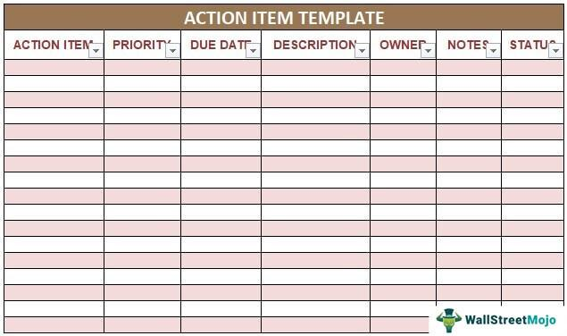

Algorithmic trading, often referred to as algo trading, is an essential aspect of contemporary financial markets, enabling traders to execute large volumes of trade orders with precise timing and enhanced efficiency. This technology-driven approach leverages computer algorithms to analyze market data and automatically make trading decisions, thus minimizing human intervention and reducing response time to market fluctuations. At the heart of algorithmic trading lies a crucial phase known as the follow-up action implementation process. This stage ensures that trades are continually optimized for performance and aligned with risk management goals.

Follow-up actions in algo trading are critical for adapting strategies to real-time market conditions and for ensuring that trades are executed with maximum efficiency. By enabling traders to adjust their positions in response to market events, follow-up actions help maintain the integrity of trading strategies and minimize potential risks. This article provides a detailed examination of the significance of follow-up actions in algorithmic trading, breaking down their purpose, process, and associated benefits. By addressing both market shifts and reinforcing strategy integrity, these actions serve a vital role in balancing the competing demands of risk and reward.



In volatile financial environments, follow-up actions can mean the difference between significant losses and profitability. Algo trading systems are designed to respond swiftly to market changes, but without a structured follow-up action framework, they might not achieve their full potential. Follow-up actions provide the necessary mechanism to fine-tune algorithms in real-time, thus enhancing overall trading success.

## Table of Contents

## Understanding Follow-Up Actions in Algo Trading

Algorithmic trading, often referred to as algo trading, utilizes computerized systems to execute trades based on pre-defined instructions. This system allows for trading in high volumes and at speeds significantly faster than human traders. However, even algo traders must respond to constantly shifting market conditions that can affect existing positions. Such responses, known as follow-up actions, are essential for managing risk, optimizing returns, and ensuring the integrity of trading strategies.

Follow-up actions are activated when changes in the market provide actionable insights that can impact current algorithmically-generated trades. These responses can be broadly categorized into three primary actions: adjusting exposure levels, hedging positions, and capitalizing on emerging opportunities.

1. **Adjusting Exposure Levels:**
   Traders may need to modify the degree of market exposure to align with updated risk assessments or strategic objectives. Changes in exposure levels involve recalibrating the [volume](/wiki/volume-trading-strategy) or duration of investments in specific assets. For instance, if a stock's price demonstrates significant upward [momentum](/wiki/momentum), traders might reduce their holdings to lock in gains, thereby avoiding potential future declines. Similarly, stop-loss settings might be amended to safeguard profits or mitigate losses as price thresholds change.

2. **Hedging Positions:**
   To mitigate the risk of adverse price movements, traders may engage in hedging strategies. This involves taking positions in related securities or derivatives, which inversely correlate with existing assets. By doing so, potential losses from the current holdings are offset by gains from the hedge, thus preserving capital. Hedging is particularly relevant in volatile markets where unexpected price movements are more likely.

3. **Capitalizing on Emerging Opportunities:**
   Market fluctuations often unveil new opportunities that can be seized for additional profits. Follow-up actions enable traders to swiftly adapt to these scenarios, adjusting their trading strategies to include new investments or to [exit](/wiki/exit-strategy) from ones that no longer show potential. For example, a sudden surge in a stock's trading volume might indicate heightened investor interest, prompting a strategic buy to take advantage of anticipated price increases.

Effective implementation of follow-up actions requires a comprehensive understanding of market dynamics and the capability to execute these strategies with precision. As algo trading systems continue to evolve, the ability to integrate automated and manual follow-up actions ensures traders remain ahead, optimizing their portfolios while managing risks.

## Key Elements of the Follow-Up Action Process

Assessing the current market conditions is a fundamental aspect of the follow-up action process in [algorithmic trading](/wiki/algorithmic-trading). Continuous monitoring involves evaluating market data, including price movements, trading volumes, and economic indicators, to identify potential signals that necessitate follow-up actions. Traders often employ real-time data analysis tools and technical indicators to discern patterns or anomalies that could impact trading strategies. By maintaining a vigilant watch on these variables, traders can respond proactively to market fluctuations, ensuring that their algorithms adapt swiftly to changes in market dynamics.

Defining objectives is another critical component. Every follow-up strategy must be anchored in clear, actionable goals such as risk mitigation, profit maximization, or capital preservation. These objectives guide decision-making and ensure that follow-up actions align with the overall trading strategy. For instance, if the primary goal is risk mitigation, the follow-up strategy might prioritize mechanisms such as adjusting stop-loss levels or diversifying assets to hedge against potential market downturns.

Implementing adjustments involves modifying trading parameters based on the current market assessment and pre-defined objectives. These adjustments may include altering order types, rebalancing portfolios, or closing out positions that no longer align with strategic goals. For example, if a follow-up action dictates rebalancing a portfolio, a trader might employ a Python script to automate the execution of trades that realign asset allocations. An illustrative code example for this could be:

```python
import pandas as pd

# Sample data of current asset allocations and target weights
current_allocations = pd.Series({'Stock A': 0.4, 'Stock B': 0.35, 'Bond X': 0.25})
target_weights = pd.Series({'Stock A': 0.3, 'Stock B': 0.4, 'Bond X': 0.3})

# Function to calculate necessary trades for rebalancing
def rebalance_portfolio(current, target, total_value):
    trades = (target - current) * total_value
    return trades

# Example of executing the rebalance
total_portfolio_value = 100000  # hypothetical total value of portfolio
trades_to_execute = rebalance_portfolio(current_allocations, target_weights, total_portfolio_value)
print("Rebalance trades:\n", trades_to_execute)
```

This example demonstrates how traders can utilize technology to facilitate the execution of follow-up actions, ensuring that portfolio adjustments are executed efficiently and precisely. By systematically monitoring conditions, defining clear objectives, and implementing adjustments, traders can enhance the efficacy of their trading strategies and better navigate the complexities of financial markets.

## Implementing Follow-Up Actions Effectively

Implementing follow-up actions effectively in algorithmic trading involves utilizing technology and strategic planning to ensure trading systems respond optimally to market changes. 

One critical component is establishing automated alerts. These involve using algorithmic strategies to detect specific market conditions that necessitate immediate action. For example, the use of moving averages to identify trends can be coded into an algorithm that triggers alerts when a crossover event occurs. Python’s Pandas library can be useful for coding such an alert:

```python
import pandas as pd

# Sample code for a moving average crossover alert
def generate_alert(prices, short_window, long_window):
    short_ma = prices.rolling(window=short_window, min_periods=1).mean()
    long_ma = prices.rolling(window=long_window, min_periods=1).mean()
    signals = pd.DataFrame(index=prices.index)
    signals['alert'] = 0
    signals['alert'][short_ma > long_ma] = 1
    return signals

# Example usage
prices = pd.Series([120, 122, 123, 125, 130, 135, 137, 140])
alerts = generate_alert(prices, short_window=3, long_window=5)
```

Flexibility is another essential [factor](/wiki/factor-investing) in follow-up actions. The market's dynamic nature requires adaptable strategies where condition rules accommodate diverse scenarios. This might involve using decision trees or neural networks to adjust rules dynamically based on real-time data inputs. Machine learning models can be trained to recognize and respond to patterns that deviate from historical norms, and they should allow for manual overrides to apply human judgment in unprecedented situations.

Regular [backtesting](/wiki/backtesting) serves as a foundation for verifying the effectiveness of follow-up strategies. By simulating trading strategies over historical data, traders can evaluate performance and refine rules before real-world application. Here's an example of backtesting a strategy using the `[backtrader](/wiki/backtrader)` library in Python:

```python
import backtrader as bt

class MyStrategy(bt.Strategy):
    def __init__(self):
        self.dataclose = self.datas[0].close

    def next(self):
        if self.dataclose[0] > self.dataclose[-1]:
            self.buy(size=100)
        elif self.dataclose[0] < self.dataclose[-1]:
            self.sell(size=100)

# Instantiate Cerebro engine
cerebro = bt.Cerebro()
cerebro.addstrategy(MyStrategy)

# Load data
data = bt.feeds.YahooFinanceData(dataname='AAPL', fromdate=pd.Timestamp('2010-01-01'), todate=pd.Timestamp('2020-12-31'))
cerebro.adddata(data)

# Run the backtest
cerebro.run()
cerebro.plot()
```

This script simplifies how a strategy can be assessed for its responsiveness and robustness against market variations. Implementing these strategies effectively can significantly enhance trading performance by ensuring automated systems remain aligned with trader objectives while being robust against market unpredictability.

## Advantages of Follow-Up Actions in Algo Trading

Follow-up actions in algorithmic trading offer distinct advantages that enhance trading performance and mitigate risks associated with market [volatility](/wiki/volatility-trading-strategies). These advantages primarily include enhanced risk management, optimization of trading strategies, and a reduction in emotional influence on trading decisions.

Enhanced risk management is achieved through the quick responsiveness to market volatility that follow-up actions provide. By continuously monitoring market conditions and implementing appropriate adjustments, traders can promptly react to unforeseen movements, ensuring minimal financial exposure. For example, if a stock price shifts unexpectedly, follow-up actions can involve recalibrating stop-loss orders or hedging strategies to protect against adverse price movements. This proactive approach ensures that potential losses are minimized and that the trader's portfolio remains aligned with the desired risk parameters.

Optimization of trading strategies is another significant benefit of follow-up actions. These actions allow traders to fine-tune their positions in real-time, capitalizing on market opportunities as they arise. Adjustments such as rebalancing or scaling into winning positions enable the algorithm to maximize returns by dynamically responding to market conditions. This continuous adaptation leads to improved performance over static trading strategies, ensuring that the algorithm remains competitive.

Furthermore, the reliance on automated follow-up actions substantially reduces the influence of emotion on trading decisions. Emotional decision-making can lead to irrational behavior such as panic selling or impulsive buying, which often results in suboptimal trading outcomes. By automating these decisions, follow-up actions ensure a disciplined, data-driven approach to trading. Algorithms evaluate market data objectively, execute trades based on predefined rules, and thus mitigate the risk of human error related to emotional biases.

In summary, follow-up actions in algorithmic trading significantly contribute to enhanced risk management, the optimization of trading strategies, and the reduction of emotional influence, thereby bolstering overall trading performance. By integrating these actions into their trading algorithms, traders can ensure a more robust, adaptive financial strategy that thrives amidst market fluctuations.

## Common Challenges and Mitigation Strategies

Algorithmic trading faces several challenges that can affect the seamless execution of trading strategies. Among these, latency issues, regulatory compliance, and system failures are prominent. Addressing these challenges is crucial to ensure efficient and uninterrupted trading operations.

### Latency Issues

Latency refers to the delay between the initiation of a trading order and its execution. In high-frequency trading, even microseconds can lead to significant differences in trading outcomes. To minimize latency, traders can implement high-performance computing resources. These might include collocating trading servers closer to exchange servers to reduce transmission time or employing advanced hardware with faster processing capabilities. Techniques such as optimizing code for speed and parallel processing can also be adopted. For instance, using Python, a trader might leverage libraries like NumPy or Cython to optimize computational efficiency:

```python
import numpy as np

# Example of using NumPy for efficient computations
prices = np.array([100, 101, 102, 103, 104])
returns = np.diff(prices) / prices[:-1]  # Calculate returns with minimal latency
```

### Regulatory Compliance

Given the global nature of financial markets, algorithmic trading must adhere to a multitude of regulations that vary between regions. These regulations are designed to ensure market integrity, protect investors, and maintain fair trading environments. To comply, traders should integrate regulatory checks into their follow-up strategies and continuously monitor for regulatory updates. Employing legal experts to review trading strategies and conducting regular audits can help ensure compliance. Additionally, using software solutions that automatically check trades against regulatory requirements can be beneficial.

### System Failures

System failures can result from hardware malfunctions, software bugs, or external factors like power outages, posing significant risks to trading operations. To mitigate such risks, traders should implement redundancy and backup systems. This might involve maintaining multiple servers in different locations to ensure continuity during outages. Real-time monitoring systems can detect anomalies early and switch to backup systems if needed. Regular testing of these fail-over mechanisms is crucial to ensure their reliability. Furthermore, maintaining updated and secure software systems can prevent failures due to bugs or cyber-attacks.

By addressing these challenges through the implementation of advanced technology, adherence to regulations, and robust system architectures, traders can enhance the reliability and efficiency of their algorithmic trading practices.

## Conclusion

Follow-up actions in algorithmic trading are indispensable for achieving and maintaining optimal trading performance within the intricate and ever-evolving landscape of financial markets. These actions ensure that trading strategies are adaptable and resilient, equipping traders to both navigate market fluctuations and capitalize on emerging opportunities effectively. By executing well-calibrated follow-up strategies, traders enhance their capacity to mitigate risks and optimize gains, thus fortifying their defenses against market volatility.

The employment of follow-up actions facilitates a transition from reactive to proactive trading, allowing traders to stay ahead of market movements. As these strategies evolve, traders can refine their approach to leverage advancements in technology and data analytics. This continuous development is not solely beneficial for immediate tactical improvements; it also fosters a robust framework for sustained trading profits over time.

Furthermore, the reliance on data-driven decisions reduces emotional bias, a frequent challenge in trading. Automated processes implemented in follow-up actions minimize human error and contribute to more a consistent trading strategy. As a result, traders achieve a delicate balance between risk and reward, which is vital for long-term success in the highly competitive trading environment.

In conclusion, the strategic implementation and ongoing enhancement of follow-up actions serve as a cornerstone for traders aiming to improve their trading strategies and secure long-term success in the face of ever-shifting market dynamics.

## References & Further Reading

[1]: Bergstra, J., Bardenet, R., Bengio, Y., & Kégl, B. (2011). ["Algorithms for Hyper-Parameter Optimization."](https://proceedings.neurips.cc/paper/2011/file/86e8f7ab32cfd12577bc2619bc635690-Paper.pdf) Advances in Neural Information Processing Systems 24.

[2]: ["Advances in Financial Machine Learning"](https://www.amazon.com/Advances-Financial-Machine-Learning-Marcos/dp/1119482089) by Marcos Lopez de Prado

[3]: ["Evidence-Based Technical Analysis: Applying the Scientific Method and Statistical Inference to Trading Signals"](https://www.amazon.com/Evidence-Based-Technical-Analysis-Scientific-Statistical/dp/0470008741) by David Aronson

[4]: ["Machine Learning for Algorithmic Trading"](https://github.com/stefan-jansen/machine-learning-for-trading) by Stefan Jansen

[5]: ["Quantitative Trading: How to Build Your Own Algorithmic Trading Business"](https://github.com/LucindaYa/quant-resources/blob/master/Quantitative%20Trading%20How%20to%20Build%20Your%20Own%20Algorithmic%20Trading%20Business.pdf) by Ernest P. Chan